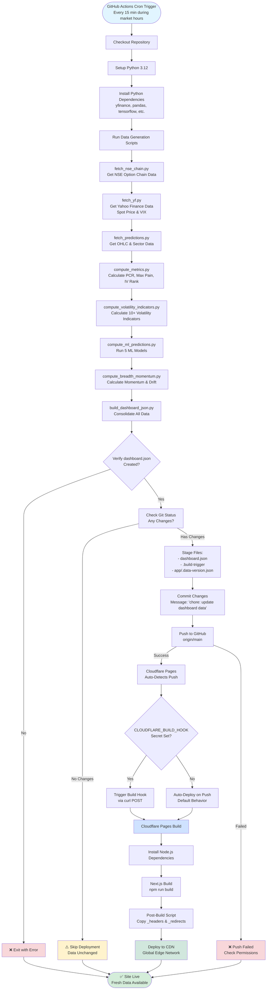
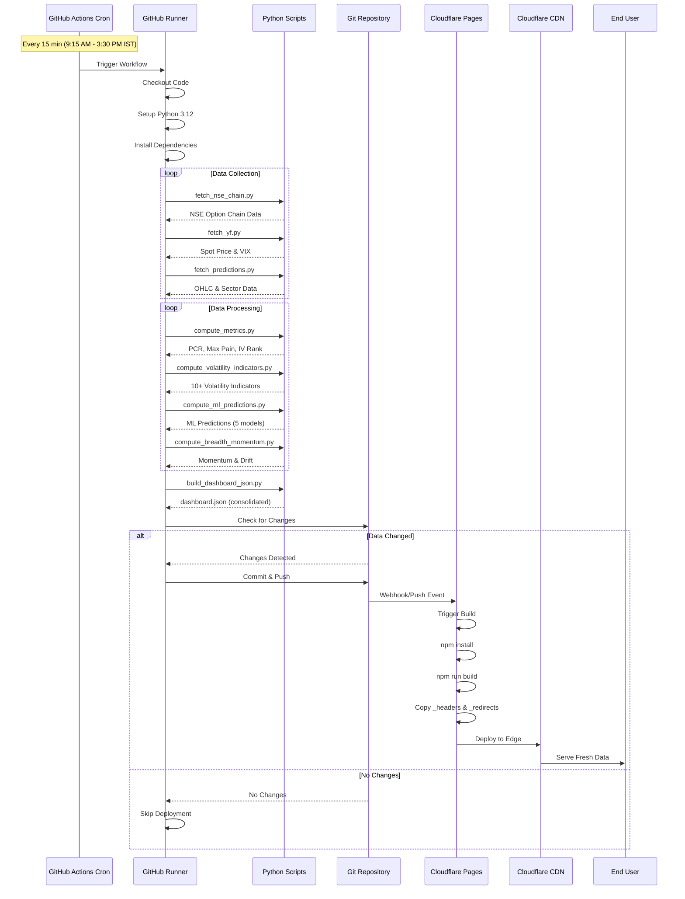
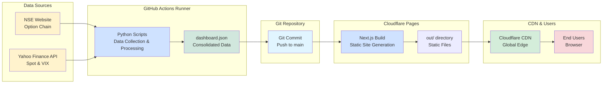
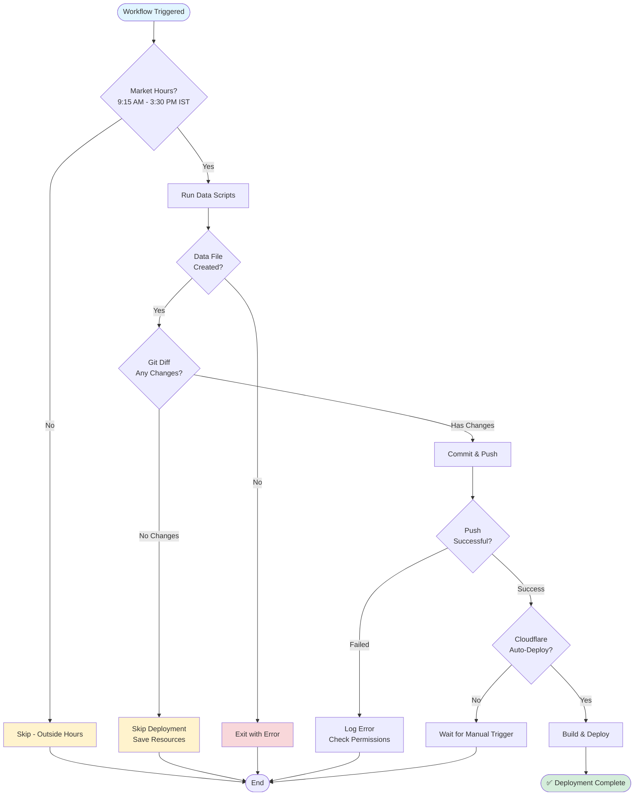

# Tradyx Dashboard - Deployment Flow Diagram

## Current Deployment Flow (Mermaid)

```mermaid
flowchart TD
    Start([GitHub Actions Cron Trigger<br/>Every 15 min during market hours]) --> Checkout[Checkout Repository]
    Checkout --> SetupPython[Setup Python 3.12]
    SetupPython --> InstallDeps[Install Python Dependencies<br/>yfinance, pandas, tensorflow, etc.]
    InstallDeps --> RunScripts[Run Data Generation Scripts]
    
    RunScripts --> FetchNSE[fetch_nse_chain.py<br/>Get NSE Option Chain Data]
    FetchNSE --> FetchYF[fetch_yf.py<br/>Get Yahoo Finance Data<br/>Spot Price & VIX]
    FetchYF --> FetchPred[fetch_predictions.py<br/>Get OHLC & Sector Data]
    FetchPred --> ComputeMetrics[compute_metrics.py<br/>Calculate PCR, Max Pain, IV Rank]
    ComputeMetrics --> ComputeVol[compute_volatility_indicators.py<br/>Calculate 10+ Volatility Indicators]
    ComputeVol --> ComputeML[compute_ml_predictions.py<br/>Run 5 ML Models]
    ComputeML --> ComputeBreadth[compute_breadth_momentum.py<br/>Calculate Momentum & Drift]
    ComputeBreadth --> BuildJSON[build_dashboard_json.py<br/>Consolidate All Data]
    
    BuildJSON --> Verify{Verify dashboard.json<br/>Created?}
    Verify -->|No| Error1[❌ Exit with Error]
    Verify -->|Yes| CheckChanges[Check Git Status<br/>Any Changes?]
    
    CheckChanges -->|No Changes| NoDeploy[⚠️ Skip Deployment<br/>Data Unchanged]
    CheckChanges -->|Has Changes| StageFiles[Stage Files:<br/>- dashboard.json<br/>- .build-trigger<br/>- app/.data-version.json]
    
    StageFiles --> Commit[Commit Changes<br/>Message: 'chore: update dashboard data']
    Commit --> Push[Push to GitHub<br/>origin/main]
    
    Push -->|Success| CloudflareAuto[Cloudflare Pages<br/>Auto-Detects Push]
    Push -->|Failed| Error2[❌ Push Failed<br/>Check Permissions]
    
    CloudflareAuto --> BuildHook{CLOUDFLARE_BUILD_HOOK<br/>Secret Set?}
    BuildHook -->|Yes| TriggerBuild[Trigger Build Hook<br/>via curl POST]
    BuildHook -->|No| AutoDeploy[Auto-Deploy on Push<br/>Default Behavior]
    
    TriggerBuild --> CloudflareBuild[Cloudflare Pages Build]
    AutoDeploy --> CloudflareBuild
    
    CloudflareBuild --> InstallNode[Install Node.js Dependencies]
    InstallNode --> NextBuild[Next.js Build<br/>npm run build]
    NextBuild --> PostBuild[Post-Build Script<br/>Copy _headers & _redirects]
    PostBuild --> Deploy[Deploy to CDN<br/>Global Edge Network]
    
    Deploy --> End([✅ Site Live<br/>Fresh Data Available])
    
    NoDeploy --> End
    Error1 --> End
    Error2 --> End
    
    style Start fill:#e1f5ff
    style End fill:#d4edda
    style Error1 fill:#f8d7da
    style Error2 fill:#f8d7da
    style NoDeploy fill:#fff3cd
    style CloudflareBuild fill:#cfe2ff
    style Deploy fill:#d1e7dd
```

## Detailed Component Flow

```mermaid
sequenceDiagram
    participant Cron as GitHub Actions Cron
    participant GH as GitHub Runner
    participant Python as Python Scripts
    participant Git as Git Repository
    participant CF as Cloudflare Pages
    participant CDN as Cloudflare CDN
    participant User as End User

    Note over Cron: Every 15 min (9:15 AM - 3:30 PM IST)
    Cron->>GH: Trigger Workflow
    GH->>GH: Checkout Code
    GH->>GH: Setup Python 3.12
    GH->>GH: Install Dependencies
    
    loop Data Collection
        GH->>Python: fetch_nse_chain.py
        Python-->>GH: NSE Option Chain Data
        GH->>Python: fetch_yf.py
        Python-->>GH: Spot Price & VIX
        GH->>Python: fetch_predictions.py
        Python-->>GH: OHLC & Sector Data
    end
    
    loop Data Processing
        GH->>Python: compute_metrics.py
        Python-->>GH: PCR, Max Pain, IV Rank
        GH->>Python: compute_volatility_indicators.py
        Python-->>GH: 10+ Volatility Indicators
        GH->>Python: compute_ml_predictions.py
        Python-->>GH: ML Predictions (5 models)
        GH->>Python: compute_breadth_momentum.py
        Python-->>GH: Momentum & Drift
    end
    
    GH->>Python: build_dashboard_json.py
    Python-->>GH: dashboard.json (consolidated)
    
    GH->>Git: Check for Changes
    alt Data Changed
        Git-->>GH: Changes Detected
        GH->>Git: Commit & Push
        Git->>CF: Webhook/Push Event
        CF->>CF: Trigger Build
        CF->>CF: npm install
        CF->>CF: npm run build
        CF->>CF: Copy _headers & _redirects
        CF->>CDN: Deploy to Edge
        CDN->>User: Serve Fresh Data
    else No Changes
        Git-->>GH: No Changes
        GH->>GH: Skip Deployment
    end
```

## Data Flow Architecture

```mermaid
graph LR
    subgraph "Data Sources"
        NSE[NSE Website<br/>Option Chain]
        YF[Yahoo Finance API<br/>Spot & VIX]
    end
    
    subgraph "GitHub Actions Runner"
        Scripts[Python Scripts<br/>Data Collection & Processing]
        JSON[dashboard.json<br/>Consolidated Data]
    end
    
    subgraph "Git Repository"
        Repo[Git Commit<br/>Push to main]
    end
    
    subgraph "Cloudflare Pages"
        Build[Next.js Build<br/>Static Site Generation]
        Out[out/ directory<br/>Static Files]
    end
    
    subgraph "CDN & Users"
        CDN[Cloudflare CDN<br/>Global Edge]
        Users[End Users<br/>Browser]
    end
    
    NSE --> Scripts
    YF --> Scripts
    Scripts --> JSON
    JSON --> Repo
    Repo --> Build
    Build --> Out
    Out --> CDN
    CDN --> Users
    
    style NSE fill:#fff3cd
    style YF fill:#fff3cd
    style Scripts fill:#cfe2ff
    style JSON fill:#d1e7dd
    style Repo fill:#e1f5ff
    style Build fill:#cfe2ff
    style CDN fill:#d4edda
    style Users fill:#f8d7da
```

## Decision Points in Flow

```mermaid
flowchart TD
    Start([Workflow Triggered]) --> CheckTime{Market Hours?<br/>9:15 AM - 3:30 PM IST}
    CheckTime -->|No| Skip1[Skip - Outside Hours]
    CheckTime -->|Yes| RunScripts[Run Data Scripts]
    
    RunScripts --> VerifyData{Data File<br/>Created?}
    VerifyData -->|No| Error[Exit with Error]
    VerifyData -->|Yes| CheckGit{Git Diff<br/>Any Changes?}
    
    CheckGit -->|No Changes| Skip2[Skip Deployment<br/>Save Resources]
    CheckGit -->|Has Changes| Commit[Commit & Push]
    
    Commit --> CheckPush{Push<br/>Successful?}
    CheckPush -->|Failed| Retry[Log Error<br/>Check Permissions]
    CheckPush -->|Success| TriggerCF{Cloudflare<br/>Auto-Deploy?}
    
    TriggerCF -->|Yes| Build[Build & Deploy]
    TriggerCF -->|No| Wait[Wait for Manual Trigger]
    
    Build --> Success([✅ Deployment Complete])
    Skip1 --> End([End])
    Skip2 --> End
    Error --> End
    Retry --> End
    Wait --> End
    
    style Start fill:#e1f5ff
    style Success fill:#d4edda
    style Error fill:#f8d7da
    style Skip1 fill:#fff3cd
    style Skip2 fill:#fff3cd
```

