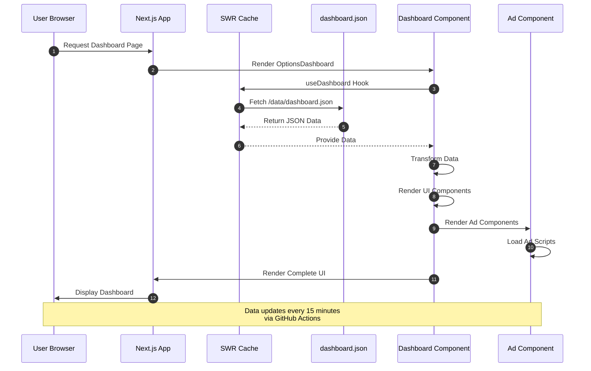
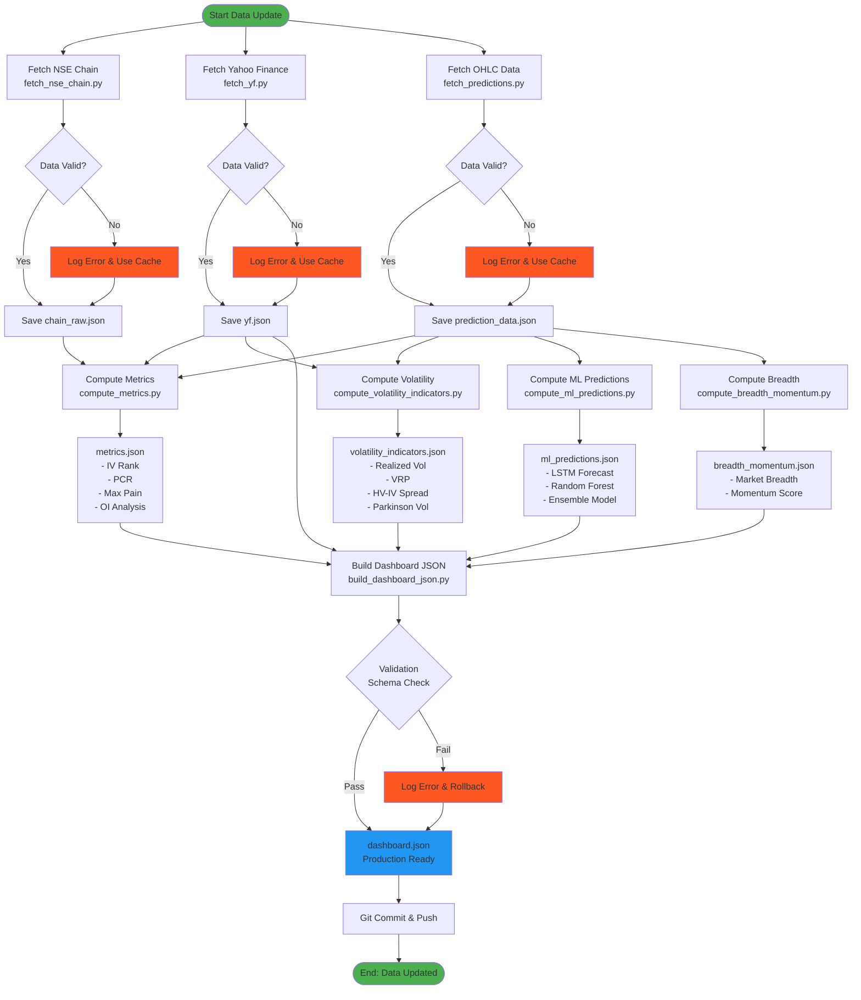
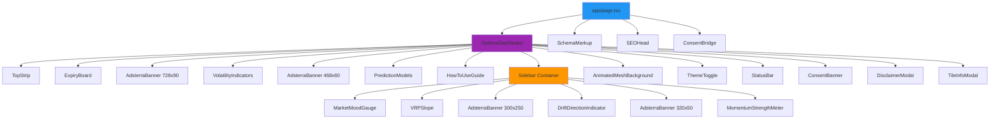
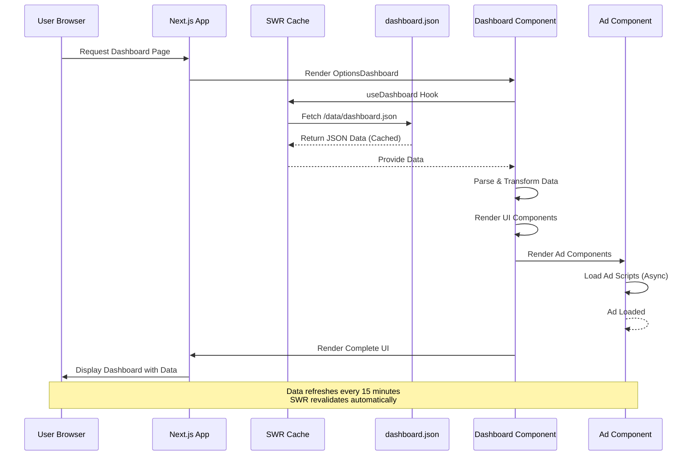

# Tradyxa Quant Dashboard - Complete Project Structure & Architecture

> **Comprehensive blueprint of the entire Tradyxa Quant Dashboard project with Mermaid-based architecture diagrams and UI/UX recreation prompts for Claude, ChatGPT, and Cursor.**

---

## 📋 Table of Contents

1. [Project Overview](#project-overview)
2. [System Architecture Diagrams](#system-architecture-diagrams)
3. [Component Architecture](#component-architecture)
4. [Data Flow Architecture](#data-flow-architecture)
5. [Technology Stack](#technology-stack)
6. [File Structure](#file-structure)
7. [UI/UX Recreation Prompt](#uiux-recreation-prompt)
8. [Deployment Architecture](#deployment-architecture)
9. [Configuration Files](#configuration-files)

---

## 🎯 Project Overview

**Tradyxa Quant Dashboard** is a real-time financial analytics platform for NIFTY options trading, built with Next.js 16, React 18, TypeScript, and Python. It provides advanced options analytics, volatility indicators, ML predictions, and comprehensive market indicators.

### Key Features

- 📊 Real-time NIFTY Options Chain Data
- 📈 10+ Volatility Indicators (IV Rank, VRP, HV-IV Spread, etc.)
- 🤖 Machine Learning Predictions (LSTM, Random Forest, Ensemble)
- 🎨 Modern Glass Morphism UI with Dark/Light Mode
- 📱 Fully Responsive Design
- ⚡ High Performance (SSR with Next.js)
- 🔒 Enterprise Security (CSP headers, XSS protection)
- 💰 Ad Monetization (Adsterra integration)
- 🚀 Automated Data Updates (GitHub Actions)

---

## 🏗️ System Architecture Diagrams

### High-Level System Architecture

```mermaid
graph TB
    subgraph "Data Sources"
        NSE[NSE API<br/>Options Chain Data]
        YF[Yahoo Finance API<br/>Spot, VIX, OHLC]
    end
    
    subgraph "Data Processing Layer"
        PY1[fetch_nse_chain.py<br/>Fetch Option Chain]
        PY2[fetch_yf.py<br/>Fetch Market Data]
        PY3[fetch_predictions.py<br/>Fetch OHLC Data]
        PY4[compute_metrics.py<br/>Compute Metrics]
        PY5[compute_volatility_indicators.py<br/>Volatility Analysis]
        PY6[compute_ml_predictions.py<br/>ML Predictions]
        PY7[compute_breadth_momentum.py<br/>Breadth Analysis]
        PY8[build_dashboard_json.py<br/>Build Final JSON]
    end
    
    subgraph "Data Storage"
        JSON1[chain_raw.json]
        JSON2[yf.json]
        JSON3[prediction_data.json]
        JSON4[metrics.json]
        JSON5[volatility_indicators.json]
        JSON6[ml_predictions.json]
        JSON7[breadth_momentum.json]
        JSON8[dashboard.json<br/>Final Output]
    end
    
    subgraph "Frontend Application"
        NEXT[Next.js 16 App Router]
        REACT[React 18 Components]
        SWR[SWR Data Fetching]
        HOOKS[Custom React Hooks]
    end
    
    subgraph "UI Components"
        DASH[Dashboard Components]
        ADS[Ad Components]
        LAYOUT[Layout Components]
        UI[UI Components]
    end
    
    subgraph "Deployment Infrastructure"
        GH[GitHub Repository]
        GA[GitHub Actions<br/>CI/CD Pipeline]
        VERCEL[Vercel Platform<br/>Edge Network]
        CF[Cloudflare Pages<br/>Alternative]
    end
    
    subgraph "End Users"
        BROWSER[Web Browser]
        MOBILE[Mobile Device]
        TABLET[Tablet]
    end
    
    NSE --> PY1
    YF --> PY2
    YF --> PY3
    
    PY1 --> JSON1
    PY2 --> JSON2
    PY3 --> JSON3
    
    JSON1 --> PY4
    JSON2 --> PY4
    JSON3 --> PY4
    PY4 --> JSON4
    
    JSON3 --> PY5
    JSON2 --> PY5
    PY5 --> JSON5
    
    JSON3 --> PY6
    PY6 --> JSON6
    
    JSON3 --> PY7
    PY7 --> JSON7
    
    JSON4 --> PY8
    JSON5 --> PY8
    JSON6 --> PY8
    JSON7 --> PY8
    JSON2 --> PY8
    PY8 --> JSON8
    
    JSON8 --> SWR
    SWR --> REACT
    REACT --> NEXT
    NEXT --> HOOKS
    
    HOOKS --> DASH
    HOOKS --> ADS
    HOOKS --> LAYOUT
    HOOKS --> UI
    
    GH --> GA
    GA --> JSON8
    GH --> VERCEL
    GH --> CF
    
    VERCEL --> NEXT
    CF --> NEXT
    
    NEXT --> BROWSER
    NEXT --> MOBILE
    NEXT --> TABLET
    
    style NSE fill:#4CAF50
    style YF fill:#4CAF50
    style JSON8 fill:#FFC107
    style NEXT fill:#2196F3
    style VERCEL fill:#000000
    style CF fill:#F38020
    style BROWSER fill:#9C27B0
```



### Detailed Component Architecture

```mermaid
graph TB
    subgraph "App Layer"
        PAGE[app/page.tsx<br/>Main Page]
        LAYOUT[app/layout.tsx<br/>Root Layout]
        LOADING[app/loading.tsx<br/>Loading State]
        ERROR[app/error.tsx<br/>Error Boundary]
    end
    
    subgraph "Dashboard Components"
        OPT_DASH[OptionsDashboard.tsx<br/>Main Dashboard Container]
        TOP_STRIP[TopStrip.tsx<br/>Spot, VIX, PCR]
        EXPIRY[ExpiryBoard.tsx<br/>Expiry Dates]
        VOL_IND[VolatilityIndicators.tsx<br/>10+ Indicators]
        PRED_MOD[PredictionModels.tsx<br/>ML Predictions]
        MMI_GAUGE[MarketMoodGauge.tsx<br/>MMI Calculation]
        VRP_SLOPE[VRPSlope.tsx<br/>VRP Slope]
        DRIFT[DriftDirectionIndicator.tsx<br/>Drift Direction]
        MOMENTUM[MomentumStrengthMeter.tsx<br/>Momentum]
        GAMMA[GammaHeatmap.tsx<br/>Gamma Heatmap]
        IV_SKEW[IVSkewChart.tsx<br/>IV Skew]
        OI_TABLE[OITable.tsx<br/>OI Table]
        WHALE[WhaleAlerts.tsx<br/>Whale Alerts]
        STATS[QuickStats.tsx<br/>Quick Stats]
        GUIDE[HowToUseGuide.tsx<br/>Usage Guide]
    end
    
    subgraph "Ad Components"
        AD_BANNER[AdsterraBanner.tsx<br/>Main Ad Component]
        AD_SIDEBAR[HighPerformanceAdSidebar.tsx<br/>Sidebar Ads]
        AD_WRAPPER[SafeAdWrapper.tsx<br/>Error Boundary]
        AD_CONFIG[AdConfig.ts<br/>Ad Configuration]
        AD_LOADER[InfinityLoader.tsx<br/>Loading Animation]
    end
    
    subgraph "Layout Components"
        MESH[AnimatedMeshBackground.tsx<br/>Animated Background]
        THEME[ThemeToggle.tsx<br/>Theme Switcher]
        STATUS[StatusBar.tsx<br/>Status Bar]
        CONSENT[ConsentBanner.tsx<br/>Cookie Consent]
        DISCLAIMER[DisclaimerModal.tsx<br/>Disclaimer]
        MODAL[TileInfoModal.tsx<br/>Info Modal]
    end
    
    subgraph "Data Layer"
        HOOK[useDashboard.ts<br/>Data Hook]
        FETCHER[fetcher.ts<br/>Data Fetcher]
        TYPES[types.ts<br/>TypeScript Types]
        SCHEMA[schema.ts<br/>Zod Schemas]
        FMT[fmt.ts<br/>Formatters]
    end
    
    PAGE --> OPT_DASH
    PAGE --> MESH
    PAGE --> CONSENT
    PAGE --> DISCLAIMER
    
    OPT_DASH --> TOP_STRIP
    OPT_DASH --> EXPIRY
    OPT_DASH --> AD_BANNER
    OPT_DASH --> VOL_IND
    OPT_DASH --> PRED_MOD
    OPT_DASH --> MMI_GAUGE
    OPT_DASH --> VRP_SLOPE
    OPT_DASH --> DRIFT
    OPT_DASH --> MOMENTUM
    OPT_DASH --> GAMMA
    OPT_DASH --> IV_SKEW
    OPT_DASH --> OI_TABLE
    OPT_DASH --> WHALE
    OPT_DASH --> STATS
    OPT_DASH --> GUIDE
    OPT_DASH --> AD_SIDEBAR
    OPT_DASH --> THEME
    OPT_DASH --> STATUS
    
    AD_BANNER --> AD_WRAPPER
    AD_BANNER --> AD_LOADER
    AD_BANNER --> AD_CONFIG
    
    OPT_DASH --> HOOK
    HOOK --> FETCHER
    HOOK --> TYPES
    HOOK --> SCHEMA
    FETCHER --> FMT
    
    style PAGE fill:#2196F3
    style OPT_DASH fill:#9C27B0
    style HOOK fill:#FF9800
    style AD_BANNER fill:#4CAF50
```



### Data Flow Architecture



### Python Data Pipeline Flow



### GitHub Actions CI/CD Pipeline

```mermaid
flowchart TD
    TRIGGER([Trigger: Cron Schedule<br/>*/15 9-15 * * 1-5 IST]) --> CHECKOUT[Checkout Repository<br/>actions/checkout@v4]
    
    CHECKOUT --> SETUP_PY[Setup Python 3.12<br/>actions/setup-python@v5]
    
    SETUP_PY --> CACHE{Cache Exists?}
    
    CACHE -->|Yes| RESTORE[Restore pip Cache]
    CACHE -->|No| INSTALL_DEPS[pip install -r requirements.txt]
    
    RESTORE --> RUN_SCRIPTS
    INSTALL_DEPS --> SAVE_CACHE[Save pip Cache]
    SAVE_CACHE --> RUN_SCRIPTS
    
    RUN_SCRIPTS[Run All Scripts<br/>python run_all.py] --> CHECK_SUCCESS{Success?}
    
    CHECK_SUCCESS -->|Yes| VALIDATE[Validate Output<br/>validate_production.py]
    CHECK_SUCCESS -->|No| ERROR_NOTIFY[Send Error Notification]
    
    VALIDATE --> CHECK_VALID{Valid?}
    
    CHECK_VALID -->|Yes| GIT_CONFIG[Configure Git User<br/>github-actions[bot]]
    CHECK_VALID -->|No| ERROR_NOTIFY
    
    GIT_CONFIG --> GIT_ADD[git add public/data/dashboard.json]
    
    GIT_ADD --> GIT_COMMIT[git commit -m 'chore: update data [skip ci]']
    
    GIT_COMMIT --> PUSH_SUCCESS{Commit Success?}
    
    PUSH_SUCCESS -->|Yes| GIT_PUSH[git push origin HEAD:main]
    PUSH_SUCCESS -->|No| NO_CHANGES[No Changes Detected]
    
    GIT_PUSH --> VERCEL_SERVE[Vercel Auto-Serves<br/>Updated JSON<br/>No Redeploy Needed]
    
    NO_CHANGES --> END
    ERROR_NOTIFY --> END
    VERCEL_SERVE --> END([End: Data Updated])
    
    style TRIGGER fill:#4CAF50
    style END fill:#4CAF50
    style VERCEL_SERVE fill:#000000
    style ERROR_NOTIFY fill:#FF5722
    style RUN_SCRIPTS fill:#2196F3
    style VALIDATE fill:#FFC107
```

### Deployment Architecture

```mermaid
graph TB
    subgraph "Development"
        DEV[Local Development<br/>npm run dev]
        PYTHON[Python Scripts<br/>Local Execution]
    end
    
    subgraph "Version Control"
        GIT[Git Repository<br/>GitHub]
        BRANCH[Main Branch]
    end
    
    subgraph "CI/CD Pipeline"
        GA[GitHub Actions<br/>Automated Data Updates]
        BUILD[Build Process<br/>Next.js Build]
    end
    
    subgraph "Hosting Platforms"
        VERCEL[Vercel Platform<br/>Primary Hosting]
        CF[Cloudflare Pages<br/>Alternative Hosting]
        NETLIFY[Netlify<br/>Alternative Hosting]
    end
    
    subgraph "Content Delivery"
        CDN[CDN Edge Network<br/>Global Distribution]
        STATIC[Static Assets<br/>JSON, Images, etc.]
    end
    
    subgraph "End Users"
        USER1[Desktop Users]
        USER2[Mobile Users]
        USER3[Tablet Users]
    end
    
    DEV --> GIT
    PYTHON --> GIT
    GIT --> BRANCH
    BRANCH --> GA
    BRANCH --> BUILD
    GA --> GIT
    BUILD --> VERCEL
    BUILD --> CF
    BUILD --> NETLIFY
    VERCEL --> CDN
    CF --> CDN
    NETLIFY --> CDN
    CDN --> STATIC
    CDN --> USER1
    CDN --> USER2
    CDN --> USER3
    
    style DEV fill:#2196F3
    style GIT fill:#24292e
    style GA fill:#2088FF
    style VERCEL fill:#000000
    style CF fill:#F38020
    style CDN fill:#4CAF50
```



---

## 🧩 Component Architecture

### Component Hierarchy



---

## 📊 Data Flow Architecture

### Request/Response Flow



---

## 🛠️ Technology Stack

### Frontend

| Technology | Version | Purpose |
|------------|---------|---------|
| **Next.js** | 16.0.0 | React framework with App Router |
| **React** | 18.2.0 | UI library |
| **TypeScript** | 5.6.2 | Type safety & IntelliSense |
| **Tailwind CSS** | 3.4.18 | Utility-first styling |
| **Framer Motion** | 11.18.2 | Animation library |
| **Lucide React** | 0.446.0 | Icon system |
| **SWR** | 2.3.6 | Data fetching & caching |
| **Zod** | 3.23.8 | Schema validation |
| **Axios** | 1.13.2 | HTTP client |

### Backend & Data Processing

| Technology | Version | Purpose |
|------------|---------|---------|
| **Python** | 3.12+ | Data processing & ML |
| **NumPy** | >=1.24.0 | Numerical computing |
| **Pandas** | >=2.0.0 | Data manipulation |
| **scikit-learn** | >=1.3.0 | Machine learning |
| **TensorFlow** | >=2.13.0 | Deep learning (LSTM) |
| **yfinance** | >=0.2.0 | Market data API |
| **requests** | >=2.31.0 | HTTP requests |
| **beautifulsoup4** | >=4.12.0 | Web scraping |

### Infrastructure

| Service | Purpose |
|---------|---------|
| **Vercel** | Frontend hosting & CDN |
| **GitHub Actions** | CI/CD & data automation |
| **GitHub** | Version control & storage |
| **Cloudflare Pages** | Alternative hosting |
| **Netlify** | Alternative hosting |

---

## 📁 File Structure

### Complete Directory Tree

```
tradyxa-options-dashboard/
├── app/                          # Next.js App Router
│   ├── about/                   # About page
│   │   └── page.tsx
│   ├── api/                     # API routes
│   │   └── ping/               # Health check endpoint
│   │       └── route.ts
│   ├── components/              # App-specific components
│   │   ├── AnimatedMeshBackground.tsx
│   │   ├── mesh.css
│   │   ├── SchemaMarkup.tsx
│   │   ├── SEOHead.tsx
│   │   └── visual/             # Visual components
│   │       ├── InfinityLoader.tsx
│   │       └── Sparkline.tsx
│   ├── fonts/                   # Custom fonts (Google Fonts)
│   │   └── README.md
│   ├── legal/                   # Legal pages
│   │   ├── cookie-settings/
│   │   │   └── page.tsx
│   │   ├── cookies/
│   │   │   └── page.tsx
│   │   ├── disclaimer/
│   │   │   └── page.tsx
│   │   ├── privacy/
│   │   │   └── page.tsx
│   │   └── terms/
│   │       └── page.tsx
│   ├── globals.css              # Global styles & theme
│   ├── layout.tsx               # Root layout
│   ├── loading.tsx              # Loading page
│   ├── error.tsx                # Error page
│   ├── page.tsx                 # Main dashboard page
│   └── sitemap.ts               # Sitemap generator
│
├── components/                   # Shared React components
│   ├── ads/                     # Ad components
│   │   ├── AdConfig.ts         # Ad configuration
│   │   ├── AdsterraBanner.tsx  # Main ad component
│   │   ├── AntiAdblockSmartlink.tsx
│   │   ├── InfinityLoader.tsx  # Loading animation
│   │   └── SafeAdWrapper.tsx   # Error boundary
│   ├── dashboard/               # Dashboard components
│   │   ├── OptionsDashboard.tsx # Main dashboard
│   │   ├── TopStrip.tsx        # Top metrics bar
│   │   ├── ExpiryBoard.tsx     # Expiry dates
│   │   ├── VolatilityIndicators.tsx
│   │   ├── PredictionModels.tsx
│   │   ├── MarketMoodGauge.tsx
│   │   ├── VRPSlope.tsx
│   │   ├── DriftDirectionIndicator.tsx
│   │   ├── MomentumStrengthMeter.tsx
│   │   ├── GammaHeatmap.tsx
│   │   ├── IVSkewChart.tsx
│   │   ├── OITable.tsx
│   │   ├── WhaleAlerts.tsx
│   │   ├── QuickStats.tsx
│   │   ├── HowToUseGuide.tsx
│   │   ├── TileInfoModal.tsx
│   │   ├── DisclaimerModal.tsx
│   │   └── mmi.ts              # Market Mood Index calculation
│   ├── layout/                  # Layout components
│   │   ├── StatusBar.tsx
│   │   └── ThemeToggle.tsx
│   ├── ui/                      # UI components
│   │   └── LoadingSpinner.tsx  # Reusable spinner
│   ├── visual/                  # Visual components
│   │   └── Sparkline.tsx
│   ├── AdSlot.tsx
│   ├── ConsentBanner.tsx
│   ├── ConsentBridge.tsx
│   ├── EffectiveGateAd.tsx
│   ├── HighPerformanceAd.tsx
│   └── HighPerformanceAdSidebar.tsx
│
├── hooks/                        # React hooks
│   └── useDashboard.ts          # Dashboard data hook
│
├── lib/                          # Utility libraries
│   ├── fetcher.ts               # Data fetching utilities
│   ├── fmt.ts                   # Formatting utilities
│   ├── types.ts                 # TypeScript types
│   ├── schema.ts                # Zod schemas
│   ├── expiry.ts                # Expiry date calculations
│   └── logger.ts                # Logging utilities
│
├── scripts/                      # Python data generation
│   ├── data/                    # Generated JSON data
│   │   ├── chain_raw.json
│   │   ├── yf.json
│   │   ├── prediction_data.json
│   │   ├── metrics.json
│   │   ├── volatility_indicators.json
│   │   ├── ml_predictions.json
│   │   ├── breadth_momentum.json
│   │   └── dashboard.json
│   ├── public/                  # Public data directory
│   │   └── data/
│   │       └── dashboard.json
│   ├── fetch_nse_chain.py      # Fetch NSE option chain
│   ├── fetch_yf.py              # Fetch Yahoo Finance data
│   ├── fetch_predictions.py     # Fetch OHLC and sector data
│   ├── compute_metrics.py       # Compute option metrics
│   ├── compute_volatility_indicators.py
│   ├── compute_ml_predictions.py # ML predictions
│   ├── compute_breadth_momentum.py
│   ├── build_dashboard_json.py  # Build final JSON
│   ├── run_all.py               # Master script
│   ├── validate_production.py   # Data validation
│   ├── error_handler.py         # Error handling
│   ├── utils.py                 # Utility functions
│   ├── production_config.py     # Production config
│   ├── requirements.txt         # Python dependencies
│   ├── README.md                # Scripts documentation
│   ├── DATA_STRUCTURE.md        # Data structure docs
│   ├── DATA_SOURCE_PRIORITY.md  # Data source docs
│   └── UPDATE_GUIDE.md          # Update guide
│
├── public/                       # Static assets
│   ├── data/                    # Dashboard JSON (served by Vercel)
│   │   └── dashboard.json       # Main data file
│   ├── ads/                     # Ad-related files
│   │   ├── dashboard.json
│   │   └── placeholder-300x250.png
│   ├── ads.txt                  # Ad network declarations
│   ├── browserconfig.xml
│   ├── manifest.json
│   ├── robots.txt               # SEO robots file
│   └── test-ads.html
│
├── .github/                      # GitHub Actions workflows
│   └── workflows/
│       └── data-update.yml      # Automated data updates
│
├── next.config.js                # Next.js configuration
├── tailwind.config.js            # Tailwind CSS configuration
├── tailwind.config.ts            # TypeScript Tailwind config
├── tsconfig.json                 # TypeScript configuration
├── package.json                  # Node.js dependencies
├── package.json.backup           # Backup package.json
├── postcss.config.js             # PostCSS configuration
├── netlify.toml                  # Netlify configuration
├── vercel.json                   # Vercel configuration
├── LICENSE                       # License file
├── README.md                     # Main README
├── ARCHITECTURE.md               # Architecture documentation
├── PROJECT_RECREATION_GUIDE.md   # Recreation guide
└── PROJECT_STRUCTURE.md          # This file
```

---

## 🎨 UI/UX Recreation Prompt

### Prompt for Claude, ChatGPT, and Cursor

```
# Tradyxa Quant Dashboard - Complete UI/UX Recreation Guide

## Project Overview
Create a real-time financial analytics dashboard for NIFTY options trading with the following exact specifications:

## Design System

### Color Palette
- **Light Mode Background**: White (#ffffff) and light gray gradients (#f8fafc)
- **Dark Mode Background**: Dark slate (#0f172a, #1e293b, #334155)
- **Primary Blue**: #3b82f6, #60a5fa, #93c5fd
- **Accent Cyan**: #06b6d4, #22d3ee
- **Text Light**: #f1f5f9, #e2e8f0
- **Text Dark**: #1e293b, #0f172a

### Typography
- **Primary Font**: Inter (Google Fonts) - for UI text
- **Monospace Font**: JetBrains Mono (Google Fonts) - for numbers and metrics
- **Brand Font**: Manrope (Google Fonts) - for headings and brand elements

### Glass Morphism Effects
- **Card Background**: `rgba(255, 255, 255, 0.6)` in light mode, `rgba(39, 39, 42, 0.5)` in dark mode
- **Backdrop Blur**: `backdrop-blur-xl`
- **Border**: `border-white/10` in light mode, `border-white/5` in dark mode
- **Box Shadow**: `0 1px 0 rgba(255,255,255,.08) inset, 0 10px 30px -12px rgba(2,6,23,.45)`

### Hover Effects
- **Electric Blue Glow**: Blue backlit effect on tile hover
- **Transform**: `translateY(-2px)` on hover
- **Shadow**: Multiple layered blue shadows for depth
- **Transition**: `transition-all duration-300`

## Layout Structure

### Main Dashboard Container
- **Grid Layout**: Responsive grid with sidebar
- **Main Content**: Left side (2/3 width on desktop)
- **Sidebar**: Right side (1/3 width on desktop)
- **Mobile**: Stacked layout (sidebar below main content)

### Top Strip
- **Height**: 60px
- **Background**: Glass morphism card
- **Content**: Spot price, VIX, PCR (Put-Call Ratio)
- **Layout**: Horizontal flex with equal spacing
- **Font**: JetBrains Mono for numbers

### Expiry Board
- **Layout**: Horizontal scrollable container
- **Cards**: Individual expiry date cards
- **Active Card**: Highlighted with blue border and glow
- **Hover Effect**: Scale up slightly on hover

### Volatility Indicators Grid
- **Layout**: Responsive grid (3 columns on desktop, 2 on tablet, 1 on mobile)
- **Card Size**: Minimum 200px height
- **Content**: Metric name, value, trend indicator, sparkline chart
- **Colors**: 
  - Green for positive/ bullish
  - Red for negative/ bearish
  - Blue for neutral

### Prediction Models Section
- **Layout**: Horizontal cards (2-3 per row)
- **Card Content**: Model name, prediction value, confidence score, chart
- **Visual**: Small line chart showing prediction trend

### Market Mood Gauge
- **Type**: Circular gauge (like a speedometer)
- **Range**: 0-100
- **Regimes**: Extreme Fear (0-25), Fear (25-45), Neutral (45-55), Greed (55-75), Extreme Greed (75-100)
- **Colors**: Red to Green gradient
- **Animation**: Smooth needle movement

### Sidebar Components
- **VRP Slope**: Line chart showing VRP trend
- **Drift Direction**: Arrow indicator with magnitude
- **Momentum Strength**: Progress bar with percentage
- **Ad Placements**: 300x250 and 320x50 ad slots

## Component Specifications

### Dashboard Tiles
- **Border Radius**: `rounded-2xl` (1rem)
- **Padding**: `p-4` to `p-6`
- **Margin**: `m-2` to `m-4`
- **Hover Effect**: Blue glow, lift animation
- **Info Icon**: Clickable info icon in top-right corner
- **Modal**: Opens TileInfoModal with description and decision guidance

### Ad Components
- **Container**: Transparent background with dashed border
- **Loading State**: Infinity loader animation (electric blue)
- **Placement**: 
  - 728x90 banner below volatility indicators
  - 468x60 banner above prediction models
  - 300x250 rectangle in sidebar (top)
  - 320x50 mobile banner in sidebar (bottom)

### Theme Toggle
- **Position**: Top-right corner
- **Style**: Rounded button with icon (Sun/Moon)
- **Animation**: Smooth transition
- **Persistence**: localStorage

### Animated Background
- **Type**: Mesh gradient animation
- **Colors**: Blue-cyan gradients
- **Animation**: Slow, subtle movement
- **Opacity**: Low (0.1-0.2) to not distract

## Animations

### Page Load
- **Fade In**: Components fade in sequentially
- **Stagger**: 100ms delay between components
- **Duration**: 300ms per component

### Hover Effects
- **Tiles**: Lift up 2px with blue glow
- **Buttons**: Scale up 1.05x
- **Cards**: Slight scale and glow

### Data Updates
- **Pulse**: Subtle pulse animation on data change
- **Color Flash**: Brief color change to indicate update
- **Smooth Transition**: Values animate to new numbers

## Responsive Design

### Breakpoints
- **Mobile**: < 640px (1 column)
- **Tablet**: 640px - 1024px (2 columns)
- **Desktop**: > 1024px (3 columns main, sidebar)

### Mobile Optimizations
- **Stacked Layout**: Sidebar below main content
- **Touch Targets**: Minimum 44x44px
- **Scroll**: Horizontal scroll for expiry board
- **Ads**: Mobile-optimized ad sizes

## Data Display

### Numbers
- **Font**: JetBrains Mono (monospace)
- **Formatting**: 
  - Prices: 2 decimal places
  - Percentages: 1-2 decimal places
  - Large numbers: Comma separators

### Charts
- **Type**: Sparklines (small line charts)
- **Colors**: Theme-aware (blue-cyan in dark, blue in light)
- **Animation**: Smooth line drawing

### Trend Indicators
- **Up Arrow**: Green, pointing up
- **Down Arrow**: Red, pointing down
- **Neutral**: Gray, horizontal line

## Accessibility

### WCAG 2.1 AA Compliance
- **Color Contrast**: Minimum 4.5:1 for text
- **Keyboard Navigation**: All interactive elements accessible
- **Screen Readers**: Proper ARIA labels
- **Focus Indicators**: Visible focus rings

## Performance

### Optimization
- **Code Splitting**: Dynamic imports for heavy components
- **Image Optimization**: Next.js Image component
- **Lazy Loading**: Load ads and charts on demand
- **Caching**: SWR for data caching and revalidation

## Implementation Notes

### Next.js 16 App Router
- Use `'use client'` for interactive components
- Use Server Components where possible
- Implement proper loading and error states

### TypeScript
- Strict type checking
- Proper interface definitions
- Type-safe data fetching

### Tailwind CSS
- Use utility classes
- Custom theme configuration
- Responsive variants

### State Management
- React hooks for local state
- SWR for server state
- Context for theme and modals

## Exact File Structure
Follow the file structure provided in the PROJECT_STRUCTURE.md document.

## Key Components to Implement
1. OptionsDashboard (main container)
2. TopStrip (spot, VIX, PCR)
3. ExpiryBoard (expiry dates)
4. VolatilityIndicators (10+ indicators grid)
5. PredictionModels (ML predictions)
6. MarketMoodGauge (circular gauge)
7. VRPSlope (line chart)
8. DriftDirectionIndicator (arrow indicator)
9. MomentumStrengthMeter (progress bar)
10. AdsterraBanner (ad component)
11. ThemeToggle (theme switcher)
12. AnimatedMeshBackground (animated background)

## Testing Requirements
- Test on desktop, tablet, and mobile
- Test dark and light modes
- Test with and without data
- Test ad loading and errors
- Test accessibility with screen readers
- Test performance with Lighthouse

## Deliverables
1. Complete Next.js application
2. All components implemented
3. Responsive design
4. Dark/Light theme support
5. Ad integration
6. Data fetching and caching
7. Error handling
8. Loading states
9. Accessibility features
10. Performance optimizations
```

---

## 🚀 Deployment Architecture

### Deployment Flow

```mermaid
graph LR
    DEV[Developer] --> GIT[Git Push]
    GIT --> GH[GitHub Repository]
    GH --> GA[GitHub Actions]
    GH --> VERCEL[Vercel Deployment]
    GA --> DATA[Update Data]
    DATA --> GH
    VERCEL --> BUILD[Build Next.js]
    BUILD --> DEPLOY[Deploy to CDN]
    DEPLOY --> USERS[End Users]
    
    style DEV fill:#2196F3
    style GH fill:#24292e
    style GA fill:#2088FF
    style VERCEL fill:#000000
    style USERS fill:#4CAF50
```



---

## ⚙️ Configuration Files

### Next.js Configuration (`next.config.js`)

```javascript
/** @type {import('next').NextConfig} */
const nextConfig = {
  reactStrictMode: true,
  compress: true,
  poweredByHeader: false,
  
  images: {
    formats: ['image/avif', 'image/webp'],
    domains: [],
  },
  
  async headers() {
    return [
      {
        source: "/(.*)",
        headers: [
          { key: "X-Content-Type-Options", value: "nosniff" },
          { key: "X-XSS-Protection", value: "1; mode=block" },
          { key: "Referrer-Policy", value: "strict-origin-when-cross-origin" },
          { 
            key: "Content-Security-Policy",
            value: [
              "default-src 'self' https: data: blob:;",
              "script-src 'self' 'unsafe-inline' 'unsafe-eval' https: https://www.highperformanceformat.com https://*.adsterra.com;",
              "connect-src 'self' https:;",
              "img-src 'self' https: data: blob:;",
              "style-src 'self' 'unsafe-inline' https:;",
              "frame-src https: data: https://www.highperformanceformat.com https://*.adsterra.com blob:;",
              "font-src 'self' data: https:"
            ].join(' ')
          },
          {
            key: "Strict-Transport-Security",
            value: "max-age=31536000; includeSubDomains"
          }
        ]
      }
    ]
  },
  
  output: 'standalone',
  
  experimental: {
    optimizeCss: true,
  },
}

module.exports = nextConfig
```

### Tailwind Configuration (`tailwind.config.js`)

```javascript
/** @type {import('tailwindcss').Config} */
module.exports = {
  darkMode: 'class',
  content: [
    './app/**/*.{js,ts,jsx,tsx}',
    './components/**/*.{js,ts,jsx,tsx}',
  ],
  theme: {
    extend: {
      colors: {
        brand: {
          400: '#22d3ee',
          500: '#06b6d4'
        }
      },
      boxShadow: {
        glass: '0 1px 0 rgba(255,255,255,.08) inset, 0 10px 30px -12px rgba(2,6,23,.45)'
      }
    },
  },
  plugins: [],
}
```

### TypeScript Configuration (`tsconfig.json`)

```json
{
  "compilerOptions": {
    "target": "ES2020",
    "lib": ["dom", "dom.iterable", "esnext"],
    "allowJs": true,
    "skipLibCheck": true,
    "strict": false,
    "noEmit": true,
    "esModuleInterop": true,
    "module": "esnext",
    "moduleResolution": "bundler",
    "resolveJsonModule": true,
    "isolatedModules": true,
    "jsx": "preserve",
    "incremental": true,
    "plugins": [
      {
        "name": "next"
      }
    ],
    "paths": {
      "@/*": ["./*"]
    }
  },
  "include": ["next-env.d.ts", "**/*.ts", "**/*.tsx", ".next/types/**/*.ts"],
  "exclude": ["node_modules"]
}
```

---

## 📞 Contact & Support

### Commercial Inquiries
- **Email**: zetaaztratech@gmail.com
- **Website**: tradyxa.vercel.app

### Technical Support
- **Documentation**: See README.md and ARCHITECTURE.md
- **GitHub Issues**: Repository issues page

---

## 📄 License

**All Rights Reserved © 2025 Zeta Aztra Technologies**

This software is proprietary and confidential. Unauthorized copying, modification, distribution, or use of this software, via any medium, is strictly prohibited without explicit written permission from Zeta Aztra Technologies.

For licensing inquiries, contact: zetaaztratech@gmail.com

---

## 🎉 Summary

This PROJECT_STRUCTURE.md provides:

1. ✅ **Complete System Architecture** - Mermaid diagrams for all layers
2. ✅ **Component Architecture** - Detailed component hierarchy
3. ✅ **Data Flow Architecture** - Request/response flow diagrams
4. ✅ **Technology Stack** - Complete tech stack with versions
5. ✅ **File Structure** - Complete directory tree
6. ✅ **UI/UX Recreation Prompt** - Detailed prompt for AI assistants
7. ✅ **Deployment Architecture** - Deployment flow diagrams
8. ✅ **Configuration Files** - Key configuration examples

### Key Takeaways

- **Modular Architecture**: Clean separation of concerns
- **Scalable Design**: Easy to extend and maintain
- **Type-Safe**: TypeScript throughout
- **Performance Optimized**: Next.js SSR, SWR caching
- **Production Ready**: Security headers, error handling
- **Fully Documented**: Comprehensive documentation

---

**Last Updated**: December 2024

**Version**: 1.0.0

**License**: All Rights Reserved

---

**Built with ❤️ for NIFTY Options Traders**

© 2025 Zeta Aztra Technologies. All Rights Reserved.

