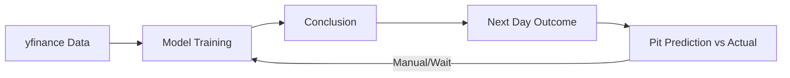
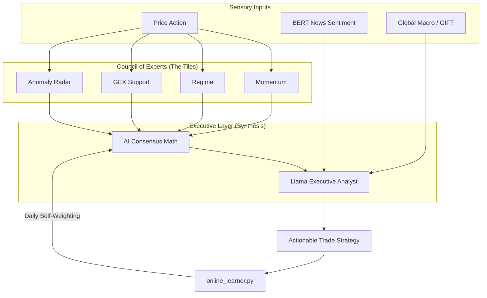

# 🌌 Tradyxa RubiX: OmegaX Master Blueprint
## H-ORBITAL Integration & The Living Brain 4.0

> [!IMPORTANT]
> **Tradyxa RubiX** is an **Autonomous Intelligence System** designed for high-frequency volatility analysis in NIFTY and BANKNIFTY. It leverages institutional-grade mathematics and self-correcting neural loops to quantify market uncertainty.

---

## 🏗️ Evolution: Old Loop vs. H-ORBITAL Mesh

You are exactly right about the **Old Version**. It was a linear "Train -> Predict -> Compare" loop. The **New Version (H-ORBITAL)** is a multi-dimensional mesh where the system doesn't just "retrain" but "Self-Corrects" in real-time.

### 📉 The Old Loop (Linear Learning)

### 🧠 The New H-ORBITAL Mesh (Living Brain 4.0)
The new system adds a **Synthesis Layer** (Llama) and **Sensory Inputs** (News/Macro) that filter the mathematical results.

---

## 💬 What does Llama actually do?

You asked if the `AI Consensus` is enough. For raw math, yes. But for **trading**, you need an Executive.

- **The Tiles (Analysts)**: "Momentum is high (+82)." "Vol is low."
- **Llama (The CEO)**: "Momentum is high, but my **Global Sentinel** sees Gift Nifty down -0.5% and my **Public Pulse** sees bearish news. Therefore, **ignore the technical momentum**—high risk of a Gap Down. Stay Cash."

Llama merges the "Math" of the expert models with the "Noise" of the real world.

---

## 🔄 The Living Brain: Continuous Learning

The system learns from mistakes via the `online_learner.py` script:
- **T-Day**: Llama gives a "Bullish" Action.
- **T+1 Day (Morning)**: The **Living Brain** fetches actual prices.
- **The Correction**: If the market went DOWN, the system lowers the **Reliability Score** and reduces the weight of the "Momentum" model in today's verdict. 
- **Cognitive State**: This is why you see **"Self-Correcting"**—it means the brain is actively adjusting its formulas based on recent misses.

---

## 🎨 Dashboard Architecture (Standard 23-Tile Grid)

| # | Tile Name | Backend Script | Mathematical Model |
|---|-----------|----------------|--------------------|
| 1 | **Spot Price Reference** | `data_fetcher.py` | Real-time Spot Integration |
| 2 | **India VIX Monitor** | `data_fetcher.py` | Implied Volatility Surface |
| 3 | **Hurst Compass** | `risk_calculator.py` | Fractal Dimension (Rescaled Range) |
| 4 | **Momentum Pulse** | `xgb_momentum.py` | XGBoost Gradient Boosting |
| 5 | **Market Regime** | `hmm_regime.py` | Hidden Markov Model (HMM) |
| 6 | **Streak Reversal** | `rf_reversal.py` | Random Forest Classifier |
| 7 | **Max Daily Loss (VaR)** | `risk_calculator.py` | Parametric Value-at-Risk (95% CI) |
| 8 | **Volatility Term** | `data_fetcher.py` | VIX Term Structure Analysis |
| 9 | **Weekend Risk** | `friday_fear.py` | Empirical Distribution of Gaps |
| 10 | **Expiry Pin** | `data_fetcher.py` | Max Pain Theory / OI Clustering |
| 11 | **Key Support (S1)** | `data_fetcher.py` | Dealer GEX (Gamma Exposure) |
| 12 | **Option Skew** | `probability_models.py` | Put/Call Skew Normalization |
| 13 | **Time Decay (Theta)** | `risk_calculator.py` | BSM Partial Derivative (Theta) |
| 14 | **Bet Size (Kelly)** | `risk_calculator.py` | Regime-Adjusted Kelly Criterion |
| 15 | **Touch Probability** | `probability_models.py` | Binary Barrier Option Modeling |
| 16 | **System Status** | `infer.py` | Weighted Multi-Factor Score |
| 17 | **Greed Meter (FOMO)** | `infer.py` | RSI + Volume Breakout Detection |
| 18 | **Next Event** | `data_fetcher.py` | Volatility Calendar Impact |
| 19 | **Global Sentinel** | `data_fetcher.py` | Gift Nifty - US Market Spillover |
| 20 | **Public Pulse** | `sentiment_engine.py` | FinBERT Sentiment Analysis |
| 21 | **Expected Range** | `qr_range.py` | Quantile Regression (Q10/Q90) |
| 22 | **Monte Carlo (Prediction 5D)** | `probability_models.py` | Merton Jump-Diffusion Simulation |
| 23 | **Anomaly Radar** | `anomaly_detector.py` | Deep Neural Auto-Encoder (AE) |

---

## 🛠️ Technology Stack

| Layer | Technologies |
|-------|--------------|
| **Frontend** | React 18, Vite, TypeScript, Tailwind CSS, Framer Motion, Recharts |
| **Backend** | Python 3.12, yfinance, Pandas, NumPy, Scikit-learn, XGBoost, hmmlearn |
| **H-ORBITAL** | PyTorch (CPU), FinBERT (Sentiment), Quantized Llama-3 (Synthesis) |

---

## 🛡️ SEBI Compliance & Disclaimer

**Tradyxa RubiX** is a statistical analysis tool for educational purposes. 
1. **No Recommendations**: All outputs are mathematical probabilities.
2. **Educational Use**: Designed for cognitive augmentation, not signal automation.
3. **Risk Warning**: F&O trading involves substantial risk of capital loss.

**Build Version:** 4.2.0-HORBITAL  
**Last Updated:** December 2025 (H-ORBITAL Refit)  
*Tradyxa: Mastering the Probabilities.*
