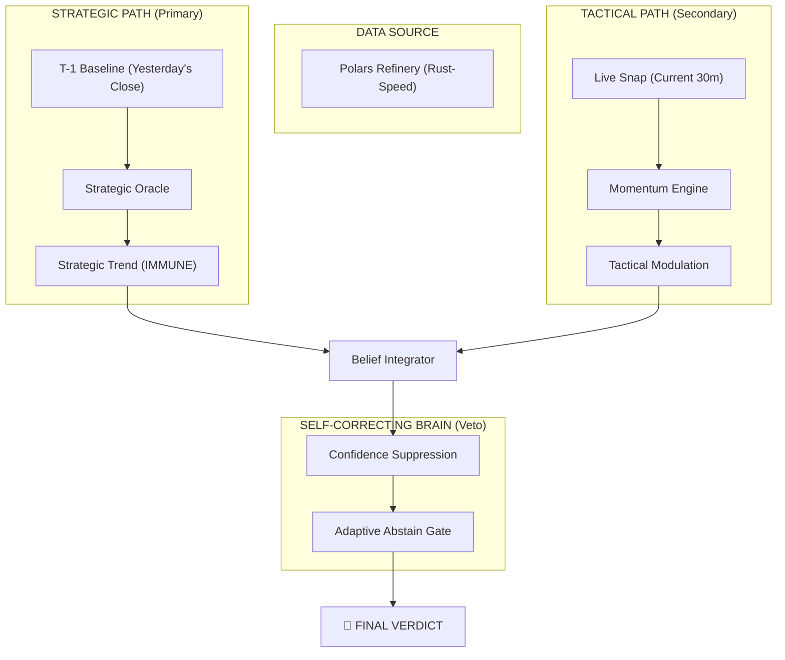
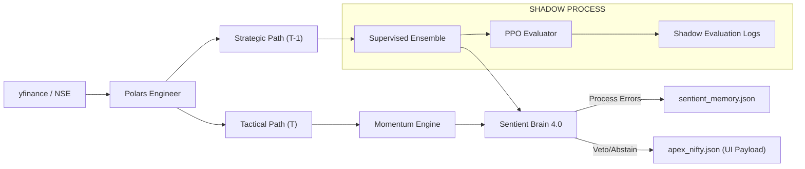

The system generates market beliefs using frozen Supervised Learning models, enforces restraint via **Meta-Cognitive Self-Correction**, and evaluates Reinforcement Learning (RL) policies strictly in **Shadow Mode**. The primary innovation is **Strategic Isolation**—the absolute decoupling of macro-trend beliefs from micro-momentum noise to ensure architectural stability.

> [!NOTE]
> **Versioning Note**: "ApeX v7.0" refers to the holistic platform release. "Sentient Brain 4.0" refers to the internal meta-cognition module handled independently from the production baseline.

---

## 2. Sentient Evolution Timeline
The trajectory of ApeX reflects a transition from "Guesswork" to "Sovereignty."

| Version | Core Philosophy | Machine Learning Role | Control Logic |
| :--- | :--- | :--- | :--- |
| **v2.0 - v4.0** | Pattern Recognition | Online Learning (Auto-Retraining) | Symmetric Ensemble Voting |
| **v5.0 - v6.0** | Experimental RL Path | RL-Led Execution (Live Strategy) | Hybrid ML/RL Authority |
| **v7.0 (Current)**| **Strategic Isolation** | Frozen Weights & Drift Monitoring | **Hierarchical Belief Suppression** |

---

## 3. Architectural Layers: The v7.0 Stack

### A. The Oracle Layer (Supervised Belief)
- **Engine**: Static Ensemble (XGBoost, LightGBM, Random Forest).
- **Weights**: **Frozen**. Performance is managed via confidence suppression rather than parameter updates.
- **Horizon**: Strategic Trend (Daily) vs. Tactical Pulse (Intraday).

### B. The Shadow Research Layer (Reinforcement Learning)
- **Engine**: PPO (Proximal Policy Optimization) Grandmaster.
- **Status**: **SHADOW ONLY**. 
- **Role**: PPO agents observe strategic states and log hypothetical actions for offline research. This data does **not** influence the live final verdict or UI strategy tiles. It serves as a validation gate for future architectural iterations.

### C. The Sentinel Layer (Defense & Veto)
- **Volatility Guard**: GARCH(1,1) regime detection.
- **Chaos Filter**: Isolation Forest anomaly detection (PyOD).
- **Abstain Logic**: A hard-coded meta-cognitive gate that neutralizes signals if adaptive thresholds are not met.

---

## 4. v7.0 Innovation: Strategic Isolation (The Firewall)
The v7.0 engine implements a temporal firewall between Trend and Noise. Unlike prior versions that mixed live data into the core model, v7.0 isolates them to resolve the "Noise Pollution" problem.

- **Operational Logic**: Tactical data can *modulate* confidence but cannot override the Strategic Trend. The system respects the T-1 baseline as the **Primary Prior** (Anchor Belief), treating intraday action as high-entropy noise.

---

## 5. Pipeline Architecture: Data Flow Logic
The pipeline follows a unidirectional flow from raw extraction to high-conviction telemetry:

---

## 6. Self-Correction Loop: Meta-Cognition (Not Learning)
ApeX v7.0 is **self-correcting, not self-learning**. It does not perform online parameter optimization during market hours to avoid data leakage and distribution shift.

1. **Drift Monitoring**: Every night, `accuracy_tracker.py` fetches actual closes and compares them to Strategic Beliefs.
2. **Confidence Suppression**: If a pattern of error is detected (3+ day streak), the **Sentient Brain** applies a **bounded confidence penalty (~10-20%)** to all sub-layer outputs, rather than retraining live weights.
3. **Adaptive Abstain**: High-stress regimes (VIX > 25) automatically raise the conviction bar (e.g., from 55% to 65%), forcing the system into a "NEUTRAL" state.
4. **Offline Retraining**: Model updates occur strictly during scheduled weekend cycles in a sandboxed environment, ensuring no live-process pollution.

---
*© 2026 Zeta Aztra Technologies. Authoritative v7.0 Technical Documentation.*
