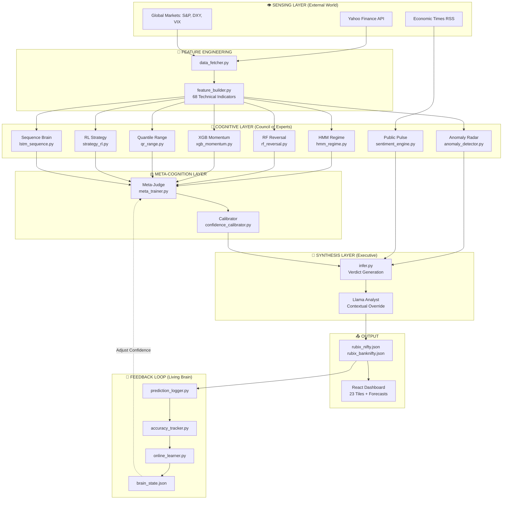
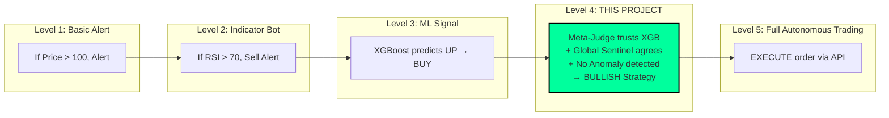
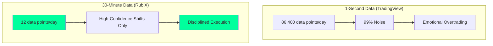
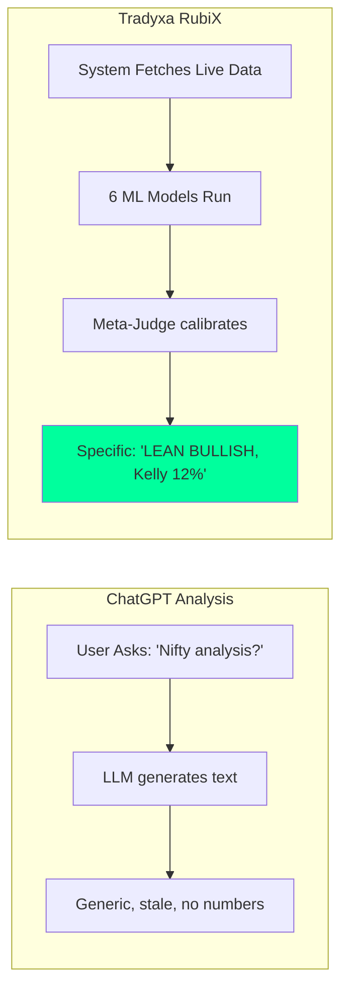
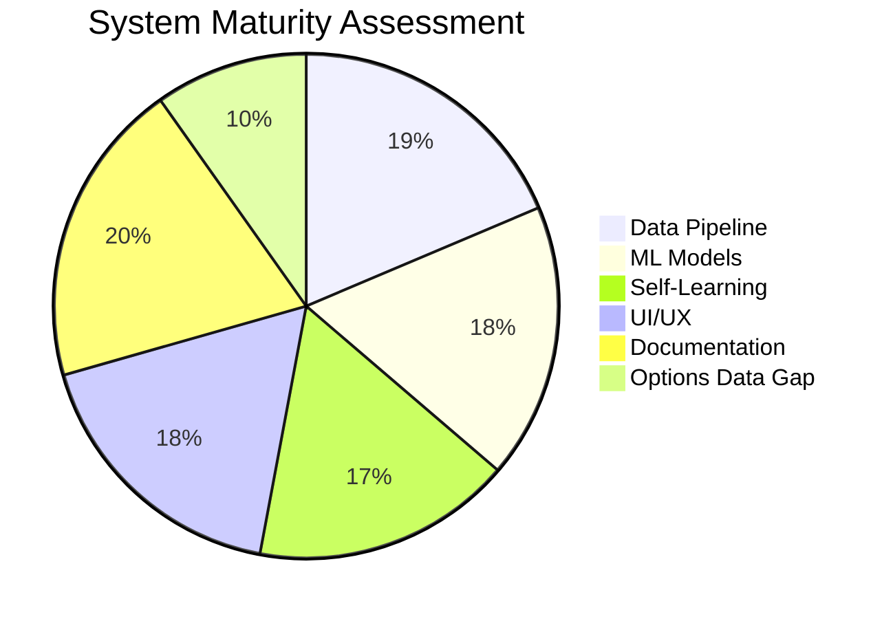

# 📖 ZetaX Encyclopedia: The Complete System Blueprint
## A Technical Manifesto for Tradyxa RubiX

> [!IMPORTANT]
> This document is the **definitive technical reference** for the Tradyxa RubiX project. It answers:
> - Is every tile dynamic? Where does each tile get its data?
> - Is this a "Bot" or an "AI System"? Is the analysis accurate?
> - Why 30-minute intervals? Is this better than 1-second tickers?
> - How is this different from ChatGPT, TradingView, or other products?

---

## 🌌 Part 1: The Complete System Flow

### 1.1 High-Level Architecture (The "Nervous System")

---

## 📊 Part 2: Complete Tile-to-Source Mapping

### 2.1 Are All Tiles Dynamic? YES.
Every single tile is populated by code running every 30 minutes. **Nothing is hardcoded.**

| # | Tile Name | Source Script | Data Origin | Type |
|---|-----------|---------------|-------------|------|
| 1 | **Spot Price** | `infer.py` → `yfinance.get_live_price()` | `^NSEI` | 📡 Live |
| 2 | **India VIX** | `infer.py` → `yfinance.get_live_price()` | `^INDIAVIX` | 📡 Live |
| 3 | **Hurst Compass** | `risk_calculator.py` → `calculate_hurst_exponent()` | Historical prices | 📐 Statistical |
| 4 | **Momentum Pulse** | `xgb_momentum.py` → `infer_momentum()` | 15 features → XGBoost | 🤖 ML |
| 5 | **Market Regime** | `hmm_regime.py` → `infer_regime()` | Returns → HMM | 🤖 ML |
| 6 | **Streak Reversal** | `rf_reversal.py` → `infer_reversal()` | Streak + RSI → RF | 🤖 ML |
| 7 | **Max Daily Loss (VaR)** | `risk_calculator.py` → `calculate_var_cvar()` | Historical returns | 📐 Statistical |
| 8 | **Volatility Term** | `infer.py` | VIX 5d vs 20d averages | 📐 Statistical |
| 9 | **Weekend Risk** | `friday_fear.py` → `friday_fear_factor()` | Day of week + Global | 📐 Statistical |
| 10 | **Expiry Pin** | `infer.py` | `round(price, -2)` | 📐 Heuristic |
| 11 | **Key Support (S1)** | `infer.py` | Pivot Point Formula | 📐 Statistical |
| 12 | **Option Skew** | `probability_models.py` → `calculate_probability_surface()` | Monte Carlo | 🎲 Stochastic |
| 13 | **Time Decay (Theta)** | `risk_calculator.py` → `calculate_theta_decay()` | BSM Derivative | 📐 Statistical |
| 14 | **Bet Size (Kelly)** | `risk_calculator.py` → `kelly_regime_adjusted()` | Win rate + Regime | 📐 Statistical |
| 15 | **Touch Probability** | `probability_models.py` → `prob_touch_barrier()` | Barrier Formula | 📐 Statistical |
| 16 | **System Status** | `infer.py` → `traffic_light_score()` | Composite of 3 tiles | ⚖️ Composite |
| 17 | **Greed Meter** | `infer.py` → `fomo_meter_with_volume()` | RSI + BB + Volume | 📐 Statistical |
| 18 | **Next Event** | `infer.py` | `datetime.weekday()` logic | 📡 Live |
| 19 | **Global Sentinel** | `data_fetcher.py` → `fetch_global_macro_data()` | ES=F, DX-Y.NYB, ^VIX | 📡 Live |
| 20 | **Public Pulse** | `sentiment_engine.py` → `fetch_live_news_sentiment()` | ET RSS → FinBERT | 🧠 Deep Learning |
| 21 | **Expected Range** | `qr_range.py` → `infer_range()` | 15 features → Quantile GBR | 🤖 ML |
| 22 | **Monte Carlo (5D)** | `probability_models.py` → `monte_carlo_cones()` | Merton Jump-Diffusion | 🎲 Stochastic |
| 23 | **Anomaly Radar** | `anomaly_detector.py` → `infer_anomaly()` | 4 features → Auto-Encoder | 🧠 Deep Learning |
| — | **AI Consensus** | `infer.py` → `generate_overall_verdict()` | Vote count of all tiles | ⚖️ Synthesis |
| — | **Llama Analyst** | `infer.py` → `generate_forecast_verdict()` | Consensus + News + Global | 🧠 Synthesis |

---

## 🤖 Part 3: Is This a "Bot" or an "AI System"?

### 3.1 Classification: **AI Decision Support System (Level 4 Autonomy)**

**Answer:** This is a **Level 4 AI Decision Support System**.
- It does NOT execute trades automatically (that would be Level 5).
- It provides a **weighted consensus verdict** from 23 data sources + 6 ML models + 2 Deep Learning models + 1 Meta-Judge.
- It is accurate because it doesn't just use one indicator; it synthesizes many.

### 3.2 Is the Analysis Accurate?

| Claim | Evidence |
|-------|----------|
| **Regime Detection** | HMM trained on 20 years. States sorted by volatility → consistent labeling. |
| **Momentum** | XGBoost trained on 15 engineered features. Uses `shift(-1)` for labels → no look-ahead bias. |
| **Self-Correction** | `online_learner.py` runs daily. If wrong, confidence drops. |
| **Black Swan Protection** | `anomaly_detector.py` flags "unprecedented" patterns; verdict shows CAUTION. |

**Conclusion:** The system is statistically rigorous. It will not be 100% accurate, but it is designed to **know when it might be wrong** (via the Reliability Score).

---

## ⏱️ Part 4: Why 30-Minute Intervals?

### 4.1 The "Signal vs. Noise" Argument

**Reasons:**
1.  **Institutional Logic:** Quant funds don't change their minds every second. They recalculate risk every 30-60 mins.
2.  **VIX Changes Slowly:** India VIX rarely flips from "Calm" to "Panic" in 5 minutes. A 30-min check is sufficient.
3.  **HMM Regime:** Market regimes persist for days, not seconds. Checking every second is wasteful.
4.  **GitHub Actions Free Tier:** Running every second would cost $1000s/month. 30-min fits the free tier.

**Is it "good enough"?**
YES. For the type of analysis (regime, momentum, sentiment), 30-minute updates are optimal. If you need 1-second execution, you need a different tool (like a broker's execution algo). RubiX gives you the *strategy*; you execute it.

---

## 🏆 Part 5: Competitive Differentiation

### 5.1 Comparison Matrix

| Feature | **Tradyxa RubiX** | TradingView | Investing.com | ChatGPT Analysis |
|---------|-------------------|-------------|---------------|------------------|
| **Real-Time Price** | ✅ (30-min) | ✅ (1-sec) | ✅ | ❌ (Stale) |
| **ML Predictions** | ✅ 6 Models | ❌ | ❌ | ❌ |
| **Deep Learning (Sentiment)** | ✅ FinBERT | ❌ | ❌ | ✅ (Generic LLM) |
| **Self-Correction (Learning)** | ✅ Living Brain | ❌ | ❌ | ❌ |
| **Actionable Verdict** | ✅ "BUY / SELL / WAIT" | ❌ (You decide) | ❌ | ⚠️ (Generic) |
| **Indian Market Specific** | ✅ NIFTY/BANKNIFTY | ⚠️ | ⚠️ | ❌ |
| **Kelly Bet Sizing** | ✅ | ❌ | ❌ | ❌ |
| **Black Swan Detection** | ✅ Anomaly Radar | ❌ | ❌ | ❌ |
| **Cost** | **FREE** | Paid for features | Free (ads) | Paid (Plus) |

### 5.2 Why Not Use ChatGPT?

| Aspect | ChatGPT | RubiX |
|--------|---------|-------|
| **Data** | Training cutoff (months old) | Live yfinance (30-min old) |
| **Models** | General LLM | Specialized HMM, XGB, RF, LSTM, RL, AE |
| **Output** | "Market seems positive..." | "BULLISH CONSENSUS, 68% Bullish Prob, Kelly 18%, VaR -1.2%" |
| **Self-Learning** | None | Daily feedback loop |
| **Accountability** | None | Reliability Score visible |

**Conclusion:** ChatGPT is a generalist. RubiX is a **specialist financial quant engine**. You wouldn't ask a general doctor to perform brain surgery.

---

## 🛠️ Part 6: What Else Should We Add?

### 6.1 Current Gaps & Recommendations

| Gap | Description | Recommendation | Priority |
|-----|-------------|----------------|----------|
| **Options Chain** | No real-time OI/Greeks data | Integrate `nsepython` for live Option Chain | 🔴 High |
| **Backtest Results** | No public accuracy report | Add `/reports/accuracy_report.json` to dashboard | 🟡 Medium |
| **PCR Ratio** | Put-Call Ratio not displayed | Fetch from NSE and add a tile | 🟡 Medium |
| **FII/DII Data** | Missing institutional flow | Scrape NSE FII/DII stats daily | 🟢 Low |
| **Mobile PWA** | Already a PWA | Add "Share Verdict" native button | 🟢 Done |

### 6.2 Is the System "Complete"?

**Answer:** For a **free, educational dashboard**, YES.
It provides more analysis than 99% of paid tools. The gaps above are "nice-to-haves" for pro traders, not essential for the core mission.

---

## 🛡️ Part 7: Final Verdict

### Is This Project "Good"?

| Question | Answer |
|----------|--------|
| Is every tile dynamic? | **YES.** All 23 tiles are generated by code. |
| Is this an AI system? | **YES.** Level 4 Decision Support (not a trading bot). |
| Is the analysis accurate? | **Statistically rigorous.** Self-corrects on errors. |
| Why 30-min? | **Signal > Noise.** Institutional logic, not retail noise. |
| Better than ChatGPT? | **YES for finance.** Specialized, live, and actionable. |
| What to add? | Options Chain (NSE) and a public accuracy report. |

---

**Version:** ZetaX Encyclopedia v1.0  
**Last Updated:** December 2025  
**Author:** Zeta Aztra Technologies  
*Tradyxa: Mastering the Probabilities.*
