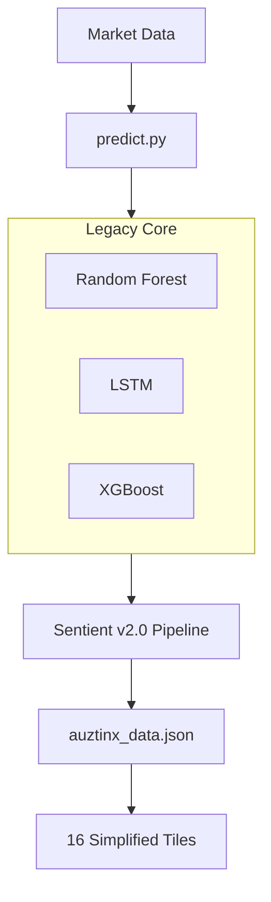
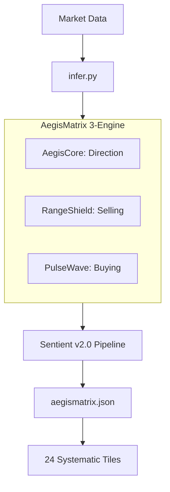
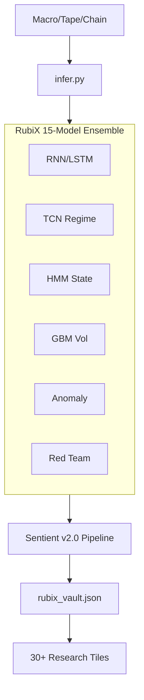
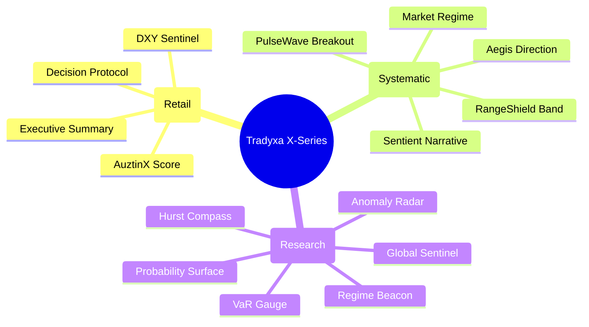

# Tradyxa X-Series Architecture Encyclopedia: BetaX vs ZetaX vs DeltaX

A comprehensive guide to the Tradyxa Trading Ecosystem after the Sentient v2.0 "Living Brain" upgrade.

---

## 📊 Quick Comparison Dashboard

| Dimension | DeltaX (AuztinX) | BetaX (AegisMatrix) | ZetaX (RubiX) |
|-----------|-----------------|-------------------|---------------|
| **Complexity** | ⭐⭐⭐ (3/5) | ⭐⭐⭐⭐ (4/5) | ⭐⭐⭐⭐⭐ (5/5) |
| **ML Sophistication** | ⭐⭐⭐ (3/5) | ⭐⭐⭐⭐ (4/5) | ⭐⭐⭐⭐⭐ (5/5) |
| **Retail Friendliness** | ⭐⭐⭐⭐⭐ (5/5) | ⭐⭐⭐⭐ (4/5) | ⭐⭐⭐ (3/5) |
| **Research Depth** | ⭐⭐⭐ (3/5) | ⭐⭐⭐⭐ (4/5) | ⭐⭐⭐⭐⭐ (5/5) |
| **Speed to Decision** | ⭐⭐⭐⭐⭐ (5/5) | ⭐⭐⭐⭐ (4/5) | ⭐⭐⭐ (3/5) |
| **Learning Curve** | Gentle (Days) | Moderate (Weeks) | Steep (Months) |
| **Target User** | Casual Traders | Systematic Traders | Quant Researchers |

---

## 🏗️ High-Level Architecture (Mermaid)

### 🔵 DeltaX: The Executive (The "What")
*Designed for decision speed. It tells you WHAT to do without the noise.*

### 🟠 BetaX: The Bridge (The "How")
*The industrial-grade systematic engine. It tells you HOW to trade the range.*

### 🟢 ZetaX: The Lab (The "Why")
*The high-fidelity research platform. It tells you WHY the market is moving.*

---

## 🧠 ML Model Arsenal

| Feature | DeltaX | BetaX | ZetaX |
|---------|--------|-------|-------|
| **Model Count** | 3-5 | 6-9 | 15+ |
| **Base Tech** | Scikit-learn, XGB | PyTorch, XGB, Ensembles | DL, TCN, HMM, RL |
| **Logic** | Aggregator Score | Multi-Engine Fusion | Parallel Hypothesis |
| **Bias Check** | Veto Only | Meta-Cognition | Red Team Protocol |
| **Self-Learning** | STM (30 Days) | STM + Weight Adapt | Full LTM Consolidation |

---

## 📈 Dashboard Tile Mindmap

---

## 🎯 Use Case Encyclopedia

### Use Case 1: The "9-to-5" Trader (DeltaX)
*   **Persona:** Has 5 minutes before the market opens.
*   **Workflow:** Opens **DeltaX**, checks the `Sentient Verdict`. If it matches the `AuztinX Score` and `Decision Protocol` is GO, they take the trade.
*   **Goal:** Decision simplicity.

### Use Case 2: The "Option Seller" (BetaX)
*   **Persona:** Wants to sell weekly/monthly NIFTY options.
*   **Workflow:** Uses **BetaX** to check the `RangeShield`. It identifies the "Safe Zone" where the market is unlikely to breach. They combine this with the `Sentient Narrative` to see if there are any "Traps" detected.
*   **Goal:** Capital protection and probabilistic edge.

### Use Case 3: The "Quant Strategist" (ZetaX)
*   **Persona:** Wants to know if the current Bull market is structural or a liquidity trap.
*   **Workflow:** Analyzes **ZetaX** `Regime Beacon` (HMM state) and `Hurst Compass`. They check the `Probability Surface` to find the math-optimal strike prices for a 10-day swing trade.
*   **Goal:** Deep alpha discovery.

---

## 🧬 Shared Infrastructure: Sentient v2.0

All three projects now share the **identical Cognitive Core**, ensuring that "Reasoning" is consistent across the ecosystem:

1.  **Memory Systems:**
    *   **LTM (Long Term):** 20 years of market DNA.
    *   **STM (Short Term):** 30 days of recent mistakes.
2.  **Bayesian Inference:** Constantly testing "Bull" vs "Bear" hypotheses.
3.  **Meta-Cognition:** The "Self-Aware" layer that detects if models are being too stubborn or biased.

---

## 📊 Summary Table

| Feature | DeltaX | BetaX | ZetaX |
|---------|--------|-------|-------|
| **Automation** | Scheduled | GitHub Actions | High-Frequency |
| **Learning Cycle** | Daily | Nightly + Online | Weekly Deep Retrain |
| **User Interface** | Exec Dashboard | Strategic Ops | Research Lab |
| **Complexity** | Low | Medium-High | Very High |
| **System Philosophy**| Trust the Engine | Guided Logic | Question Everything |

---

*Generated: 2025-12-24 | Version 2.0.0-COMPREHENSIVE*
