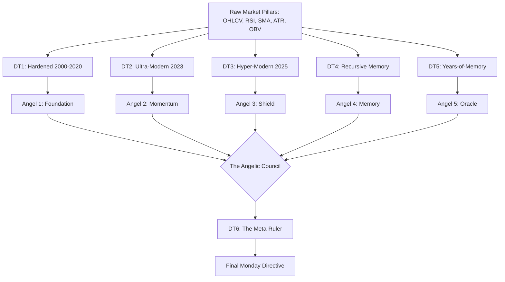
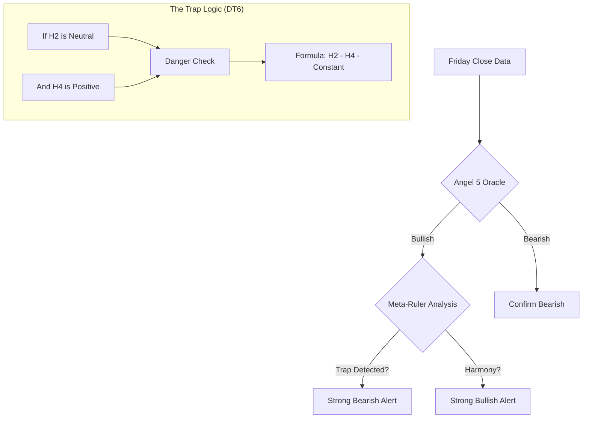

# 🔱 THE ANGELIC COUNCIL: LEVEL 6.5 OMNI-SENTIENT
## The Genetic Permutator Encyclopedia

This document outlines the architecture, philosophy, and mathematical evolution of the **Level 6.5 Omni-Sentient** prototype. It documents the transition from defensive "Death Testing" to the unified "Angelic Council" architecture.

---

## 🏛️ Philosophy: From Death to Angels

### 💀 The Death Test (Stress Testing)
In quantitative finance, a "Death Test" is designed to kill a hypothesis. We subjected our "Alien Math" to 6 distinct Death Zones to ensure their predictive power wasn't just overfit noise.
*   **Goal:** Destruction of weak signals.
*   **Result:** Only "Elite Alpha" survivors remained.

### 👼 The Angel Council (Protection)
Once a formula survives a Death Test, it is rebranded as an **Angel (Guardian)**. These are no longer just math; they are protective layers that guard your capital by detecting specific historical traps.
*   **Goal:** Preservation and consensus.
*   **Result:** A unified "Council" that governs every trading day.

---

## 🧬 Architectural Flow: The Evolution Pipeline

The following diagram illustrates how we moved from raw market pillars to the final **Master Ruler (DT6)**.

---

## 🛡️ The 6 Evolutionary Horizons

### 1. Hardened Foundation (H1)
*   **Training:** 2000 - 2020
*   **Validation:** 2021 - 2025 (OOS)
*   **Focus:** Long-term market physics. It ignores recent noise and looks for "Universal Laws."

### 2. Momentum Watcher (H2)
*   **Training:** 2000 - 2023
*   **Validation:** 2024 - 2025
*   **Focus:** The relationship between **Wick Resistance** and **Body Energy**. Perfect for modern bull runs.

### 3. Volatility Shield (H3)
*   **Training:** 2000 - Jan 2025
*   **Validation:** Full 2025
*   **Focus:** Resilience against the specific high-volatility regime of the current year.

### 4. Memory Keeper (H4)
*   **Method:** Recursive Walk-Forward.
*   **Focus:** Learning from the transition between decades (2000 -> 2010 -> 2020). It captures how the market "ages."

### 5. All-Seeing Oracle (H5)
*   **Method:** **Year-by-Year Residual Learning.**
*   **Accuracy:** **16.5% OOS Correlation.**
*   **Focus:** 25 individual formulas evolved to fix the previous year's mistakes. This is our most granular model.

### 6. The Meta-Ruler (H6)
*   **Method:** Meta-Symbolic Regression.
*   **Focus:** **Math governing the Math.** It uses the outputs of Angels 1-5 as its raw ingredients to find the "Ultimate Consensus."

---

## ⚖️ The Decision Logic (Meta-Council)

The Angelic Council does not use a simple "Majority Vote." It uses **Meta-Conflict Analysis.**

### 🧠 Why the Ruler can over-rule the Oracle
The **All-Seeing Oracle (H5)** has 16.5% accuracy, but it can be prone to "FOMO" (Green candle excitement). The **Meta-Ruler (H6)** has learned over 25 years that certain combinations of "Staff Behavior" (Angel 2 and 4 movements) actually predict a reversal. 

The Ruler's job isn't to be right about the trend; its job is to **detect the lie.**

---

## 📂 Research Directory Map
*   `experimental_omni/angel_tests/`: The unified production script.
*   `experimental_omni/death_test_1-6/`: The historical evolutionary archives.
*   `experimental_omni/genetic_engine.py`: The core DNA of the Level 6.0 intelligence.

**Omni-Sentient Level 6.5: Math that has survived the fire to become an Angel. 🔱🧬🌌🚀🦾**
