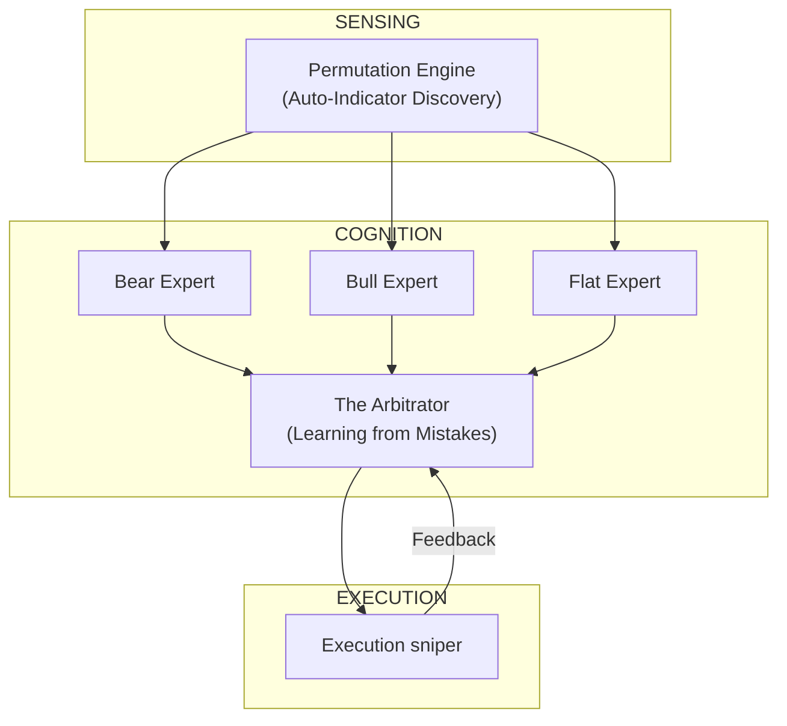

# Sentient 5.0: The Neural Orchestrator (The Beyond)

> **Vision:** Moving from a "Pipeline of Models" to a "Symphony of Intelligence" that proactively heals, permutes, and adapts.

---

## 🧠 1. The "Why" (ApeX vs ZetaX)

You asked why ApeX doesn't have the **Living Brain** (online learner) of ZetaX. 

### The Latency-Complexity Tradeoff
*   **ZetaX (The Executive):** It is designed to be very deep. It has time to "think" (Living Brain loops). But this makes it heavy and slower.
*   **ApeX (The Sniper):** It is designed for **execution**. Every nested loop adds "lag". If the Living Brain starts overthinking, the Sniper misses the shot.
*   **Standard ApeX Strategy:** We use **Asynchronous Learning**. Instead of learning *inside* the prediction loop, we learn *next to it* (Nightly Review) and update the engine once a week.

---

## 🔄 2. The Logic of "Loops of Loops"

### Proposed: Robot 2 (The Arbitrator)
You suggested having one robot learn from the market and another learn from the first robot's mistakes. In Sentient 5.0, we call this **The Arbitrator**.

| Phase | Action |
| :--- | :--- |
| **Model A (The Worker)** | Predicts UP (based on RSI). |
| **Model B (The Critic)** | Predicts if Model A is likely to be WRONG right now. |
| **Synthesis** | If Critic says "Model A is failing in this volatility," we Veto. |

**Pro:** Catches "regime shifts" where old patterns stop working.
**Con:** High risk of **Overfitting**. If Model A fails once, the Critic might over-react and never let it trade again.

---

## 🎮 3. The "Multi-Gamer" Pipeline (Adversarial RL)

Your doubt about the Gamer Robot is a classic AI problem. Why not have many "Gamer Personalities"?

### Sentient 5.0 Evolutionary Concept:
Instead of one Gamer playing 1 level, we have **3 Experts**:
1.  **The Bear-Market Gamer:** Trains only on 2008 and 2020 crashes.
2.  **The Bull-Market Gamer:** Trains only on 2021-2024 massive rallies.
3.  **The Sideways Gamer:** Trains on boring, flat years.

**The Loop:**
*   **Sensing:** The **Risk Regime (v4.0)** identifies the current market state.
*   **Selection:** It flips a switch and loads the **Specific Expert** brain.
*   **Execution:** You get "Specialist" performance rather than "Generalist" guesswork.

---

## 🧬 4. Sentient 5.0: Permutations & Computations

You asked for permutations—here is the math-heavy vision for 5.0.

### A. The Permutation Engine (Genetic Algorithms)
Currently, **we** (the programmers) choose the 13 Pillars (RSI, SMA). 
**In 5.0:**
*   The system creates **1,000 random combinations** (e.g., `(RSI * VIX) / ATR`).
*   It tests all 1,000 on 20 years of data.
*   The system itself "discovers" new indicators that no human has ever seen.

### B. Recursive Self-Healing
If the system detects it is losing money (Accuracy < 45% for 3 days):
1.  It triggers an **Emergency Retrain**.
2.  It deletes the "bad memory" neurons in the neural net.
3.  It adjusts its own **Reward Function** to be more defensive.

---

## 🏆 Summary: The v5.0 Master Map

**Sentient 5.0 doesn't just predict the market; it predicts its own failure and fixes it before the next candle close.**
