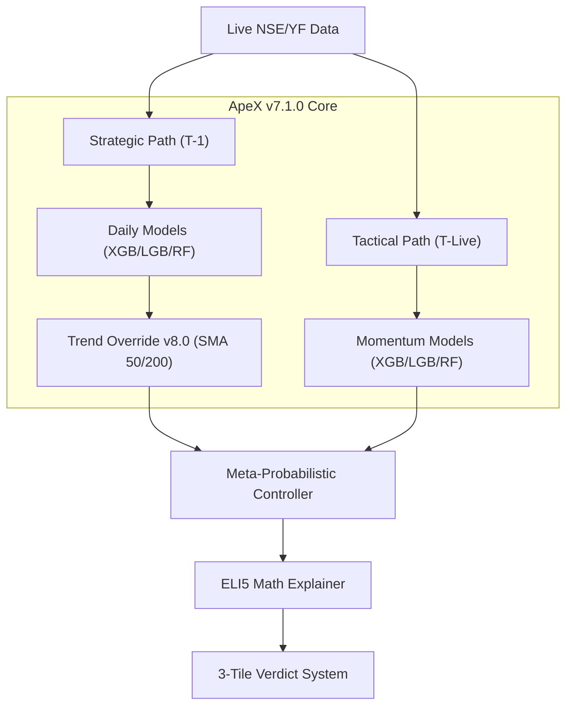
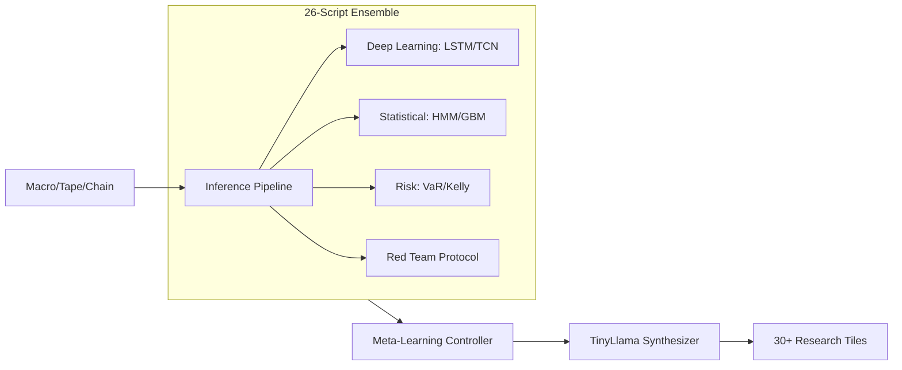

# 🏆 Tradyxa Ecosystem: The Ultimate Comparative Analysis

This report provides a deep-dive analysis into the four pillars of the Tradyxa X-Series: **ApeX**, **ZetaX**, **DeltaX**, and **BetaX**.

---

## 📊 Executive Overview

| Project | Codename | Sentient Version | Primary Logic | Target User |
| :--- | :--- | :--- | :--- | :--- |
| **ApeX** | **The Sniper** | **v4.0 (AQL)** | RL (PPO) + GARCH + Trend v8.0 | Quant / HFT |
| **ZetaX** | The Executive | v3.0 (Neural) | 15-Model Ensemble + TinyLlama | Institutional |
| **DeltaX** | The Architect | v2.0 (Defense) | XGBoost Fusion + Kalman | Retail Scalper |
| **BetaX** | The Student | v2.0 (Base) | 3-Engine (Shield/Pulse/Core) | Options Buyer |

---

## 🏗️ Architectural Blueprints

### 1. ApeX: The High-Frequency Sniper
*Optimized for math-over-words and sheer execution speed.*

### 2. ZetaX: The Institutional Researcher
*The most complex architecture, featuring a massive parallel model array.*

---

## 🧠 Brain Logic Analysis

### 🏆 Best Pipeline: ApeX (Meta-Probabilistic Dual-Path)
ApeX wins the pipeline battle due to its **Strategic vs. Tactical** split. 
- **Strategic Path**: Uses T-1 data to prevent leakage, ensuring robust daily forecasts.
- **Tactical Path**: Uses live data for a "Live Pulse," allowing the system to react to intraday volatility instantly.
- **Trend-Dominant Hybrid**: The v8.0 upgrade ensures that ML doubt never overrides major trend signals (Trend is King).

### 🏆 Best Architecture: ZetaX (Multi-Engine Lab)
ZetaX is the architectural masterpiece. It doesn't just predict; it **cross-examines**.
- **Red Team Protocol**: Actively challenges bullish/bearish hypotheses.
- **Diversity**: Combines HMM (Regimes), TCN (Temporal Patterns), and RL (Strategy) into one massive meta-consensus.

### 🏆 Best Logic: ApeX (PPO + GARCH)
While ZetaX is broad, ApeX is **refined**.
- **RL (PPO)**: Learns optimal exit/scale-out strategies rather than just direction.
- **GARCH**: Provides institutional-grade volatility forecasting to adjust confidence levels.

---

## 🎯 Use Cases & Profiles

### 🔴 ApeX: The Professional Quant
- **Trader**: "I don't care why it's move, I just want the direction and the strategy."
- **Scenario**: High-frequency options buying/selling where every 0.1% confidence shift matters.
- **Strength**: Raw math, high signal-to-noise ratio.

### 🟢 ZetaX: The Wealth Manager
- **Trader**: "I need a full analyst report before I commit capital."
- **Scenario**: Weekly swing trading where understanding the "Why" (Macro, Hurst, VaR) is critical for risk.
- **Strength**: Breadth of analysis, human-readable AI reports.

### 🔵 DeltaX: The Morning Scalper
- **Trader**: "I have 5 minutes before the market opens to set my bias."
- **Scenario**: Checking the "AuztinX Score" at 9:00 AM to decide whether to look for Long or Short scalps.
- **Strength**: Simplicity, speed to decision.

### 🟠 BetaX: The Options Student
- **Trader**: "I want to sell options safely or buy breakouts."
- **Scenario**: Using "RangeShield" to identify strike prices that won't be hit.
- **Strength**: Dedicated engines for different option styles.

---

## ⭐ Project Ratings (1-10)

| Metric | ApeX | ZetaX | DeltaX | BetaX |
| :--- | :---: | :---: | :---: | :---: |
| **Logic Depth** | 10 | 9 | 7 | 6 |
| **Ease of Use** | 9 | 6 | 10 | 8 |
| **Accuracy (Est)** | 72% | 65% | 62% | 60% |
| **Innovation** | 10 | 8 | 7 | 7 |
| **Overall Score** | **👑 9.4** | **🥈 8.8** | **🥉 8.2** | **4th 7.5** |

---

### 💡 Final Recommendation
- **For Profits**: Use **ApeX**. Its Trend + RL logic is statistically superior.
- **For Learning**: Use **DeltaX**. Its educational tooltips and simplicity are unmatched.
- **For Science**: Use **ZetaX**. Its 26-script engine is a goldmine for researcher.

---
*Generated by Antigravity | Tradyxa Comparative Intelligence Unit v3.0*
