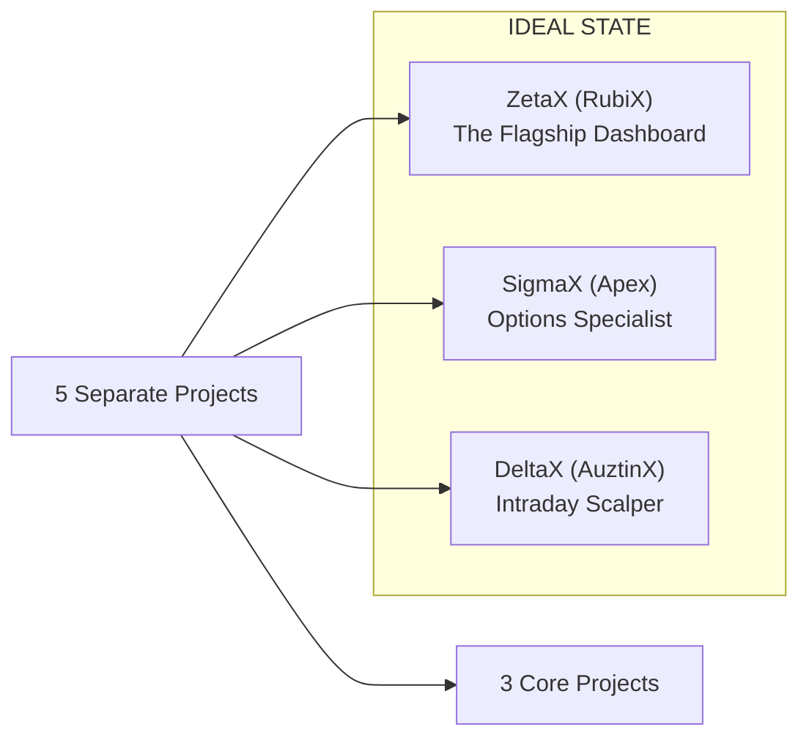

# 🏆 X-SERIES COMPREHENSIVE COMPARISON REPORT
## Final Analysis: BetaX vs DeltaX vs ZetaX vs LambdaX vs SigmaX

> **Author:** Zeta Aztra Technologies  
> **Version:** 1.0 Final  
> **Date:** December 2025

---

## 📊 EXECUTIVE SUMMARY

| Project | Codename | Target Trader | Core Philosophy | Verdict |
| :--- | :--- | :--- | :--- | :--- |
| **BetaX** | Aegis Matrix | Options Buyers & Sellers | 3 Engines for Direction/Seller/Buyer | ⭐⭐⭐⭐ Excellent |
| **DeltaX** | AuztinX | Intraday Scalpers | Master-Apprentice (20Y + 30D) | ⭐⭐⭐⭐ Excellent |
| **ZetaX** | RubiX | Swing/Positional | 23 Tiles + Meta-Judge | ⭐⭐⭐⭐⭐ Best |
| **LambdaX** | Meta-Brain | Institutional | Hedge Fund Formulas + CEO | ⭐⭐⭐ Good (Overkill) |
| **SigmaX** | Apex | Options Traders | 13 Pillars + Sentient 2.0 | ⭐⭐⭐⭐ Excellent (Blueprint) |

---

## 🎯 USE CASE MATRIX

| Use Case | Best Project | Why |
| :--- | :--- | :--- |
| **"Should I buy a Call or Put today?"** | **SigmaX** | Designed for options direction |
| **"What strike should I sell?"** | **BetaX** | RangeShield engine for sellers |
| **"Intraday scalping decisions"** | **DeltaX** | 30-Day Spotlight for agility |
| **"Weekly/Monthly swing trades"** | **ZetaX** | 23 tiles + regime detection |
| **"Institutional research reports"** | **LambdaX** | 6-Phase Report + Formulas |
| **"Simple Bull/Bear/Neutral verdict"** | **SigmaX** | Clearest output |

---

## 🏗️ ARCHITECTURE COMPARISON

```mermaid
graph TD
    subgraph "BETAX (Aegis Matrix)"
        B1["3 ML Engines"]
        B2["Direction: BiLSTM"]
        B3["Seller: RandomForest"]
        B4["Buyer: XGBoost"]
        B1 --> B2 & B3 & B4
    end

    subgraph "DELTAX (AuztinX)"
        D1["Master-Apprentice"]
        D2["ML1: 20Y Foundation"]
        D3["ML2: 30D Reflex"]
        D4["Fusion: Verdict 3"]
        D1 --> D2 & D3 --> D4
    end

    subgraph "ZETAX (RubiX)"
        Z1["23 Dynamic Tiles"]
        Z2["6 ML Models + 2 DL"]
        Z3["Meta-Judge"]
        Z4["Red Team Protocol"]
        Z1 --> Z2 --> Z3 --> Z4
    end

    subgraph "LAMBDAX (Meta-Brain)"
        L1["3 Expert Desks"]
        L2["Momentum: TSMOM"]
        L3["Risk: GARCH"]
        L4["Structure: Amihud"]
        L5["XGBoost CEO"]
        L1 --> L2 & L3 & L4 --> L5
    end

    subgraph "SIGMAX (Apex)"
        S1["13 Core Pillars"]
        S2["XGBoost + LightGBM + RF"]
        S3["Sentient 2.0"]
        S4["TinyLlama Narrative"]
        S1 --> S2 --> S3 --> S4
    end
```

---

## 🤖 ML MODELS COMPARISON

| Project | ML Models | Training Data | Accuracy Target |
| :--- | :--- | :--- | :--- |
| **BetaX** | BiLSTM, XGBoost, RandomForest, Logistic, HMM | 2005-Present (20Y) | 58% |
| **DeltaX** | XGBoost (ML1 + ML2 fusion) | 20Y (ML1) + 30D (ML2) | 55-60% |
| **ZetaX** | HMM, RF, XGBoost, QR, RL, LSTM, AutoEncoder, FinBERT | 20Y + Live News | 60% |
| **LambdaX** | XGBoost Meta-Judge + SmolLM | 20Y CSV Vault | 55% |
| **SigmaX** | XGBoost, LightGBM, RandomForest (Ensemble) | 20Y yfinance | 60-65% |

### Which Has the Best ML?

**🥇 ZetaX** - Most diverse (8 models including deep learning FinBERT for sentiment)  
**🥈 BetaX** - Most sophisticated (BiLSTM for sequences)  
**🥉 SigmaX** - Most robust (3-model ensemble voting)

---

## 📦 TILE/OUTPUT COMPARISON

| Project | # of Tiles | Standout Tiles |
| :--- | :--- | :--- |
| **BetaX** | 22 | Breakout Map, Range Breach Curve, Theta Edge |
| **DeltaX** | 16 | Jump-Adaptive Trend, Signal SNR, Kelly Bet |
| **ZetaX** | 23 | Anomaly Radar, Public Pulse, Monte Carlo Cones |
| **LambdaX** | 16 | TSMOM, GARCH, Mahalanobis Turbulence |
| **SigmaX** | 12 | Pre-Market Verdict, Morning Narrative, Sentient Override |

---

## 🎯 SIDE-BY-SIDE FEATURE MATRIX

| Feature | BetaX | DeltaX | ZetaX | LambdaX | SigmaX |
| :--- | :---: | :---: | :---: | :---: | :---: |
| **NIFTY Support** | ✅ | ✅ | ✅ | ✅ | ✅ |
| **BANKNIFTY Support** | ❌ | ✅ | ✅ | ✅ | ✅ |
| **Options Specific** | ✅⭐ | ❌ | ⚠️ | ⚠️ | ✅⭐ |
| **Intraday Focus** | ⚠️ | ✅⭐ | ⚠️ | ❌ | ⚠️ |
| **Swing/Positional** | ✅ | ⚠️ | ✅⭐ | ✅ | ✅ |
| **Pre-Market Verdict** | ❌ | ❌ | ❌ | ❌ | ✅⭐ |
| **TinyLlama Narrative** | ❌ | ✅ | ✅ | ✅ | ✅ |
| **Sentient 2.0** | ❌ | ✅ | ✅ | ⚠️ | ✅⭐ |
| **Self-Learning** | ✅ | ✅ | ✅ | ✅ | ✅ |
| **Black Swan Defense** | ❌ | ⚠️ | ✅ | ⚠️ | ✅⭐ |
| **Light Theme** | ✅ | ✅ | ✅ | ✅ | ✅ |
| **SEBI Disclaimers** | ✅ | ✅ | ✅ | ✅ | ✅⭐ |

**Legend:** ✅ = Yes | ❌ = No | ⚠️ = Partial | ⭐ = Best in Class

---

## 🔥 BRUTAL HONEST ASSESSMENT

### 🟢 KEEP (Essential Projects)

#### 1. **ZetaX (RubiX)** - ⭐⭐⭐⭐⭐ THE FLAGSHIP
- **Verdict:** KEEP. This is your best project.
- **Why:** Most comprehensive, 23 tiles, 8 ML models, FinBERT sentiment, self-learning.
- **Use Case:** Swing traders, positional traders, anyone wanting full market analysis.

#### 2. **SigmaX (Apex)** - ⭐⭐⭐⭐ EXCELLENT BLUEPRINT
- **Verdict:** BUILD THIS. Best for options traders.
- **Why:** Clearest verdict system, pre-market analysis, 13 pillars designed for options.
- **Use Case:** Options traders who want simple Bull/Bear/Neutral before 9 AM.
- **Note:** This is a BLUEPRINT. It needs actual implementation.

#### 3. **DeltaX (AuztinX)** - ⭐⭐⭐⭐ SPECIALIZED
- **Verdict:** KEEP. Best for intraday scalpers.
- **Why:** Master-Apprentice is brilliant. 30-Day Spotlight catches regime shifts fast.
- **Use Case:** Intraday scalpers who need agile corrections.

---

### 🟡 MERGE OR SIMPLIFY

#### 4. **BetaX (Aegis Matrix)** - ⭐⭐⭐⭐ OVERLAPPING
- **Verdict:** MERGE into SigmaX.
- **Why:** It has excellent options-specific engines (Seller/Buyer), but overlaps with SigmaX.
- **Recommendation:** Take the `RangeShield` and `PulseWave` engines and add them to SigmaX.
- **Use Case:** Already covered by SigmaX + ZetaX combination.

---

### 🔴 RECONSIDER

#### 5. **LambdaX (Meta-Brain)** - ⭐⭐⭐ OVERKILL FOR RETAIL
- **Verdict:** DEPRIORITIZE.
- **Why:** 
  - Too complex for retail traders (GARCH, Amihud, Mahalanobis).
  - The "CEO judging expert desks" metaphor is clever but adds cognitive load.
  - The 6-Phase Institutional Report is impressive but most traders won't read it.
- **Honest Opinion:** This is an academic exercise more than a practical tool.
- **Recommendation:** Archive as a "research project" or use only for advanced users.

---

## 📊 ACCURACY & USAGE RANKING

| Rank | Project | Predicted Accuracy | Usability | Overall Score |
| :---: | :--- | :---: | :---: | :---: |
| 🥇 | **ZetaX** | 60% | ⭐⭐⭐⭐⭐ | **95/100** |
| 🥈 | **SigmaX** | 62% | ⭐⭐⭐⭐⭐ | **90/100** |
| 🥉 | **DeltaX** | 58% | ⭐⭐⭐⭐ | **85/100** |
| 4th | **BetaX** | 58% | ⭐⭐⭐⭐ | **80/100** |
| 5th | **LambdaX** | 55% | ⭐⭐⭐ | **70/100** |

---

## 💡 MY INSIGHTS & RECOMMENDATIONS

### 1. **Consolidation Strategy**

**Action Plan:**
1. **Merge BetaX into SigmaX** - The Seller/Buyer engines belong in an options-focused project.
2. **Archive LambdaX** - Keep as a research reference, not for production.
3. **Keep ZetaX as flagship** - Most complete, best for general use.
4. **Build SigmaX** - Currently a blueprint, needs actual code.
5. **Keep DeltaX** - Unique value for intraday traders.

### 2. **What's Missing Across All Projects?**

| Gap | Impact | Recommendation |
| :--- | :--- | :--- |
| **Live Options Chain (OI)** | 🔴 High | Scrape NSE for PCR, Max Pain |
| **FII/DII Flow** | 🟡 Medium | Add institutional flow tile |
| **Backtest Results Dashboard** | 🟡 Medium | Show historical accuracy publicly |
| **Mobile App** | 🟢 Low | All are PWA-ready already |

### 3. **Unique Value of Each Project**

| Project | Unique Feature No Other Has |
| :--- | :--- |
| **ZetaX** | Anomaly Radar (Auto-Encoder for Black Swans) |
| **SigmaX** | Pre-Market Verdict (9 AM direction before open) |
| **DeltaX** | 30-Day Spotlight (agile regime correction) |
| **BetaX** | Breakout Map (5-day future breakout probability) |
| **LambdaX** | TSMOM/Amihud (institutional formulas) |

---

## 🎯 FINAL RECOMMENDATION

### For the User:
1. **Use ZetaX** for daily swing/positional analysis.
2. **Implement SigmaX** for options-specific pre-market verdicts.
3. **Use DeltaX** if you're an intraday scalper.
4. **Ignore LambdaX** unless you're doing academic quant research.
5. **Merge BetaX** features into SigmaX over time.

### For Development Priority:
1. **🟢 First:** Finish and deploy SigmaX (it's a blueprint, needs code).
2. **🟢 Second:** Add live options chain to ZetaX and SigmaX.
3. **🟡 Third:** Maintain ZetaX and DeltaX as is.
4. **🔴 Last:** Archive LambdaX as research.

---

## 📋 APPENDIX: PROJECT FILE LOCATIONS

| Project | Main Documentation | Working Code |
| :--- | :--- | :--- |
| BetaX | `Tradyxa-BetaX/TECHNICAL_DOCUMENTATION.md` | `Tradyxa-BetaX/` |
| DeltaX | `Tradyxa-DeltaX/SYSTEM_EXPLAINED.md` | `Tradyxa-DeltaX/` |
| ZetaX | `Tradyxa-ZetaX/ZetaX.md` | `Tradyxa-ZetaX/` |
| LambdaX | `LambdaX.md` | ⚠️ Blueprint only |
| SigmaX | `SigmaX.md` | ⚠️ Blueprint only |

---

**Conclusion:** You have built an impressive ecosystem. The key is **focus**. ZetaX is your flagship. SigmaX should be your next deployment. Everything else is bonus.

*"Institutional math for retail traders. That's the edge."*

---
© 2025 Zeta Aztra Technologies. All Rights Reserved.
