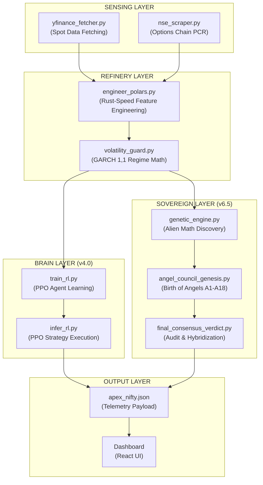

# 📜 APEX ENGINE: ALGORITHMIC CODEX
## The Technical Blueprint of Pythonic Intelligence

This document details the internal algorithms, architectural connections, and logical flow of the Tradyxa-ApeX engine.

---

## 🏗️ 1. MASTER CONNECTIVITY ARCHITECTURE
The ApeX engine is a modular ecosystem where data is sequentially refined from "Raw Noise" into "Sovereign Intelligence."

---

## 🧬 2. SCRIPT-LEVEL ALGORITHMIC BREAKDOWN

### A. `engineer_polars.py` (The Refinery)
*   **Algorithm:** **Vectorized High-Performance Computation.**
*   **Logic:** Uses Rust-based Polars expressions to calculate indicators (RSI, SMA, ATR) across 20 years of data in milliseconds.
*   **Physics:**
    *   **RSI:** `100 - (100 / (1 + (rolling_mean(gain) / rolling_mean(loss))))`
    *   **Body Size:** `abs(Close - Open)`
    *   **Volatility Intensity:** `(rolling_std(Close, 20) / rolling_mean(Close, 20))`

### B. `genetic_engine.py` (The Discovery)
*   **Algorithm:** **Symbolic Regression (Genetic Programming).**
*   **Logic:** Spawns binary trees of operators (+, -, log, sin) and operands (Indicators).
*   **Cycle:**
    1.  **Crossover:** Swapping branches between two winner formulas.
    2.  **Mutation:** Randomly changing an operator or constant.
    3.  **Fitness:** `Pearson Correlation Coefficient` between formula output and future price change.

### C. `train_rl.py` (The Gamer)
*   **Algorithm:** **Proximal Policy Optimization (PPO).**
*   **Logic:** An actor-critic method that stabilizes training by preventing the policy from changing too drastically in one step.
*   **Objective:** Maximize cumulative reward (Profit) while minimizing Drawdown.
*   **Steps:** 1 Million Market Steps (Simulating 250 years of trading).

### D. `volatility_guard.py` (The Sentinel)
*   **Algorithm:** **GARCH(1,1) - Generalized Autoregressive Conditional Heteroskedasticity.**
*   **Logic:** A statistical model that predicts the "Clustering" of volatility.
*   **Equation:** `σ²_t = ω + αε²_{t-1} + βσ²_{t-1}`
*   **Purpose:** To detect if the market is shifting from a "Quiet" regime to a "Stressed" regime *before* the price collapses.

---

## 🛰️ 3. DATA FLOW & CONNECTIVITY

### Phase 1: The Training Loop (Weekly)
1.  `yfinance_fetcher.py` appends the latest week to `archive_nifty.csv`.
2.  `engineer_polars.py` translates the entire archive into the **13 Universal Pillars**.
3.  `train_rl.py` loads the 13 Pillars and updates the `.zip` brain.
4.  `angel_council_genesis.py` runs the Genetic Engine to evolve the **Elite 12** formulas.

### Phase 2: The Inference Loop (Every 30 Mins)
1.  `yfinance_fetcher.py` grabs the current 30m tick.
2.  `engineer_polars.py` calculates the indicators for this **single snapshot**.
3.  `infer_rl.py` queries the PPO brain with the snapshot -> Returns **Strategy Action**.
4.  `final_consensus_verdict.py` queries the 12 Angel formulas -> Returns **Market Bias**.
5.  `prediction_logger.py` merges both into the final Telemetery JSON.

---

## 🏆 4. SUMMARY OF INTERDEPENDENCIES
*   **Feature Dependency:** Every script depends on `engineer_polars.py` for its input math.
*   **Decision Dependency:** The Singularity depends on `angel_council_genesis.py` to keep the Angel formulas fresh and accurate.
*   **Safety Dependency:** All output is gated by `volatility_guard.py`. If GARCH says "CHAOS," the PPO agent is forced to **HOLD/EXIT**.

🔱🧬🌌🚀🦾
© 2025 Zeta Aztra Technologies.  
**Vision:** Mastery through Algorithmic Sovereignty.
