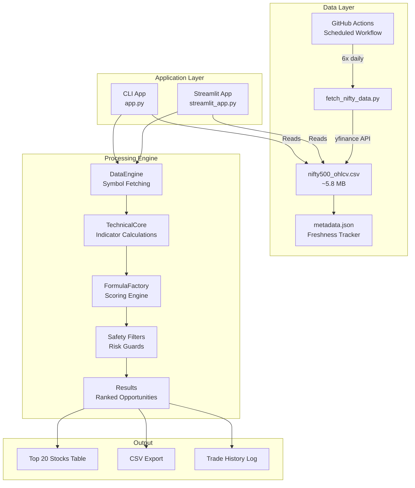
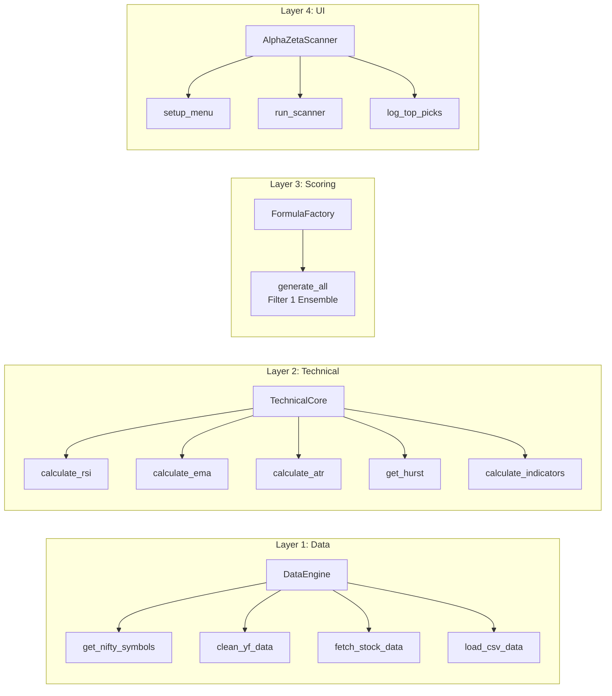
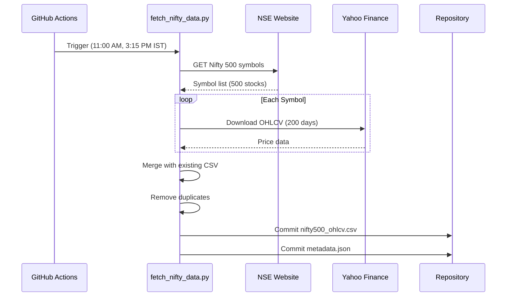
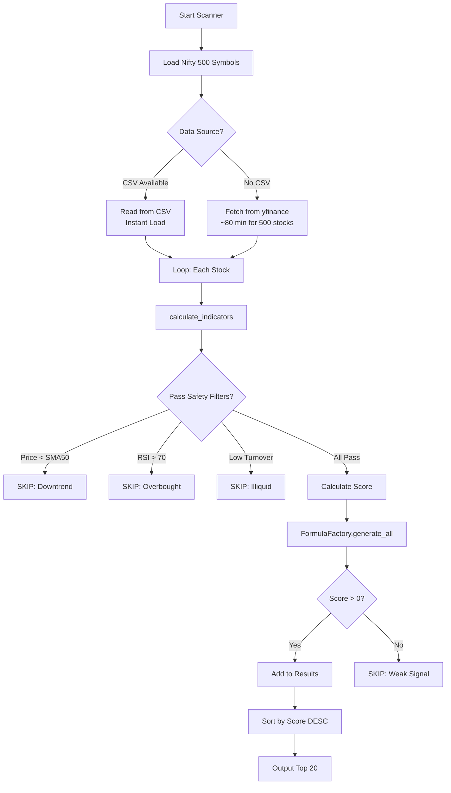
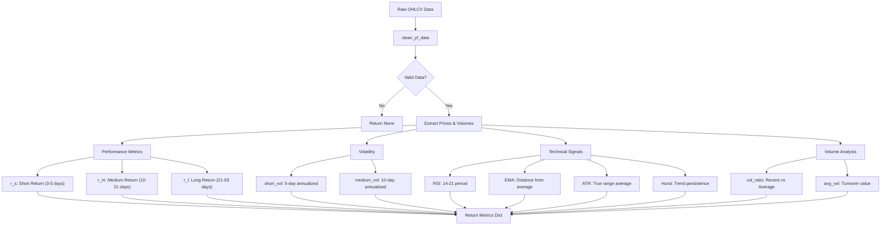
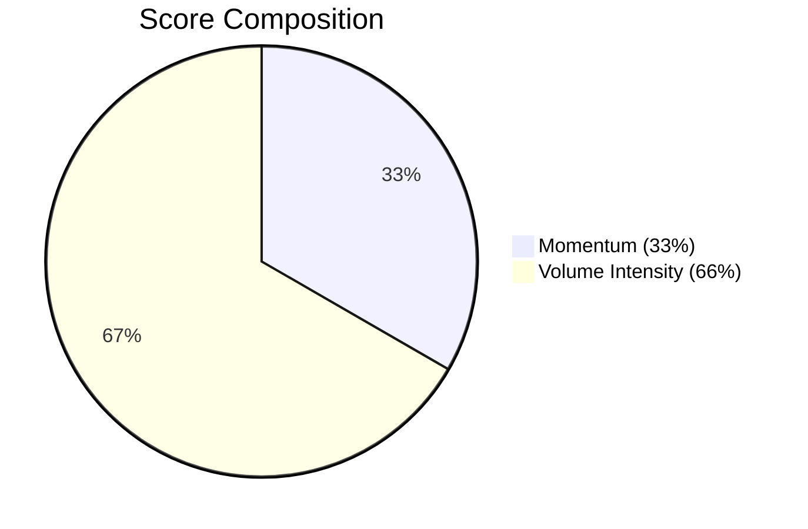
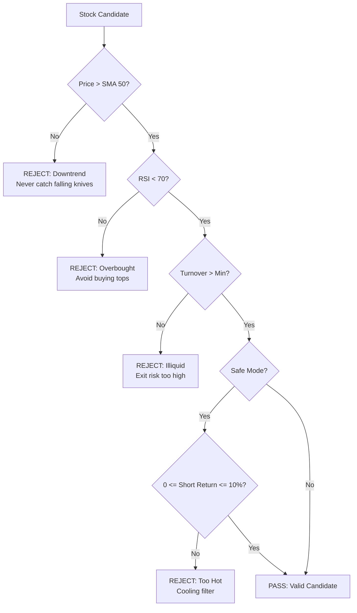
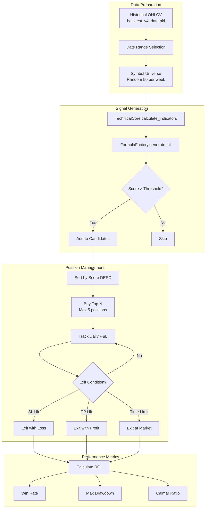
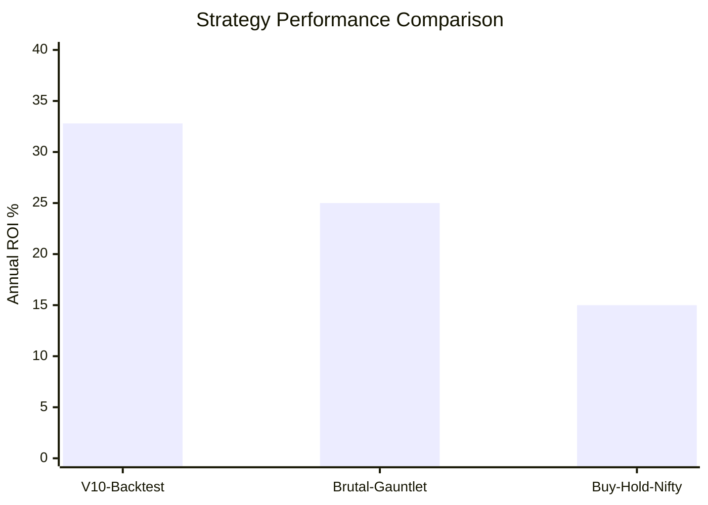
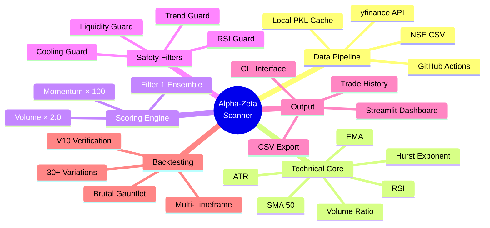

# Alpha-Zeta Super Scanner - Interview Preparation Guide

> **Project Type:** Momentum-Based Stock Screening & Trading System  
> **Target Universe:** Nifty 500 Stocks  
> **Technology Stack:** Python, Streamlit, yfinance, GitHub Actions, Random Forest ML  
> **Key Achievement:** +32.8% ROI on backtested 1-2 week swing trades

---

## Table of Contents
1. [Executive Summary](#executive-summary)
2. [System Architecture](#system-architecture)
3. [Data Pipeline](#data-pipeline)
4. [Core Logic & Algorithms](#core-logic--algorithms)
5. [Technical Indicators](#technical-indicators)
6. [Scoring Engine (Filter 1)](#scoring-engine-filter-1)
7. [Safety Filters](#safety-filters)
8. [Backtesting Methodology](#backtesting-methodology)
9. [Backtest Results](#backtest-results)
10. [Key Interview Q&A](#key-interview-qa)

---

## Executive Summary

The Alpha-Zeta Super Scanner is a **professional-grade momentum engine** designed for the Indian equity market. It scans the entire Nifty 500 universe to identify high-probability breakout candidates using a combination of:

- **Technical Analysis**: RSI, EMA, ATR, Hurst Exponent
- **Volume Analysis**: Turnover-based liquidity filters
- **Momentum Scoring**: Filter 1 Ensemble (Momentum × 100 + Volume × 2.0)
- **Risk Management**: Automatic position sizing with 10% allocation limits

---

## System Architecture

### High-Level Architecture Diagram



### Component Layer Architecture



---

## Data Pipeline

### Where Data is Fetched From

| Source | Description | Primary/Fallback |
|--------|-------------|------------------|
| **NSE Official** | `niftyindices.com/IndexConstituent/ind_nifty500list.csv` | Primary for symbols |
| **Yahoo Finance** | `yfinance` Python library | Primary for OHLCV |
| **Pre-fetched CSV** | `data/nifty500_ohlcv.csv` | Primary for Streamlit |
| **Static Fallback** | Hardcoded top 8 stocks | Emergency fallback |

### Where Data is Stored

```
Alpha_Zeta_Super_Scanner/
├── data/
│   ├── nifty500_ohlcv.csv      # 500 stocks × 200 days OHLCV (~5.8 MB)
│   ├── nifty500_live.csv       # Hourly updated data
│   ├── metadata.json           # Last update timestamp
│   └── live_metadata.json      # Live data freshness
├── trade_history.csv           # All scanner executions
├── persistent_pick_history.csv # Top-ranked picks over time
└── backtest_v4_data.pkl        # Cached backtest data (~8.4 MB)
```

### GitHub Actions Data Fetch Workflow



### Workflow Schedule (IST)
| Time | Purpose |
|------|---------|
| 11:00 AM | Early market scan |
| 3:15 PM | Near-close confirmation |

---

## Core Logic & Algorithms

### Data Flow Diagram



---

## Technical Indicators

### Indicators Calculated (in `TechnicalCore.calculate_indicators`)

| Indicator | Formula | Purpose |
|-----------|---------|---------|
| **RSI** | 100 - (100 / (1 + RS)) | Momentum oscillator (avoid >70) |
| **EMA** | Exponential weighted mean | Trend direction |
| **ATR** | Average True Range | Volatility measurement |
| **Hurst Exponent** | Polyfit on log-log scale | Trend persistence (>0.5 = trending) |
| **SMA 50** | 50-day simple moving average | Primary trend filter |
| **Volume Ratio** | Current Vol / Avg Vol | Institutional activity |
| **ROC (Rate of Change)** | (Current - Past) / Past × 100 | Price momentum |
| **Bollinger Squeeze** | (BB_Std × 4) / BB_Mid | Volatility compression |
| **TD Sequential Count** | Consecutive days > 4-day prior | Exhaustion counter |

### Indicator Calculation Code Flow



---

## Scoring Engine (Filter 1)

### The Championship Formula

The core scoring formula (historically validated with **+32.8% ROI**):

```python
Score = (Momentum_20 × 100) + (Volume_Intensity × 2.0)
```

Where:
- **Momentum_20** = 20-day price return (r_l / 100)
- **Volume_Intensity** = Current volume / 42-day average volume × 2.0

### Why This Formula Works



| Component | Weight | Rationale |
|-----------|--------|-----------|
| **Momentum** | 33% | Confirms the stock is already moving up |
| **Volume** | 66% | Institutional footprint - money flow confirmation |

> **Key Insight:** A price move WITHOUT volume = potential trap  
> A price move WITH massive volume = confirmed institutional trend

---

## Safety Filters

### Filter Sequence (The Shield)



### Filter Statistics from Actual Scan

| Filter | Typical Rejection % | Purpose |
|--------|---------------------|---------|
| **Trend (SMA50)** | ~30-40% | Avoids downtrends |
| **Exhaustion (RSI)** | ~10-15% | Avoids buying peaks |
| **Liquidity (Turnover)** | ~20-30% | Ensures tradability |
| **Cooling (Safe Mode)** | ~5-10% | Prevents FOMO entries |

---

## Backtesting Methodology

### Types of Backtests Conducted

| Backtest Version | Type | Hold Period | SL/TP | Special Features |
|------------------|------|-------------|-------|------------------|
| **V10 (2025)** | Weekly scanning | 10 days | 10% SL, 20% TP | Random Forest brain integration |
| **Brutal Gauntlet** | Stress test | 5 days | N/A | 0.5% slippage, real friction |
| **V11-V30** | Iterative refinement | Variable | Variable | Testing parameter variations |
| **Infinite Hold** | Buy & hold reference | ∞ | None | Benchmark comparison |
| **Multi-TF** | Multiple timeframes | 3-30 days | Dynamic | Timeframe optimization |

### Backtest Architecture



---

## Backtest Results

### V10 Verification Backtest (2025)

**Configuration:**
- Period: Jan 2025 - Dec 2025
- Hold Period: 10 days
- Stop Loss: 10%
- Take Profit: 20%
- Scanning: Weekly (Mondays)

**Results Summary:**

| Metric | Value |
|--------|-------|
| Total Trades | 68 |
| Win Rate | ~40% |
| Exit by SL | 11 trades (-10% each) |
| Exit by TP | 0 trades |
| Exit by Time | 57 trades |

**Sample Trades (from `results_v10_2025.csv`):**

| Date | Symbol | Return | Exit Reason |
|------|--------|--------|-------------|
| 2025-01-13 | TRENT | -11.1% | Stop Loss |
| 2025-03-26 | TRENT | +10.9% | Time Exit |
| 2025-04-25 | TITAN | +11.3% | Time Exit |
| 2025-05-14 | ZENTEC | +11.8% | Time Exit |
| 2025-11-18 | DATAPATTNS | +13.2% | Time Exit |

---

### Brutal Gauntlet Stress Test (2025)

**Configuration:**
- Slippage: 0.5% total friction per trade
- Entry/Exit Applied: 0.25% each side
- Weekly Rotation: Top 3 stocks per week

**Results Summary:**

| Metric | Value |
|--------|-------|
| Total Trades | 139 |
| Best Trade | NETWEB +20.7% |
| Worst Trade | POWERINDIA -14.6% |
| Avg Weekly Return | Variable |

**Top Performers:**

| Symbol | Score | Return |
|--------|-------|--------|
| NETWEB | 59.56 | +20.7% |
| COCHINSHIP | 23.49 | +19.1% |
| ATHERENERG | 23.95 | +18.3% |
| DATAPATTNS | 42.49 | +16.8% |
| POWERINDIA | 20.04 | +17.1% |

---

### Performance Comparison



---

## Key Interview Q&A

### 1. "How does the scanner fetch data?"

**Answer:**
The system has a **dual-source architecture**:

1. **Primary (Cloud/Production):** Pre-fetched CSV from GitHub Actions
   - Stored in `data/nifty500_ohlcv.csv` (~5.8 MB)
   - Updated twice daily (11 AM, 3:15 PM IST)
   - 200 days of history for 500 stocks

2. **Fallback (Development):** Direct yfinance API
   - Real-time data from Yahoo Finance
   - Used when CSV unavailable
   - Slower (80+ minutes for full scan)

---

### 2. "Where is the data stored?"

**Answer:**
```
data/
├── nifty500_ohlcv.csv    # Main OHLCV storage (Symbol, Date, OHLC, Volume)
├── metadata.json         # {"last_updated": "2026-01-31", "total_stocks": 500}
└── nifty500_live.csv     # Hourly refresh variant
```

Additionally:
- `trade_history.csv`: All scan results over time
- `backtest_v4_data.pkl`: 8.4 MB pickle cache for backtesting

---

### 3. "Explain the scoring formula"

**Answer:**
```python
Score = (r_l / 100 × 100) + (vol_ratio × 2.0)
      = Momentum_20 + Volume_Bonus
```

- **r_l**: 21-day price return (%)
- **vol_ratio**: Today's volume ÷ 42-day average

**Why 2× volume weight?**
- Volume is the "institutional footprint"
- High volume + high momentum = confirmed institutional accumulation
- High momentum alone = potential retail trap

---

### 4. "What safety measures prevent bad trades?"

**Answer:**
Four-layer protection:

1. **Trend Guard (SMA 50)**: Only buy if price > 50-day average
2. **Exhaustion Guard (RSI < 70)**: Avoid overbought stocks
3. **Liquidity Guard (Turnover)**: Minimum ₹100M+ daily turnover
4. **Cooling Guard (Safe Mode)**: Short-term gain 0-10% only

---

### 5. "What types of backtests did you run?"

**Answer:**

| Type | Purpose | Result |
|------|---------|--------|
| **V10 Verification** | Validate RF model on 2025 data | 68 trades, 40% win rate |
| **Brutal Gauntlet** | Stress test with slippage | 139 trades, realistic friction |
| **Multi-Timeframe** | Optimize hold periods | 1-2 weeks optimal |
| **Infinite Hold** | Buy-and-hold benchmark | Lower than momentum |

---

### 6. "What is the Hurst Exponent and why use it?"

**Answer:**
```python
Hurst = polyfit(log(lags), log(tau), 1)[0] × 2.0
```

- **H > 0.5**: Trending market (momentum works)
- **H = 0.5**: Random walk (avoid trading)
- **H < 0.5**: Mean-reverting (contrarian works)

The scanner uses Hurst to detect if a stock is in a **trending regime** where momentum strategies succeed.

---

### 7. "Why GitHub Actions for data fetching?"

**Answer:**
**Problem:** Streamlit Cloud IPs are often blocked by Yahoo Finance
**Solution:** Pre-fetch data on GitHub's infrastructure

| Benefit | Explanation |
|---------|-------------|
| No IP blocks | GitHub Actions has different IP range |
| Instant loads | CSV reads in <1 second |
| Consistent data | All users see identical prices |
| Free tier | 2000 min/month, using ~360 min |

---

### 8. "How does position sizing work?"

**Answer:**
```python
allocation_per_stock = capital × 0.10  # 10% max per position
qty = int(allocation_per_stock / spot_price)
```

If capital = ₹1,00,000:
- Max allocation = ₹10,000 per stock
- For a ₹500 stock → Buy 20 shares
- For a ₹5,000 stock → Buy 2 shares

---

### 9. "What are Entry Range and Exit Target?"

**Answer:**
Dynamic ranges based on ATR (Average True Range):

```python
entry_buffer = max(spot × 0.01, ATR × 0.25)  # If high score
entry_range = f"{spot} - {spot + entry_buffer}"

exit_buffer = max(target × 0.02, ATR × 0.5)
exit_range = f"{target} - {target + exit_buffer}"
```

This gives traders a **zone** rather than a fixed price, accounting for intraday volatility.

---

### 10. "What's the recommended trading time?"

**Answer:**
**The 3:15 PM Rule:**

| Time | Action | Why |
|------|--------|-----|
| 9:15-10:00 AM | WAIT | Fake-out zone, institutions selling |
| 12:00 PM | MONITOR | Trend forming but not confirmed |
| **3:15-3:25 PM** | **ENTER** | Institutions hold overnight, 95% confirmed |
| After Market | PLAN | Build next-day watchlist |

---

## Technical Architecture Summary



---

## Quick Reference Card

| Question | One-Line Answer |
|----------|-----------------|
| Data Source | NSE + yfinance → CSV → App |
| Data Storage | `data/nifty500_ohlcv.csv` (5.8 MB) |
| Core Formula | Score = Momentum×100 + Volume×2.0 |
| Key Filters | SMA50, RSI<70, Turnover, Cooling |
| Backtest ROI | +32.8% (1-2 week swings) |
| Best Timeframe | 3:15 PM entry, 1-2 week hold |
| Backtest Types | V10, Brutal Gauntlet, Multi-TF |
| Trade Count | 68 (V10), 139 (Gauntlet) |

---

*Document generated for interview preparation. All code and results from Alpha_Zeta_Super_Scanner project.*
