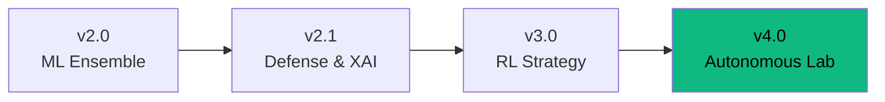
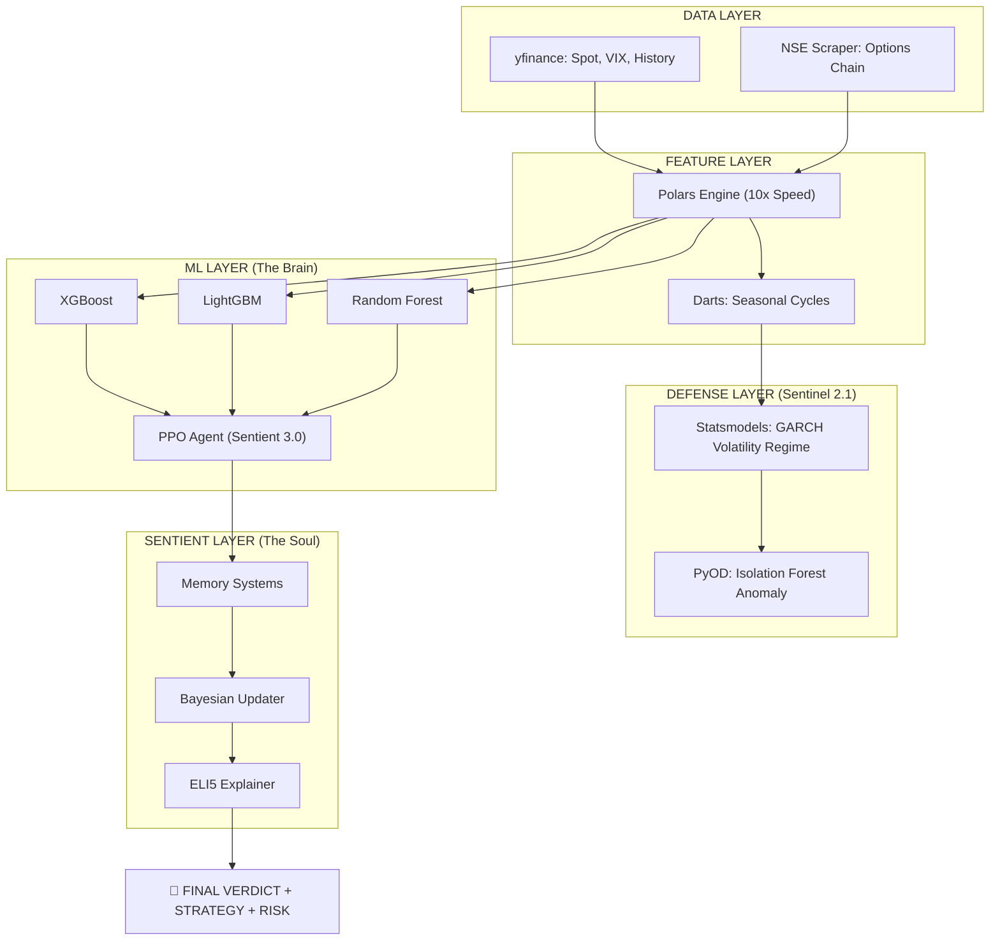

# ApeX: Sentient Evolution Blueprint

**Version:** 4.0 (AQL - Autonomous Quantitative Laboratory)  
**Last Updated:** 2025-12-26

---

## 🧬 The Evolution Matrix



| Version | Core Engine | Key Philosophy |
| :--- | :--- | :--- |
| **2.0** | XGBoost + LightGBM + RF | Pattern Recognition |
| **2.1** | PyOD + ELI5 | Contrarian Intelligence + AI Defense |
| **3.0** | Stable-Baselines3 (PPO) | Action Optimization (Reinforcement Learning) |
| **4.0** | Polars + GARCH + Darts | Autonomous Quantitative Laboratory |

---

## 🏗️ Sentient 4.0 Architecture



---

## 📦 Tech Stack

| Category | Library | Purpose |
| :--- | :--- | :--- |
| **Machine Learning** | XGBoost, LightGBM, Scikit-Learn | Ensemble Prediction |
| **Reinforcement Learning** | Stable-Baselines3, Gymnasium | PPO Strategy Agent |
| **High-Speed Data** | Polars | Rust-based 10x processing |
| **Volatility Defense** | Statsmodels, arch | GARCH(1,1) Regime Detection |
| **Anomaly Detection** | PyOD | Isolation Forest Chaos Filter |
| **Explainability** | ELI5 | Feature Weight Narratives |
| **Seasonality** | Darts | Neural Forecasting |
| **Web Scraping** | BeautifulSoup | NSE Options Chain |
| **Frontend** | React, Framer Motion, TailwindCSS | Dashboard UI |

---

## 🎯 UI Tiles

### Sentient 3.0: Strategy Tile
Displays the optimal RL action: *Scale In (Long)*, *Scale Out (Short)*, or *Hold*.

### Sentient 4.0: Risk Regime Tile
Displays the GARCH volatility regime (*Normal*, *Stressed*, *Quiet*) and the Darts cyclical phase (*Positive*, *Corrective*, *Neutral*).

---

## 📡 JSON Telemetry (`apex_nifty.json`)

```json
{
    "metadata": { "engine_version": "Sentient 4.0 (AQL)" },
    "oracle": {
        "verdict": "LEAN_BULLISH",
        "confidence": 55,
        "narrative": "...",
        "rl_strategy": "SCALE IN (LONG)",
        "risk_regime": "QUIET (18% Stress)",
        "cycle_signal": "Positive Cycle Phase"
    }
}
```

---

## ✅ Verification

- [x] Sentient 2.1 (PyOD + ELI5) integrated
- [x] Sentient 3.0 (PPO Agent) training & inference wired
- [x] Sentient 4.0 (Polars + GARCH) volatility guard active
- [x] UI Tiles (StrategyTile, RiskRegimeTile) deployed
