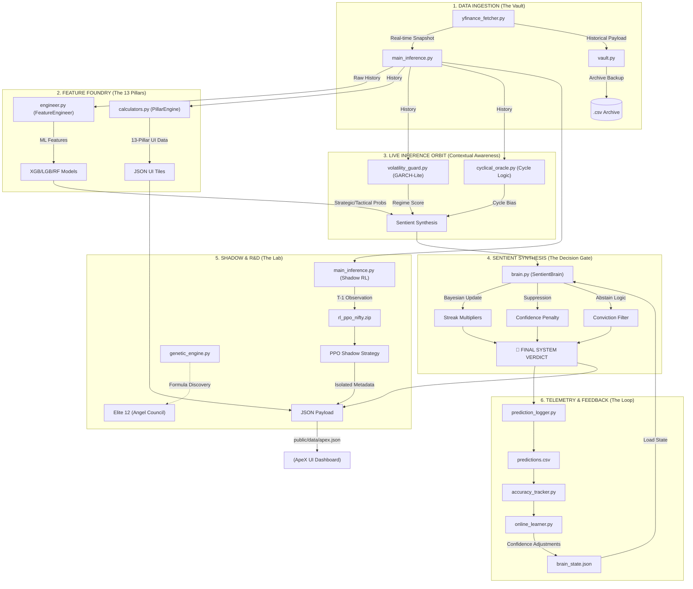

# 🗺️ ApeX v7.0: Comprehensive Codebase Map

This document provides a high-fidelity mapping of the **Tradyxa-ApeX v7.0** architecture, tracing the lifecycle of a single market verdict from raw data ingestion to telemetry logging.

---

## 🔱 The Universal Data Flow (Full Architecture)

---

## 📂 Module Breakdown (Detailed Descriptions)

### 🧱 Core Orchestrator
| File | Role |
| :--- | :--- |
| `engine/main_inference.py` | The heartbeat of ApeX. Orchestrates data fetching, feature engineering, model prediction, and sentient synthesis. |

### 📊 Data & Features
| File | Role |
| :--- | :--- |
| `engine/data/yfinance_fetcher.py` | Robust wrapper for `yfinance`. Handles multi-ticker snapshots and historical payloads. |
| `engine/features/engineer.py` | Core `FeatureEngineer` class. Converts raw OHLCV into the technical input required by ML models. |
| `engine/features/calculators.py` | The `PillarEngine`. Logic for the 13 specific pillars displayed on the UI dashboard. |
| `engine/features/cyclical_oracle.py` | Detects market cycles (Correction, Positive, Neutral) using dual-SMA slope analysis. |

### 🧠 The Sentient Brain
| File | Role |
| :--- | :--- |
| `engine/sentient/brain.py` | Implements the `SentientBrain`. Handles streak-based Bayesian updates, conviction suppression, and the "Abstain" veto logic. |
| `engine/scripts/online_learner.py` | Acts as a Drift Monitor. It calculates "Brain States" based on recent performance to adjust conviction levels. |

### 🛡️ Defensive Layers
| File | Role |
| :--- | :--- |
| `engine/defense/volatility_guard.py` | Performs regime detection using GARCH-inspired rolling volatility. Signals when the market enters high-stress outliers. |

### 🔬 Shadow (R&D) Layers
| File | Role |
| :--- | :--- |
| `engine/models/train_rl.py` | Retraining script for the PPO agent. |
| `engine/models/trading_env.py` | The Gymnasium environment where the shadow RL agent "practices" strategy. |

### 📈 Telemetry & Audit
| File | Role |
| :--- | :--- |
| `engine/scripts/prediction_logger.py` | Commits every verdict and confidence score to a CSV ledger for permanent audit. |
| `engine/scripts/accuracy_tracker.py` | The "Truth Engine". Fetches actual outcomes to verify prediction results. |

---

> [!NOTE]
> **Strategic Isolation Enforcement**: Note how **Phase 5 (Shadow)** and **Phase 2 (ML Features)** are strictly separate streams that only converge in the final metadata payload, ensuring experimental RL never pollutes the core verdict.
