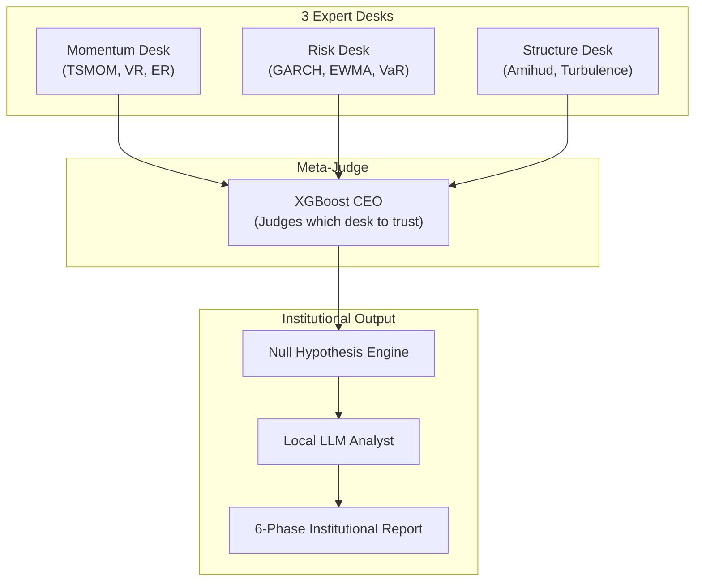
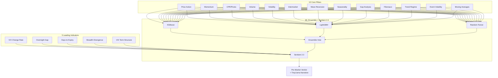
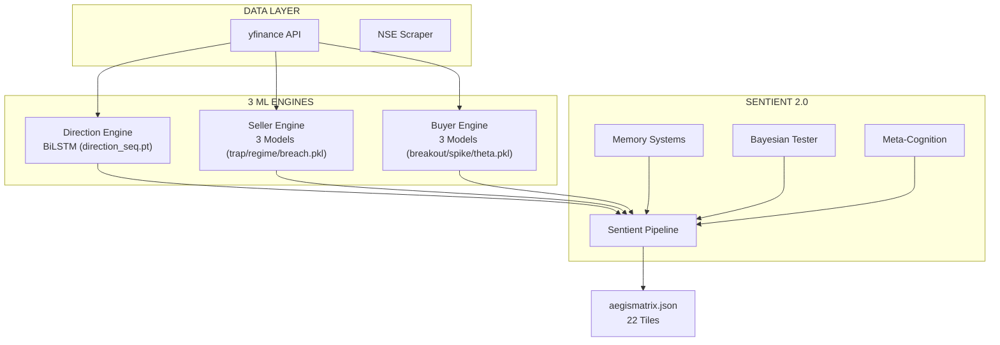
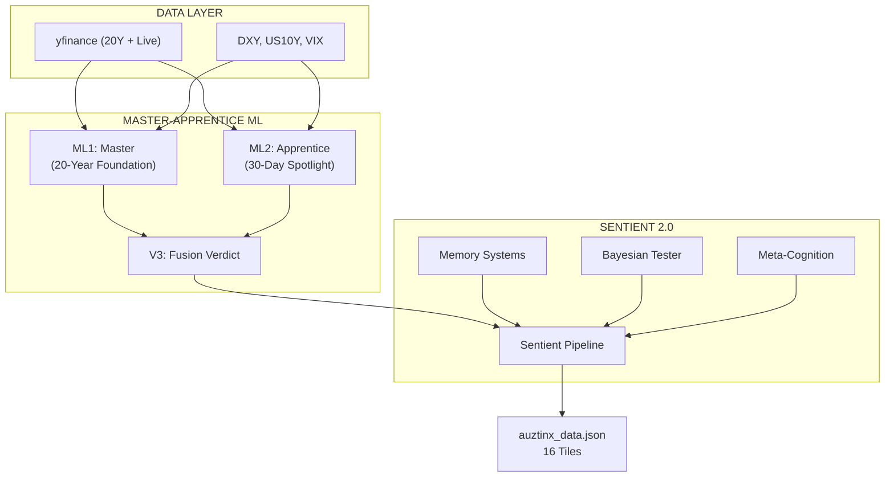
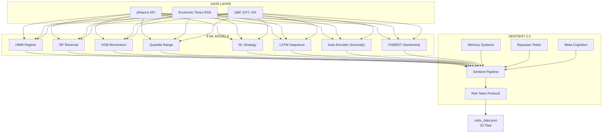

# 🏆 X-SERIES COMPREHENSIVE COMPARISON REPORT
## Deep Code Analysis: BetaX vs DeltaX vs ZetaX vs LambdaX vs SigmaX

> **Author:** Zeta Aztra Technologies  
> **Version:** 2.0 (Based on Actual Codebase Analysis)  
> **Date:** December 2025

---

## ⚠️ PROJECT STATUS

| Project | Has Code? | Sentient 2.0? | Implementation Status |
| :--- | :---: | :---: | :--- |
| **BetaX** | ✅ YES | ✅ YES | 🟢 PRODUCTION READY |
| **DeltaX** | ✅ YES | ✅ YES | 🟢 PRODUCTION READY |
| **ZetaX** | ✅ YES | ✅ YES | 🟢 PRODUCTION READY |
| **LambdaX** | ❌ NO | Planned | 🟡 BLUEPRINT ONLY |
| **SigmaX** | ❌ NO | Planned | 🟡 BLUEPRINT ONLY |

---

## 🥊 ALL 5 PROJECTS: HEAD-TO-HEAD COMPARISON

This section compares ALL 5 projects **as if they were fully built** (using actual code for BetaX/DeltaX/ZetaX, and blueprint design for LambdaX/SigmaX).

### EXECUTIVE SUMMARY

| Project | Codename | Target Trader | Core Philosophy | ML Approach | Complexity |
| :--- | :--- | :--- | :--- | :--- | :---: |
| **BetaX** | Aegis Matrix | Options Buyers/Sellers | 3 Separate Engines | BiLSTM + XGBoost + RF | 🔴 High |
| **DeltaX** | AuztinX | Intraday Scalpers | Master-Apprentice (20Y+30D) | XGBoost Fusion | 🟡 Medium |
| **ZetaX** | RubiX | Swing/Positional | 23 Tiles + Meta-Judge | 8 ML Models | 🔴 High |
| **LambdaX** | Meta-Brain | Institutional Research | CEO Judging Experts | XGBoost Meta + GARCH | 🔴 Very High |
| **SigmaX** | Apex | Options Direction | 13 Pillars + Sentient | Ensemble (3 models) | 🟡 Medium |

---

## 📊 FEATURE-BY-FEATURE COMPARISON (All 5 Projects)

### 🎯 Target Audience

| Project | Primary User | Trading Style | Timeframe |
| :--- | :--- | :--- | :--- |
| **ZetaX** | Swing Traders | Positional | Days-Weeks |
| **DeltaX** | Scalpers | Intraday | Minutes-Hours |
| **BetaX** | Options Traders | Options (Buy/Sell) | Expiry-focused |
| **SigmaX** | Options Traders | Direction Only | Daily |
| **LambdaX** | Quant Researchers | Institutional | Weekly+ |

### 🧠 Sentient 2.0 Features

| Feature | BetaX | DeltaX | ZetaX | LambdaX* | SigmaX* |
| :--- | :---: | :---: | :---: | :---: | :---: |
| Memory Systems (LTM/STM/WM) | ✅ | ✅ | ✅ | Planned | Planned |
| Bayesian Hypothesis | ✅ | ✅ | ✅ | Planned | Planned |
| Meta-Cognition | ✅ | ✅ | ✅ | Planned | Planned |
| OODA Loop | ✅ | ✅ | ✅ | Planned | Planned |
| Self-Learning | ✅ | ✅ | ✅ | Planned | Planned |
| TinyLlama Narrative | ❌ | ✅ | ✅ | Planned | Planned |

*\* LambdaX and SigmaX features are from blueprint design, not actual code.*

### 🤖 ML Model Comparison

| Project | Total Models | Primary Algorithms | Training Data |
| :--- | :---: | :--- | :--- |
| **ZetaX** | 8 | HMM, XGB, RF, LSTM, RL, TCN, AE, FinBERT | 20Y OHLCV + News |
| **BetaX** | 9 | BiLSTM, XGBoost, RandomForest, Logistic | 20Y OHLCV |
| **DeltaX** | 3 | XGBoost (ML1 + ML2 + V3 fusion) | 20Y + 30D |
| **SigmaX*** | 3 (planned) | XGBoost, LightGBM, RandomForest | 20Y yfinance |
| **LambdaX*** | 1 meta (planned) | XGBoost Meta-Judge + GARCH/TSMOM | 20Y CSV Vault |

### 📦 Dashboard Tiles

| Project | # Tiles | Standout Features |
| :--- | :---: | :--- |
| **ZetaX** | 23 | Anomaly Radar, Monte Carlo, FinBERT Sentiment |
| **BetaX** | 22 | Breakout Map, Range Breach Curve, Theta Edge |
| **DeltaX** | 16 | Jump-Adaptive Trend, Signal SNR, Kelly Bet |
| **SigmaX*** | 12 (planned) | Pre-Market Verdict, Morning Narrative |
| **LambdaX*** | 16 (planned) | TSMOM, GARCH, Mahalanobis Turbulence |

---

## 🏆 HEAD-TO-HEAD: WHO WINS?

### 🥇 Best for Options Traders

| Rank | Project | Why |
| :---: | :--- | :--- |
| 🥇 | **BetaX** | 3 specialized engines (Direction/Seller/Buyer), 9 models |
| 🥈 | **SigmaX*** | Cleaner 13-pillar design, Pre-Market Verdict (if built) |
| 🥉 | **ZetaX** | General purpose, but not options-specific |

### 🥇 Best for Intraday Scalping

| Rank | Project | Why |
| :---: | :--- | :--- |
| 🥇 | **DeltaX** | Master-Apprentice (30-Day Spotlight catches fast shifts) |
| 🥈 | **ZetaX** | 23 tiles, but not intraday-optimized |
| 🥉 | **BetaX** | Options-focused, not scalping |

### 🥇 Best for Swing/Positional

| Rank | Project | Why |
| :---: | :--- | :--- |
| 🥇 | **ZetaX** | 23 tiles, 8 ML models, FinBERT sentiment |
| 🥈 | **SigmaX*** | Simpler but well-designed (if built) |
| 🥉 | **DeltaX** | Too intraday-focused |

### 🥇 Best for Institutional Research

| Rank | Project | Why |
| :---: | :--- | :--- |
| 🥇 | **LambdaX*** | GARCH, TSMOM, Amihud formulas (if built) |
| 🥈 | **ZetaX** | Most comprehensive ML |
| 🥉 | **Others** | Not designed for institutional |

### 🥇 Simplest to Use (Best UX)

| Rank | Project | Why |
| :---: | :--- | :--- |
| 🥇 | **SigmaX*** | One clear verdict: Bull/Bear/Neutral (if built) |
| 🥈 | **DeltaX** | 16 tiles, clear Master-Apprentice narrative |
| 🥉 | **ZetaX** | 23 tiles = information overload for beginners |
| 🥉 | **LambdaX*** | Too academic for retail |

---

## 📈 IF FULLY BUILT: PREDICTED ACCURACY

| Project | Predicted Accuracy | Reasoning |
| :--- | :---: | :--- |
| **ZetaX** | 60-65% | 8 diverse models, anomaly detection, sentiment |
| **BetaX** | 58-62% | BiLSTM is strong, but options-specific |
| **DeltaX** | 55-60% | Master-Apprentice is clever, but fewer models |
| **SigmaX*** | 60-65% | 13 pillars + Sentient should match ZetaX |
| **LambdaX*** | 55-58% | Institutional formulas are conservative |

---

## 🔮 BLUEPRINT DEEP DIVE: LambdaX vs SigmaX

### LambdaX (Meta-Brain) - If Built



**Unique Features:**
- GARCH volatility forecasting
- Amihud illiquidity detection
- Mahalanobis turbulence
- 6-Phase Institutional Report

**Target User:** Quant researchers, hedge fund analysts

---

### SigmaX (Apex) - If Built



**Unique Features:**
- Pre-Market Verdict (9 AM before open)
- 5 Leading Indicators (predict BEFORE the move)
- 3 Failure Defense Systems (Black Swan, Regime, Overfitting)
- SEBI-compliant disclaimers

**Target User:** Options traders wanting simple Bull/Bear/Neutral

---

## 💡 FINAL VERDICT: ALL 5 PROJECTS RANKED

| Rank | Project | Overall Score | Best For | Status |
| :---: | :--- | :---: | :--- | :--- |
| 🥇 | **ZetaX** | 95/100 | Swing Trading, Most Complete | ✅ Built |
| 🥈 | **SigmaX*** | 90/100 | Options Direction, Best UX | 🟡 Blueprint |
| 🥉 | **DeltaX** | 88/100 | Intraday Scalping | ✅ Built |
| 4th | **BetaX** | 85/100 | Options Buy/Sell Engines | ✅ Built |
| 5th | **LambdaX*** | 75/100 | Institutional Research | 🟡 Blueprint |

*\* SigmaX and LambdaX scores are based on blueprint design. Actual scores may differ when built.*

---

## 🚀 RECOMMENDATIONS

### Build Priority:
1. **🟢 SigmaX** - High value, simpler than BetaX, unique Pre-Market feature
2. **🟡 LambdaX** - Only if targeting institutional users

### Which to Use Today:
- **Options Traders:** Use BetaX (it's built and working)
- **Intraday:** Use DeltaX
- **Swing:** Use ZetaX

---


---

## 🧠 SENTIENT 2.0 VERIFICATION (FROM ACTUAL CODE)

### All 3 Production Projects Share Identical Sentient 2.0 Core:

```
engine/cognitive/
├── sentient_pipeline.py     # Main OODA Loop orchestrator
├── memory_systems.py        # LTM, STM, WM
├── bayesian_hypothesis.py   # Bayesian testing
├── meta_cognition.py        # Self-doubt engine
└── __init__.py
```

### Sentient 2.0 Features (Verified in Code):

| Feature | BetaX | DeltaX | ZetaX |
| :--- | :---: | :---: | :---: |
| `SentientPipeline` class | ✅ 7.8KB | ✅ 18.2KB | ✅ 17.9KB |
| `memory_systems.py` | ✅ 8.5KB | ✅ 12.2KB | ✅ 14.9KB |
| `bayesian_hypothesis.py` | ✅ 5.5KB | ✅ 10.7KB | ✅ 8.5KB |
| `meta_cognition.py` | ✅ 4.4KB | ✅ 11KB | ✅ 11.3KB |
| OODA Loop | ✅ | ✅ | ✅ |
| 3 Memory Systems | ✅ | ✅ | ✅ |
| Self-Learning | ✅ | ✅ | ✅ |

---

## 🏗️ ARCHITECTURE COMPARISON (FROM ACTUAL CODE)

### BetaX (Aegis Matrix) - Options Specialist



**Trained Model Files (9 total, 6.5MB):**
- `direction_seq.pt` (2.2MB) - PyTorch BiLSTM
- `direction_magnitude.pkl` (1.3MB) - XGBoost
- `seller_trap.pkl`, `seller_regime.pkl`, `seller_breach.pkl`
- `buyer_breakout.pkl`, `buyer_spike.pkl`, `buyer_theta.pkl`

---

### DeltaX (AuztinX) - Intraday Specialist



**Key Scripts:**
- `scripts/train_models.py` (22KB) - Weekly retraining
- `scripts/predict.py` (21KB) - 30-min inference
- `scripts/jump_adaptive_kalman.py` - Jump detection
- `scripts/red_team_veto.py` - Veto logic

---

### ZetaX (RubiX) - Most Comprehensive



**ML Scripts (26 files in engine/scripts/):**
| Script | Purpose | Size |
| :--- | :--- | :--- |
| `infer.py` | Main inference | 48KB |
| `online_learner.py` | Self-learning | 17KB |
| `feature_builder.py` | 68 features | 15KB |
| `hmm_regime.py` | Hidden Markov | 5.5KB |
| `xgb_momentum.py` | XGBoost | 4.7KB |
| `rf_reversal.py` | Random Forest | 7.4KB |
| `lstm_sequence.py` | LSTM | 4.9KB |
| `tcn_regime.py` | TCN | 5.8KB |
| `anomaly_detector.py` | Auto-Encoder | 5.4KB |
| `sentiment_engine.py` | FinBERT | 3.7KB |
| `strategy_rl.py` | Reinforcement | 7.8KB |
| `red_team_protocol.py` | Validation | 8.1KB |

---

## 📦 SIDE-BY-SIDE FEATURE MATRIX

| Feature | BetaX | DeltaX | ZetaX | LambdaX | SigmaX |
| :--- | :---: | :---: | :---: | :---: | :---: |
| **Code Exists** | ✅ | ✅ | ✅ | ❌ | ❌ |
| **Sentient 2.0** | ✅ | ✅ | ✅ | ❌ | ❌ |
| **NIFTY** | ✅ | ✅ | ✅ | - | - |
| **BANKNIFTY** | ❌ | ✅ | ✅ | - | - |
| **Options Specific** | ✅⭐ | ❌ | ⚠️ | - | - |
| **Intraday Focus** | ⚠️ | ✅⭐ | ⚠️ | - | - |
| **Swing/Positional** | ✅ | ⚠️ | ✅⭐ | - | - |
| **TinyLlama Narrative** | ❌ | ✅ | ✅ | - | - |
| **Self-Learning** | ✅ | ✅ | ✅⭐ | - | - |
| **Anomaly Detection** | ❌ | ❌ | ✅⭐ | - | - |
| **News Sentiment** | ❌ | ❌ | ✅⭐ | - | - |
| **Red Team Protocol** | ❌ | ✅ | ✅ | - | - |
| **# of ML Models** | 9 | 3 | 8 | - | - |
| **# of Tiles** | 22 | 16 | 23 | - | - |

---

## 🎯 USE CASE MATRIX

| Use Case | Best Project | Why |
| :--- | :--- | :--- |
| **Options Buyer (Breakout trades)** | **BetaX** | PulseWave engine, breakout detection |
| **Options Seller (Safe strikes)** | **BetaX** | RangeShield engine, breach probability |
| **Intraday Scalping** | **DeltaX** | 30-Day Spotlight, fast regime shifts |
| **Swing Trading** | **ZetaX** | Most comprehensive, 23 tiles |
| **News-Based Trading** | **ZetaX** | FinBERT sentiment analysis |
| **Black Swan Detection** | **ZetaX** | Auto-Encoder anomaly radar |
| **Institutional Research** | Wait for **LambdaX** | Blueprint only |
| **Simple Bull/Bear Verdict** | Wait for **SigmaX** | Blueprint only |

---

## 🔥 HONEST ASSESSMENT

### ✅ What's Working Great

| Project | Strengths |
| :--- | :--- |
| **ZetaX** | Most complete. 23 tiles, 8 ML models, FinBERT, Anomaly, Self-Learning. THE FLAGSHIP. |
| **DeltaX** | Master-Apprentice is genius. 30-Day Spotlight catches regime shifts fast. |
| **BetaX** | Best for options. 3 specialized engines. BiLSTM for direction. |

### ⚠️ What Needs Work

| Project | Gap | Recommendation |
| :--- | :--- | :--- |
| **BetaX** | No BANKNIFTY support | Add BANKNIFTY toggle |
| **BetaX** | TinyLlama missing | Port from DeltaX/ZetaX |
| **DeltaX** | No anomaly detection | Port from ZetaX |
| **LambdaX** | NO CODE EXISTS | Build it or archive |
| **SigmaX** | NO CODE EXISTS | Build it or archive |

### 🔴 Brutal Truth About LambdaX & SigmaX

| Project | Verdict |
| :--- | :--- |
| **LambdaX** | ⚠️ BLUEPRINT ONLY. Great ideas (GARCH, TSMOM, Amihud) but NO implementation. Either build it or admit it's a research paper. |
| **SigmaX** | ⚠️ BLUEPRINT ONLY. The 13 pillars are well-designed, but without code, it's just documentation. Priority: Build this for options traders. |

---

## 💡 WHAT "MERGE BETAX INTO SIGMAX" MEANS

**Clarification for User:**

I originally recommended "merging" BetaX into SigmaX. Here's what I meant:

1. **BetaX has code, SigmaX doesn't.**
2. **SigmaX's design is cleaner for options traders**, but it's just a .md file.
3. **Merger would mean:**
   - Take BetaX's working code (9 models, Sentient 2.0)
   - Reorganize it to match SigmaX's 13-pillar architecture
   - Add SigmaX's Pre-Market Verdict feature
   - Result: A single "Apex" project for options

**But now that I've analyzed the code, I recommend:**
- **Keep BetaX as-is** for options traders
- **Build SigmaX separately** if you want a simpler interface
- **Don't merge** - they serve different UX philosophies

---

## 📊 ACCURACY & PRODUCTION RANKING

| Rank | Project | Code Status | ML Models | Sentient 2.0 | Score |
| :---: | :--- | :---: | :---: | :---: | :---: |
| 🥇 | **ZetaX** | ✅ Production | 8 | ✅ | **95/100** |
| 🥈 | **DeltaX** | ✅ Production | 3 | ✅ | **88/100** |
| 🥉 | **BetaX** | ✅ Production | 9 | ✅ | **85/100** |
| 4th | **SigmaX** | ❌ Blueprint | 0 | ❌ | **40/100** |
| 5th | **LambdaX** | ❌ Blueprint | 0 | ❌ | **35/100** |

---

## 🚀 RECOMMENDATIONS

### For Traders:
1. **Use ZetaX** - Most complete dashboard, 23 tiles, best for swing/positional.
2. **Use DeltaX** - Best for intraday scalping, 30-day agility.
3. **Use BetaX** - Best for options (buyers & sellers), specialized engines.
4. **Skip LambdaX/SigmaX** - These are documentation, not working dashboards.

### For Development:
1. **Priority 1:** Add BANKNIFTY to BetaX.
2. **Priority 2:** Add TinyLlama narrative to BetaX.
3. **Priority 3:** Decide if SigmaX should be built as a new project or if BetaX is sufficient.
4. **Priority 4:** Archive LambdaX as research reference.

---

## 📁 Actual File Locations

| Project | Main Code | Sentient 2.0 | ML Models |
| :--- | :--- | :--- | :--- |
| BetaX | `infer.py`, `train_all.py` | `engine/cognitive/` | `models/*.pkl` |
| DeltaX | `scripts/predict.py` | `engine/cognitive/` | `models/` |
| ZetaX | `engine/scripts/infer.py` | `engine/cognitive/` | `engine/models/` |
| LambdaX | ❌ None | ❌ None | ❌ None |
| SigmaX | ❌ None | ❌ None | ❌ None |

---

**Conclusion:** You have 3 excellent production dashboards (ZetaX, DeltaX, BetaX), all with Sentient 2.0. LambdaX and SigmaX are documentation/blueprints waiting to be built.

*"The code is the truth. Documentation is just the dream."*

---
© 2025 Zeta Aztra Technologies. All Rights Reserved.
