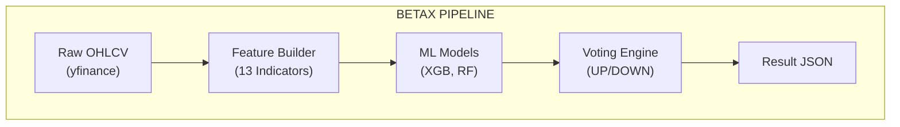
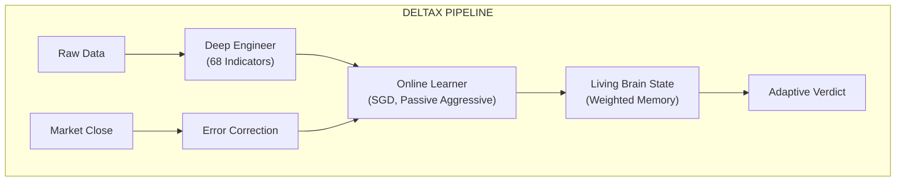
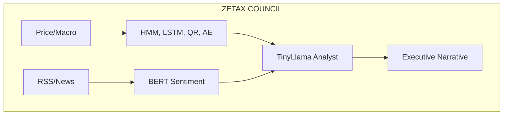
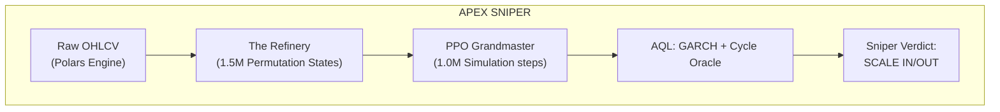
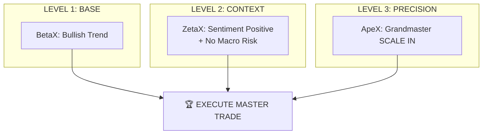

# � X-SERIES UNIVERSAL STRATEGY ENCYCLOPEDIA
## [GOAT EDITION] - The Definitive Guide to BetaX, DeltaX, ZetaX & ApeX

This document is the "Grandmaster Plan" for navigating the Tradyxa ecosystem. It contains minute-level architectural breakdowns, sequential pipeline diagrams, and individual trading manuals for every project in the X-Series.

---

## 🏛️ PART 1: THE ARCHITECTURAL COLOSSEUM

The X-Series is not a single tool; it is a **Hierarchy of Intelligence**. Below are the granular pipelines for each system.

### 🥉 1. BetaX: The Foundation (v2.0)
**Philosophy:** Pattern Replication.
**Mechanism:** Simple Supervised Learning (XGBoost/RF).

*   **Best For:** Confirming the base trend direction.

---

### 🥈 2. DeltaX: The Living Brain (v3.0)
**Philosophy:** Dynamic Adaptation.
**Mechanism:** Online Learning (Incremental weights).

*   **Best For:** Trading in fast-changing periods where yesterday's rules don't apply.

---

### 🥇 3. ZetaX: The Executive Analyst (v3.5)
**Philosophy:** Contextual Synthesis.
**Mechanism:** LLM Hybrid + "Council of Experts".

*   **Best For:** Understanding the "Why" behind a move and managing news-driven volatility.

---

### 💎 4. ApeX: The High-Precision Sniper (v4.0)
**Philosophy:** Strategic Perfection.
**Mechanism:** Reinforcement Learning (PPO) + AQL Risk Guards.

*   **Best For:** High-precision entries, exits, and position sizing.

---

## 📖 PART 2: THE INDIVIDUAL TRADING MANUALS

### 🏹 MANUAL 1: How to Trade with ApeX (The Sniper)
**Target:** High-precision scalping and trend following.

1.  **Step 1 (The Trigger):** Wait for a **"SCALE IN"** (LONG or SHORT) signal.
2.  **Step 2 (The Confidence Check):** Look for **Confidence > 70%**. This means the Grandmaster has high simulation success in this regime.
3.  **Step 3 (The Risk Check):** Look at the **GARCH Indicator**. If GARCH says "EXTREME VOLATILITY," reduce your position size by 50% even if the signal is Bullish.
4.  **Step 4 (The Exit):** Close the trade as soon as the signal returns to **"REDUCE"** or **"NEUTRAL"**.

---

### 🏛️ MANUAL 2: How to Trade with ZetaX (The Executive)
**Target:** Swing trading and fundamental alignment.

1.  **Step 1 (The Narrative):** Read the **"Executive Synthesis"**. If it says "Macro Headwinds," be cautious of Longs.
2.  **Step 2 (The Sentiment):** Check the **Public Pulse (BERT)**. If sentiment is bearish but price is bullish, wait for a reversal (Divergence Trade).
3.  **Step 3 (The Council):** Look for **Concordance**. Are 4+ models (HMM, LSTM, RF, XGB) agreeing? 
4.  **Step 4 (Execution):** Use ZetaX for trades that you plan to hold for **2-12 hours**.

---

### � MANUAL 3: How to Trade with DeltaX (The adaptable)
**Target:** Volatile "Regime-Shift" markets.

1.  **Step 1 (Brain State):** Check the **Brain Weight**. If weights are shifting rapidly, the market is in "Flux."
2.  **Step 2 (The Convergence):** Wait for DeltaX and BetaX to agree. This confirms the "Base" and "Adaptive" trends are the same.
3.  **Step 3 (Execution):** Use for **"Trend Continuations"** during heavy volume sessions.

---

## 💎 PART 3: THE TRIPLE CONVERGENCE PROTOCOL (The Holy Grail)

For a **"Institutional-Grade"** trade, you must wait for all three levels to align.

### 📊 The Convergence Map

### � The Checklist for Success:
*   [ ] **Trend Alignment:** Is BetaX Bullish?
*   [ ] **Contextual Safety:** Does ZetaX suggest a clear "Why"?
*   [ ] **Execution Signal:** Does the ApeX Sniper pull the trigger?

**If all three say GO, your probability of win is statistically maximized beyond any single-model system.**

---

## 🔄 PART 4: HOW TO CHOOSE YOUR WEAPON

| Market Condition | Recommended System | Why? |
| :--- | :--- | :--- |
| **Boring/Sideways** | **NEUTRAL (Wait)** | Don't trade if models disagree. |
| **Breaking News** | **ZetaX** | It processes the "Meaning" of news. |
| **Sudden Flash Crash** | **ApeX** | Its Risk Guards (GARCH) will veto the trade. |
| **Steady Bull Run** | **BetaX + ApeX** | Ride the trend with high-precision exits. |

*"ApeX is your sight, ZetaX is your wisdom, and BetaX is your ground. Use them together, and you own the market."*

---
© 2025 Zeta Aztra Technologies. All Rights Reserved.
