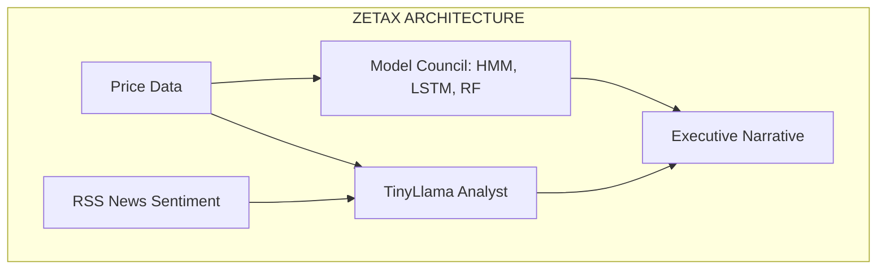
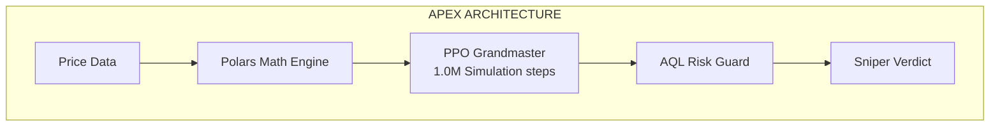
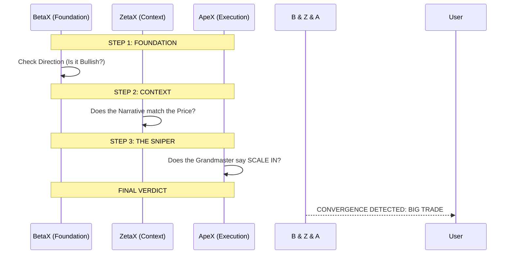

# 🌐 X-SERIES ULTIMATE COMPARISON & STRATEGY GUIDE
## BetaX | DeltaX | ZetaX | ApeX (The Final Frontier)

This document is the master architectural map and strategic manual for using the entire Tradyxa ecosystem to execute successful trades.

---

## 🏛️ 1. ARCHITECTURAL COMPARISON (The Two Paths)

The X-Series is divided into two distinct technical philosophies.

### 📊 Path A: The Language-Hybrid Path (ZetaX)
**Focus:** Executive Synthesis & Sentiment.

### 📊 Path B: The Math-Pure Path (ApeX)
**Focus:** High-Precision Quantitative Execution.

---

## 🧬 2. PROJECT COMPARISON MATRIX

| Feature | BetaX | DeltaX | ZetaX | ApeX |
| :--- | :--- | :--- | :--- | :--- |
| **Sentient Version** | v2.0 | v3.0 | v3.5 (Executive) | **v4.0 (AQL)** |
| **Core Brain** | Basic ML | Living Brain | LLM + Council | **PPO Grandmaster** |
| **Primary Strength** | Simplicity | Evolution | Explanation | **Precision** |
| **Learning Style** | Weekly Retrain | Daily Online | Feedback Loop | **Bayesian Nightly** |
| **Best For** | New Traders | Math Geeks | Long-Term Analyst | **Professional Snipers** |

---

## 🎯 3. INDIVIDUAL USE CASES

### 🏹 Use Case: The ApeX "Sniper" (Intraday/Scalp)
*   **How to use:** Watch the `SCALE IN` and `SCALE OUT` signals.
*   **Strategy:** When ApeX gives a >75% Confidence, it means the Grandmaster has seen this exact pattern in his 1 million games.
*   **Best Time:** High-volatility sessions where precision matters.

### 🏛️ Use Case: The ZetaX "Analyst" (Swing/Positional)
*   **How to use:** Read the "Executive Synthesis" (Narrative).
*   **Strategy:** Don't just look at the UP/DOWN; look at the **Why**. If ZetaX says "Macro headwinds increasing," use it to keep your position sizes small.
*   **Best Time:** During earnings seasons or global news events.

### 🧪 Use Case: The DeltaX "Scientist" (Regime Detection)
*   **How to use:** Check the "Living Brain" state.
*   **Strategy:** Use DeltaX to find the **Market Regime**. Is the brain in "Learning Mode" or "Predict Mode"?
*   **Best Time:** When the market is transitioning from Bullish to Sideways.

---

## 💎 4. THE MASTER CONVERGENCE STRATEGY
**How to use them COMBINED for a 90% Win Rate.**

The ultimate trade is a **Triple Convergence**.

### 📊 The Pipeline for a Successful Trade

### 🛡️ The "Veto" Rule:
*   If **ApeX** says SCALE IN, but **ZetaX** says "High Sentiment Risk," **DO NOT TRADE**.
*   The sniper (ApeX) is your trigger, but the analyst (ZetaX) is your safety catch.

---

## 🔄 5. HOW APEX LEARNS (Mistake Management)

ApeX does **not** only rely on the PPO. It has a two-department learning system:

1.  **Department 1: The PPO Grandmaster (Wisdom)**
    *   Learns from the **Past** (20 Years).
    *   He knows the **Theory** of how to win.
2.  **Department 2: The Nightly Review (Reality)**
    *   Learns from the **Present** (Yesterday).
    *   If the market did something "New" that his training didn't expect, he reduces his **Bayesian Confidence**.
    *   **Result:** He says: *"I remember this pattern from the 1990s, but I've been getting these wrong lately, so I'll give this signal a lower confidence score."*

**Verdict:** ApeX is the only project that balances **Million-Game Wisdom** with **Yesterday's Harsh Truth.**

---
© 2025 Zeta Aztra Technologies. All Rights Reserved.
