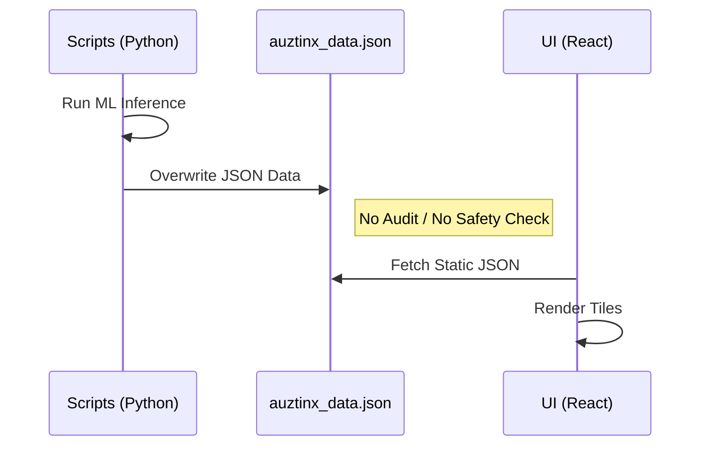
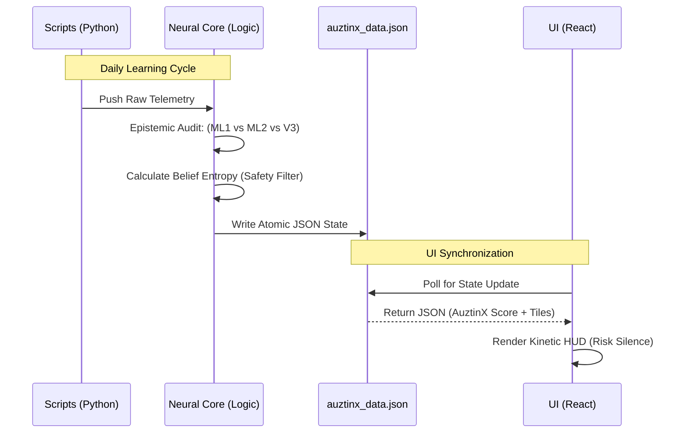

# AuztinX 4.0: Universal Architecture & Pipeline Audit

This report documents the architectural shift from the legacy **"Cognitive Dashboard"** to the **AuztinX 4.0 Institutional Sovereign HUD**. It details the mathematical pipelines, cognitive hierarchies, and the "Risk Silence" philosophy implemented in Tradyxa-DeltaX.

---

## 🏗️ 1. Architecture: Before vs. After

### 🔴 Legacy Architecture (Visual Noise Model)
The previous architecture focused on presenting all raw telemetry to the user simultaneously. This led to high cognitive load and "Analysis Paralysis" where conflicting signals (Sentiment vs. Math) confused the trader.

```mermaid
graph TD
    subgraph Data Sources
        NSE[NSE Option Chain]
        YF[Yahoo Finance / VIX]
    end

    subgraph Logic Layer
        ML[ML Models v2.0]
        SENT[Sentiment Analysis]
        HUD[Context Engine]
    end

    subgraph UI (Legacy)
        T1[Raw Metric Tiles]
        T2[Secondary Numeric HUD]
        T3[Sentiment Badges]
        V1[Verdict Tile + Safety Score]
    end

    NSE --> ML
    YF --> SENT
    ML --> T1
    SENT --> T2
    HUD --> T3
    ML & SENT --> V1
```

### 🟢 Institutional Architecture (Sovereign HUD Model)
The new architecture introduces a **Neural Core** that synthesizes data into binary "Axioms" before presentation. The UI is designed for "Risk Silence," where only the final outcome and its structural reason are foregrounded.

```mermaid
graph TD
    subgraph Data Sources
        DS[NSE + YF Real-time Feed]
    end

    subgraph Sentient Neural Core (v6.1.0)
        NC[Epistemic Auditor]
        SH[Self-Healing Logic]
        VB[Verdict Bit: Amber/Rose]
    end

    subgraph Guided Governance UI
        KV[Kinetic Visualizers: Centered Metrics]
        SA[Synthesized Analysis: Logic Narrative]
        EF[Ecosystem Footer: Distributional Unity]
    end

    DS --> NC
    NC --> SH
    SH --> VB
    VB --> KV
    SH --> SA
    KV & SA --> EF
```

---

## ⚙️ 2. The Universal Neural Core Pipeline

The pipeline evolution marks the shift from **Direct Injection** (Scripts → JSON) to **Mediated Intelligence** (Scripts → Neural Core → JSON).

### 🔴 Legacy Pipeline (Direct Injection)
In the legacy model, scripts directly modified the data file. There was no recursive audit layer to check for signal divergence or entropy, leading to potential "Blind Spots."



### 🟢 Institutional Pipeline (Neural Core Mediation)
The new pipeline introduces the **Sentient v6.1 Neural Core**. Scripts now feed a logic layer that performs an **Epistemic Audit** (ML vs. V3 Logic) and calculates **Belief Entropy** before any data is committed to the public state.



### Key Components of the Pipeline:
1.  **Epistemic Auditor:** Compares the "Master" (v3.0 logic) with the "Apprentice" (ML predictions). If they diverge, the system flags a "Conflict Detected" state.
2.  **Belief Entropy:** Instead of a simple percentage, the system 📜 measures the "Confusion Level" of the models. High entropy = System Verdict: NEUTRAL.
3.  **Risk Scaling (Informational):** The previous "Kelly Bet" is now framed as Risk Scaling to prevent users from treating it as direct financial advice, emphasizing the "Educational" nature.

---

## 🎨 3. UI Engineering: From Noise to "Risk Silence"

The transition to AuztinX 4.0 involved a deliberate "de-cluttering" process:

| Element | Previous State | New Institutional State | Rationale |
| :--- | :--- | :--- | :--- |
| **Numeric Display** | Large value below animation | **Centered inside Visualizer** | Reduces visual jumping; creates a single focal point. |
| **Color Logic** | Green/Red (Price based) | **Amber (Neutral) / Rose (Energy)** | Aligns with "Living HUD" aesthetic; signals energy vs. observation. |
| **HUD Cards** | Safety Score + Live Context | **Removed / Synthesized** | Eliminates redundant "Sentiment Noise"; prioritizes Math. |
| **Options Tab** | Directional Badges | **Distributional Focus** | Enforces discipline; options are about range, not just direction. |
| **Footer** | Sparse Links | **High-Density Ecosystem Card** | Professionalizes the brand; provides transparency into data ownership. |

---

## ⚖️ 4. Mathematical Integrity & Epistemic Contract

The final layer of the architecture is the **Institutional Governance**. 
*   **The Contract:** The UI specifically renders "Sovereign oversight only" and "Educational use" notices to protect both the platform and the user.
*   **Precision:** Standardizing on 2 decimal places (`26,328.55`) ensures the dashboard looks and feels like a professional trading terminal rather than a hobbyist tool.

**Implementation Status:** ✅ **FULLY RATIFIED & SYNCED**
