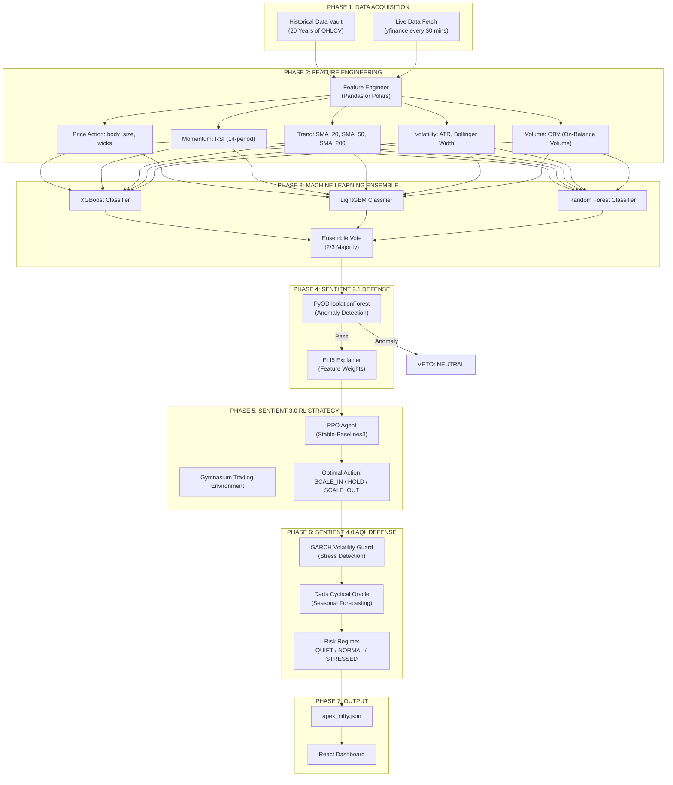
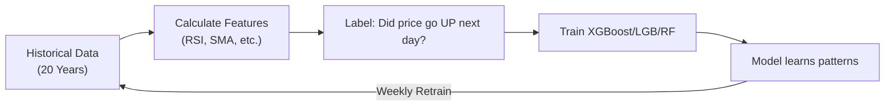
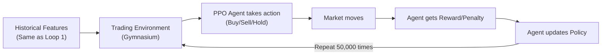
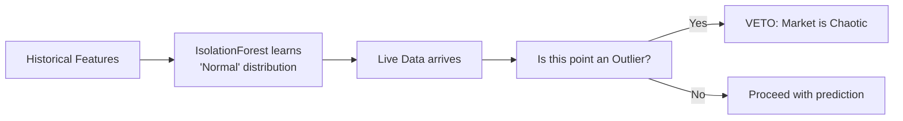
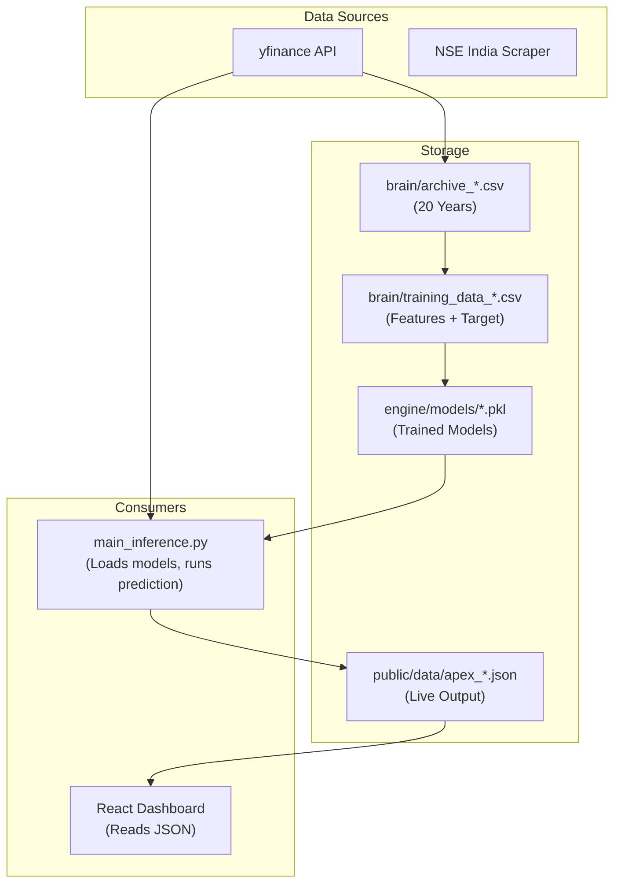

# Sentient Pipeline: Complete Architecture

This document contains TWO explanations:
1. **Part A:** Research-Level Technical Deep-Dive
2. **Part B:** 5-Year-Old Explanation

---

# PART A: Research-Level Technical Documentation

## 1. Confirmation: All Versions Live in This Project

**YES.** Versions 2.0, 2.1, 3.0, and 4.0 are ALL implemented and running in Tradyxa ApeX.

| Version | Files Implementing It | Status |
| :--- | :--- | :--- |
| **2.0** | `train_models.py`, `brain.py` | ✅ Active |
| **2.1** | `chaos_filter.py`, `explainer.py` | ✅ Active |
| **3.0** | `trading_env.py`, `train_rl.py` | ✅ Active |
| **4.0** | `engineer_polars.py`, `volatility_guard.py`, `cyclical_oracle.py` | ✅ Active |

They are not separate "modes." They run **sequentially** in `main_inference.py`:
1. v2.0 core prediction runs first.
2. v2.1 defense layer checks for anomalies.
3. v3.0 RL agent suggests optimal action.
4. v4.0 risk layer assesses market stress.

---

## 2. The "PPO Robot" Explained

**What is PPO?**
- PPO stands for **Proximal Policy Optimization**.
- It is a **Reinforcement Learning (RL)** algorithm from OpenAI.
- We use the `stable-baselines3` library to implement it.

**Is it a literal robot?**
- No. "Robot" is a metaphor.
- It is a **neural network** that learns by trial-and-error.
- It "plays" 50,000 simulated trades against historical data.
- It gets a **reward** for profitable trades and a **penalty** for losses.
- Over time, it learns the **optimal action** (Buy, Sell, Hold) for any given market state.

**Where does the "robot" live?**
- Trained model: `engine/models/rl_ppo_nifty.zip`
- Training script: `engine/models/train_rl.py`
- Environment: `engine/models/trading_env.py` (a custom Gymnasium environment)

---

## 3. The Complete Sentient Pipeline (Master Diagram)



---

## 4. The Learning Loops (Recursive Self-Improvement)

There are **3 distinct learning loops** in this system:

### Loop 1: Supervised Learning (ML Ensemble)



**How it works:**
1. We download 20 years of OHLCV data.
2. We calculate features (RSI, SMA, ATR) **programmatically** (not by hand).
3. We create a "Target" label: 1 if next day's close > today's close, else 0.
4. XGBoost learns: "When RSI < 30 AND Price > SMA_200, target is usually 1."
5. **Weekly**, the Nightly Review script retrains models with new data.

### Loop 2: Reinforcement Learning (PPO Strategy)



**How it works:**
1. We create a "game" where the agent can buy, sell, or hold.
2. The agent observes the 8 key features (RSI, SMA, etc.).
3. It takes an action and sees the result (profit or loss).
4. Profit = positive reward. Loss = negative reward.
5. Over 50,000 episodes, it learns the **optimal strategy**.

### Loop 3: Anomaly Learning (Chaos Filter)



**How it works:**
1. IsolationForest is an **unsupervised** algorithm.
2. It learns the "shape" of normal market data.
3. When live data arrives, it asks: "Is this point weird?"
4. If yes (top 1% outlier), it vetoes the prediction to protect capital.

---

## 5. How Features Are Calculated (Not by Hand!)

**We do NOT calculate RSI by hand.** Here's what happens:

1. **Raw Data:** `yfinance` returns a DataFrame with `Open, High, Low, Close, Volume`.
2. **Pandas/Polars Code:** `engineer.py` runs calculations like:
   ```python
   delta = df['Close'].diff()
   gain = delta.where(delta > 0, 0).rolling(14).mean()
   loss = (-delta.where(delta < 0, 0)).rolling(14).mean()
   df['RSI'] = 100 - (100 / (1 + gain / loss))
   ```
3. **Result:** A new column `RSI` is added to the DataFrame.
4. **This DataFrame** (with all calculated features) is fed to ML models.

---

## 6. How Data Spreads Across the System



---

# PART B: 5-Year-Old Explanation

## The Cookie Factory Story 🍪

Imagine you have a **magical cookie factory** that tries to guess if there will be more cookies tomorrow.

### The Workers in the Factory

| Worker | Job | Real Name |
| :--- | :--- | :--- |
| **The Historian** | Remembers every cookie from the last 20 years | Data Vault |
| **The Counter** | Counts how many cookies were eaten today | Feature Engineer |
| **The Guesser** | Looks at the count and says "More cookies tomorrow!" | XGBoost/ML |
| **The Skeptic** | Asks "Is the kitchen on fire?" and stops the Guesser if yes | Chaos Filter |
| **The Gamer** | Played 50,000 cookie games and knows the BEST way to get cookies | PPO Agent |
| **The Weatherman** | Checks if it's a good day for cookies (sunny = good, storm = bad) | GARCH/Darts |

### How They Work Together

```
🍪 Every 30 Minutes:

1. The Historian says: "Here's what happened with cookies."
2. The Counter says: "I counted 50 cookies eaten, 10 in the jar."
3. The Guesser says: "More cookies tomorrow! I'm 70% sure."
4. The Skeptic checks: "Is the kitchen weird? No. OK, proceed."
5. The Gamer says: "Open the jar NOW. Best time for cookies!"
6. The Weatherman says: "Sunny day. Safe to eat cookies."
7. They write it all on a sign (JSON).
8. You read the sign and know what to do! 🍪
```

### The 4 Generations

| Version | The Worker | What They Learned |
| :--- | :--- | :--- |
| **v2.0** | The Guesser | "Patterns in cookie history." |
| **v2.1** | The Skeptic | "When to say STOP because things are weird." |
| **v3.0** | The Gamer | "The BEST move to get the most cookies." |
| **v4.0** | The Weatherman | "When the weather is too dangerous to try." |

### The Magic Part

**The workers learn from their mistakes!**
- Every night, they check: "Were we right about cookies?"
- If wrong, they study more and get smarter.
- That's why the factory gets better every week! 📈

---

**END OF DOCUMENT**
