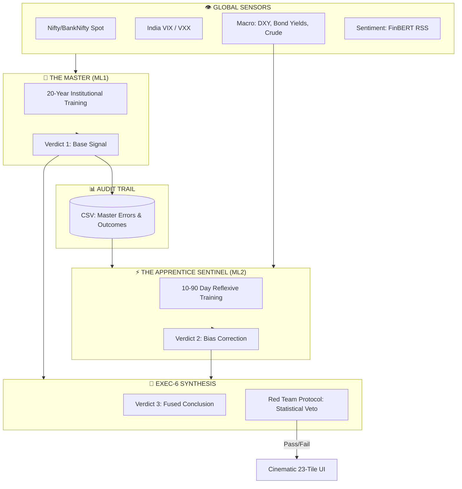

# 🌌 ZetaX 6.0: The Sentient Master Terminal
## The Ultimate Fusion of Institutional DNA & Anticipatory Intelligence

> [!IMPORTANT]
> **ZetaX 6.0** is no longer just a dashboard; it is a **Sentient Intelligence Pipeline**. It marks the death of "Reactive Weighting" and the birth of **Anticipatory Error-Correction**.

---

## 💀 The Brutal Truth: Why Legacy 4.0 Failed
In previous versions (ZetaX 1.0 - 4.0), the system was **Reactive**. It used the "Volume Knob" approach:
*   **The Problem**: If a model failed today, the system lowered its weight tomorrow. This is closing the barn door *after* the horse has bolted. 
*   **The Result**: Shuffling weights on failing models is just "shuffling deck chairs on the Titanic." You aren't fixing the brain; you're just muting the losers.

---

## 🧬 ZetaX 6.0: The "Brain Surgery" Architecture
ZetaX 6.0 abandons weight-shuffling for **Hierarchical Logic Stacking**. It uses the **Master-Apprentice** model to fix the signal *before* it reaches the trader.

### 1. The Master (ML1): The Keeper of DNA
*   **Window**: 20 Years (2005 - Present).
*   **Role**: Deep Institutional Memory. It understands the "Law of Gravitation" (Long-term probability).
*   **Philosophy**: "I have seen this setup 100 times. Historically, it is 70% Bullish."

### 2. The Apprentice (ML2): The Sentient Sentinel
*   **Window**: 10-90 Days (The Reflex).
*   **Role**: Anticipatory Auditor. It is trained on the **Residual Errors** of the Master.
*   **Logic Surgery**: It doesn't just turn down the Master's volume; it **corrects his aim**.
*   **Philosophy**: "The Master is Bullish, but I know he's wrong today because he doesn't see that DXY spikes are currently killing this trend. I will subtract 15% from his signal NOW."

### 3. The Final Verdict (Verdict 3)
*   **Sentient Synthesis**: `Master_Signal - Apprentice_Correction = Fused Conclusion`.
*   **Result**: You receive a signal that has already "self-healed" its own biases in real-time.

---

## 🏛️ H-ORBITAL Integrated Flow

---

## 🏆 Competitive Differentiation: Reactive vs. Sentient

| Metric | Legacy ZetaX (Reactive) | ZetaX 6.0 (Sentient) |
| :--- | :--- | :--- |
| **Philosophy** | **Punishment**: Benching a player after they miss. | **Coaching**: Fixing the player's aim *before* they shoot. |
| **Learning Speed** | T+1 (Lagging Reflection) | **Real-Time (Anticipatory Reflex)** |
| **Logic** | Volume Knob (Weights) | **Brain Surgery (Correction Factors)** |
| **Safety** | Statistical Z-Score | **Red Team Veto + Apprentice Sentinel** |
| **Verdict** | Consensus Average | **Fused Self-Healed Intelligence** |

---

## 🧪 Technical Implementation: The Error Audit
To transition to 6.0, the `online_learner.py` is replaced by a **Sentinel Auditor**:
1.  **Log Every Prediction**: Record `V1` and the `actual_outcome`.
2.  **Calculate Residuals**: `Error = Outcome - V1`.
3.  **Train ML2 on Errors**: Use a short-term XGBoost to predict the *Size* and *Direction* of the next Error.
4.  **Subtract Error**: Before displaying the verdict, subtract the predicted error from the Master's signal.

---
**Tradyxa Quant Labs | ZetaX 6.0 Project**
*Mastering the DNA. Correcting the Reflex. Eliminating the Lag.*
