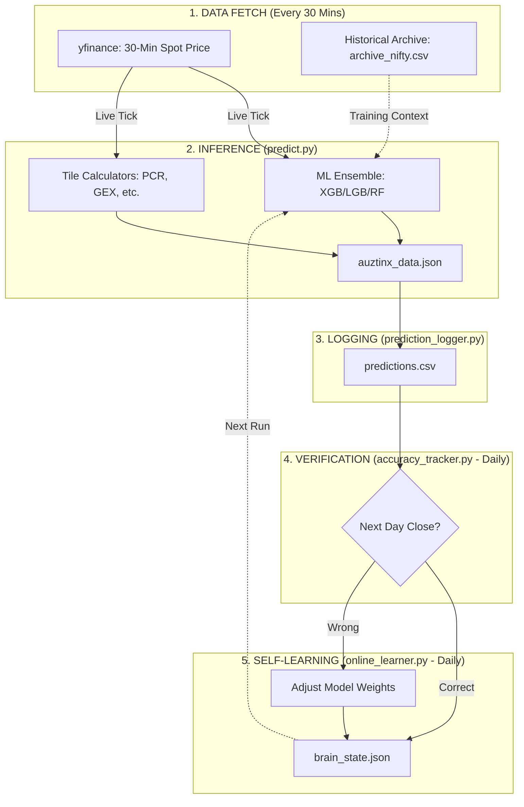
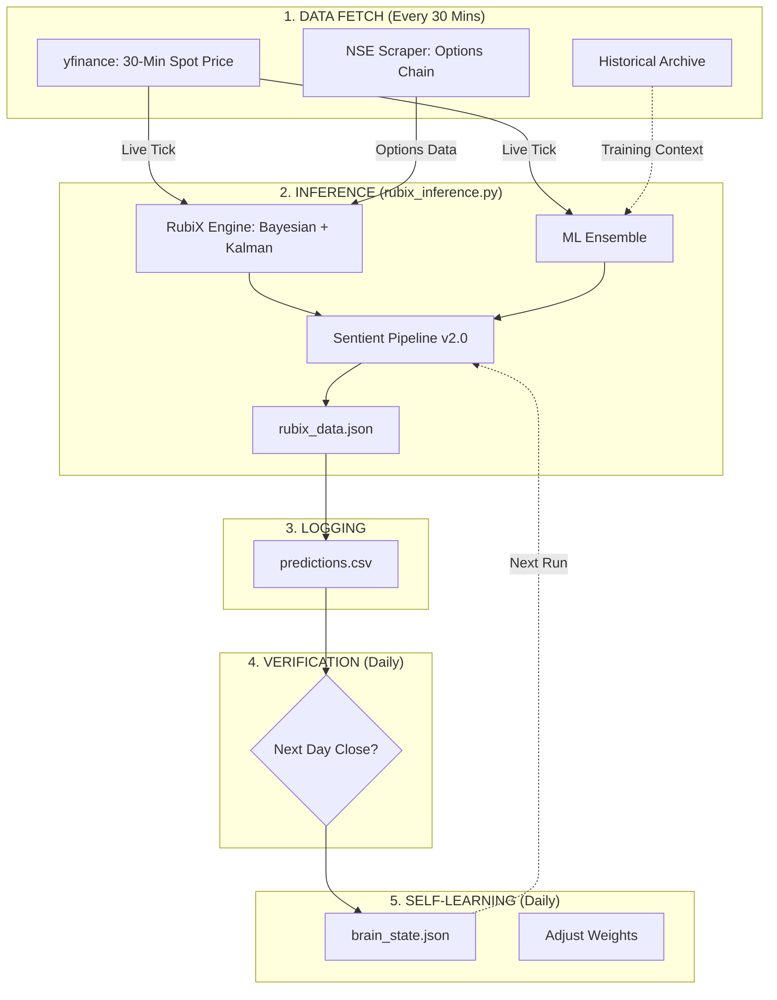
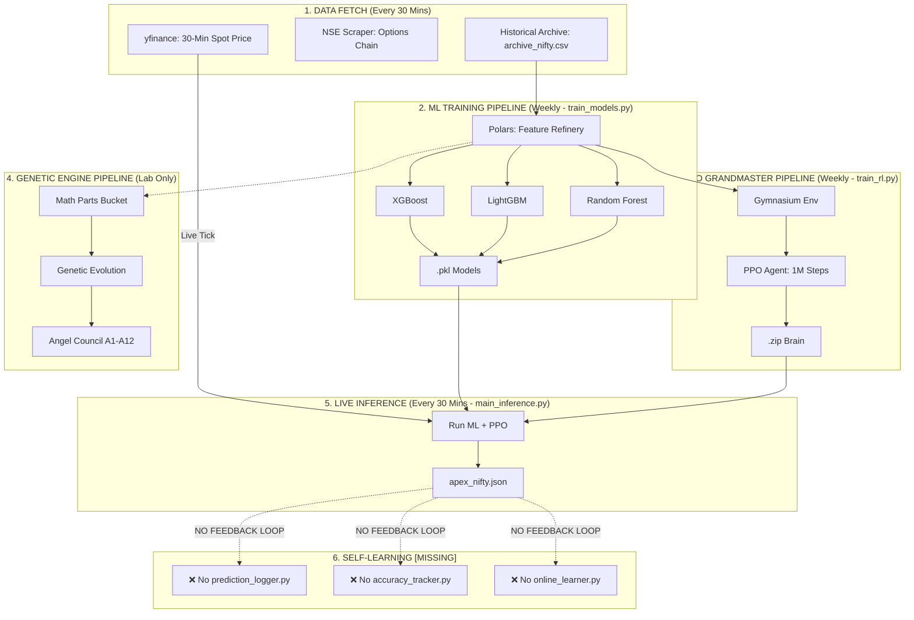

# 🏛️ CROSS-PROJECT ARCHITECTURE COMPARISON
## DeltaX vs ZetaX vs ApeX: Full Pipeline Analysis

This document provides a side-by-side comparison of the data flow, training loops, and self-learning mechanisms for the three Tradyxa projects.

---

## ✅ YOUR UNDERSTANDING IS CORRECT:
**ApeX has 3 distinct pipelines:**
1.  **ML Training Pipeline:** XGBoost, LightGBM, Random Forest.
2.  **PPO Grandmaster Pipeline:** Reinforcement Learning (1M Steps).
3.  **Genetic Engine Pipeline:** Alien Math Discovery (Experimental).

---

## 📊 DELTAX ARCHITECTURE (Living Brain Active)

---

## 📊 ZETAX ARCHITECTURE (Similar to DeltaX)

---

## 📊 APEX ARCHITECTURE (Living Brain MISSING)

---

## 🔑 KEY DIFFERENCES

| Feature | DeltaX | ZetaX | ApeX |
| :--- | :--- | :--- | :--- |
| **ML Ensemble** | ✅ XGB/LGB/RF | ✅ XGB/LGB/RF | ✅ XGB/LGB/RF |
| **PPO Grandmaster** | ❌ | ❌ | ✅ 1M Steps |
| **Genetic Engine** | ❌ | ❌ | ✅ (Lab Only) |
| **Living Brain (Self-Learning)** | ✅ | ✅ | ❌ MISSING |
| **Sentient Pipeline** | v2.0 | v2.0 | v4.0 (Partial) |

---

## 🚀 RECOMMENDATION FOR APEX

To complete ApeX Sentient 6.0, migrate the "Living Brain" loop from DeltaX:
1.  `prediction_logger.py` → Log `apex_nifty.json` to CSV.
2.  `accuracy_tracker.py` → Verify next-day outcomes.
3.  `online_learner.py` → Adapt weights for ML, PPO, and Angels.

🔱🧬🌌🚀🦾
© 2025 Zeta Aztra Technologies.
