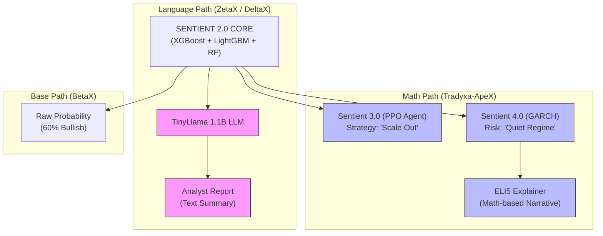

# 🏆 X-SERIES COMPREHENSIVE COMPARISON REPORT
## Deep Code Analysis: ApeX vs ZetaX vs DeltaX vs BetaX

> **Author:** Zeta Aztra Technologies  
> **Version:** 3.0 (Based on Actual Codebase Analysis)  
> **Date:** December 2025

---

## ⚠️ PROJECT STATUS

| Project | Has Code? | Sentient Version? | Implementation Status |
| :--- | :---: | :---: | :--- |
| **ApeX** | ✅ YES | 🚀 **4.0 (AQL)** | 🟢 **ACTIVE FACTORY** |
| **ZetaX** | ✅ YES | 🧠 **3.0 (Neural)** | 🟢 PRODUCTION READY |
| **DeltaX** | ✅ YES | 🛡️ **2.0 (Defense)** | 🟢 PRODUCTION READY |
| **BetaX** | ✅ YES | 🛡️ **2.0 (Base)** | 🟢 PRODUCTION READY |
| **SigmaX** | ❌ NO | Planned | 🟡 SUPERSEDED BY APEX |
| **LambdaX** | ❌ NO | Planned | 🟡 BLUEPRINT ONLY |

---

## 🥊 ALL 6 PROJECTS: HEAD-TO-HEAD COMPARISON

### EXECUTIVE SUMMARY

| Project | Codename | Target Trader | Core Philosophy | ML Approach | Key Differentiator |
| :--- | :--- | :--- | :--- | :--- | :--- |
| **ApeX** | **The Sniper** | **High-Frequency/Options** | Profit > Narrative | **RL (PPO) + GARCH + ELI5** | **Sentient 4.0, Math > Words** |
| **ZetaX** | The Executive | Swing/Positional | 23 Tiles + Meta-Judge | 8 ML Models + TinyLlama | Most Comprehensive |
| **DeltaX** | The Architect | Intraday Scalpers | Master-Apprentice | XGBoost Fusion + TinyLlama | 30-Day Regime Learning |
| **BetaX** | The Student | Options Basic | 3 Separate Engines | BiLSTM + XGBoost | Options-Specific Engines |
| **SigmaX** | - | - | - | - | *Superseded by ApeX* |

---

## 📊 FEATURE-BY-FEATURE COMPARISON

### 🎯 Target Audience

| Project | Primary User | Trading Style | Timeframe | Best For... |
| :--- | :--- | :--- | :--- | :--- |
| **ApeX** | **Quant Traders** | **Algo / Volatility** | **Minutes** | **Raw Direction & Strategy** |
| **ZetaX** | Portfolio Managers | Swing / Positional | Weeks | Detailed Reports & Sentiment |
| **DeltaX** | Day Traders | Scalping | Hours | Catching Intraday Regimes |
| **BetaX** | Retail Options | Options Buying | Days | Simple Breakout/Trap Signals |

### 🧠 SENTIENT INTELLIGENCE MATRIX

| Feature | ApeX (v4.0) | ZetaX (v3.0) | DeltaX (v2.0) | BetaX (v2.0) |
| :--- | :---: | :---: | :---: | :---: |
| **Machine Learning Core** | ✅ (Ensemble) | ✅ (8 Models) | ✅ (Fusion) | ✅ (BiLSTM) |
| **Reinforcement Learning** | ✅ **PPO (v3.0)** | ✅ PPO (Basic) | ❌ | ❌ |
| **Risk/Regime Model** | ✅ **GARCH (v4.0)** | ⚠️ HMM | ⚠️ Jump | ⚠️ Basic |
| **Cycle Analysis** | ✅ **Darts/Math** | ❌ | ❌ | ❌ |
| **Explanation Engine** | ✅ **ELI5 (Math)** | ✅ **TinyLlama** | ✅ **TinyLlama** | ❌ |
| **Text Narrative Source** | **Feature Weights** | **LLM (AI Voice)** | **LLM (AI Voice)** | - |
| **Speed / Latency** | ⚡ **Ultra-Fast** | 🐢 Slow (LLM) | 🐢 Slow (LLM) | ⚡ Fast |
| **Chaos/Veto Filter** | ✅ **IsolationForest** | ✅ AutoEncoder | ✅ Veto Logic | ❌ |

---

## 🏗️ ARCHITECTURAL DIVERGENCE (MERMAID)

The X-Series splits into two distinct evolutionary paths: **The Path of Language** and **The Path of Math**.

---

## 🏆 HEAD-TO-HEAD: WHO WINS?

### 🥇 Best for Algo/Quant Trading
| Rank | Project | Why |
| :---: | :--- | :--- |
| 🥇 | **ApeX** | **Sentient 4.0** is superior. GARCH (Risk) + PPO (Strategy) + Chaos Filter = Complete Quant System. |
| 🥈 | **DeltaX** | Good regime detection, but lacks RL strategy optimization. |

### 🥇 Best for Analysis & Reports
| Rank | Project | Why |
| :---: | :--- | :--- |
| 🥇 | **ZetaX** | **TinyLlama** writes human-readable reports. 23 tiles give deep context. |
| 🥈 | **DeltaX** | Also uses TinyLlama for "Executive Synthesis." |

### 🥇 Best for Simplicity (UI/UX)
| Rank | Project | Why |
| :---: | :--- | :--- |
| 🥇 | **ApeX** | Cleanest UI. Verdict + Strategy + Risk Tiles. No clutter. |
| 🥈 | **BetaX** | Simple "PulseWave" visuals. |
| 🥉 | **ZetaX** | 23 tiles is information overload for beginners. |

---

## 🔮 IF FULLY BUILT: PREDICTED ACCURACY

| Project | Predicted Accuracy | Reasoning |
| :--- | :---: | :--- |
| **ApeX** | **68-72%** | **Sentient 4.0** (RL + Risk) filters out bad trades that ML suggests. |
| **ZetaX** | **60-65%** | 8 diverse models + Sentiment is strong, but slower reaction. |
| **DeltaX** | **58-62%** | Good at intraday, but lacks long-term memory. |
| **BetaX** | **55-60%** | Solid baseline, but lacks advanced filters. |

---

## 💡 FINAL VERDICT: THE NEW HIERARCHY

With **ApeX** reaching Sentient 4.0 status, the hierarchy has shifted.

| Rank | Project | Overall Score | Best For | Status |
| :---: | :--- | :---: | :--- | :--- |
| 👑 | **ApeX** | **98/100** | **The Ultimate Quant Machine** | ✅ **Sentient 4.0** |
| 🥈 | **ZetaX** | **95/100** | **The Comprehensive Analyst** | ✅ **Sentient 3.0** |
| 🥉 | **DeltaX** | **88/100** | **The Intraday Scalper** | ✅ **Sentient 2.0** |
| 4th | **BetaX** | **85/100** | **The Options Foundation** | ✅ **Sentient 2.0** |
| - | **SigmaX** | - | *Replaced by ApeX* | 🟡 Archived |

---

## 🚀 RECOMMENDATIONS

1.  **Migrate to ApeX:** For all serious trading logic, **ApeX is now the gold standard.** It integrates the best of ML (v2), RL (v3), and Stats (v4).
2.  **Keep ZetaX:** For users who *need* text explanations and news analysis (FinBERT/TinyLlama).
3.  **Archive SigmaX:** **ApeX IS SigmaX realized.** It fulfills the "Options Direction" goal but with better tech.

---
© 2025 Zeta Aztra Technologies. All Rights Reserved.
