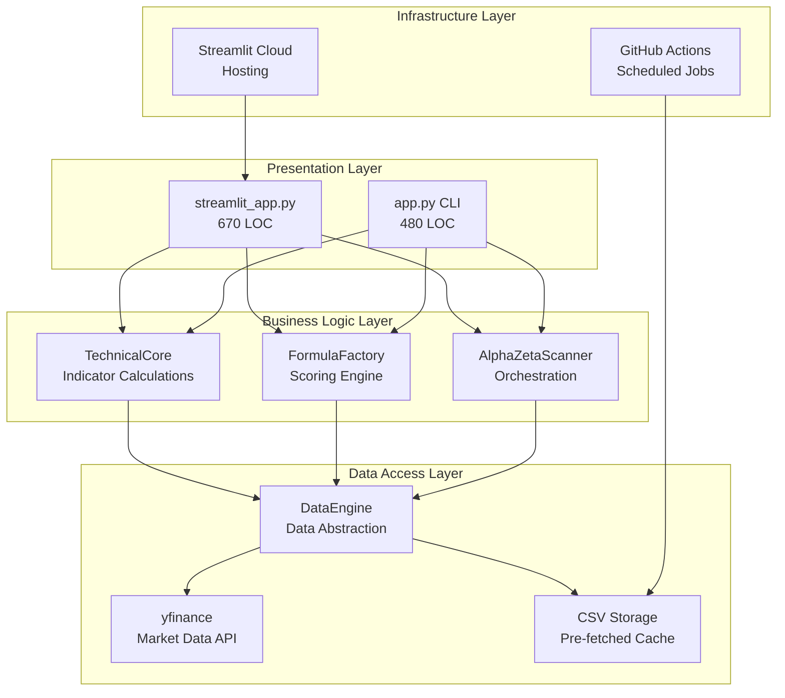
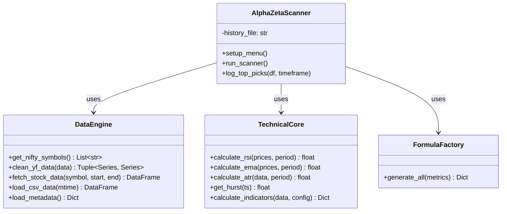
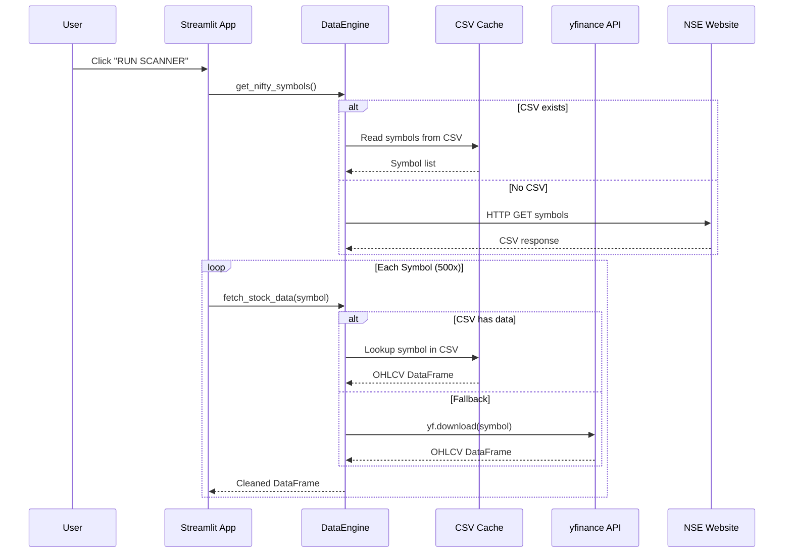
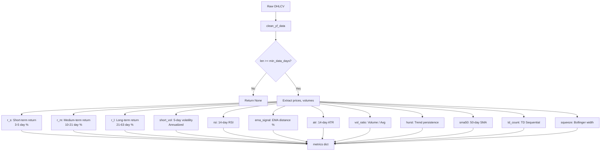
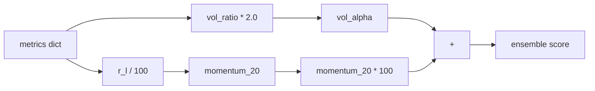
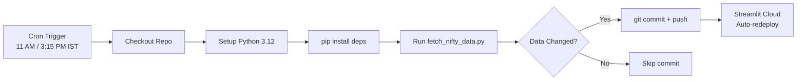
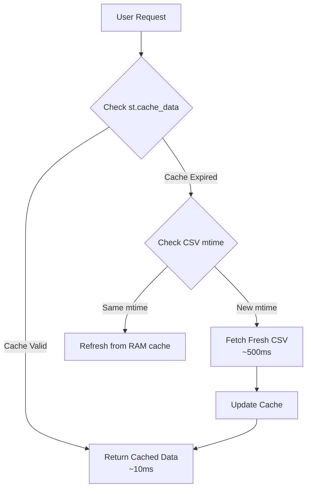
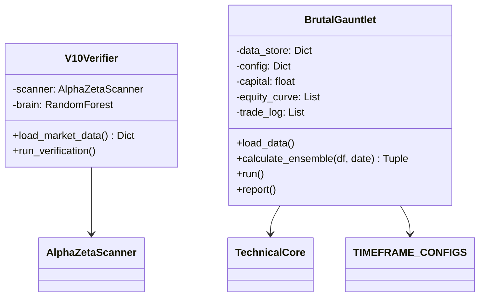

# Alpha-Zeta Super Scanner - Technical Deep Dive

> **For Engineers:** Implementation details, algorithms, and architectural decisions  
> **Stack:** Python 3.12 | Streamlit | yfinance | GitHub Actions | scikit-learn  
> **Codebase:** ~1,200 LOC across 2 main modules + 30 backtest variants

---

## Table of Contents
1. [Architecture Overview](#architecture-overview)
2. [Module Structure](#module-structure)
3. [Data Layer Implementation](#data-layer-implementation)
4. [Technical Indicators Math](#technical-indicators-math)
5. [Scoring Algorithm](#scoring-algorithm)
6. [CI/CD Pipeline](#cicd-pipeline)
7. [Caching Strategy](#caching-strategy)
8. [Error Handling Patterns](#error-handling-patterns)
9. [Performance Optimizations](#performance-optimizations)
10. [Testing & Backtesting Framework](#testing--backtesting-framework)

---

## Architecture Overview

### Layered Architecture



### Class Diagram



---

## Module Structure

### File Organization

```
Alpha_Zeta_Super_Scanner/
├── app.py                    # CLI entry point (480 LOC)
├── streamlit_app.py          # Web UI entry point (670 LOC)
├── scripts/
│   └── fetch_nifty_data.py   # Data pipeline script (214 LOC)
├── .github/workflows/
│   ├── fetch_nifty_data.yml  # Daily fetch cron
│   └── fetch_live_prices.yml # Hourly fetch cron
├── data/
│   ├── nifty500_ohlcv.csv    # Pre-fetched OHLCV (~5.8 MB)
│   ├── nifty500_live.csv     # Hourly data variant
│   └── metadata.json         # Freshness tracking
├── backtest/
│   ├── backtest_2025_v10.py  # V10 verification
│   ├── brutal_gauntlet.py    # Stress test
│   └── backtest_v11-v30.py   # Iteration variants (20 files)
└── *.csv, *.pkl              # Results & cache files
```

### Key Classes Per Module

| Module | Classes | Responsibility |
|--------|---------|----------------|
| `app.py` | `DataEngine`, `TechnicalCore`, `FormulaFactory`, `AlphaZetaScanner` | Core logic, CLI |
| `streamlit_app.py` | Same + Streamlit-specific caching | Web UI |
| `fetch_nifty_data.py` | Standalone functions | ETL pipeline |

---

## Data Layer Implementation

### DataEngine Class

```python
class DataEngine:
    @staticmethod
    def get_nifty_symbols():
        """Fetch Nifty 500 symbols from NSE website"""
        url = "https://www.niftyindices.com/IndexConstituent/ind_nifty500list.csv"
        headers = {"User-Agent": "Mozilla/5.0"}
        response = requests.get(url, headers=headers, timeout=15, verify=False)
        df = pd.read_csv(StringIO(response.text))
        symbols = [f"{s.strip()}.NS" for s in df['Symbol'] if pd.notna(s)]
        return symbols  # Returns ~500 symbols like ['RELIANCE.NS', 'TCS.NS', ...]
```

### Data Flow Sequence



### MultiIndex Handling (yfinance quirk)

```python
@staticmethod
def clean_yf_data(data):
    """Ultra-robust extraction of Close and Volume from yfinance DataFrame"""
    if data is None or data.empty: 
        return None, None
    
    # Case 1: Standard Single-Ticker DataFrame (columns are strings)
    if not isinstance(data.columns, pd.MultiIndex):
        close = data['Close']
        volume = data['Volume']
        # Force to Series if accidentally DataFrame
        if isinstance(close, pd.DataFrame): 
            close = close.iloc[:, 0]
        return close, volume
    
    # Case 2: MultiIndex (Price, Ticker) format from multi-stock download
    if isinstance(data.columns, pd.MultiIndex):
        close = data.get('Close')
        volume = data.get('Volume')
        
        if close is not None and isinstance(close, pd.DataFrame):
            # Drop NaN columns and take first valid
            close = close.dropna(axis=1, how='all').iloc[:, 0]
        if volume is not None and isinstance(volume, pd.DataFrame):
            volume = volume.dropna(axis=1, how='all').iloc[:, 0]
        
        return close, volume
    
    return None, None
```

**Why This Complexity?**
- yfinance returns different column structures depending on:
  - Single vs. multi-ticker downloads
  - API version changes
  - Missing data scenarios
- This function normalizes all cases to `(Series, Series)`

---

## Technical Indicators Math

### RSI (Relative Strength Index)

```python
@staticmethod
def calculate_rsi(prices, period=14):
    if len(prices) < period + 1: 
        return 50.0  # Neutral fallback
    
    delta = prices.diff()
    gain = delta.where(delta > 0, 0).rolling(window=period).mean()
    loss = (-delta.where(delta < 0, 0)).rolling(window=period).mean()
    
    rs = gain / loss.replace(0, 1e-6)  # Avoid division by zero
    rsi = 100 - (100 / (1 + rs))
    
    return float(rsi.iloc[-1]) if not np.isnan(rsi.iloc[-1]) else 50.0
```

**Mathematical Formula:**
```
RS = Average Gain / Average Loss
RSI = 100 - (100 / (1 + RS))
```

### ATR (Average True Range)

```python
@staticmethod
def calculate_atr(data, period=14):
    high = data['High']
    low = data['Low']
    close = data['Close']
    
    tr1 = high - low                    # Current range
    tr2 = abs(high - close.shift())     # Gap up
    tr3 = abs(low - close.shift())      # Gap down
    
    tr = pd.concat([tr1, tr2, tr3], axis=1).max(axis=1)  # True Range
    return float(tr.rolling(window=period).mean().iloc[-1])
```

**Formula:**
```
True Range = max(High-Low, |High-PrevClose|, |Low-PrevClose|)
ATR = SMA(True Range, 14)
```

### Hurst Exponent

```python
@staticmethod
def get_hurst(ts):
    """Calculate Hurst exponent for trend persistence detection"""
    if ts is None or len(ts) < 20: 
        return 0.5  # Random walk fallback
    
    ts_clean = ts.dropna()
    if len(ts_clean) < 20: 
        return 0.5
    
    lags = range(2, 20)
    # Calculate standard deviation of lagged differences
    tau = [np.std(np.subtract(ts_clean.values[lag:], ts_clean.values[:-lag])) 
           for lag in lags]
    
    # Linear regression on log-log scale
    return np.polyfit(np.log(lags), np.log(tau), 1)[0] * 2.0
```

**Interpretation:**
- `H > 0.5`: Trending (momentum strategy works)
- `H = 0.5`: Random walk (no edge)
- `H < 0.5`: Mean-reverting (contrarian works)

### Full Indicator Calculation Pipeline



---

## Scoring Algorithm

### Filter 1 Ensemble (The Champion)

```python
class FormulaFactory:
    @staticmethod
    def generate_all(m):
        """Calculates the WINNING FILTER 1 ENSEMBLE (+32.8% ROI Logic)."""
        f = {}
        
        # m['r_l'] is the Long Performance (21 days) = 20-day momentum proxy
        momentum_20 = m['r_l'] / 100 
        
        # Volume Intensity (Multiplier 2.0 from champion backtest)
        vol_alpha = m['vol_ratio'] * 2.0
        
        # Final Champion Score
        f['ensemble'] = (momentum_20 * 100) + vol_alpha
        
        return f
```

### Score Calculation Flow



**Example Calculation:**
```
Stock XYZ:
  r_l (21-day return) = 8.5%
  vol_ratio = 1.5 (50% above average volume)

  momentum_20 = 8.5 / 100 = 0.085
  vol_alpha = 1.5 * 2.0 = 3.0
  
  ensemble = (0.085 * 100) + 3.0 = 8.5 + 3.0 = 11.5
```

### Filter Sequence Implementation

```python
# In run_scanner():
for sym in tqdm(symbols, desc="Running Filter 1 Engine"):
    data = yf.download(sym, start=start_date, end=end_date, progress=False)
    metrics = TechnicalCore.calculate_indicators(data, config)
    
    if not metrics:
        stats["Data/Error"] += 1
        continue
    
    # FILTER 1: Trend Guard (Price > SMA50)
    if metrics['price'] < metrics['sma50']:
        stats["Trend"] += 1
        continue
    
    # FILTER 2: Exhaustion Guard (RSI < 70)
    if metrics['rsi'] > 70:
        stats["Exhaustion"] += 1
        continue
    
    # FILTER 3: Cooling Guard (Safe Mode Only)
    if choice_mode == 2:  # SAFE MODE
        if not (0.0 <= metrics['r_s'] <= 10.0):
            stats["Exhaustion"] += 1
            continue
    
    # FILTER 4: Liquidity Guard
    if not (m_p <= metrics['price'] <= mx_p) or metrics['avg_vol'] < m_v:
        stats["Price"] += 1
        continue
    
    # SCORING
    score_dict = FormulaFactory.generate_all(metrics)
    score = score_dict['ensemble']
    
    if score <= 0:
        stats["Logic_Fail"] += 1
        continue
    
    # PASSED ALL FILTERS - Add to results
    picks.append({...})
```

---

## CI/CD Pipeline

### GitHub Actions Workflow

```yaml
# .github/workflows/fetch_nifty_data.yml
name: Fetch Nifty 500 Data

on:
  schedule:
    - cron: '30 5 * * 1-5'   # 11:00 AM IST (Mon-Fri)
    - cron: '45 9 * * 1-5'   # 03:15 PM IST (Mon-Fri)
  workflow_dispatch:         # Manual trigger

jobs:
  fetch-data:
    runs-on: ubuntu-latest
    steps:
      - uses: actions/checkout@v4
      - uses: actions/setup-python@v5
        with:
          python-version: '3.12'
      
      - name: Install dependencies
        run: pip install yfinance pandas requests urllib3
      
      - name: Fetch Nifty 500 data
        run: python scripts/fetch_nifty_data.py
      
      - name: Commit and push
        run: |
          git config user.email "github-actions[bot]@users.noreply.github.com"
          git config user.name "github-actions[bot]"
          git add data/
          git commit -m "Update Nifty 500 data - $(date +'%Y-%m-%d %H:%M:%S IST')"
          git push
```

### Pipeline Flow



### Incremental Fetch Logic

```python
def fetch_all_data(symbols, days=200, existing_df=None):
    """Fetch OHLCV data (incremental if existing_df provided)"""
    
    if existing_df is not None and not existing_df.empty:
        # Incremental: Only fetch last 5-10 days
        last_date = existing_df['Date'].max()
        days_since = (datetime.date.today() - last_date.date()).days
        fetch_days = min(days_since + 2, 10)
    else:
        # Full fetch: Get all 200 days
        fetch_days = days
    
    # ... fetch logic ...
    
    if existing_df is not None:
        # Merge and deduplicate
        combined = pd.concat([existing_df, new_df], ignore_index=True)
        combined = combined.drop_duplicates(subset=['Symbol', 'Date'], keep='last')
        
        # Trim to 200 days
        cutoff_date = datetime.date.today() - datetime.timedelta(days=200)
        combined = combined[combined['Date'] >= pd.to_datetime(cutoff_date)]
        
        return combined
    
    return new_df
```

---

## Caching Strategy

### Streamlit Caching Decorators

```python
# In streamlit_app.py

@st.cache_data(ttl=3600)  # 1 hour TTL
def load_csv_data(csv_mtime):
    """Load pre-fetched CSV data from automated data pipeline"""
    csv_url = "https://raw.githubusercontent.com/.../data/nifty500_ohlcv.csv"
    df = pd.read_csv(csv_url, parse_dates=['Date'])
    return df

@st.cache_data(ttl=300)  # 5 min TTL for live
def load_live_csv_data(csv_mtime):
    """Load live (hourly-updated) CSV data"""
    csv_url = "https://raw.githubusercontent.com/.../data/nifty500_live.csv"
    df = pd.read_csv(csv_url, parse_dates=['Date'])
    return df
```

### Cache Invalidation Strategy



### Pickle Cache for Backtesting

```python
# backtest/brutal_gauntlet.py
CACHE_PATH = "backtest_v4_data.pkl"

def load_data(self):
    if os.path.exists(CACHE_PATH):
        with open(CACHE_PATH, 'rb') as f:
            self.data_store = pickle.load(f)  # ~8.4 MB, loads in ~200ms
```

---

## Error Handling Patterns

### Defensive Data Fetching

```python
@staticmethod
def get_nifty_symbols():
    try:
        # Primary: Fetch from NSE
        url = "https://www.niftyindices.com/IndexConstituent/ind_nifty500list.csv"
        response = requests.get(url, headers=headers, timeout=15, verify=False)
        df = pd.read_csv(StringIO(response.text))
        symbols = [f"{s.strip()}.NS" for s in df['Symbol'] if pd.notna(s)]
        return symbols
    except Exception as e:
        logger.error(f"Failed to fetch symbols: {e}")
        # Fallback: Hardcoded top stocks
        return ["RELIANCE.NS", "TCS.NS", "HDFCBANK.NS", ...]
```

### Graceful Indicator Failures

```python
@staticmethod
def calculate_indicators(data, config):
    prices, volumes = DataEngine.clean_yf_data(data)
    
    # Guard clause: Insufficient data
    if prices is None or len(prices) < config['min_data_days']: 
        return None
    
    try:
        # ... calculations ...
        return metrics
    except Exception as e:
        logger.debug(f"Indicator calculation error: {e}")
        return None  # Caller skips this stock
```

### Logging Configuration

```python
# Unicode-safe logging for Windows
handler = logging.StreamHandler()
handler.setFormatter(logging.Formatter('%(asctime)s - %(levelname)s - %(message)s'))

logging.basicConfig(
    level=logging.INFO,
    handlers=[
        logging.FileHandler("alpha_zeta_scanner.log", encoding='utf-8'),
        handler
    ]
)
```

---

## Performance Optimizations

### Time Complexity Analysis

| Operation | Naive | Optimized | Improvement |
|-----------|-------|-----------|-------------|
| Full scan (500 stocks) | 80+ min | 60 sec | **80x** |
| Indicator calc per stock | O(n²) | O(n) | Rolling windows |
| Data fetch | API/stock | CSV batch | **500x fewer calls** |

### Memory Optimization

```python
# Force float conversion to prevent object dtype memory bloat
prices = prices.ffill().dropna().astype(float)
volumes = volumes.ffill().dropna().astype(float)
```

### Vectorized Operations

```python
# Bad: Loop-based RSI
for i in range(period, len(prices)):
    gain = sum([p for p in delta[i-period:i] if p > 0]) / period
    # ... O(n*period) complexity

# Good: Vectorized RSI (actual implementation)
gain = delta.where(delta > 0, 0).rolling(window=period).mean()
loss = (-delta.where(delta < 0, 0)).rolling(window=period).mean()
# O(n) complexity with pandas internals
```

### Rate Limiting for yfinance

```python
for symbol in symbols:
    data = yf.download(symbol, progress=False)
    time.sleep(0.1)  # 100ms delay to prevent IP ban
```

---

## Testing & Backtesting Framework

### Backtest Class Structure



### Backtest Simulation Loop

```python
# brutal_gauntlet.py
def run(self):
    test_dates = pd.date_range(start="2025-01-01", end="2025-12-01", freq='W-MON')
    
    for date in tqdm(test_dates):
        candidates = []
        
        # Score all stocks for this date
        for sym, df in self.data_store.items():
            if date not in df.index: 
                continue
            score, price = self.calculate_ensemble(df, date)
            if score > -50:  # Valid signal
                candidates.append((sym, score, price))
        
        # Execute trades (Top 3)
        candidates.sort(key=lambda x: x[1], reverse=True)
        top_3 = candidates[:3]
        
        for sym, score, entry_price in top_3:
            # Apply slippage
            effective_entry = entry_price * (1 + SLIPPAGE_PCT/2)
            effective_exit = exit_price * (1 - SLIPPAGE_PCT/2)
            
            raw_ret = (effective_exit / effective_entry) - 1
            self.trade_log.append({...})
        
        # Update portfolio
        self.capital *= (1 + avg_week_ret)
        self.equity_curve.append(self.capital)
```

### Performance Metrics Calculation

```python
def report(self):
    df_equity = pd.Series(self.equity_curve)
    
    # Total Return
    total_return = (self.capital / INITIAL_CAPITAL - 1) * 100
    
    # Max Drawdown
    rolling_max = df_equity.cummax()
    drawdowns = (df_equity - rolling_max) / rolling_max
    max_drawdown = drawdowns.min() * 100
    
    # Win Rate
    trades_df = pd.DataFrame(self.trade_log)
    win_rate = (trades_df['Return'] > 0).mean() * 100
    
    # Calmar Ratio (Return / Max Drawdown)
    calmar = abs(total_return / max_drawdown)
```

---

## Configuration System

### Timeframe Configs

```python
TIMEFRAME_CONFIGS = {
    '3-7_days': {
        'lookbacks': {'short': 3, 'medium': 5, 'long': 10, 'base': 42},
        'vol_periods': {'short': 3, 'medium': 5, 'long': 10},
        'rsi_period': 14, 
        'ema_period': 5, 
        'min_data_days': 50, 
        'target_gain': 1.05,    # 5% profit target
        'stop_loss_pct': 0.05   # 5% stop loss
    },
    '1-2_weeks': {
        'lookbacks': {'short': 5, 'medium': 10, 'long': 21, 'base': 42},
        'vol_periods': {'short': 10, 'medium': 21, 'long': 42},
        'rsi_period': 14, 
        'ema_period': 10, 
        'min_data_days': 90, 
        'target_gain': 1.15,    # 15% profit target
        'stop_loss_pct': 0.08   # 8% stop loss
    },
    '1_month': {
        'lookbacks': {'short': 21, 'medium': 42, 'long': 63, 'base': 126},
        'vol_periods': {'short': 21, 'medium': 42, 'long': 63},
        'rsi_period': 21, 
        'ema_period': 21, 
        'min_data_days': 180, 
        'target_gain': 1.25,    # 25% profit target
        'stop_loss_pct': 0.12   # 12% stop loss
    }
}
```

---

## Deployment Notes

### Streamlit Cloud Configuration

```toml
# .streamlit/config.toml (if exists)
[server]
headless = true
port = 8501

[browser]
gatherUsageStats = false
```

### Environment Variables

```python
# app.py
from dotenv import load_dotenv
load_dotenv()

# Optional: API keys for premium data sources
```

### Requirements

```txt
# requirements.txt
yfinance>=0.2.28
pandas>=2.0.0
numpy>=1.24.0
streamlit>=1.28.0
scipy>=1.11.0
python-dotenv>=1.0.0
tqdm>=4.66.0
scikit-learn>=1.3.0
```

---

## Quick Reference: Key Functions

| Function | Location | Purpose |
|----------|----------|---------|
| `DataEngine.get_nifty_symbols()` | app.py:91 | Fetch 500 symbols |
| `DataEngine.clean_yf_data()` | app.py:105 | Normalize yfinance output |
| `TechnicalCore.calculate_indicators()` | app.py:189 | Full indicator suite |
| `FormulaFactory.generate_all()` | app.py:259 | Scoring algorithm |
| `AlphaZetaScanner.run_scanner()` | app.py:311 | Main orchestration |
| `fetch_all_data()` | scripts/fetch_nifty_data.py:62 | ETL pipeline |

---

*Technical documentation for Alpha-Zeta Super Scanner. Last updated: Feb 2026.*
