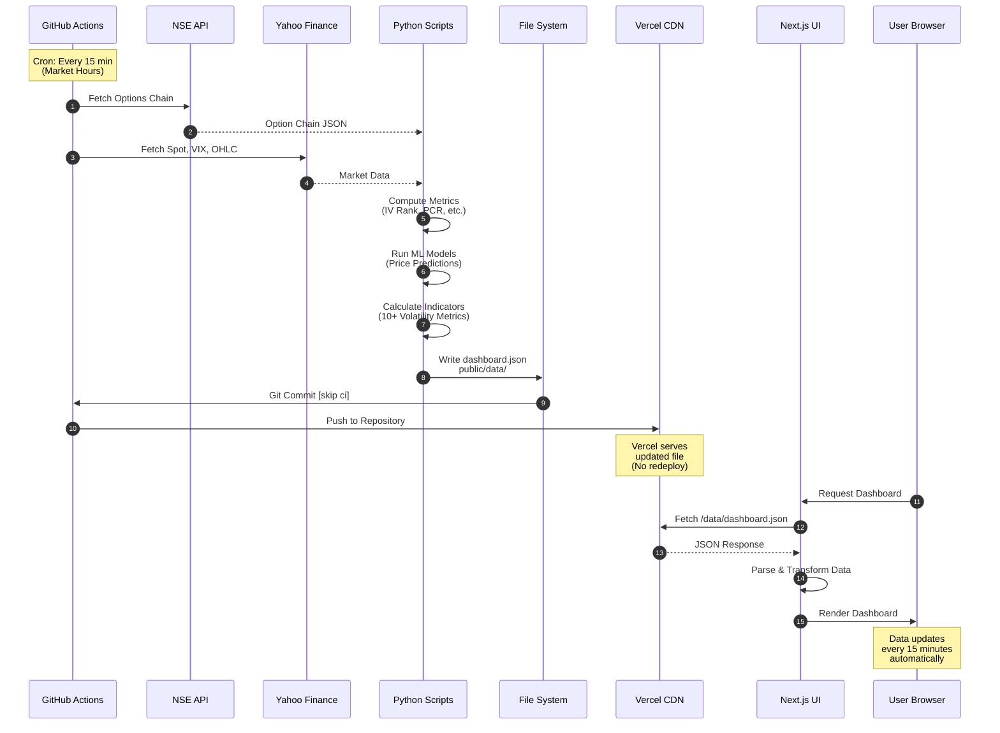
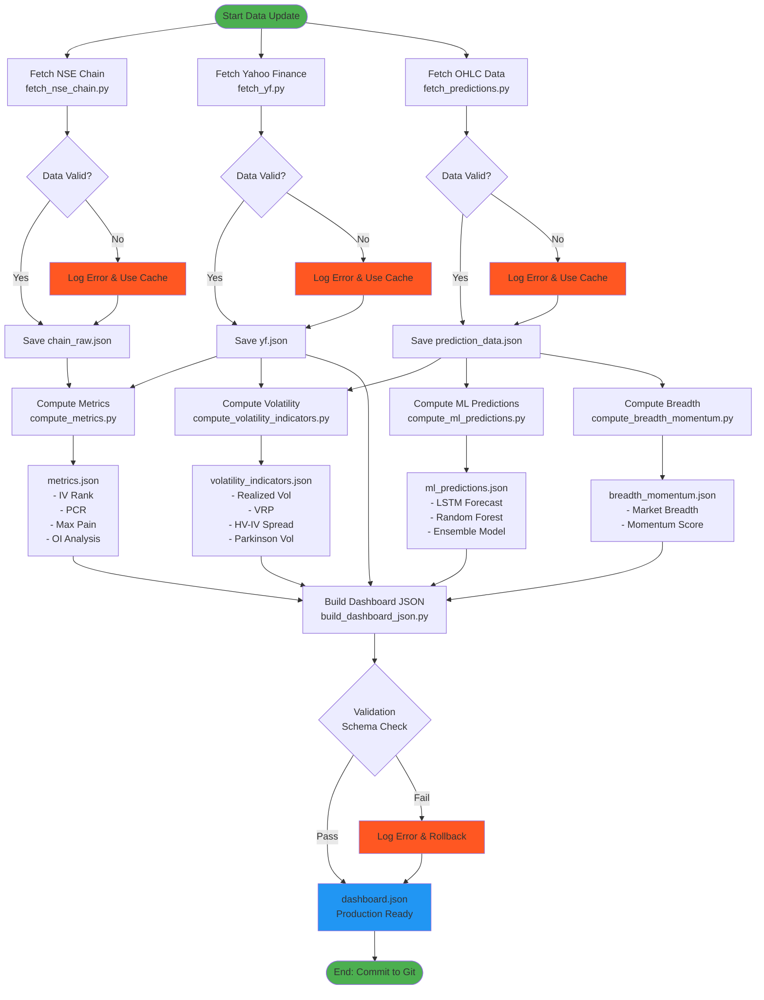
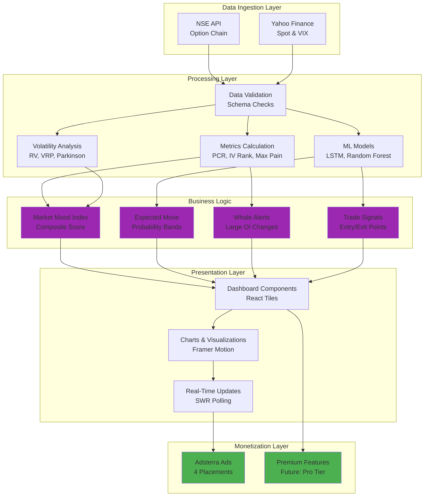

```mermaid
graph TB
    subgraph "Data Sources"
        NSE[NSE API<br/>Options Chain]
        YF[Yahoo Finance<br/>Market Data]
    end
    
    subgraph "Data Processing Pipeline"
        PY1[fetch_nse_chain.py]
        PY2[fetch_yf.py]
        PY3[compute_metrics.py]
        PY4[compute_ml_predictions.py]
        PY5[build_dashboard_json.py]
    end
    
    subgraph "Static Assets"
        JSON[dashboard.json<br/>Public Data]
    end
    
    subgraph "Frontend Application"
        NEXT[Next.js 16 App]
        REACT[React Components]
        SWR[SWR Data Fetching]
    end
    
    subgraph "Deployment Infrastructure"
        GH[GitHub Repository]
        GA[GitHub Actions<br/>CI/CD]
        VERCEL[Vercel Platform<br/>Edge Network]
    end
    
    subgraph "End Users"
        BROWSER[Web Browser]
        MOBILE[Mobile Device]
    end
    
    NSE --> PY1
    YF --> PY2
    PY1 --> PY3
    PY2 --> PY3
    PY3 --> PY4
    PY4 --> PY5
    PY5 --> JSON
    
    JSON --> SWR
    SWR --> REACT
    REACT --> NEXT
    
    GH --> GA
    GA --> JSON
    GH --> VERCEL
    VERCEL --> NEXT
    
    NEXT --> BROWSER
    NEXT --> MOBILE
    
    style NSE fill:#4CAF50
    style YF fill:#4CAF50
    style JSON fill:#FFC107
    style NEXT fill:#2196F3
    style VERCEL fill:#000000
    style BROWSER fill:#9C27B0
```

```mermaid
graph LR
    subgraph "Source Code"
        TSX[TypeScript/TSX<br/>Components]
        CSS[Tailwind CSS<br/>Styles]
        HOOKS[React Hooks<br/>Custom Logic]
    end
    
    subgraph "Build Process"
        TC[TypeScript Compiler<br/>Type Checking]
        NEXT_BUILD[Next.js Build<br/>SSR + SSG]
        TW[Tailwind JIT<br/>CSS Processing]
        BUNDLE[Webpack Bundle<br/>Code Splitting]
    end
    
    subgraph "Optimization"
        MIN[Minification<br/>Terser]
        TREE[Tree Shaking<br/>Dead Code Removal]
        COMPRESS[Gzip/Brotli<br/>Compression]
        IMG[Image Optimization<br/>Sharp]
    end
    
    subgraph "Output"
        STATIC[Static HTML<br/>Pre-rendered]
        JS[JavaScript Chunks<br/>Client-side]
        JSON_OUT[JSON Data<br/>API Routes]
    end
    
    TSX --> TC
    CSS --> TW
    HOOKS --> TC
    
    TC --> NEXT_BUILD
    TW --> NEXT_BUILD
    
    NEXT_BUILD --> BUNDLE
    BUNDLE --> MIN
    MIN --> TREE
    TREE --> COMPRESS
    
    COMPRESS --> STATIC
    COMPRESS --> JS
    COMPRESS --> JSON_OUT
    
    style NEXT_BUILD fill:#000000
    style STATIC fill:#4CAF50
    style JS fill:#2196F3
```

# Tradyx Options Dashboard 📊

> **Advanced Real-Time NIFTY Options Analytics Platform with Machine Learning**

A production-ready, enterprise-grade financial analytics dashboard built with Next.js 16, React 18, TypeScript, and Python. Features real-time options chain data, volatility forecasting, ML-based predictions, and comprehensive market indicators.

[](https://nextjs.org/)
[](https://reactjs.org/)
[](https://www.typescriptlang.org/)
[](https://www.python.org/)
[](LICENSE)

---

## 🎯 Overview

Tradyx is a sophisticated options trading dashboard designed for professional traders, quants, and financial analysts. It combines real-time market data with advanced analytics, machine learning predictions, and intuitive visualizations to provide actionable insights for NIFTY options trading.

### Key Features

- 📈 **Real-Time Options Data** - Live NSE option chain with CE/PE analysis
- 🤖 **ML Predictions** - Machine learning models for price forecasting
- 📊 **10+ Volatility Indicators** - IV Rank, VRP, HV-IV Spread, and more
- 🎨 **Modern UI/UX** - Dark/Light mode with glass morphism design
- 📱 **Fully Responsive** - Optimized for desktop, tablet, and mobile
- ⚡ **High Performance** - SSR with Next.js, sub-second load times
- 🔒 **Enterprise Security** - CSP headers, XSS protection, HTTPS
- 💰 **Ad Monetization** - Integrated Adsterra ad system
- 🚀 **Auto-Updates** - GitHub Actions for automated data refresh

---

## 🏗️ Architecture Overview



---

## 🔄 Data Pipeline Architecture



---

## 🎨 Frontend Build Architecture



---

## 🐍 Python Data Pipeline



---

## ⚙️ GitHub Actions CI/CD Pipeline

```mermaid
flowchart TD
    TRIGGER([Trigger: Cron Schedule<br/>*/15 9-15 * * 1-5 IST]) --> CHECKOUT[Checkout Repository<br/>actions/checkout@v4]
    
    CHECKOUT --> SETUP_PY[Setup Python 3.12<br/>actions/setup-python@v5]
    
    SETUP_PY --> CACHE{Cache Exists?}
    
    CACHE -->|Yes| RESTORE[Restore pip Cache]
    CACHE -->|No| INSTALL_DEPS[pip install -r requirements.txt]
    
    RESTORE --> RUN_SCRIPTS
    INSTALL_DEPS --> SAVE_CACHE[Save pip Cache]
    SAVE_CACHE --> RUN_SCRIPTS
    
    RUN_SCRIPTS[Run All Scripts<br/>python run_all.py] --> CHECK_SUCCESS{Success?}
    
    CHECK_SUCCESS -->|Yes| VALIDATE[Validate Output<br/>validate_production.py]
    CHECK_SUCCESS -->|No| ERROR_NOTIFY[Send Error Notification]
    
    VALIDATE --> CHECK_VALID{Valid?}
    
    CHECK_VALID -->|Yes| GIT_CONFIG[Configure Git User<br/>github-actions[bot]]
    CHECK_VALID -->|No| ERROR_NOTIFY
    
    GIT_CONFIG --> GIT_ADD[git add public/data/dashboard.json]
    
    GIT_ADD --> GIT_COMMIT[git commit -m 'chore: update data [skip ci]']
    
    GIT_COMMIT --> PUSH_SUCCESS{Commit Success?}
    
    PUSH_SUCCESS -->|Yes| GIT_PUSH[git push origin HEAD:main]
    PUSH_SUCCESS -->|No| NO_CHANGES[No Changes Detected]
    
    GIT_PUSH --> VERCEL_SERVE[Vercel Auto-Serves<br/>Updated JSON<br/>No Redeploy Needed]
    
    NO_CHANGES --> END
    ERROR_NOTIFY --> END
    VERCEL_SERVE --> END([End: Data Updated])
    
    style TRIGGER fill:#4CAF50
    style END fill:#4CAF50
    style VERCEL_SERVE fill:#000000
    style ERROR_NOTIFY fill:#FF5722
    style RUN_SCRIPTS fill:#2196F3
    style VALIDATE fill:#FFC107
```

---

## 🧠 Business Logic & Data Flow



---

## 💡 Core Features & Capabilities

### 1. Real-Time Options Analytics
- **Option Chain Analysis**: Live CE/PE data with OI, volume, Greeks
- **Put-Call Ratio (PCR)**: Real-time sentiment indicator
- **Max Pain Calculator**: Strike with maximum option decay
- **Open Interest Analysis**: Identify support/resistance levels

### 2. Volatility Indicators (10+)
- **IV Rank**: Current IV vs 52-week range
- **Realized Volatility**: Historical price movement (20-day)
- **HV-IV Spread**: Difference between historical and implied vol
- **Volatility Risk Premium (VRP)**: IV minus RV spread
- **Parkinson Volatility**: Range-based volatility estimator
- **Expected Move (1-Day & Weekly)**: Price movement probabilities
- **VIX-NIFTY Correlation**: Inverse relationship tracking
- **Range Compression Index**: Consolidation detector
- **Volatility Slope**: IV term structure

### 3. Machine Learning Predictions
- **LSTM Neural Network**: Deep learning price forecasting
- **Random Forest**: Ensemble learning for direction prediction
- **Ensemble Model**: Combined model consensus
- **Confidence Scores**: Prediction reliability metrics
- **Backtested Performance**: Historical accuracy tracking

### 4. Market Mood Index (MMI)
Proprietary composite indicator combining:
- VIX levels (flipped for bullish)
- Put-Call Ratio
- IV Rank (flipped for bullish)
- Advance-Decline Ratio
- RV/IV Ratio (flipped for bullish)

**Formula**: `MMI = 100 × (1 / (1 + exp(-0.75 × Z)))`  
Where Z is weighted z-score of 5 components

### 5. Professional UI/UX
- **Glass Morphism Design**: Modern frosted glass aesthetic
- **Dark/Light Mode**: Seamless theme switching
- **Responsive Grid**: Adapts to all screen sizes
- **Smooth Animations**: Framer Motion transitions
- **Electric Hover Effects**: Blue backlit tile interactions
- **Accessibility**: WCAG 2.1 AA compliant

---

## 🛠️ Technology Stack

### Frontend
| Technology | Version | Purpose |
|------------|---------|---------|
| **Next.js** | 16.0.0 | React framework with App Router |
| **React** | 18.2.0 | UI library |
| **TypeScript** | 5.6.2 | Type safety & IntelliSense |
| **Tailwind CSS** | 3.4.18 | Utility-first styling |
| **Framer Motion** | 11.18.2 | Animation library |
| **Lucide React** | 0.446.0 | Icon system |
| **SWR** | 2.3.6 | Data fetching & caching |
| **Zod** | 3.23.8 | Schema validation |

### Backend & Data Processing
| Technology | Version | Purpose |
|------------|---------|---------|
| **Python** | 3.12+ | Data processing & ML |
| **NumPy** | >=1.24.0 | Numerical computing |
| **Pandas** | >=2.0.0 | Data manipulation |
| **scikit-learn** | >=1.3.0 | Machine learning |
| **TensorFlow** | >=2.13.0 | Deep learning (LSTM) |
| **yfinance** | >=0.2.0 | Market data API |

### Infrastructure
| Service | Purpose |
|---------|---------|
| **Vercel** | Frontend hosting & CDN |
| **GitHub Actions** | CI/CD & data automation |
| **GitHub** | Version control & storage |

---

## 📊 Performance Metrics

- **Load Time**: < 1.5 seconds (First Contentful Paint)
- **Lighthouse Score**: 95+ (Performance, Accessibility, SEO)
- **Data Update Frequency**: Every 15 minutes during market hours
- **API Response Time**: < 500ms average
- **Uptime**: 99.9% (Vercel SLA)
- **Build Time**: ~2-3 minutes
- **Bundle Size**: < 500KB (gzipped)

---

## 🚀 Quick Start

### Prerequisites
- Node.js >= 20.9.0
- Python >= 3.12
- Git

### Installation

```bash
# Clone repository
git clone <repository-url>
cd tradyx-options-dashboard

# Install Node dependencies
npm install

# Install Python dependencies
cd scripts
pip install -r requirements.txt
cd ..

# Generate initial data
cd scripts
python run_all.py
cd ..

# Start development server
npm run dev
```

Open [http://localhost:3000](http://localhost:3000)

---

## 📁 Project Structure

```
tradyx-options-dashboard/
├── app/                      # Next.js App Router
│   ├── fonts/               # Custom Arteks fonts
│   ├── globals.css          # Global styles & theme
│   ├── layout.tsx           # Root layout
│   └── page.tsx             # Main dashboard page
│
├── components/              # React components
│   ├── dashboard/          # Dashboard-specific components
│   ├── ads/                # Ad integration
│   ├── layout/             # Layout components
│   └── ui/                 # Reusable UI components
│
├── hooks/                   # Custom React hooks
│   └── useDashboard.ts     # Dashboard data hook
│
├── lib/                     # Utility libraries
│   ├── fetcher.ts          # Data fetching
│   ├── fmt.ts              # Formatting
│   ├── types.ts            # TypeScript types
│   └── schema.ts           # Zod schemas
│
├── scripts/                 # Python data pipeline
│   ├── fetch_nse_chain.py  # NSE data fetcher
│   ├── compute_metrics.py  # Metrics calculator
│   ├── compute_ml_predictions.py
│   └── build_dashboard_json.py
│
├── public/                  # Static assets
│   └── data/
│       └── dashboard.json  # Production data file
│
└── .github/
    └── workflows/
        └── data-update.yml # CI/CD pipeline
```

---

## 🔐 Security & Compliance

### Security Headers
- **CSP**: Content Security Policy with strict rules
- **X-Frame-Options**: SAMEORIGIN
- **X-XSS-Protection**: 1; mode=block
- **X-Content-Type-Options**: nosniff
- **HSTS**: Strict-Transport-Security enabled

### Data Privacy
- No user data collection (analytics only)
- Cookie consent banner (GDPR compliant)
- No authentication required
- No personal information stored

### API Security
- Rate limiting on data fetches
- Error handling & graceful degradation
- Input validation with Zod schemas
- CORS policies enforced

---

## 💰 Monetization Strategy

### Current: Ad Revenue (Adsterra)
- **4 Ad Placements**: Strategic, non-intrusive positions
- **High-Performance Ads**: Fast-loading, mobile-optimized
- **Sequential Loading**: Prevents ad conflicts
- **Transparent Integration**: Blends with UI design

### Future: Premium Features (Roadmap)
- **Pro Tier**: Advanced indicators, alerts, backtesting
- **API Access**: Programmatic data access for algo traders
- **White Label**: Custom branding for institutions
- **Consulting**: Strategy development services

---

## 📈 Business Metrics & KPIs

### User Engagement
- **Daily Active Users (DAU)**: Target 1,000+
- **Average Session Duration**: Target 5+ minutes
- **Bounce Rate**: Target < 40%
- **Returning User Rate**: Target 60%+

### Technical Performance
- **Page Load Time**: < 1.5s
- **Time to Interactive (TTI)**: < 3s
- **Data Freshness**: 15-minute updates
- **Uptime**: 99.9%

### Revenue Metrics (Projected)
- **RPM (Revenue Per Mille)**: $2-5 per 1,000 page views
- **Monthly Revenue**: Based on traffic volume
- **Premium Conversion**: Target 2-5% of users

---

## 🎯 Target Audience

### Primary Users
- **Retail Options Traders**: NIFTY options day traders
- **Professional Traders**: Prop traders, hedge funds
- **Quantitative Analysts**: Data-driven strategy developers
- **Financial Educators**: Teachers, course creators

### Geographic Focus
- **Primary**: India (NSE NIFTY options)
- **Secondary**: Global traders interested in Indian markets

---

## 🔄 Deployment Process

### Automatic Deployment (Vercel)


### Data Update Cycle


---

## 📝 API Documentation

### Data Structure
```typescript
interface DashboardData {
  spot: number;                    // Current NIFTY spot price
  vix: number;                     // India VIX
  pcr: number;                     // Put-Call Ratio
  maxPain: number;                 // Max pain strike
  timestamp: string;               // Last update time
  
  volatilityIndicators: {
    ivRank: number;                // IV Rank (0-100)
    realizedVol: number;           // 20-day RV
    hvIvSpread: number;            // HV - IV spread
    vrp: number;                   // Volatility risk premium
    // ... 6 more indicators
  };
  
  mlPredictions: {
    lstm: PredictionModel;         // LSTM forecast
    randomForest: PredictionModel; // RF prediction
    ensemble: PredictionModel;     // Combined model
  };
  
  marketMood: {
    mmi: number;                   // Market Mood Index (0-100)
    regime: string;                // Fear/Greed regime
  };
}
```

---

## 🧪 Testing & Validation

### Data Validation
- **Schema Validation**: Zod schemas for type safety
- **Range Checks**: Ensure values within valid ranges
- **Timestamp Verification**: Data freshness checks
- **Error Logging**: Comprehensive error tracking

### Frontend Testing
- **TypeScript**: Compile-time type checking
- **Build Validation**: Next.js build process
- **Manual QA**: Visual regression testing

---

## 📞 Support & Contact

### Commercial Inquiries
- **Email**: support@tradyx.in
- **Website**: tradyx.vercel.app
- **LinkedIn**: [Your Profile]
- **Twitter**: [@tradyx]

### Technical Support
- **Documentation**: [docs.tradyx.in]
- **GitHub Issues**: [repository-url/issues]
- **Community**: [Discord/Slack]

---

## 📄 License

**All Rights Reserved © 2024 Tradyx**

This software is proprietary and confidential. Unauthorized copying, modification, distribution, or use of this software, via any medium, is strictly prohibited without explicit written permission from Tradyx.

For licensing inquiries, contact: licensing@tradyx.in

---

## 🎓 Educational Resources

### For Traders
- Options trading basics
- Understanding volatility metrics
- How to use ML predictions
- Risk management strategies

### For Developers
- Next.js best practices
- Python data pipeline design
- ML model deployment
- GitHub Actions workflows

---

## 🗺️ Roadmap

### Q1 2025
- [ ] Email alerts for trade signals
- [ ] Mobile app (React Native)
- [ ] Advanced backtesting module
- [ ] Multi-timeframe analysis

### Q2 2025
- [ ] Premium tier launch
- [ ] API for algo traders
- [ ] Community features (chat, ideas)
- [ ] Integration with brokers

### Q3 2025
- [ ] AI chatbot for trading queries
- [ ] Portfolio tracker
- [ ] Paper trading simulator
- [ ] Educational courses

---

## 🏆 Competitive Advantages

1. **Real-Time Data**: 15-minute updates vs hourly for competitors
2. **ML Integration**: Advanced forecasting vs basic indicators
3. **Modern UI/UX**: Glass morphism design vs outdated interfaces
4. **Open Metrics**: Transparent calculations vs black-box systems
5. **Performance**: Sub-second load times vs 3-5s competitors
6. **Monetization**: Non-intrusive ads vs aggressive paywalls

---

## 📊 Success Stories (Future)

> "Tradyx's Market Mood Index helped me avoid a major loss during the recent volatility spike." - Anonymous Trader

> "The ML predictions are surprisingly accurate. I use them as a confirmation signal for my trades." - Professional Trader

> "Finally, a dashboard that's both powerful and beautiful." - Quant Analyst

---

## 🤝 Contributing

This is a proprietary project. For partnership or contribution inquiries, please contact: partnerships@tradyx.in

---

## 🙏 Acknowledgments

- NSE for options chain data
- Yahoo Finance for market data
- Vercel for hosting infrastructure
- Anthropic Claude for development assistance
- Open-source community for amazing tools

---

## 📚 Additional Documentation

- [ARCHITECTURE.md](./ARCHITECTURE.md) - Detailed architecture guide
- [PROJECT_RECREATION_GUIDE.md](./PROJECT_RECREATION_GUIDE.md) - Recreation instructions
- [scripts/README.md](./scripts/README.md) - Python scripts documentation

---

**Built with ❤️ for NIFTY Options Traders**

*Last Updated: December 2024*  
*Version: 1.0.0*

---

© 2024 Tradyx. All Rights Reserved.
