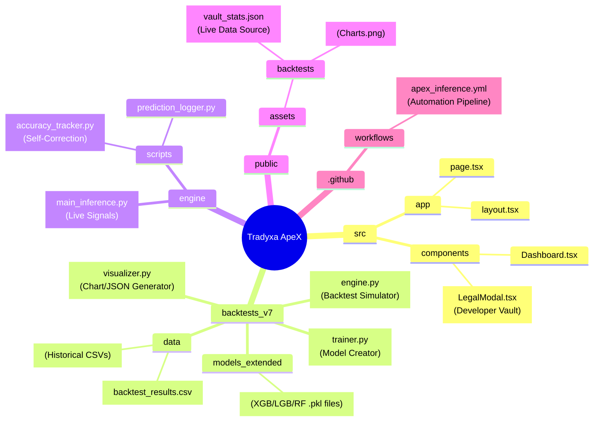
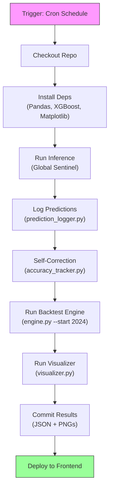
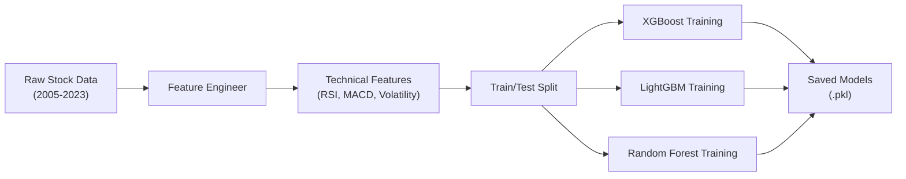
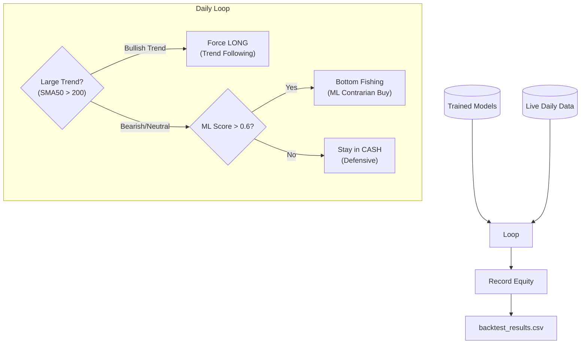
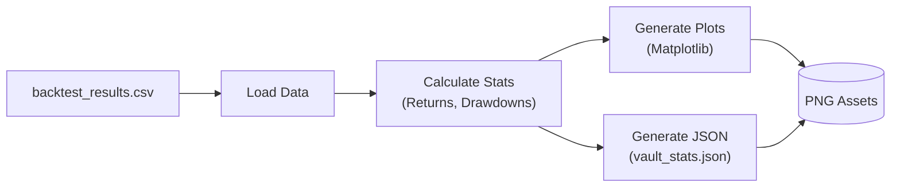
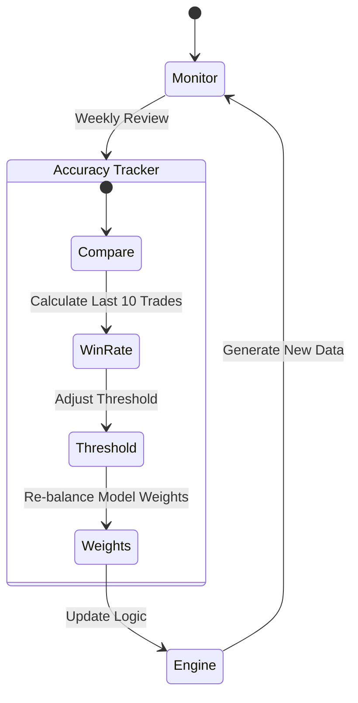

# ApeX V8.0 Master Architecture Documentation

## 1. Codebase Structure Mindmap

## 2. CI/CD Pipeline Architecture (GitHub Actions)
**Frequency**: Daily (Market Hours)
**File**: `.github/workflows/apex_inference.yml`

## 3. Algorithmic Logic Architecture

### A. The Trainer (Knowledge Base)
**File**: `backtests_v7/trainer.py`

### B. The Engine (Decision Maker)
**File**: `backtests_v7/engine.py`

### C. The Visualizer (Translator)
**File**: `backtests_v7/visualizer.py`

## 4. Self-Correction Architecture
**Concept**: The system adapts its weights based on recent performance.

