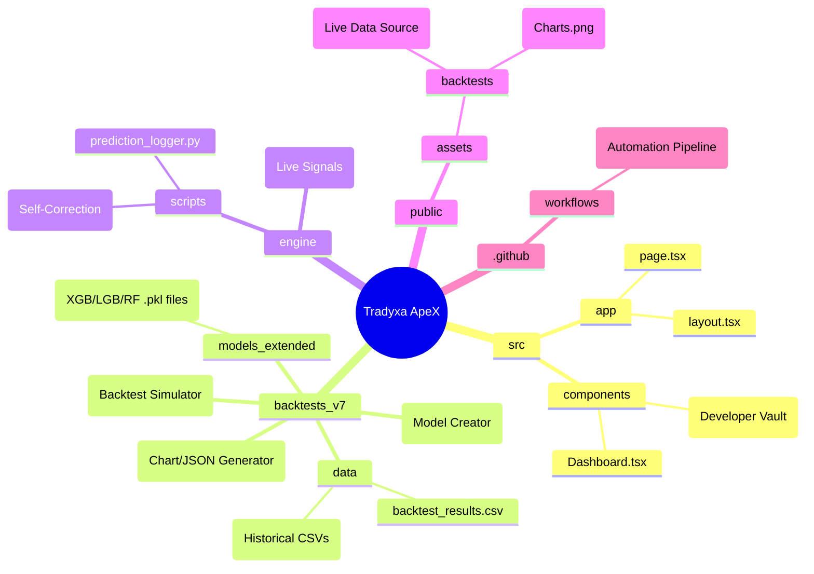
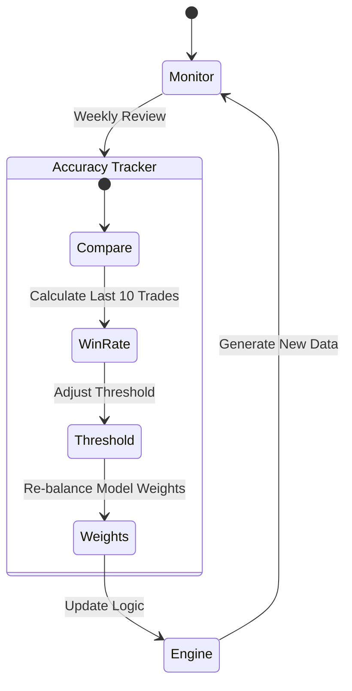

# ApeX V8.0 Master Architecture Documentation

## 1. Codebase Structure Mindmap



## 2. CI/CD Pipeline Architecture (GitHub Actions)
**Frequency**: Daily (Market Hours)
**File**: `.github/workflows/apex_inference.yml`

```mermaid
graph TD
    Start[Trigger: Cron Schedule] --> Checkout[Checkout Repo]
    Checkout --> Install[Install Deps\n(Pandas, XGBoost, Matplotlib)]
    Install --> Inf[Run Inference\n(Global Sentinel)]
    Inf --> Log[Log Predictions\n(prediction_logger.py)]
    Log --> Acc[Self-Correction\n(accuracy_tracker.py)]
    Acc --> BT[Run Backtest Engine\n(engine.py --start 2024)]
    BT --> Vis[Run Visualizer\n(visualizer.py)]
    Vis --> Commit[Commit Results\n(JSON + PNGs)]
    Commit --> Deploy[Deploy to Frontend]
    
    style Start fill:#f9f,stroke:#333
    style Deploy fill:#9f9,stroke:#333
```

## 3. Algorithmic Logic Architecture

### A. The Trainer (Knowledge Base)
**File**: `backtests_v7/trainer.py`
```mermaid
flowchart LR
    Raw[Raw Stock Data\n(2005-2023)] --> Eng[Feature Engineer]
    Eng --> Feats[Technical Features\n(RSI, MACD, Volatility)]
    Feats --> Split[Train/Test Split]
    Split --> XGB[XGBoost Training]
    Split --> LGB[LightGBM Training]
    Split --> RF[Random Forest Training]
    XGB & LGB & RF --> Models[Saved Models\n(.pkl)]
```

### B. The Engine (Decision Maker)
**File**: `backtests_v7/engine.py`
```mermaid
flowchart TD
    Models[(Trained Models)] --> Loop
    Live[(Live Daily Data)] --> Loop
    
    subgraph Daily Loop
        Step1{Is Uptrend?}
        Step1 -- Yes --> Trend[Force LONG\n(Trend Following)]
        Step1 -- No --> CheckML{ML Score > 0.6?}
        CheckML -- Yes --> Bottom[Bottom Fishing\n(Contrarian Buy)]
        CheckML -- No --> Cash[Stay in CASH\n(Defensive)]
    end
    
    Loop --> Rec[Record Equity]
    Rec --> CSV[backtest_results.csv]
```

### C. The Visualizer (Translator)
**File**: `backtests_v7/visualizer.py`
```mermaid
flowchart LR
    CSV[backtest_results.csv] --> Load[Load Data]
    Load --> Calc[Calculate Stats\n(Returns, Drawdowns)]
    Calc --> Plot[Generate Plots\n(Matplotlib)]
    Calc --> JSON[Generate JSON\n(vault_stats.json)]
    
    Plot --> Assets[(PNG Assets)]
    JSON --> Assets
```

## 4. Self-Correction Architecture
**Concept**: The system adapts its weights based on recent performance.


