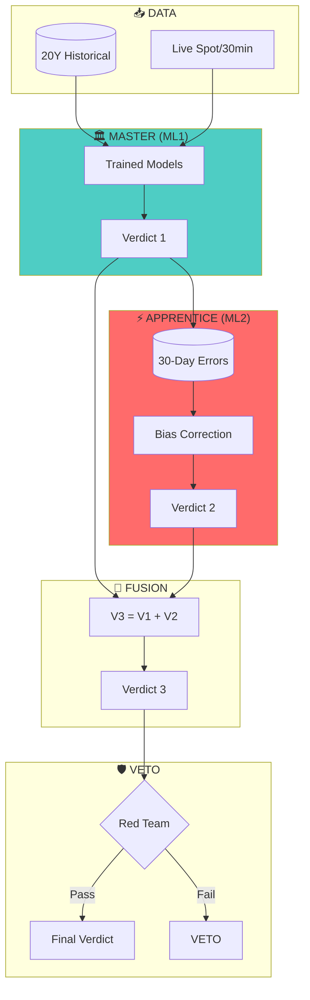
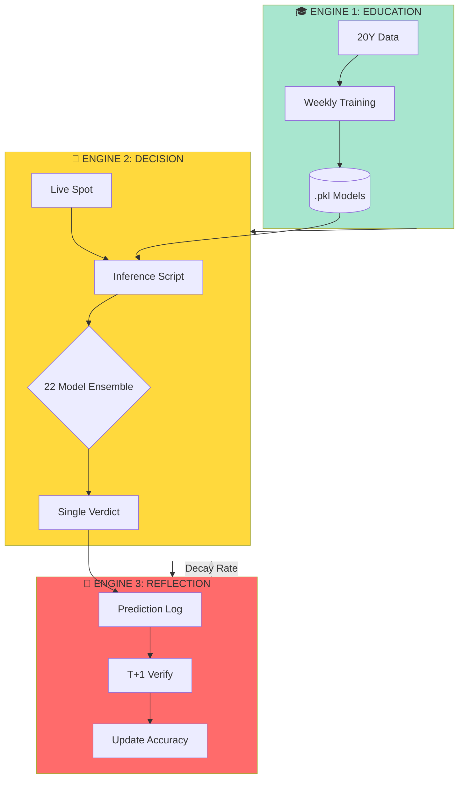
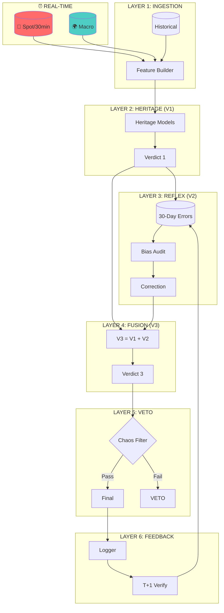
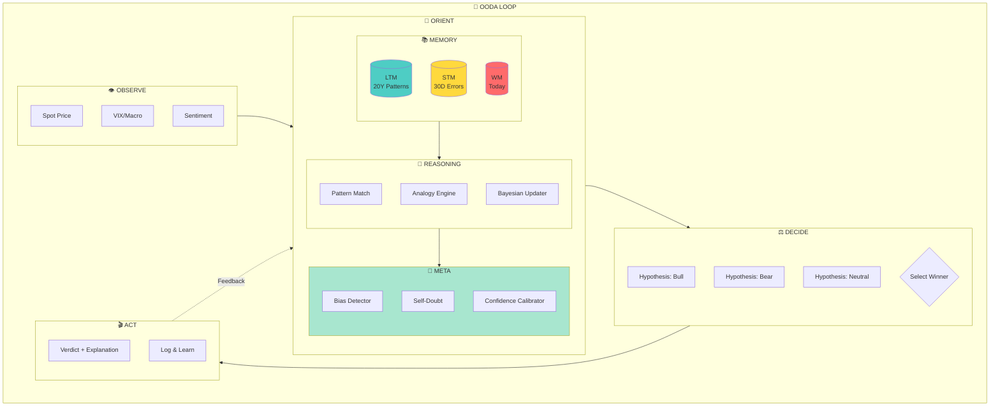
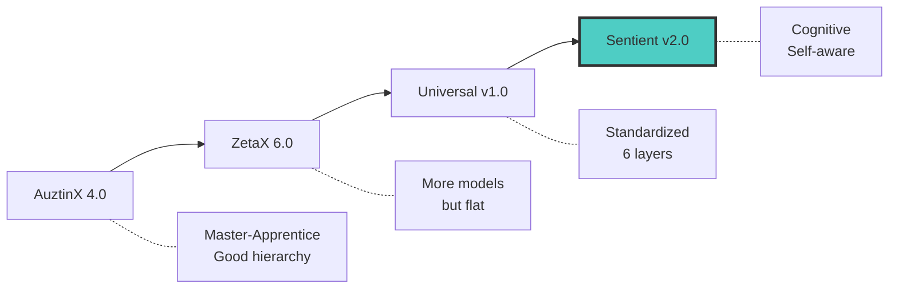
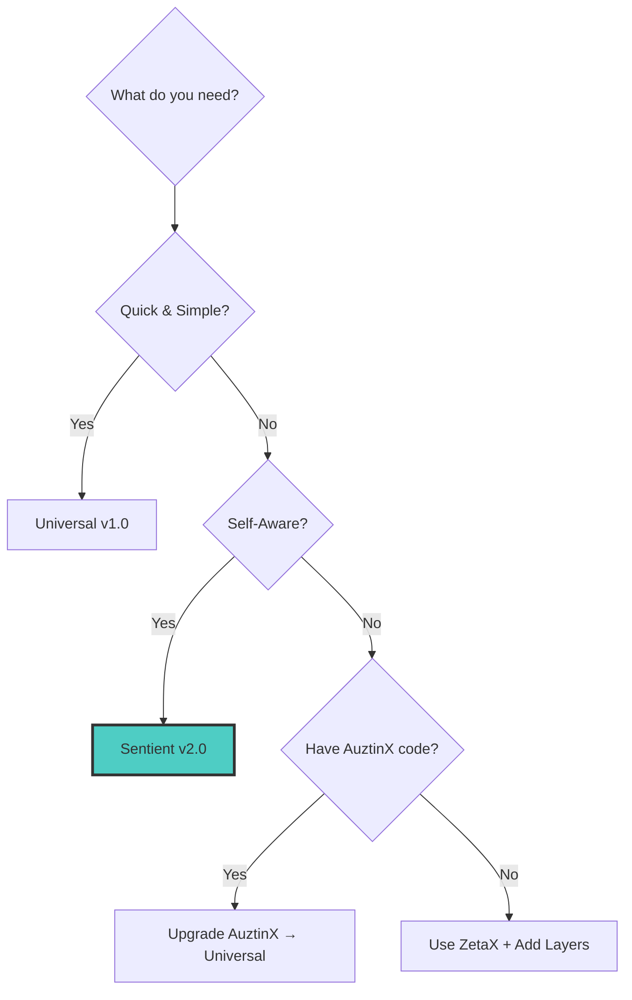

# 🔬 Ultimate Architecture Comparison
## AuztinX 4.0 vs ZetaX 6.0 vs Universal v1.0 vs Sentient v2.0

---

## 📊 QUICK COMPARISON TABLE

| Feature | AuztinX 4.0 | ZetaX 6.0 | Universal v1.0 | Sentient v2.0 |
|:--------|:------------|:----------|:---------------|:--------------|
| **Philosophy** | Master-Apprentice | 3-Engine Flat | 6-Layer Pipeline | 7-Layer Cognitive |
| **Self-Awareness** | ❌ None | ❌ None | ❌ None | ✅ Full Meta-Cognition |
| **Memory Systems** | 1 (brain_state) | 1 (brain_state) | 1 (error_log) | 3 (LTM, STM, WM) |
| **Reasoning Type** | Hierarchical | Ensemble | Fusion | Bayesian + Analogy |
| **Explanation** | ❌ None | ❌ None | ❌ None | ✅ Human-readable |
| **Bias Detection** | ❌ Manual | ❌ Manual | ❌ Manual | ✅ Automatic |
| **Institutional Grade** | ⭐⭐⭐ | ⭐⭐ | ⭐⭐⭐⭐ | ⭐⭐⭐⭐⭐ |

---

## 🏛️ ARCHITECTURE DIAGRAMS

### 1️⃣ AuztinX 4.0 (Master-Apprentice)

**Key Characteristics:**
- ✅ Hierarchical (ML1 → ML2)
- ✅ 30-day sliding window
- ❌ No self-awareness
- ❌ No explanation generation

---

### 2️⃣ ZetaX 6.0 (Three-Engine)

**Key Characteristics:**
- ❌ Flat ensemble (no hierarchy)
- ❌ Decaying learning rate (not window)
- ✅ More ML models (22+)
- ❌ No bias detection

---

### 3️⃣ Universal Core Logic Pipeline v1.0

**Key Characteristics:**
- ✅ Model-agnostic framework
- ✅ 6 clear layers
- ✅ Fixed 30-day window
- ❌ No self-awareness
- ❌ No explanation

---

### 4️⃣ Sentient Cognitive Pipeline v2.0

**Key Characteristics:**
- ✅ 3 memory systems
- ✅ Meta-cognition (self-awareness)
- ✅ Bayesian reasoning
- ✅ Analogy detection
- ✅ Human-readable explanations
- ✅ Automatic bias detection

---

## 🔄 EVOLUTION PATH

---

## 📐 LAYER-BY-LAYER COMPARISON

| Layer | AuztinX 4.0 | ZetaX 6.0 | Universal v1.0 | Sentient v2.0 |
|:------|:------------|:----------|:---------------|:--------------|
| **Data Input** | Spot + Historical | Spot + Historical | Spot + Macro + Historical | Spot + Macro + Sentiment |
| **Heritage Models** | ML1 (20Y) | 22 Models (flat) | Any .pkl models | LTM + Pattern Layer |
| **Error Awareness** | ML2 (30D window) | Decaying rate | 30D fixed window | STM + Meta Layer |
| **Fusion Logic** | V3 = V1 + V2 | Ensemble vote | V3 = V1 + V2 | Bayesian posterior |
| **Veto Logic** | Red Team Z-Score | Partial | 4 conditions | + Self-doubt output |
| **Self-Awareness** | ❌ | ❌ | ❌ | ✅ Meta-Cognition |
| **Explanation** | ❌ | ❌ | ❌ | ✅ JARVIS-style |
| **Bias Detection** | ❌ | ❌ | ❌ | ✅ Automatic |

---

## 🎯 WHICH TO IMPLEMENT?

### Recommendation:

| If You Want... | Implement... |
|:---------------|:-------------|
| Quick standardization | **Universal v1.0** |
| Maximum intelligence | **Sentient v2.0** |
| Use existing DeltaX | Upgrade to **Universal v1.0** |
| Use existing ZetaX | Add missing layers from **Universal v1.0** |
| JARVIS-like reasoning | **Sentient v2.0** |

---

## 📋 IMPLEMENTATION CHECKLIST

### To Upgrade Any Project to Sentient v2.0:

- [ ] **Memory Systems**
  - [ ] Implement LTM (20-year pattern storage)
  - [ ] Implement STM (30-day error window)
  - [ ] Implement WM (today's context)

- [ ] **Reasoning Layers**
  - [ ] Add Pattern Recognition
  - [ ] Add Analogy Engine
  - [ ] Add Bayesian Hypothesis Tester

- [ ] **Meta-Cognition**
  - [ ] Implement Bias Detector
  - [ ] Implement Self-Doubt Engine
  - [ ] Implement Confidence Calibrator

- [ ] **Output Enhancement**
  - [ ] Add explanation generator
  - [ ] Add warning system
  - [ ] Add confidence adjustment

---

## 🏆 FINAL VERDICT

| Pipeline | Complexity | Intelligence | Recommended For |
|:---------|:-----------|:-------------|:----------------|
| AuztinX 4.0 | ⭐⭐ | ⭐⭐⭐ | Legacy upgrade |
| ZetaX 6.0 | ⭐⭐⭐ | ⭐⭐ | Model variety |
| Universal v1.0 | ⭐⭐ | ⭐⭐⭐⭐ | Quick standardization |
| **Sentient v2.0** | ⭐⭐⭐⭐⭐ | ⭐⭐⭐⭐⭐ | **Ultimate goal** |

---

*Comparison Document - Tradyxa Architecture Evolution*
