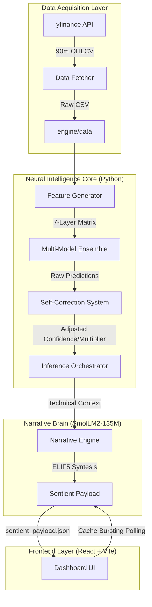
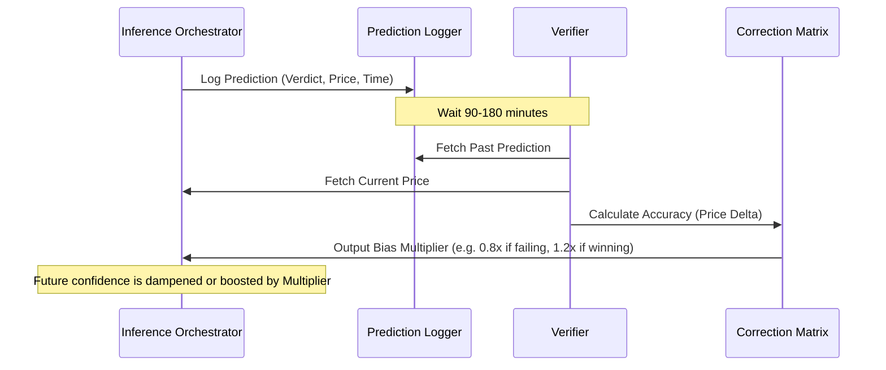

# CryptiX-ZetaX | Neural Architecture & Pipeline

This document outlines the 7-Layer Sentient Pipeline, the self-correction feedback loop, and the data orchestration logic powering the CryptiX-ZetaX dashboard.

## 1. High-Level System Architecture

The system follows a **Backend-Intelligence, Frontend-Display** model. All heavy lifting, ML inference, and LLM narrative generation occur locally on the Python backend to ensure zero-latency and data privacy.

## 2. The 7-Layer Intelligence Pipeline

ZetaX uses a layered approach to feature engineering and inference:

1.  **Microstructure Layer**: Calculates Volume Profile POC (Point of Control) and rolling Support/Resistance.
2.  **Fractal Layer**: Aligns trends across 4.5h, 9h, and 24h timeframes using resampled 90m data.
3.  **Regime Layer**: Classifies the market as Neural Bull, Neural Bear, or Chaotic.
4.  **Smart Money Layer**: Detects order absorption and significant volume deltas.
5.  **Momentum Layer**: Real-time RSI and MACD convergence/divergence.
6.  **Reversal Layer**: Scans for exhaustion points near Support/Resistance.
7.  **Ensemble Layer**: Combines all above layers into a finalized Meta-Verdict (Buy/Sell/Wait).

## 3. Self-Correction Feedback Loop

The "Sentient" part of the engine comes from its ability to learn from its own mistakes without retraining the core weights.

## 4. Price Fetching & ML Feeding

1.  **Fetching**: `DataFetcher` requests the last 5 days of 90m interval data from `yfinance`.
2.  **Normalization**: Data is saved to `engine/data` and cleaned for NaN values.
3.  **Feature Mapping**: The `FeatureGenerator` creates a technical matrix:
    - `poc_proxy`: Volume-weighted average price.
    - `fractal_alignment`: Trend sync across timeframes.
    - `support/resistance`: Rolling 3-day high/low extremes.
4.  **Inference**: The `joblib`-loaded XGBoost/Random Forest ensemble processes the latest row of the matrix to generate a probability score.
5.  **Payload**: The final verdict, support/resistance levels, and SmolLM2 narratives are packaged into `public/sentient_payload.json`.

## 5. Summary of Key Files

| Component | Responsibility |
| :--- | :--- |
| `main_inference.py` | Orchestrates the entire pipeline run. |
| `feature_generator.py` | The technical "eye" calculating SR and indicators. |
| `narrative_engine.py` | Local SmolLM2 brain translating data to ELIF5 advice. |
| `self_correction.py` | The learning module that adjusts confidence multipliers. |
| `Index.tsx` | The React hub mirroring the backend's sentient state. |

---
*Generated by ZetaX Neural Documentation System*
