# Sentient Evolution: Explain Like I'm 5

This document explains everything we built in Tradyxa ApeX in the simplest possible terms.

---

## 🎯 The Big Picture

Imagine you want to know if a cookie jar will have more cookies tomorrow.

| Version | What the System Does | Analogy |
| :--- | :--- | :--- |
| **v2.0** | Looks at the cookie jar and guesses. | "There were cookies yesterday, so maybe today too." |
| **v2.1** | Checks if the kitchen looks normal AND explains its thinking. | "I think yes, BECAUSE the jar was full yesterday." |
| **v3.0** | A robot that practiced 50,000 times learns the BEST way to get cookies. | "Open the jar slowly at 3 PM for the most cookies." |
| **v4.0** | The robot also checks if the kitchen is on fire before trying. | "Kitchen is on fire! DON'T try to get cookies!" |

---

## 🔄 How Data Flows (The Cookie Pipeline)

```mermaid
graph TD
    A["📡 Step 1: Get Fresh Data\n(yfinance + NSE Scraper)"] --> B["🔢 Step 2: Calculate 13 Pillars\n(RSI, SMA, VIX, etc.)"]
    B --> C["🧠 Step 3: ML Prediction\n(XGBoost + LightGBM + RF)"]
    C --> D["🛡️ Step 4: v2.1 Defense\n(Is this data weird?)"]
    D --> E["🎯 Step 5: v3.0 Strategy\n(What's the best action?)"]
    E --> F["⚠️ Step 6: v4.0 Risk Check\n(Is the market on fire?)"]
    F --> G["📄 Step 7: Write JSON\n(apex_nifty.json)"]
    G --> H["🖥️ Step 8: Dashboard Reads JSON\n(You see the tiles!)"]
```

---

## 🍪 The Training Process (How the Robot Learns)

```mermaid
graph LR
    subgraph "ONE TIME TRAINING (Weekly)"
        T1["📚 20 Years of Data\n(Data Vault)"] --> T2["✏️ Calculate Features\n(RSI, SMA, etc.)"]
        T2 --> T3["🎓 Teach XGBoost\n(Pattern Recognition)"]
        T2 --> T4["🎮 PPO Robot Plays\n(50,000 Simulations)"]
        T2 --> T5["🦢 Teach Chaos Filter\n(What is 'Normal'?)"]
    end
    T3 --> M1["Model Saved\n(xgb.pkl)"]
    T4 --> M2["Robot Saved\n(rl_ppo.zip)"]
    T5 --> M3["Chaos Model\n(iforest.pkl)"]
```

**The models are trained ONCE.** Then, every 30 minutes, they just USE what they learned.

---

## 🏠 Is the Spot Price Mixed with the Pipeline?

**YES!**

```mermaid
sequenceDiagram
    participant GA as GitHub Actions
    participant YF as yfinance
    participant ML as ML Models
    participant JSON as apex_nifty.json
    participant UI as Your Dashboard

    loop Every 30 Minutes
        GA->>YF: "What's the live NIFTY price?"
        YF-->>GA: "₹24,150.50"
        GA->>ML: "Here's the price, what do you think?"
        ML-->>GA: "65% Bullish, SCALE IN, LOW RISK"
        GA->>JSON: Write verdict + strategy + risk
        UI->>JSON: "What's the latest data?"
        JSON-->>UI: Sends all the data
        UI->>UI: Shows tiles, verdict, strategy!
    end
```

**The 30-minute spot price is the FIRST thing fetched.** Everything else (prediction, strategy, risk) is calculated FROM that price.

---

## 🧱 How Each Tile Works

### 1. The BIG Verdict Tile
- **What it shows:** BULLISH, BEARISH, or NEUTRAL.
- **Where it comes from:** The ML models (XGBoost, LightGBM, Random Forest) vote. 2 out of 3 wins.
- **The confidence %:** How sure the models are (50% = coin flip, 90% = very sure).

### 2. The Narrative Tile
- **What it shows:** "Verdict is Bullish because of RSI support..."
- **Where it comes from:** ELI5 looks INSIDE the XGBoost model and finds which features pushed the decision.

### 3. The 13 Pillar Tiles
- **What they show:** Technical indicators like RSI, Moving Averages, VIX.
- **Where they come from:** Calculated fresh every 30 minutes from the live price.

### 4. The Strategy Tile (v3.0)
- **What it shows:** "SCALE IN (LONG)" or "HOLD"
- **Where it comes from:** The PPO robot played 50,000 games against the market. It learned the BEST action for this specific situation.

### 5. The Risk Regime Tile (v4.0)
- **What it shows:** "QUIET (Low Stress)" or "STRESSED (High Danger)"
- **Where it comes from:** GARCH volatility model calculates if the market is behaving normally or going crazy.

---

## 🎭 Version Comparison (The 4 Generations)

---

## 📦 What We Built (Summary)

| File | Purpose |
| :--- | :--- |
| `engineer.py` | Calculates features from price (RSI, SMA, etc.) |
| `engineer_polars.py` | Same, but 10x faster using Rust-based Polars |
| `train_models.py` | Teaches XGBoost/LightGBM/RF to recognize patterns |
| `train_rl.py` | Teaches the PPO robot to play the market game |
| `chaos_filter.py` | Learns what "normal" looks like, flags weirdness |
| `volatility_guard.py` | GARCH model to detect market stress |
| `cyclical_oracle.py` | Darts model to detect seasonal waves |
| `main_inference.py` | The boss: runs all of the above every 30 mins |
| `StrategyTile.tsx` | UI tile for v3.0 robot's action |
| `RiskRegimeTile.tsx` | UI tile for v4.0 stress check |

---

## ✅ The Final Picture

Every 30 minutes, your dashboard shows you:
1. **What happened** (Spot Price)
2. **What the AI thinks** (Verdict)
3. **Why it thinks that** (Narrative)
4. **What you should do** (Strategy - v3.0)
5. **How dangerous the market is** (Risk - v4.0)

**That's the Sentient Evolution: from a simple guesser to a self-correcting, strategy-generating, risk-aware AI laboratory.**
