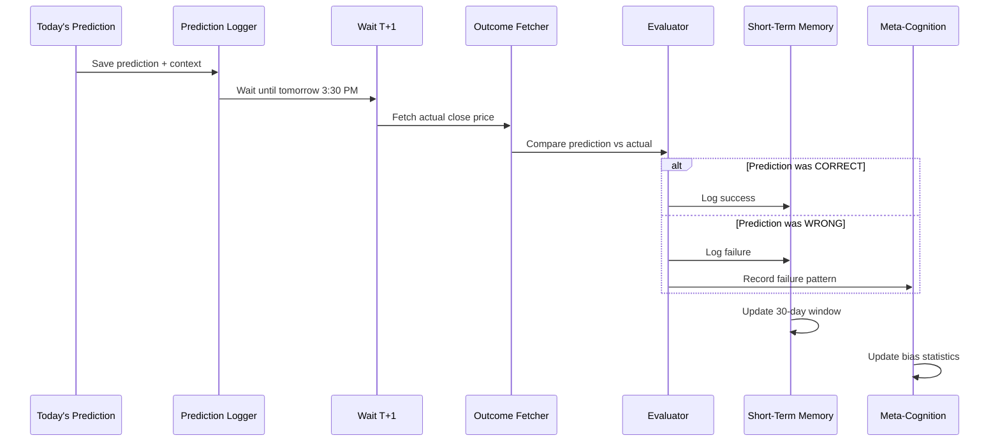

# 🚀 Sentient v2.0 Implementation Plan
## Upgrading DeltaX & ZetaX to Cognitive Intelligence

---

## ✅ CAN IT BE DONE?

| Project | Feasibility | Effort | Ready Components |
|:--------|:------------|:-------|:-----------------|
| **DeltaX (AuztinX 4.0)** | ✅ YES | Medium | ML1/ML2 hierarchy, 30-day window, Red Team |
| **ZetaX 6.0** | ✅ YES | Higher | 22 ML models, comprehensive inference |

---

## 🧬 COMPLETE SENTIENT v2.0 ARCHITECTURE

### The Full System Diagram:

```mermaid
flowchart TB
    subgraph INPUTS["👁️ SENSORY INPUTS (Every 30 Min)"]
        direction LR
        SPOT[("🔴 SPOT PRICE<br/>Live Feed")]
        VIX[("📊 VIX<br/>Fear Gauge")]
        MACRO[("🌍 MACRO<br/>DXY/Bonds")]
        SENT[("📰 SENTIMENT<br/>News NLP")]
    end

    subgraph MEMORY["📚 THREE MEMORY SYSTEMS"]
        direction TB
        LTM[("🏛️ LONG-TERM MEMORY<br/>━━━━━━━━━━━━━━━━<br/>• 20-Year Patterns<br/>• Trained .pkl Models<br/>• Historical Signatures<br/>• Updates: Weekly")]
        STM[("⚡ SHORT-TERM MEMORY<br/>━━━━━━━━━━━━━━━━<br/>• 30-Day Error Window<br/>• Recent Predictions<br/>• Bias Statistics<br/>• Updates: Daily")]
        WM[("💭 WORKING MEMORY<br/>━━━━━━━━━━━━━━━━<br/>• Today's Context<br/>• Current Hypotheses<br/>• Live Observations<br/>• Updates: Every 30min")]
    end

    subgraph REASONING["🧠 COGNITIVE REASONING ENGINE"]
        direction TB
        
        subgraph PATTERN["🔍 PATTERN LAYER"]
            PAT1[Pattern Matcher]
            PAT2[Analogy Finder]
            PAT3[Similarity Scorer]
        end
        
        subgraph BAYES["📊 BAYESIAN LAYER"]
            HYP1["Hypothesis: BULLISH"]
            HYP2["Hypothesis: BEARISH"]
            HYP3["Hypothesis: NEUTRAL"]
            UPDATE[Bayesian Updater]
        end
        
        subgraph META["🔮 META-COGNITION LAYER"]
            BIAS[Bias Detector]
            DOUBT[Self-Doubt Engine]
            FAIL[Failure Pattern Matcher]
            CONF[Confidence Calibrator]
        end
    end

    subgraph SYNTHESIS["⚖️ DECISION SYNTHESIS"]
        FUSE[Fusion Engine]
        EXPLAIN[Explanation Generator]
        VERDICT[("🎯 FINAL VERDICT<br/>+ Confidence<br/>+ Reasoning<br/>+ Warnings")]
    end

    subgraph VETO["🛡️ VETO GATE"]
        CHAOS{Chaos<br/>Filter}
        PASS[✅ PASS]
        BLOCK[❌ HARD VETO]
    end

    subgraph FEEDBACK["🔄 FEEDBACK LOOP (T+1)"]
        LOG[Prediction Logger]
        VERIFY[Outcome Fetcher]
        LEARN[Learning Engine]
    end

    %% Data Flow
    INPUTS --> WM
    LTM --> PATTERN
    STM --> META
    WM --> BAYES
    
    PATTERN --> FUSE
    BAYES --> FUSE
    META --> FUSE
    
    FUSE --> EXPLAIN
    EXPLAIN --> VERDICT
    VERDICT --> CHAOS
    
    CHAOS -->|Pass| PASS
    CHAOS -->|Fail| BLOCK
    
    PASS --> LOG
    LOG --> VERIFY
    VERIFY --> LEARN
    LEARN --> STM
    LEARN -.->|Failure| META

    %% Styling
    style LTM fill:#4ecdc4,color:#000
    style STM fill:#ffd93d,color:#000
    style WM fill:#ff6b6b,color:#fff
    style META fill:#a8e6cf,color:#000
    style VERDICT fill:#6c5ce7,color:#fff
```



---

## 📖 COMPONENT EXPLANATIONS

### 🏛️ MEMORY SYSTEMS

#### 1. Long-Term Memory (LTM) - The Institutional DNA
```
┌─────────────────────────────────────────────────────────┐
│  LONG-TERM MEMORY (LTM)                                 │
├─────────────────────────────────────────────────────────┤
│  Purpose:    Store permanent market patterns            │
│  Timeframe:  20 years of historical data                │
│  Updates:    Weekly (during model training)             │
│  Contents:   - Trained .pkl model weights               │
│              - Historical pattern signatures            │
│              - Market regime fingerprints               │
│              - Crash/Rally profile templates            │
├─────────────────────────────────────────────────────────┤
│  Analogy:    Human's education and life experiences     │
│              "I studied this for 20 years"              │
└─────────────────────────────────────────────────────────┘
```

#### 2. Short-Term Memory (STM) - The Error Diary
```
┌─────────────────────────────────────────────────────────┐
│  SHORT-TERM MEMORY (STM)                                │
├─────────────────────────────────────────────────────────┤
│  Purpose:    Track recent prediction errors             │
│  Timeframe:  30-day sliding window                      │
│  Updates:    Daily (after T+1 verification)             │
│  Contents:   - Recent predictions & outcomes            │
│              - Bias statistics (over-bullish/bearish)   │
│              - Rolling accuracy metrics                 │
│              - Failure pattern signatures               │
├─────────────────────────────────────────────────────────┤
│  Analogy:    Human's recent memory of mistakes          │
│              "I was wrong 3 times last week about X"    │
└─────────────────────────────────────────────────────────┘
```

#### 3. Working Memory (WM) - Today's Scratchpad
```
┌─────────────────────────────────────────────────────────┐
│  WORKING MEMORY (WM)                                    │
├─────────────────────────────────────────────────────────┤
│  Purpose:    Hold current session context               │
│  Timeframe:  Today only (resets each day)               │
│  Updates:    Every 30 minutes (each poll)               │
│  Contents:   - Current spot price                       │
│              - Live VIX, DXY, macro data                │
│              - Running hypothesis probabilities         │
│              - Accumulated evidence for today           │
├─────────────────────────────────────────────────────────┤
│  Analogy:    Human's active thinking space              │
│              "What am I looking at right now?"          │
└─────────────────────────────────────────────────────────┘
```

---

### 🧠 COGNITIVE REASONING LAYERS

#### Layer A: Pattern Recognition

```mermaid
flowchart LR
    subgraph PATTERN["🔍 PATTERN RECOGNITION"]
        IN[Current State] --> QUERY[Query LTM]
        QUERY --> MATCH[Find Similar Patterns]
        MATCH --> SCORE[Score Similarity]
        SCORE --> TOP[Return Top 3 Matches]
    end
```


**What It Does:**
- Takes current market state (RSI, VIX, momentum, etc.)
- Searches 20-year LTM for similar historical patterns
- Returns top 3 matches with outcomes
- Example: "This looks 78% similar to Nov 2016 setup"

---

#### Layer B: Bayesian Hypothesis Testing
```mermaid
flowchart TD
    subgraph BAYES["📊 BAYESIAN REASONING"]
        PRIOR[Prior Beliefs<br/>Bull=33%, Bear=33%, Neutral=34%]
        PRIOR --> EVIDENCE["New Evidence Arrives<br/>(RSI, VIX, Momentum)"]
        EVIDENCE --> LIKELIHOOD[Calculate Likelihoods<br/>P(Evidence | Hypothesis)]
        LIKELIHOOD --> UPDATE[Bayesian Update<br/>P(H|E) = P(E|H) × P(H) / P(E)]
        UPDATE --> POSTERIOR[Updated Beliefs<br/>Bull=52%, Bear=28%, Neutral=20%]
    end
```

**What It Does:**
- Maintains 3 competing hypotheses (Bull, Bear, Neutral)
- Each new evidence updates probabilities
- Gradually converges to most likely direction
- Never fully commits (always probabilistic)

**Example Flow:**
```
Start:     Bull=33%  Bear=33%  Neutral=34%
+ RSI<30:  Bull=45%  Bear=25%  Neutral=30%  (oversold = bullish)
+ VIX>25:  Bull=38%  Bear=35%  Neutral=27%  (fear = bearish bump)
+ Mom>60:  Bull=52%  Bear=28%  Neutral=20%  (momentum = bullish)
```

---

#### Layer C: Meta-Cognition (Self-Awareness)

```mermaid
flowchart TD
    subgraph META["🔮 META-COGNITION"]
        PRED[Current Prediction] --> CHECK1{Am I Biased?}
        CHECK1 -->|Yes| WARN1["⚠️ Over-bullish warning"]
        CHECK1 -->|No| CHECK2{Matches Failure Pattern?}
        CHECK2 -->|Yes| WARN2["⚠️ Similar to past mistake"]
        CHECK2 -->|No| CHECK3{Overconfident?}
        CHECK3 -->|Yes| WARN3["⚠️ High confidence, low accuracy"]
        CHECK3 -->|No| CHECK4{Chaotic Regime?}
        CHECK4 -->|Yes| WARN4["⚠️ Regime unreliable"]
        
        WARN1 & WARN2 & WARN3 & WARN4 --> ADJUST[Adjust Confidence Down]
        ADJUST --> OUTPUT[Warnings + Adjusted Confidence]
    end
```


**What It Does:**
1. **Bias Detection**: "Have I been calling BULLISH too often?"
2. **Failure Pattern Match**: "Is this similar to when I was wrong before?"
3. **Overconfidence Check**: "Am I 85% confident but only 50% accurate lately?"
4. **Regime Check**: "Is the market too chaotic to predict?"

**Output Example:**
```
Warnings:
⚠️ I've been over-bullish 7 of last 10 predictions
⚠️ Similar to failure pattern from Dec 15
⚠️ High confidence (85%) but recent accuracy is only 52%

Confidence Adjustment: -35%
Raw Confidence: 85% → Adjusted: 50%
```

---

### ⚖️ DECISION SYNTHESIS FLOW

```mermaid
flowchart LR
    subgraph SYNTHESIS["⚖️ DECISION SYNTHESIS"]
        direction TB
        
        PAT_IN[Pattern Vote<br/>30% weight] --> COMBINE
        BAY_IN[Bayesian Vote<br/>50% weight] --> COMBINE
        META_IN[Meta Adjustment<br/>Subtractive] --> COMBINE
        
        COMBINE[Weighted Fusion] --> VERDICT[Final Verdict]
        VERDICT --> EXPLAIN[Generate Explanation]
    end
```



**The Fusion Formula:**
```python
# Step 1: Weight the inputs
pattern_contribution = pattern_vote × 0.30
bayesian_contribution = bayesian_posterior × 0.50
heritage_contribution = heritage_verdict × 0.20

# Step 2: Combine
raw_confidence = sum of weighted contributions

# Step 3: Apply meta-cognition penalty
final_confidence = raw_confidence + meta_adjustment  # (negative if warnings)

# Step 4: Generate verdict
if final_confidence > 0.65: verdict = "BULLISH"
elif final_confidence > 0.55: verdict = "LEAN BULLISH"
elif final_confidence < 0.35: verdict = "BEARISH"
elif final_confidence < 0.45: verdict = "LEAN BEARISH"
else: verdict = "NEUTRAL"
```

---

### 🔄 FEEDBACK LOOP (Learning)



---

## 🎯 THE COMPLETE OODA CYCLE

```mermaid
graph TD
    subgraph OBSERVE["👁️ OBSERVE"]
        O1[Fetch Spot Price]
        O2[Fetch VIX]
        O3[Fetch Macro Data]
        O4[Fetch Sentiment]
    end

    subgraph ORIENT["🧭 ORIENT"]
        OR1[Load from LTM]
        OR2[Load from STM]
        OR3[Update WM]
        OR4[Pattern Match]
        OR5[Bayesian Update]
        OR6[Meta Audit]
    end

    subgraph DECIDE["⚖️ DECIDE"]
        D1[Fuse All Signals]
        D2[Generate Explanation]
        D3[Apply Veto Check]
    end

    subgraph ACT["🎬 ACT"]
        A1[Output Verdict]
        A2[Log Prediction]
        A3[Display to User]
    end

    OBSERVE --> ORIENT
    ORIENT --> DECIDE
    DECIDE --> ACT
    ACT -.->|T+1 Feedback| ORIENT

    style OBSERVE fill:#ff6b6b
    style ORIENT fill:#ffd93d
    style DECIDE fill:#4ecdc4
    style ACT fill:#a8e6cf
```



**Timing:**
| Phase | When | Duration |
|:------|:-----|:---------|
| OBSERVE | Every 30 min | ~2 seconds |
| ORIENT | Every 30 min | ~1 second |
| DECIDE | Every 30 min | ~0.5 seconds |
| ACT | Every 30 min | ~0.5 seconds |
| FEEDBACK | T+1 (next day) | ~3 seconds |

---

## 📊 DATA FLOW SUMMARY

```mermaid
flowchart TB
    subgraph EXTERNAL["🌐 EXTERNAL WORLD"]
        MKT[Market Data]
        NEWS[News/Sentiment]
    end

    subgraph SENTIENT["🧠 SENTIENT PIPELINE"]
        subgraph SENSE["SENSING"]
            SPOT[Spot Price]
            VIX[VIX]
            MACRO[DXY/Bonds]
        end

        subgraph THINK["THINKING"]
            MEM[3 Memory Systems]
            REASON[3 Reasoning Layers]
        end

        subgraph JUDGE["JUDGING"]
            FUSE[Fusion + Meta]
            VETO[Veto Gate]
        end
    end

    subgraph OUTPUT["📤 OUTPUT"]
        VERDICT[Verdict]
        EXPLAIN[Explanation]
        WARNINGS[Warnings]
    end

    subgraph LEARN["📚 LEARNING"]
        LOG[Logger]
        VERIFY[Verifier]
        UPDATE[Memory Updater]
    end

    MKT --> SENSE
    NEWS --> SENSE
    SENSE --> THINK
    THINK --> JUDGE
    JUDGE --> OUTPUT
    OUTPUT --> LOG
    LOG --> VERIFY
    VERIFY --> UPDATE
    UPDATE --> MEM
```



---

## 🏗️ WHAT EACH PROJECT ALREADY HAS

```mermaid
flowchart LR
    subgraph DELTAX["DeltaX (AuztinX 4.0)"]
        D1[✅ ML1 Heritage]
        D2[✅ ML2 Reflex]
        D3[✅ 30-Day Window]
        D4[✅ Red Team Veto]
        D5[❌ Meta-Cognition]
        D6[❌ 3 Memory Systems]
        D7[❌ Bayesian]
        D8[❌ Explanation]
    end

    subgraph ZETAX["ZetaX 6.0"]
        Z1[✅ 22 ML Models]
        Z2[✅ Comprehensive Inference]
        Z3[❌ Hierarchy]
        Z4[❌ 30-Day Window]
        Z5[❌ Meta-Cognition]
        Z6[❌ 3 Memory Systems]
        Z7[❌ Bayesian]
        Z8[❌ Explanation]
    end
```



---

## 📁 NEW FILES TO CREATE (Both Projects)

```
engine/
├── cognitive/                    # NEW FOLDER
│   ├── __init__.py
│   ├── memory_systems.py         # LTM, STM, WM
│   ├── pattern_recognizer.py     # Pattern matching
│   ├── analogy_engine.py         # Detective reasoning
│   ├── bayesian_hypothesis.py    # Probabilistic reasoning
│   ├── meta_cognition.py         # Self-awareness
│   ├── decision_synthesis.py     # Final verdict + explanation
│   └── sentient_pipeline.py      # Main orchestrator
```

---

## 🧠 IMPLEMENTATION: Core Files

### 1. `memory_systems.py`

```python
"""
Three Memory Systems for Sentient Intelligence
"""
import json
from pathlib import Path
from datetime import datetime, timedelta
from collections import deque

class LongTermMemory:
    """20-year pattern storage - trained weekly, rarely changes."""
    
    def __init__(self, models_dir: Path):
        self.models_dir = models_dir
        self.patterns = self._load_patterns()
    
    def _load_patterns(self) -> list:
        """Load historical pattern signatures."""
        pattern_file = self.models_dir / "ltm_patterns.json"
        if pattern_file.exists():
            return json.loads(pattern_file.read_text())
        return []
    
    def find_similar(self, current_state: dict, top_k: int = 5) -> list:
        """Find top-k similar historical patterns."""
        scored = []
        for pattern in self.patterns:
            similarity = self._calculate_similarity(current_state, pattern)
            scored.append((similarity, pattern))
        scored.sort(reverse=True, key=lambda x: x[0])
        return [p for _, p in scored[:top_k]]
    
    def _calculate_similarity(self, state: dict, pattern: dict) -> float:
        """Cosine similarity between feature vectors."""
        # Simplified - implement proper similarity
        return 0.0


class ShortTermMemory:
    """30-day error window - updates daily."""
    
    def __init__(self, learning_dir: Path, window_size: int = 30):
        self.file_path = learning_dir / "stm_errors.json"
        self.window_size = window_size
        self.errors = deque(maxlen=window_size)
        self._load()
    
    def _load(self):
        if self.file_path.exists():
            data = json.loads(self.file_path.read_text())
            self.errors = deque(data[-self.window_size:], maxlen=self.window_size)
    
    def save(self):
        self.file_path.write_text(json.dumps(list(self.errors), indent=2))
    
    def add_error(self, error: dict):
        self.errors.append(error)
        self.save()
    
    def get_recent(self, days: int = 30) -> list:
        return list(self.errors)[-days:]
    
    def get_bias_stats(self) -> dict:
        """Calculate recent bias statistics."""
        if not self.errors:
            return {"bullish_bias": 0, "bearish_bias": 0, "accuracy": 0.5}
        
        bullish_wrong = sum(1 for e in self.errors 
                           if e.get('predicted') == 'BULLISH' and not e.get('correct'))
        bearish_wrong = sum(1 for e in self.errors 
                           if e.get('predicted') == 'BEARISH' and not e.get('correct'))
        correct = sum(1 for e in self.errors if e.get('correct'))
        
        return {
            "bullish_bias": bullish_wrong / max(len(self.errors), 1),
            "bearish_bias": bearish_wrong / max(len(self.errors), 1),
            "accuracy": correct / max(len(self.errors), 1)
        }


class WorkingMemory:
    """Today's context - resets each session."""
    
    def __init__(self):
        self.context = {}
        self.observations = []
        self.hypotheses = {"BULLISH": 0.33, "BEARISH": 0.33, "NEUTRAL": 0.34}
    
    def update(self, observation: dict):
        self.observations.append(observation)
        self.context.update(observation)
    
    def get_current_state(self) -> dict:
        return self.context.copy()
    
    def reset(self):
        self.context = {}
        self.observations = []
        self.hypotheses = {"BULLISH": 0.33, "BEARISH": 0.33, "NEUTRAL": 0.34}
```

---

### 2. `meta_cognition.py`

```python
"""
Meta-Cognition Layer - Self-Awareness and Bias Detection
"""
from typing import List, Dict

class MetaCognition:
    """
    The 'Self-Doubt' engine that knows its own limitations.
    """
    
    def __init__(self, stm: 'ShortTermMemory'):
        self.stm = stm
        self.failure_patterns = []
        self.known_biases = []
    
    def audit_myself(self, prediction: dict, context: dict) -> dict:
        """
        Perform self-audit on current prediction.
        Returns warnings and confidence adjustments.
        """
        warnings = []
        confidence_adjustment = 0.0
        
        # 1. Check for bias
        bias_check = self._check_bias(prediction['direction'])
        if bias_check['is_biased']:
            warnings.append(f"⚠️ {bias_check['message']}")
            confidence_adjustment -= 0.15
        
        # 2. Check for failure pattern match
        if self._matches_failure_pattern(context):
            warnings.append("⚠️ Similar to past failure pattern")
            confidence_adjustment -= 0.20
        
        # 3. Check for overconfidence
        if prediction['raw_confidence'] > 0.80:
            recent_accuracy = self.stm.get_bias_stats()['accuracy']
            if recent_accuracy < 0.55:
                warnings.append(f"⚠️ High confidence but recent accuracy is {recent_accuracy:.0%}")
                confidence_adjustment -= 0.15
        
        # 4. Check for regime mismatch
        if context.get('regime') == 'CHAOTIC':
            warnings.append("⚠️ Chaotic regime - predictions less reliable")
            confidence_adjustment -= 0.10
        
        # 5. Check VIX environment
        if context.get('vix', 0) > 20:
            warnings.append("⚠️ High VIX environment")
            confidence_adjustment -= 0.05
        
        return {
            "warnings": warnings,
            "confidence_adjustment": confidence_adjustment,
            "adjusted_confidence": max(0.10, prediction['raw_confidence'] + confidence_adjustment),
            "self_awareness_level": len(warnings)
        }
    
    def _check_bias(self, direction: str) -> dict:
        """Check if I've been biased towards a direction."""
        stats = self.stm.get_bias_stats()
        
        if direction == 'BULLISH' and stats['bullish_bias'] > 0.4:
            return {"is_biased": True, "message": "I've been over-bullish recently"}
        if direction == 'BEARISH' and stats['bearish_bias'] > 0.4:
            return {"is_biased": True, "message": "I've been over-bearish recently"}
        
        return {"is_biased": False, "message": ""}
    
    def _matches_failure_pattern(self, context: dict) -> bool:
        """Check if current context matches known failure patterns."""
        for pattern in self.failure_patterns:
            if self._context_matches(context, pattern):
                return True
        return False
    
    def _context_matches(self, context: dict, pattern: dict) -> bool:
        """Simple pattern matching."""
        matches = 0
        total = len(pattern)
        for key, value in pattern.items():
            if context.get(key) == value:
                matches += 1
        return matches / max(total, 1) > 0.7
    
    def record_failure(self, context: dict):
        """Record a new failure pattern."""
        # Simplified - extract key context features
        pattern = {
            "regime": context.get('regime'),
            "vix_high": context.get('vix', 0) > 20,
            "momentum_low": context.get('momentum', 50) < 30
        }
        self.failure_patterns.append(pattern)
        # Keep only last 50 patterns
        self.failure_patterns = self.failure_patterns[-50:]
```

---

### 3. `bayesian_hypothesis.py`

```python
"""
Bayesian Hypothesis Testing - Multiple Competing Hypotheses
"""
from typing import Dict

class BayesianHypothesisTester:
    """
    Maintains and updates multiple hypotheses with Bayesian updates.
    """
    
    def __init__(self):
        # Start with uniform priors
        self.hypotheses = {
            "BULLISH": 0.33,
            "BEARISH": 0.33,
            "NEUTRAL": 0.34
        }
        self.evidence_history = []
    
    def update_with_evidence(self, evidence: dict) -> dict:
        """
        Update hypothesis probabilities with new evidence.
        P(H|E) = P(E|H) * P(H) / P(E)
        """
        # Calculate likelihoods for each hypothesis
        likelihoods = {}
        for hypothesis in self.hypotheses:
            likelihoods[hypothesis] = self._calculate_likelihood(evidence, hypothesis)
        
        # Bayesian update
        for hypothesis in self.hypotheses:
            self.hypotheses[hypothesis] *= likelihoods[hypothesis]
        
        # Normalize
        total = sum(self.hypotheses.values())
        if total > 0:
            self.hypotheses = {h: p/total for h, p in self.hypotheses.items()}
        
        self.evidence_history.append(evidence)
        
        return self.hypotheses.copy()
    
    def _calculate_likelihood(self, evidence: dict, hypothesis: str) -> float:
        """
        Calculate P(Evidence | Hypothesis)
        This is where domain knowledge comes in.
        """
        likelihood = 1.0
        
        # Example: RSI evidence
        rsi = evidence.get('rsi', 50)
        if hypothesis == "BULLISH":
            if rsi < 30:  # Oversold = bullish reversal likely
                likelihood *= 1.5
            elif rsi > 70:  # Overbought = bullish continuation unlikely
                likelihood *= 0.6
        elif hypothesis == "BEARISH":
            if rsi > 70:  # Overbought = bearish reversal likely
                likelihood *= 1.5
            elif rsi < 30:  # Oversold = bearish continuation unlikely
                likelihood *= 0.6
        
        # VIX evidence
        vix = evidence.get('vix', 15)
        if hypothesis == "BEARISH" and vix > 25:
            likelihood *= 1.3
        elif hypothesis == "BULLISH" and vix < 15:
            likelihood *= 1.2
        
        # Momentum evidence
        momentum = evidence.get('momentum', 50)
        if hypothesis == "BULLISH" and momentum > 60:
            likelihood *= 1.3
        elif hypothesis == "BEARISH" and momentum < 40:
            likelihood *= 1.3
        
        return max(0.1, likelihood)  # Avoid zeros
    
    def get_leading_hypothesis(self) -> tuple:
        """Return the most probable hypothesis and its probability."""
        winner = max(self.hypotheses, key=self.hypotheses.get)
        return winner, self.hypotheses[winner]
    
    def reset(self):
        """Reset to uniform priors."""
        self.hypotheses = {"BULLISH": 0.33, "BEARISH": 0.33, "NEUTRAL": 0.34}
        self.evidence_history = []
```

---

### 4. `sentient_pipeline.py` (Main Orchestrator)

```python
"""
Sentient Cognitive Pipeline v2.0 - Main Orchestrator
"""
import json
from datetime import datetime
from pathlib import Path

from .memory_systems import LongTermMemory, ShortTermMemory, WorkingMemory
from .meta_cognition import MetaCognition
from .bayesian_hypothesis import BayesianHypothesisTester

class SentientPipeline:
    """
    The Ultimate Cognitive Trading Intelligence.
    
    Combines:
    - OODA Loop (Military Decision Making)
    - ACT-R (Cognitive Architecture)
    - Bayesian Inference (Probabilistic Reasoning)
    - Meta-Cognition (Self-Awareness)
    """
    
    def __init__(self, models_dir: Path, learning_dir: Path):
        # Memory Systems
        self.ltm = LongTermMemory(models_dir)
        self.stm = ShortTermMemory(learning_dir)
        self.wm = WorkingMemory()
        
        # Cognitive Layers
        self.bayesian = BayesianHypothesisTester()
        self.meta = MetaCognition(self.stm)
    
    def run(self, observation: dict, heritage_verdict: dict) -> dict:
        """
        Run the full OODA cycle.
        
        Args:
            observation: Current market data (from existing infer.py)
            heritage_verdict: V1 from existing ML models
        
        Returns:
            Sentient verdict with explanation
        """
        timestamp = datetime.now().isoformat()
        
        # ═══════════════════════════════════════════
        # OBSERVE: Gather all data
        # ═══════════════════════════════════════════
        self.wm.update(observation)
        
        # ═══════════════════════════════════════════
        # ORIENT: Cognitive processing
        # ═══════════════════════════════════════════
        
        # 1. Pattern Recognition (from LTM)
        patterns = self.ltm.find_similar(observation, top_k=3)
        
        # 2. Bayesian update with evidence
        evidence = {
            "rsi": observation.get('rsi', 50),
            "vix": observation.get('vix', 15),
            "momentum": observation.get('momentum', 50),
            "regime": observation.get('regime', 'NEUTRAL')
        }
        posterior = self.bayesian.update_with_evidence(evidence)
        
        # 3. Meta-cognitive audit
        preliminary = {
            "direction": heritage_verdict.get('direction', 'NEUTRAL'),
            "raw_confidence": heritage_verdict.get('confidence', 0.5)
        }
        meta_audit = self.meta.audit_myself(preliminary, observation)
        
        # ═══════════════════════════════════════════
        # DECIDE: Synthesize final verdict
        # ═══════════════════════════════════════════
        
        # Combine heritage + bayesian
        leading_hypo, bayesian_conf = self.bayesian.get_leading_hypothesis()
        
        # Weight: 60% heritage, 40% Bayesian
        final_direction = heritage_verdict.get('direction', leading_hypo)
        final_confidence = (
            0.6 * heritage_verdict.get('confidence', 0.5) +
            0.4 * bayesian_conf
        )
        
        # Apply meta-cognition adjustment
        final_confidence = max(0.1, final_confidence + meta_audit['confidence_adjustment'])
        
        # Generate explanation
        explanation = self._generate_explanation(
            heritage_verdict, posterior, meta_audit, patterns
        )
        
        # ═══════════════════════════════════════════
        # ACT: Output final verdict
        # ═══════════════════════════════════════════
        
        return {
            "timestamp": timestamp,
            "verdict": final_direction,
            "confidence": round(final_confidence, 3),
            "raw_confidence": heritage_verdict.get('confidence', 0.5),
            "bayesian_posterior": posterior,
            "meta_warnings": meta_audit['warnings'],
            "explanation": explanation,
            "self_awareness_level": meta_audit['self_awareness_level'],
            "pipeline_version": "SENTIENT_2.0"
        }
    
    def _generate_explanation(self, heritage, posterior, meta, patterns) -> str:
        """Generate JARVIS-style human-readable explanation."""
        lines = [
            "VERDICT REASONING:",
            f"- Heritage Models: {heritage.get('direction', 'NEUTRAL')} ({heritage.get('confidence', 0.5):.0%})",
            f"- Bayesian Analysis: {max(posterior, key=posterior.get)} ({max(posterior.values()):.0%})",
        ]
        
        if patterns:
            lines.append(f"- Similar Pattern: {patterns[0].get('name', 'Unknown')}")
        
        if meta['warnings']:
            lines.append("")
            lines.append("SELF-ASSESSMENT:")
            for warning in meta['warnings']:
                lines.append(f"  {warning}")
        
        return "\n".join(lines)
    
    def learn_from_outcome(self, prediction: dict, actual_outcome: dict):
        """Update all memory systems after T+1 verification."""
        was_correct = self._evaluate_correctness(prediction, actual_outcome)
        
        # Update STM
        self.stm.add_error({
            "date": prediction.get('timestamp', ''),
            "predicted": prediction.get('verdict'),
            "actual": actual_outcome.get('direction'),
            "correct": was_correct
        })
        
        # Record failure if wrong
        if not was_correct:
            self.meta.record_failure(prediction.get('context', {}))
        
        return {"learned": True, "was_correct": was_correct}
    
    def _evaluate_correctness(self, prediction: dict, outcome: dict) -> bool:
        predicted = prediction.get('verdict', 'NEUTRAL')
        actual = outcome.get('direction', 'FLAT')
        
        if predicted in ['BULLISH', 'LEAN BULLISH'] and actual == 'UP':
            return True
        if predicted in ['BEARISH', 'LEAN BEARISH'] and actual == 'DOWN':
            return True
        if predicted == 'NEUTRAL' and actual == 'FLAT':
            return True
        return False
```

---

## 🔌 INTEGRATION WITH EXISTING CODE

### For DeltaX (`scripts/predict.py`):

```python
# Add at the top
from engine.cognitive.sentient_pipeline import SentientPipeline

# Initialize once
sentient = SentientPipeline(
    models_dir=Path("models/"),
    learning_dir=Path("engine/logs/")
)

# In your run_engine() function, after getting V3:
def run_engine():
    # ... existing code to get verdict_3 ...
    
    # 🧠 ADD SENTIENT LAYER
    observation = {
        "spot_price": spot_price,
        "vix": vix,
        "rsi": tiles_data['rf-oscillator']['value'],
        "momentum": tiles_data['adx-trend']['value'],
        "regime": tiles_data['market-regime']['value']
    }
    
    heritage_verdict = {
        "direction": verdict_3['stance'],
        "confidence": verdict_3['confidence']
    }
    
    sentient_result = sentient.run(observation, heritage_verdict)
    
    # Use sentient_result for final output
    final_verdict = sentient_result['verdict']
    final_confidence = sentient_result['confidence']
    explanation = sentient_result['explanation']
```

### For ZetaX (`engine/scripts/infer.py`):

```python
# Add at the top
from cognitive.sentient_pipeline import SentientPipeline

# Initialize
sentient = SentientPipeline(
    models_dir=MODELS_DIR,
    learning_dir=LEARNING_DIR
)

# In run_inference(), after generating verdict:
def run_inference(index: str = 'NIFTY'):
    # ... existing code ...
    
    # 🧠 ADD SENTIENT LAYER
    observation = {
        "spot_price": spot,
        "vix": vix,
        "rsi": features.get('rsi_14', 50),
        "momentum": momentum_result.get('score', 50),
        "regime": regime_result.get('label', 'NEUTRAL')
    }
    
    heritage_verdict = {
        "direction": overall_verdict['stance'],
        "confidence": overall_verdict['confidence']
    }
    
    sentient_result = sentient.run(observation, heritage_verdict)
    
    # Add to output
    result['sentient'] = sentient_result
    result['explanation'] = sentient_result['explanation']
```

---

## 📋 IMPLEMENTATION CHECKLIST

### Phase 1: Core Files (Day 1-2)
- [ ] Create `engine/cognitive/` folder
- [ ] Implement `memory_systems.py`
- [ ] Implement `meta_cognition.py`
- [ ] Implement `bayesian_hypothesis.py`
- [ ] Implement `sentient_pipeline.py`

### Phase 2: Integration (Day 3-4)
- [ ] Integrate with DeltaX `predict.py`
- [ ] Integrate with ZetaX `infer.py`
- [ ] Update prediction logger to include explanations
- [ ] Update online_learner to call `learn_from_outcome()`

### Phase 3: Testing (Day 5)
- [ ] Run both projects with Sentient layer
- [ ] Verify explanations are generated
- [ ] Verify bias detection works
- [ ] Verify confidence adjustments are applied

---

## ✅ ANSWER: YES, IT CAN BE IMPLEMENTED!

Both projects have the **foundation** needed:
- DeltaX has the **hierarchy** (ML1/ML2) - Sentient adds **self-awareness**
- ZetaX has the **models** (22+) - Sentient adds **reasoning + explanation**

**Estimated Effort:**
- DeltaX: **2-3 days** (already has hierarchy)
- ZetaX: **3-4 days** (needs hierarchy first, then Sentient)

---

*Implementation Plan for Sentient v2.0*
