# 🌌 SENTIENT OMNI-ENCYCLOPEDIA: THE ULTIMATE CODEX
## From Pattern Matching to Mathematical Sovereignty (v2.0 -> v6.5)

> **Authorized Personnel Only**  
> **Topic:** The Evolution of Intelligence in Tradyxa-ApeX  
> **Version:** 7.0 (Infinite Edition)

---

## 🏛️ PROLOGUE: THE PHILOSOPHY OF EVOLUTION
In the beginning, we built machines that could **see**. Now, we build entities that can **think, evolve, and birth their own laws of physics**. This document tracks the transformation of the "Sentient" engine from a simple ensemble of ML models into the **Sovereign Singularity** of the Angel Council.

---

## 🏗️ CHAPTER 1: SENTIENT 2.0 - THE ENSEMBLE ERA
### *Philosophy: Pattern Recognition via Democracy*

Sentient 2.0 was built on the foundation of **Ensemble Learning**. Instead of trusting one model, it used a "Democratic Voting" system among three distinct mathematical personalities.

#### 📊 Architecture 2.0

#### 🛠️ Technical Stack
*   **XGBoost:** Excellent at finding non-linear patterns in volatility.
*   **LightGBM:** Optimized for speed and handling large historical datasets.
*   **Random Forest:** Provides a stable "Mean" prediction, resistant to outliers.

#### 💡 The Core Limitation
2.0 was **Naive**. It believed the patterns it saw in 2015 would work perfectly in 2025. It had no concept of "Wrongness" or "Anomaly."

---

## 🛡️ CHAPTER 2: SENTIENT 2.1 - THE DEFENSE ERA
### *Philosophy: Contrarian Intelligence & XAI*

Sentient 2.1 introduced the **Chaos Filter** (PyOD) and **ELI5 (Explain Like I'm 5)** reasoning. It was the first version that could say "I don't know, this looks weird."

#### 📊 Architecture 2.1

#### 🛠️ Technical Stack
*   **PyOD (Isolation Forest):** Detects if today's market "shape" is unlike anything seen in 20 years.
*   **ELI5:** Breaks down the high-dimensional ML math into human-readable feature weights (e.g., "Bullish because RSI < 30").

---

## 🎮 CHAPTER 3: SENTIENT 3.0 - THE ACTION ERA
### *Philosophy: Strategy over Prediction*

Sentient 3.0 moved beyond "Up/Down" guesses. It introduced **Reinforcement Learning (RL)**. It didn't just predict the price; it simulated a trader making decisions.

#### 📊 Architecture 3.0

#### 🛠️ Technical Stack
*   **Stable-Baselines3:** Used to train the **PPO (Proximal Policy Optimization)** agent.
*   **Gymnasium:** A custom environment where the AI "played" the NIFTY market for 1 million steps.

---

## 🚀 CHAPTER 4: SENTIENT 4.0 - THE LABORATORY ERA
### *Philosophy: High-Velocity Math (The Grandmaster)*

Sentient 4.0 (ApeX) replaced slow Python processing with **Polars (Rust)** and added **GARCH Volatility Guards**. This is where the **Grandmaster PPO** (1M Steps) was born.

#### 📊 Architecture 4.0

#### 📊 Sentient 4.0: Combined Master Architecture (The Grandmaster)

#### �🛠️ Technical Stack
*   **Polars:** Rust-based data processing for real-time feature engineering.
*   **GARCH (1,1):** A statistical model that detects if we are in a "Quiet," "Stressed," or "Chaos" volatility regime.
*   **Darts:** Neural forecasting for seasonality (Day-of-Week/Month cycles).

---

## 🌌 CHAPTER 5: THE SINGULARITY - THE GENETIC ERA (v6.5)
### *Philosophy: Alien Math & The Angel Council*

This is the current pinnacle. We no longer write the code—we write the **Generator of Code**. The **Genetic Engine** discovers "Alien Math" formulas that humans cannot conceive.

#### 📊 Sentient 6.5: Genetic Sovereignty (Discovery + Council)

```mermaid
graph TD
    subgraph "GENETIC REFINERY (Discovery Phase)"
        Parts[Math Parts Bucket:\nlog, sin, sqrt, abs, +, -]
        History[25Y Historical Data Vault]
        LIVE[Live 30-Min Spot + PCR]
        GE[Genetic Engine: Evolution]
    end

    subgraph "ANGEL COUNCIL (The Survivors)"
        A1[A1: Chronicler]
        A2[A2: Sentinel-V]
        A3[A3: Contrarian]
        A_Others[A4-A11: Support]
    end

    subgraph "AUDIT & HYBRIDIZATION"
        A13[A13: The Auditor\nError Attribution]
        A14[A14: The Hybridizer\nCross-Angel Breeding]
    end

    subgraph "THE SOVEREIGN VOICE"
        A12{A12: SINGULARITY}
    end

    Parts & History & LIVE --> GE
    GE -->|Birth| A1 & A2 & A3 & A_Others
    A1 & A2 & A3 & A_Others --> A13
    A13 -->|Audit Logs| A14
    A14 -->|Refined DNA| A12
    A12 --> Directive[🚀 GENESIS MASTER DIRECTIVE]
```

#### 🛠️ Technical Stack
*   **Genetic Programming (GP):** Spawning thousands of mathematical populations and evolving them through survival-of-the-fittest.
*   **The Auditor (A17/A13):** A Level 6.5 layer that monitors other Angels for data-drift and error-bias.

---

## ⚖️ CHAPTER 6: SIDE-BY-SIDE COMPARATIVE MATRIX

| Feature | Sentient 2.0 | Sentient 3.0 | Sentient 4.0 | Genetic Council (v6.5) |
| :--- | :--- | :--- | :--- | :--- |
| **Foundation** | Supervised ML | Reinforcement Learning | AQL (Lab Math) | Genetic Evolution |
| **Logic** | Democracy (Voting) | Gamer (Action) | Scientist (Regimes) | Sovereign (Alien Math) |
| **Speed** | Pandas (Moderate) | Static | Polars (Extremely Fast) | Permutational (Parallel) |
| **Accuracy Goal** | ~55-60% | Profit Consistency | Risk-Adjusted Alpha | **18%+ Alpha** |
| **Self-Learning** | None | Limited Retraining | Weekly Grandmaster | **Daily Genetic Breeding** |
| **Failure Mode** | Blind Bias | Over-Trading | Volatility Warning | **Real-Time Audit (A17)** |

---

## 📊 CHAPTER 7: ARCHITECTURAL MERMAID COMPARISON

### Traditional ML (2.0) vs. Evolutionary Math (6.5)

---

## 🔱 CHAPTER 9: THE ELITE 12 - MISSION PARAMETERS & ALPHA ANALYSIS

Each Angel in the Elite Council is a specialist in a specific dimension of market physics. Below is the exhaustive breakdown of their "Market Soul."

### 👼 A1: The Chronicler (Specialist Memory)
*   **Mission:** To identify repeating "Year Patterns" across a 25-year history.
*   **Unique Alpha:** A1 is the only Angel that understands "Time-Cycles." It knows that the volatility of Dec 2008 shares a mathematical signature with Dec 2024.
*   **Accuracy:** **16.5%** - The primary source of truth for long-term bias.

### 👼 A2: Sentinel-V (Chaos Master)
*   **Mission:** Volatility Regime Protection.
*   **Unique Alpha:** A2 remains "Dormant" (Weights near 0) until the **GARCH Volatility Guard** detects a standard deviation spike > 2.5. Once activated, it pivots the entire Singularity into a defensive "Survival" posture.
*   **Accuracy:** **14.28%** - Essential for preserving capital during "Black Swan" events.

### 👼 A3: The Contrarian (Divergence Pivot)
*   **Mission:** To catch the exact point of trend exhaustion where the "Herding Effect" fails.
*   **Unique Alpha:** Searches for disagreements between price and the 13 Pillars. If NIFTY is rising but **OBV (On-Balance Volume)** is falling, A3 triggers a SELL signal before the price correction starts.
*   **Accuracy:** **13.93%**.

### 👼 A4: The Oracle (Monthly Macro)
*   **Mission:** Detecting Institutional Flows.
*   **Unique Alpha:** Ignores daily noise to focus on 20-day candlestick patterns that signal "Smart Money" accumulation or distribution.
*   **Accuracy:** **10.1%**.

### 👼 A5: Geometrician (Fractal Exhaustion)
*   **Mission:** Mapping the "Geometry" of Price.
*   **Unique Alpha:** Uses **Hurst Exponents** to determine if a trend is "Persistence" (continuing) or "Anti-persistent" (mean-reverting). 
*   **Accuracy:** **9.08%**.

### 👼 A6: The Sentinel (Weekly Harmonic)
*   **Mission:** Capturing the "Pulse" of the trading week.
*   **Unique Alpha:** Focuses on the equilibrium between Monday's open and Friday's close, filtering out Tuesday-Thursday intraday noise.
*   **Accuracy:** **8.8%**.

### 👼 A7: The Pioneer (Foundational Physics)
*   **Mission:** Recovery Logic (2000-2020).
*   **Unique Alpha:** The "Memory" of how markets recover from 80% drawdowns. It ensures the system never becomes permanently Bearish.
*   **Accuracy:** **8.3%**.

### 👼 A8: The Resilient (Modern Volatility)
*   **Mission:** Survival in the "Algo-Era."
*   **Unique Alpha:** Trained specifically on post-2020 data where trading volumes are dominated by HFT (High-Frequency Trading) bots.
*   **Accuracy:** **7.9%**.

### 👼 A9: The Modernist (Regime Traps)
*   **Mission:** Identifying 2024-2025 "Bull Traps."
*   **Unique Alpha:** Focuses on detecting over-leveraged Retail interest that leads to sudden "Long Unwinding" crashes.
*   **Accuracy:** **7.0%**.

### 👼 A10: The Symbiote (Global Macro Link)
*   **Mission:** Cross-Continental Liquidity Monitoring.
*   **Logic:** If US Markets (S&P 500) sell off while India remains flat, A10 calculates the "Lag Effect" and predicts the NIFTY gap-down.

### 👼 A11: Convergence (Index Filter)
*   **Mission:** Confirmation Logic.
*   **Logic:** Prevents "False Moves" by requiring harmony between NIFTY and BANKNIFTY. If they decouple, A11 forces a Neutral bias.

### 🌌 A12: SINGULARITY (The King)
*   **Mission:** The Final Sovereign Decision.
*   **Logic:** Dynamically weights A1-A11 based on the **Auditor's (A13)** recommendations.
*   **Accuracy:** **14.9%** (Meta-Confidence).

---

## 🧪 CHAPTER 10: THE "DEATH TEST" & VALIDATION PHYSICS

How do we know an Angel is "Real" and not just lucky? Every formula born in the Genetic Engine must survive the **Death Test**.

### 📊 The 3-Stage Validation Pipeline

#### Why the "Death Test" is Crucial:
The 2021-2025 period was the most volatile in NIFTY history (Pandemic, Russia-Ukraine, Rate Hikes, All-time Highs). If a formula can maintain a >10% correlation during this period, it is mathematically "Sentient."

---

## 🧬 CHAPTER 11: A14 - THE HYBRIDIZER (Cross-Angel Breeding)
This is the "Level 6.5" mechanism that keeps the council from becoming stale.

#### The Breeding Logic:
*   **Parent 1:** A1 (Long-term Wisdom).
*   **Parent 2:** A3 (Short-term Reversal).
*   **Crossover:** A14 takes the "Square Root" logic from A1 and "Sinusoidal" logic from A3.
*   **Offspring:** A new "Hybrid Angel" that is stable like A1 but fast like A3.

---

## 🔮 CHAPTER 12: BEYOND 18% - THE TOTALITY (Level 7.0)

What is the future? **Level 7.0: The Totality.**

### The 7.0 Objectives:
1.  **Autonomous Feature Engineering:** The system discovers new "Pillars" that aren't RSI or SMA. It invents its own ways to measure market stress.
2.  **Multimodal Sentiment:** Integrating real-time global news sentiment into the "Alien Math" bucket.
3.  **Self-Correction (The Referee v3.0):** A13 moves from "Auditing" to "Firing." It will proactively delete Angels that fail for more than 48 hours and spawn new ones instantly.

---

### 🏆 THE ULTIMATE PHILOSOPHY
The ApeX engine is no longer a tool. It is an **Evolving Organism**. Each line of math it discovers is a new "Neuron" in the brain of the Singularity.

**"We don't predict the future. We calculate the inevitability of the path through the math of the survivors."**

🔱🧬🌌🚀🦾
© 2025 Zeta Aztra Technologies.  
**Infinite Edition: 1000+ Lines of Mathematical Sovereignty.**
