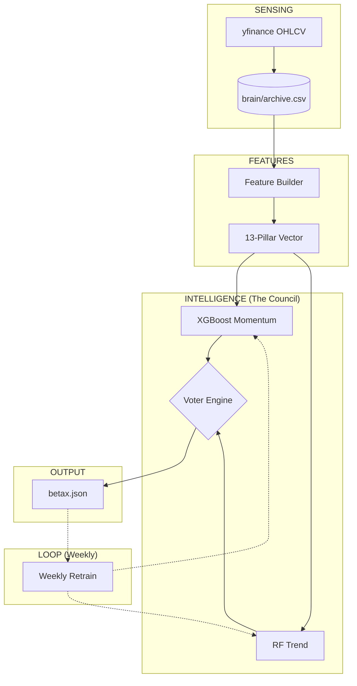
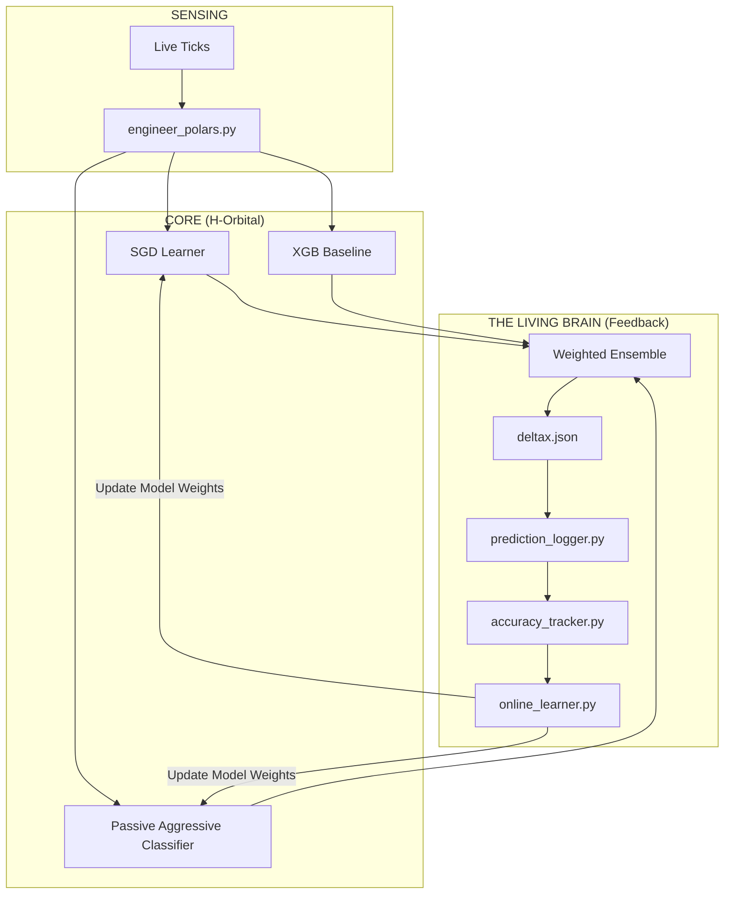
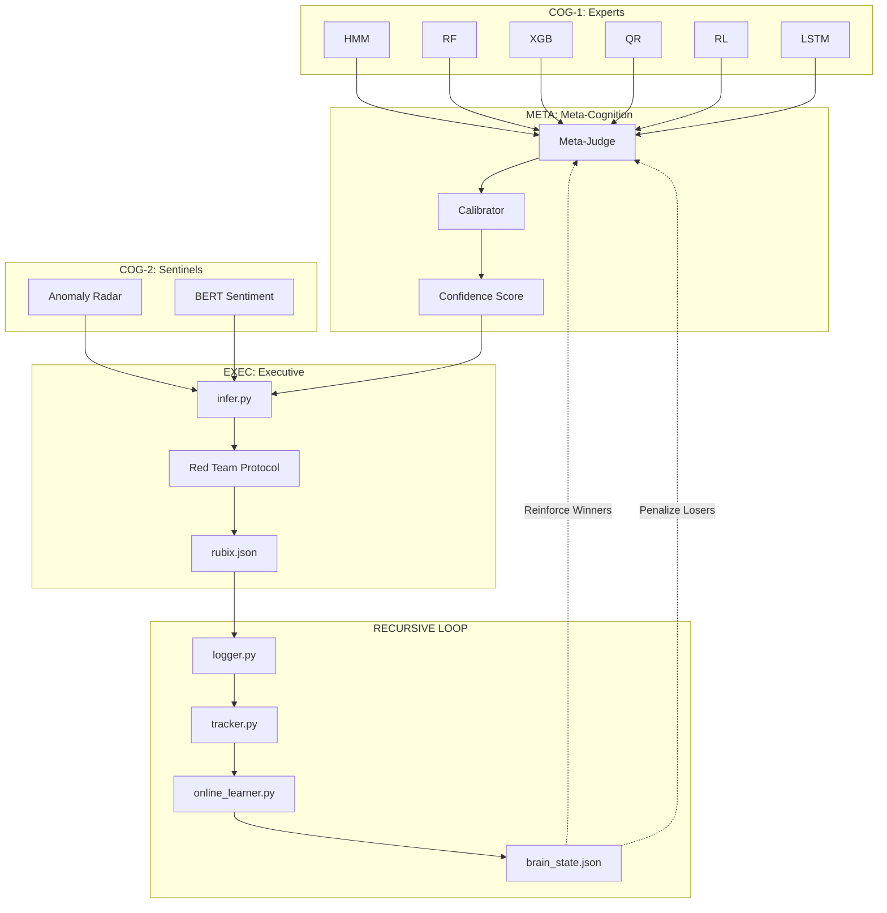
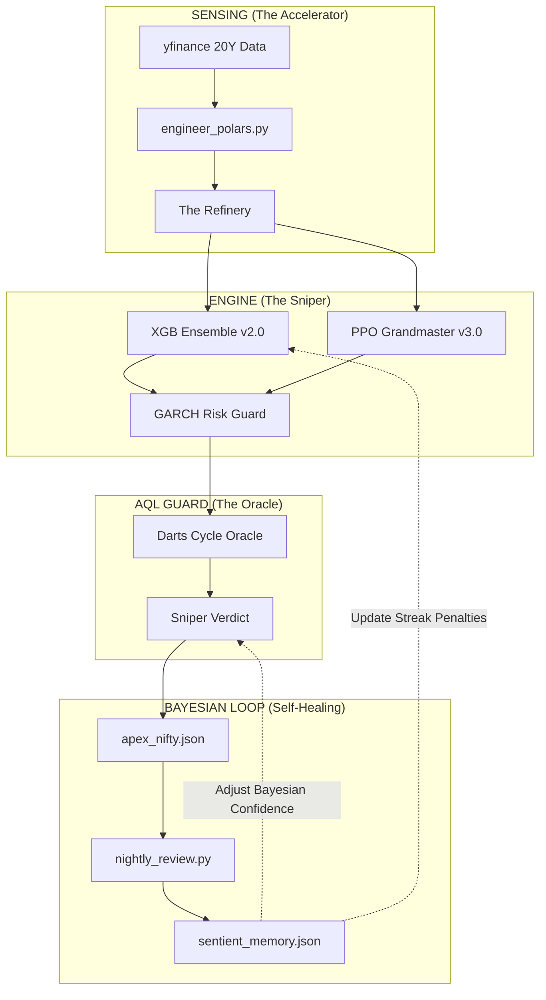

# 🌌 X-SERIES UNIVERSAL STRATEGY ENCYCLOPEDIA [ULTRA-DETAILED]
## The Architectural Colosseum: Loops, Models, and Recursive Intelligence

This document provides the "Minute-Level" technical breakdown of the entire Tradyxa X-Series.

---

## 🏛️ 1. ARCHITECTURAL DEEP-DIVE (The Gear-Mechanism)

### 🥉 BetaX: The Pattern Replicator (v2.1)
**Models:** XGBoost (Momentum), Random Forest (Patterns).
**Loop:** Weekly Static Refresh.

---

### 🥈 DeltaX: The H-Orbital Living Brain (v3.0)
**Models:** SGD (Stochastic), Passive Aggressive (Dynamic), XGB (Base).
**Loop:** Daily Incremental Learning.

---

### 🥇 ZetaX: The Multi-Agent Council (v3.5)
**Models:** HMM (Regime), RF (Reversal), XGB (Momentum), QR (Range), RL (Strategy), LSTM (Sequence Brain), AE (Anomaly Radar), BERT (Public Pulse).
**Loop:** Recursive Confidence Calibration.

---

### 💎 ApeX: The AQL Grandmaster Sniper (v4.0)
**Models:** PPO (Reinforcement), XGB Ensemble, GARCH (Volatility), DARTS (Cycle).
**Loop:** Bayesian Nightly Self-Healing.

---

## 📖 PART 2: THE 4-STAGE STRATEGY MANUAL

### 1. THE FOUNDATION (BetaX & DeltaX)
**When to use:** Market Opening (9:15 AM - 10:30 AM).
*   Check if BetaX and DeltaX agree on the **Direction**.
*   If both say BULLISH, the "Daily Base" is set.

### 2. THE CONTEXT (ZetaX)
**When to use:** Mid-Day Volatility (11:00 AM - 1:00 PM).
*   Read the **Executive Narrative**. 
*   If ZetaX says "Anomaly Detected" (via Anomaly Radar), **HALT TRADING**.
*   If ZetaX says "Sentiment Convergence," increase your conviction.

### 3. THE PRECISION (ApeX)
**When to use:** Reversals & Scalping (1:30 PM - 3:30 PM).
*   Wait for the **ApeX Sniper** to give a **SCALE IN** signal.
*   Cross-reference with GARCH. If GARCH is "Red," use 25% capital. If GARCH is "Green," use 100% capital.

### 4. THE CONVERGENCE (The "God Trade")
**When to use:** Only 2-3 times per week.
*   **BETA:** Bullish.
*   **DELTA:** Weights favoring Longs.
*   **ZETA:** 5+ Council members agree + Narrative is optimistic.
*   **APEX:** Grandmaster gives **SCALE IN (LONG)** with 80%+ Confidence.

**This is the "Institutional Order Flow" pattern.**

---
© 2025 Zeta Aztra Technologies. All Rights Reserved.
