# 🌌 AuztinX 4.0: The Axiom-Sentient Living Brain
## The Sentient Evolution of Math-First Intelligence

> [!NOTE]
> This document outlines the transformation of AuztinX (formerly DeltaX) from an institutional math filter (2.0) into a sentient, macro-aware agent (4.0). It incorporates the rigorous "Red Team" logic and the "Jump-Diffusion" mechanics of **Axiom-Sentient Intelligence**.

---

## 🔍 Viability Assessment: Is AuztinX Ready?

**Verdict: EXTREMELY VIABLE.**

AuztinX is the perfect candidate for Living Brain 4.0 for three reasons:
1.  **Solid Foundation**: It already possesses the "Micro-Senses" (Adaptive Filters, GARCH) that other systems lack. It has "Sharp Eyes."
2.  **Modular Core**: The transition from 2.0 to 4.0 only requires adding a "Reasoning Layer" (LLM) and a "Skepticism Layer" (Red Team) on top of existing math.
3.  **The Math Paradox**: Financial models are often "too accurate" to the numbers, which makes them blind to "Narrative Shifts" (Black Swans). Living Brain 4.0 solves this by adding Global Macro awareness.

---

## 🆚 Legacy DeltaX vs. Modern AuztinX 4.0

| Feature | Legacy DeltaX (2.0) | Modern AuztinX (Axiom 4.0) |
| :--- | :--- | :--- |
| **Intelligence** | **Reactive**: Adjusts filters after an error. | **Sentient**: Anticipates error via macro-fusion. |
| **Brain Level** | Living Brain 2.0/3.0 | **Living Brain 4.0** |
| **Math Engine** | Standard Kalman / GARCH | **Jump-Adaptive Kalman / GJR-GARCH** |
| **Data Scope** | Local NIFTY/BANKNIFTY Prices | **Cross-Asset Fusion** (DXY, Bonds, Oil) |
| **Validation** | Basic Optimization | **Red Team Protocol (Hard Veto)** |
| **Interface** | 12 Technical Tiles | **Cinematic 16-Tile UI + LLM Synthesis** |
| **Output** | "Math is Bullish/Bearish" | **Executive Verdict: Synthesized Reasoning.** |

---

## 🧬 THE LIVING BRAIN EVOLUTION MATRIX

| Version | Name | Philosophy | Capability |
| :--- | :--- | :--- | :--- |
| **1.0** | **The Calculator** | Static Heuristics | High-frequency calculation of technical indicators (RSI, EMA). |
| **2.0** | **The Reflex** | Self-Adjusting | Can "Sense" error. Adjusts internal multipliers based on misses. |
| **3.0** | **The Meta-Judge** | Strategic Meritocracy| Judges the "Council of Experts." Learns which math to trust. |
| **4.0** | **The Sentient** | Global Awareness | **Sentience.** Understands Cross-Asset relationships. Features Agency (Reasoning) and Skepticism (Red Team). |

---

## 🏛️ AXIOM 4.0 ARCHITECTURE

```mermaid
flowchart TB
    subgraph SENSES["👁️ SENSING LAYER"]
        YF[yfinance: Spot/VIX]
        MACRO[Macro: DXY/Bonds/S&P]
        RSS[News RSS: NLP Analysis]
    end

    subgraph BRAIN["🧠 COGNITIVE PROCESSING (models/)"]
        direction LR
        RF["Probability Ensemble"]
        GB["Structure Analysis"]
        AE["Structure Radar"]
        QR["Expected Range"]
    end

    subgraph MATH["🧬 PRECISION MATH (Exotic)"]
        JKF[Adaptive Trend Filter]
        GJR[GJR-GARCH Vol]
        FOUR[Signal SNR: Fourier]
    end

    subgraph VETO["🛡️ THE COMMAND CENTER (Validation)"]
        RT[Red Team Protocol]
        Blue[Blue Team: Kelly Risk]
        RT & Blue -->|PASS/FAIL| LOGIC{Executive Analyst}
    end

    subgraph FEEDBACK["🧠 THE LIVING BRAIN (Learning)"]
        LOG[3:30 PM Close Log]
        VER[T+1 Outcome Verify]
        LEARN[brain_state.json Accuracy]
        VER --> LEARN -->|Update Weights| BRAIN
    end

    SENSES --> MATH & BRAIN
    MATH & BRAIN --> RT
    LOGIC --> UI["Cinematic 16-Tile UI"]
    UI --> LOG
    LOG --> VER
```

---

## 📊 THE 16-TILE COMMAND CENTER

| # | Tile Name | Type | Institutional Logic | Role |
|:--|:----------|:-----|:-------------------|:-----|
| 1 | **Spot Price** | Senses | Live Quote Engine | Baseline Monitoring |
| 2 | **India VIX** | Senses | Live Fear Engine | Regime Filtering |
| 3 | **Red Team** | Meta | Military Hard Veto | Risk Sentinel |
| 4 | **DXY Sentinel** | Macro | Currency Liquidity | Emerging Market Proxy |
| 5 | **Adaptive Trend**| Exotic| Jump-Adaptive Filter | Primary Direction |
| 6 | **Expected Range**| Exotic| GJR-GARCH Volatility| Volatility Cone |
| 7 | **Signal SNR** | Math | Fourier Cycles | Cycle Predictability |
| 8 | **Logic Levels** | ML | K-Means Clusters | Structural Support/Res |
| 9 | **Reversal Prob.**| Ensemble| Probabilistic Logic | Overbought/Oversold |
| 10| **SNR Strength** | Math | Spectral Density | Momentum Confidence |
| 11| **Structure Radar**| ML | Neural Anomaly Detection| Black Swan Detection |
| 12| **Consensus Pulse**| ML | NLP Narrative Engine | News Sentiment |
| 13| **Option Skew** | Synth | Monte Carlo | Fat-Tail Risk |
| 14| **Dealer Pos.** | Synth | Gamma Simulation | Market Maker Magnet |
| 15| **Kelly Bet** | Risk | Allocation Optimization| Position Sizing |
| 16| **AI Consensus**| Executive| Synthesized Reasoning | Human-Readable Verdict |

---

## 🐍 TECHNICAL BLUEPRINT: AUZTINX INTEGRATION

### 1. Adaptive Trend Filter (Jump-Adaptive)
Located at `jump_adaptive_kalman.py`. Focuses on minimizing lag during parabolic moves.

### 2. The Red Team Protocol
Located at `red_team_veto.py`. Ensures no trade is taken in high-chaos regimes.

### 3. Executive Synthesis (LLM Interface)
Located at `executive_synthesis_llama.py`. The "Brain" that resolves "Math vs Logic" conflicts.

---

## 📅 STRATEGIC ROADMAP

1.  **Phase 1**: Rebranding and Logic Concealment (Complete).
2.  **Phase 2**: Deployment of the **Axiom** math core (Complete).
3.  **Phase 3**: Integration of **Executive Synthesis** reasoning (Complete).
4.  **Phase 4**: The Living Brain (Feedback Learning) - **LIVE**.
    *   T+1 Outcome Analysis via `online_learner.py`.
    *   Intelligence Scorecard via `brain_state.json`.
    *   Autonomous position-size calibration based on track record.

---

Every morning, the system runs its own audit. If the math predicted "BULLISH" but the market was "BEARISH," the system marks its own homework. It reduces the weight of the failing model in the `brain_state.json` diary.

**Technical Constraints**:
- **The Floodlight (ML1)**: Operates on a **20-year Heritage Window** to maintain ancestral stability.
- **The Spotlight (ML2)**: Operates on a **30-day Sliding Window** (Reflex Memory) to ensure high-agility responses to immediate regime shifts.
- **The No-Loss Vault**: All results are archived perpetually in `predictions.csv`.

---

## 🧩 THE LIVING BRAIN SIMPLIFIED (Connecting the Dots)

To avoid confusion, think of the system in three simple steps that happen every day:

1.  **The Memory (`brain_state.json`)**:
    *   This is the "Brain's Diary." It remembers if the system has been right or wrong lately.
    *   `predict.py` reads this first to see how much it should "trust" its own math today.

2.  **The Action (`predict.py` & `prediction_logger.py`)**:
    *   The **Master (ML1)** looks at 20 years of math.
    *   The **Apprentice (ML2)** looks at the Diary and says "Boss, we've been too bullish lately, let's tone it down."
    *   The **Fused Verdict (V3)** is the final consensus saved to `predictions.csv`.

3.  **The Teacher (`online_learner.py`)**:
    *   Every afternoon, the Teacher looks at `predictions.csv`.
    *   It checks what actually happened in the market.
    *   It writes a new entry in the **Diary (`brain_state.json`)**, updating the trust scores for tomorrow.
