# 🧠 SENTIENT COGNITIVE PIPELINE v2.0
## The Ultimate Self-Aware Trading Intelligence

> [!IMPORTANT]
> This pipeline is based on **4 proven institutional frameworks**:
> 1. **OODA Loop** (US Military Decision Making)
> 2. **ACT-R / SOAR** (Cognitive Architecture from CMU/Michigan)
> 3. **Bayesian Brain** (Hedge Fund Probabilistic Reasoning)
> 4. **Meta-Cognition** (Learning to Learn - DeepMind)

---

## 🎯 THE CORE PHILOSOPHY

Traditional ML pipelines: **"What is the prediction?"**

Cognitive pipelines: **"Why am I predicting this, and where might I be wrong?"**

```
IRON MAN'S JARVIS doesn't just give answers.
It says: "Sir, based on pattern X, I predict Y. 
         However, I was wrong about similar situations 3 times last month.
         Confidence adjusted from 85% to 62%."
```

---

## 🏛️ THE 4 COGNITIVE FRAMEWORKS

### 1. OODA LOOP (Military Decision Science)
**Origin**: Colonel John Boyd, US Air Force


**Why it works**: Fighter pilots who cycle through OODA faster than enemies WIN. Markets are no different.

### 2. ACT-R / SOAR (Cognitive Architecture)
**Origin**: Carnegie Mellon / University of Michigan


**Why it works**: Separates "knowledge" from "skills" - just like a human trader.

### 3. BAYESIAN BRAIN (Probabilistic Reasoning)
**Origin**: Hedge Funds, Quant Research

```
Prior Belief + New Evidence = Updated Belief

P(Market UP | New Data) = P(New Data | Market UP) × P(Market UP) / P(New Data)
```

**Why it works**: Doesn't flip-flop. Gradually updates confidence as evidence accumulates.

### 4. META-COGNITION (Thinking About Thinking)
**Origin**: DeepMind, OpenAI

```
"I know that I don't know."
"I know that I'm biased towards bullish calls."
"I know that I fail in high-VIX environments."
```

**Why it works**: Self-awareness prevents overconfidence.

---

## 🧬 THE SENTIENT COGNITIVE PIPELINE ARCHITECTURE

```mermaid
flowchart TB
    subgraph OODA["🎯 OODA LOOP (Outer Shell)"]
        direction TB
        
        subgraph OBSERVE["👁️ OBSERVE"]
            O1[Live Price Feed]
            O2[Macro Sensors]
            O3[Sentiment Feed]
        end
        
        subgraph ORIENT["🧭 ORIENT (Cognitive Core)"]
            direction TB
            
            subgraph MEMORY["📚 MEMORY SYSTEMS"]
                LTM[("Long-Term Memory<br/>20-Year Patterns")]
                STM[("Short-Term Memory<br/>30-Day Errors")]
                WM[("Working Memory<br/>Today's Context")]
            end
            
            subgraph REASONING["🧠 REASONING ENGINE"]
                BAYES[Bayesian Updater]
                PATTERN[Pattern Matcher]
                ANALOGY[Analogy Finder]
            end
            
            subgraph META["🔮 META-COGNITION"]
                CONFIDENCE[Confidence Calibrator]
                BIAS[Bias Detector]
                DOUBT[Self-Doubt Engine]
            end
            
            MEMORY --> REASONING
            REASONING --> META
        end
        
        subgraph DECIDE["⚖️ DECIDE"]
            V1[Hypothesis 1: Bullish]
            V2[Hypothesis 2: Bearish]
            V3[Hypothesis 3: Neutral]
            WINNER{Select Best<br/>with Confidence}
        end
        
        subgraph ACT["🎬 ACT"]
            VERDICT[Final Verdict]
            LOG[Log Prediction]
            LEARN[Queue for Learning]
        end
        
        OBSERVE --> ORIENT
        ORIENT --> DECIDE
        DECIDE --> ACT
        ACT -.->|Feedback| ORIENT
    end
```



---

## 📐 THE 7 COGNITIVE LAYERS

### LAYER 1: SENSORY INPUT (OBSERVE)
**What**: Raw data ingestion
**Analogy**: Human eyes, ears, touch

```python
class SensoryLayer:
    """The system's 'senses' - gathering raw market data."""
    
    def observe(self):
        return {
            "spot_price": fetch_live_price(),      # Vision
            "vix": fetch_vix(),                     # Pain/Fear sensor
            "dxy": fetch_dollar_index(),            # Global pulse
            "news_sentiment": fetch_news_nlp(),     # Hearing
            "volume": fetch_volume(),               # Touch (market pressure)
            "option_flow": fetch_option_data()      # Institutional whispers
        }
```

---

### LAYER 2: PATTERN RECOGNITION (ORIENT - Part 1)
**What**: Match current state to known patterns
**Analogy**: "This looks like 2008..." or "This feels like a breakout..."

```python
class PatternLayer:
    """Pattern matching against Long-Term Memory."""
    
    def recognize(self, current_state: dict) -> list:
        # Query Long-Term Memory for similar patterns
        similar_patterns = self.ltm.find_similar(current_state, top_k=5)
        
        # Each pattern has: signature, outcome, confidence
        return [
            {"pattern": "Pre-Breakout Consolidation", "outcome": "UP", "historical_accuracy": 0.72},
            {"pattern": "VIX Spike Exhaustion", "outcome": "REVERSAL", "historical_accuracy": 0.65},
            {"pattern": "DXY Divergence", "outcome": "DOWN", "historical_accuracy": 0.58}
        ]
```

---

### LAYER 3: ANALOGY ENGINE (ORIENT - Part 2)
**What**: Find structural similarities, not just numerical
**Analogy**: Detective connecting unrelated clues

```python
class AnalogyEngine:
    """
    The 'Detective' layer - finds non-obvious connections.
    
    Like Sherlock Holmes: "The case of the missing butler in 1892 
    had the same structural pattern as this market..."
    """
    
    def find_analogies(self, current_state: dict) -> list:
        # Not just numerical similarity, but STRUCTURAL similarity
        analogies = []
        
        # Example: 2024 market structure similar to 2016 post-election
        if self.is_structural_match(current_state, "2016_post_election"):
            analogies.append({
                "reference": "Nov 2016 Post-Election",
                "insight": "Initial chaos followed by 18-month rally",
                "relevance_score": 0.78
            })
        
        return analogies
```

---

### LAYER 4: BAYESIAN HYPOTHESIS TESTING (ORIENT - Part 3)
**What**: Multiple competing hypotheses, each with probability
**Analogy**: Jury weighing evidence for different verdicts

```python
class BayesianHypothesisTester:
    """
    The 'Jury' - maintains multiple hypotheses simultaneously.
    Updates probabilities with each new piece of evidence.
    """
    
    def __init__(self):
        # Start with prior beliefs (can be uniform)
        self.hypotheses = {
            "BULLISH": 0.33,
            "BEARISH": 0.33,
            "NEUTRAL": 0.34
        }
    
    def update_with_evidence(self, evidence: dict):
        """
        Bayesian update: P(H|E) = P(E|H) * P(H) / P(E)
        """
        for hypothesis in self.hypotheses:
            # Calculate likelihood: How probable is this evidence if hypothesis is true?
            likelihood = self.calculate_likelihood(evidence, hypothesis)
            
            # Update probability
            self.hypotheses[hypothesis] *= likelihood
        
        # Normalize to sum to 1
        total = sum(self.hypotheses.values())
        self.hypotheses = {h: p/total for h, p in self.hypotheses.items()}
        
        return self.hypotheses
    
    def get_leading_hypothesis(self):
        return max(self.hypotheses, key=self.hypotheses.get)
```

---

### LAYER 5: META-COGNITION (Self-Awareness)
**What**: Know your own biases, blind spots, and limitations
**Analogy**: JARVIS saying "Sir, I may be wrong because..."

```python
class MetaCognitionLayer:
    """
    The 'Self-Doubt' layer - critical for avoiding overconfidence.
    
    This is what separates good traders from blown-up accounts.
    """
    
    def __init__(self):
        self.known_biases = []
        self.failure_patterns = []
        self.confidence_history = []
    
    def audit_myself(self, current_prediction: dict) -> dict:
        warnings = []
        confidence_adjustment = 0.0
        
        # 1. Check for known failure patterns
        if self.matches_failure_pattern(current_prediction):
            warnings.append("⚠️ Similar to past failure pattern")
            confidence_adjustment -= 0.15
        
        # 2. Check for overconfidence
        if current_prediction['raw_confidence'] > 0.85:
            recent_accuracy = self.get_recent_accuracy(days=30)
            if recent_accuracy < 0.6:
                warnings.append("⚠️ High confidence but recent accuracy is low")
                confidence_adjustment -= 0.20
        
        # 3. Check for known biases
        if self.am_i_biased_towards(current_prediction['direction']):
            warnings.append(f"⚠️ I have a historical bias towards {current_prediction['direction']}")
            confidence_adjustment -= 0.10
        
        # 4. Check for regime mismatch
        if self.current_regime != self.trained_regime:
            warnings.append("⚠️ Market regime differs from training data")
            confidence_adjustment -= 0.10
        
        return {
            "warnings": warnings,
            "confidence_adjustment": confidence_adjustment,
            "adjusted_confidence": max(0.1, current_prediction['raw_confidence'] + confidence_adjustment),
            "self_awareness_score": len(warnings)  # Higher = more cautious
        }
    
    def am_i_biased_towards(self, direction: str) -> bool:
        """Check if I've been calling this direction too often."""
        recent_calls = self.get_recent_predictions(days=30)
        direction_ratio = sum(1 for p in recent_calls if p == direction) / len(recent_calls)
        return direction_ratio > 0.7  # Biased if >70% same direction
```

---

### LAYER 6: DECISION SYNTHESIS (DECIDE)
**What**: Combine all reasoning into final verdict
**Analogy**: Judge delivering verdict after hearing all evidence

```python
class DecisionSynthesis:
    """
    The 'Judge' - makes the final call after hearing all evidence.
    """
    
    def synthesize(self, 
                   patterns: list,
                   analogies: list,
                   bayesian_posterior: dict,
                   meta_audit: dict) -> dict:
        
        # Weight contributions
        pattern_vote = self.aggregate_patterns(patterns)         # 30%
        analogy_vote = self.aggregate_analogies(analogies)       # 20%
        bayesian_vote = bayesian_posterior                       # 40%
        
        # Combine votes
        combined = {
            "BULLISH": 0.3 * pattern_vote["BULLISH"] + 
                       0.2 * analogy_vote["BULLISH"] + 
                       0.5 * bayesian_vote["BULLISH"],
            "BEARISH": 0.3 * pattern_vote["BEARISH"] + 
                       0.2 * analogy_vote["BEARISH"] + 
                       0.5 * bayesian_vote["BEARISH"],
            "NEUTRAL": 0.3 * pattern_vote["NEUTRAL"] + 
                       0.2 * analogy_vote["NEUTRAL"] + 
                       0.5 * bayesian_vote["NEUTRAL"]
        }
        
        # Apply meta-cognition adjustment
        winning_direction = max(combined, key=combined.get)
        raw_confidence = combined[winning_direction]
        adjusted_confidence = raw_confidence + meta_audit['confidence_adjustment']
        adjusted_confidence = max(0.1, min(0.95, adjusted_confidence))
        
        return {
            "verdict": winning_direction,
            "raw_confidence": raw_confidence,
            "adjusted_confidence": adjusted_confidence,
            "meta_warnings": meta_audit['warnings'],
            "reasoning": self.generate_explanation(patterns, analogies, bayesian_vote)
        }
    
    def generate_explanation(self, patterns, analogies, bayesian) -> str:
        """Generate human-readable explanation like JARVIS."""
        return f"""
        VERDICT REASONING:
        - Pattern Recognition: {patterns[0]['pattern']} suggests {patterns[0]['outcome']}
        - Historical Analogy: Similar to {analogies[0]['reference']}
        - Bayesian Probability: {max(bayesian, key=bayesian.get)} at {max(bayesian.values()):.1%}
        - Self-Assessment: {len(self.meta_warnings)} concerns identified
        """
```

---

### LAYER 7: LEARNING & ADAPTATION (ACT + FEEDBACK)
**What**: Log, verify, and update all memory systems
**Analogy**: Iron Man improving suit after each battle

```python
class LearningLayer:
    """
    The 'Self-Improvement' layer.
    
    After each prediction is verified:
    1. Update Long-Term Memory (slowly)
    2. Update Short-Term Memory (quickly)
    3. Update Meta-Cognition (bias detection)
    """
    
    def learn_from_outcome(self, prediction: dict, actual_outcome: dict):
        was_correct = self.evaluate_correctness(prediction, actual_outcome)
        
        # 1. Update Short-Term Memory (30-day window)
        self.stm.append({
            "date": prediction['date'],
            "predicted": prediction['verdict'],
            "actual": actual_outcome['direction'],
            "correct": was_correct,
            "confidence": prediction['adjusted_confidence']
        })
        self.stm = self.stm[-30:]  # Keep only 30 days
        
        # 2. Update failure patterns in Meta-Cognition
        if not was_correct:
            self.meta.record_failure(
                context=prediction['context'],
                predicted=prediction['verdict'],
                actual=actual_outcome['direction']
            )
        
        # 3. Update bias detector
        self.meta.update_bias_tracking(prediction['verdict'], was_correct)
        
        # 4. Update Bayesian priors (slowly)
        self.bayesian.update_priors_from_outcome(actual_outcome)
        
        # 5. Calculate rolling accuracy
        rolling_accuracy = sum(1 for p in self.stm if p['correct']) / len(self.stm)
        
        return {
            "learned": True,
            "was_correct": was_correct,
            "rolling_accuracy": rolling_accuracy,
            "failures_recorded": len(self.meta.failure_patterns),
            "known_biases": self.meta.known_biases
        }
```

---

## 🔄 THE COMPLETE SENTIENT PIPELINE

```python
class SentientCognitivePipeline:
    """
    THE ULTIMATE PIPELINE
    
    Combines:
    - OODA Loop (decision speed)
    - Cognitive Architecture (structured reasoning)
    - Bayesian Inference (probabilistic updates)
    - Meta-Cognition (self-awareness)
    """
    
    def __init__(self):
        # Memory Systems
        self.ltm = LongTermMemory()      # 20 years of patterns
        self.stm = ShortTermMemory()     # 30 days of errors
        self.wm = WorkingMemory()        # Today's context
        
        # Cognitive Layers
        self.sensory = SensoryLayer()
        self.pattern = PatternLayer(self.ltm)
        self.analogy = AnalogyEngine(self.ltm)
        self.bayesian = BayesianHypothesisTester()
        self.meta = MetaCognitionLayer()
        self.decision = DecisionSynthesis()
        self.learning = LearningLayer(self.stm, self.meta)
    
    def run(self, symbol: str) -> dict:
        """
        THE OODA CYCLE
        """
        # ═══════════════════════════════════════════
        # OBSERVE: Gather all sensory data
        # ═══════════════════════════════════════════
        senses = self.sensory.observe()
        self.wm.update(senses)
        
        # ═══════════════════════════════════════════
        # ORIENT: Process through cognitive layers
        # ═══════════════════════════════════════════
        
        # Pattern matching
        patterns = self.pattern.recognize(senses)
        
        # Analogy finding
        analogies = self.analogy.find_analogies(senses)
        
        # Bayesian hypothesis update
        for evidence in senses.values():
            self.bayesian.update_with_evidence(evidence)
        posterior = self.bayesian.hypotheses
        
        # Meta-cognitive audit
        preliminary_verdict = {
            "direction": self.bayesian.get_leading_hypothesis(),
            "raw_confidence": max(posterior.values())
        }
        meta_audit = self.meta.audit_myself(preliminary_verdict)
        
        # ═══════════════════════════════════════════
        # DECIDE: Synthesize into final verdict
        # ═══════════════════════════════════════════
        verdict = self.decision.synthesize(
            patterns=patterns,
            analogies=analogies,
            bayesian_posterior=posterior,
            meta_audit=meta_audit
        )
        
        # ═══════════════════════════════════════════
        # ACT: Output and log
        # ═══════════════════════════════════════════
        self.log_prediction(verdict)
        
        return {
            "timestamp": datetime.now().isoformat(),
            "symbol": symbol,
            "verdict": verdict['verdict'],
            "confidence": verdict['adjusted_confidence'],
            "reasoning": verdict['reasoning'],
            "warnings": verdict['meta_warnings'],
            "pipeline_version": "SENTIENT_2.0"
        }
```

---

## 🎯 HOW THIS IS DIFFERENT FROM v1.0

| Aspect | v1.0 (Universal Pipeline) | v2.0 (Sentient Cognitive) |
|:-------|:--------------------------|:--------------------------|
| **Philosophy** | "Calculate the prediction" | "Reason about the prediction" |
| **Memory** | Single error log | 3 memory systems (LTM, STM, WM) |
| **Reasoning** | Direct model output | Pattern + Analogy + Bayesian |
| **Self-Awareness** | None | Full meta-cognition layer |
| **Explanation** | None | Human-readable reasoning |
| **Bias Detection** | Manual | Automatic + self-correcting |
| **Confidence** | From model | Adjusted by self-doubt |
| **Learning** | Simple accuracy tracking | Multi-system memory update |

---

## 🧠 THE JARVIS EFFECT

With this pipeline, your system doesn't just say:

```
"BULLISH - 72% confidence"
```

It says:

```
VERDICT: BULLISH
CONFIDENCE: 72% → 58% (adjusted)

REASONING:
- Pattern: "Pre-breakout consolidation" identified (72% historical accuracy)
- Analogy: Similar to Nov 2016 post-election setup
- Bayesian: 68% probability after incorporating VIX drop

SELF-ASSESSMENT:
⚠️ I have been over-bullish 7 of last 10 days
⚠️ My accuracy in high-VIX environments is only 42%
⚠️ Confidence adjusted from 72% to 58%

RECOMMENDED ACTION: Small position, tight stop-loss
```

---

## ✅ IMPLEMENTATION PRIORITY

### Phase 1: Core Cognitive (Week 1)
- [ ] Implement 3 memory systems (LTM, STM, WM)
- [ ] Build Pattern Recognition layer
- [ ] Build Bayesian Hypothesis Tester

### Phase 2: Meta-Cognition (Week 2)
- [ ] Implement bias detector
- [ ] Implement failure pattern recorder
- [ ] Build confidence calibrator

### Phase 3: Integration (Week 3)
- [ ] Wire up OODA loop
- [ ] Add explanation generator
- [ ] Deploy and test

---

## 🏛️ INSTITUTIONAL REFERENCES

| Framework | Used By | Key Paper |
|:----------|:--------|:----------|
| OODA Loop | US Air Force, Hedge Funds | Boyd, J. (1987) |
| ACT-R | CMU, NASA, Defense | Anderson, J. (2007) |
| Bayesian Brain | Citadel, Two Sigma | Friston, K. (2010) |
| Meta-Learning | DeepMind, OpenAI | Finn, C. (2017) |

---

*Sentient Cognitive Pipeline v2.0 - Designed for Human-Like Trading Intelligence*
