# ZetaX vs DeltaX Architecture Encyclopedia

A comprehensive analysis of two Tradyxa products after Sentient v2.0 integration.

---

## 📊 Quick Comparison Dashboard

| Dimension | ZetaX | DeltaX |
|-----------|-------|--------|
| **Complexity** | ⭐⭐⭐⭐⭐ (5/5) | ⭐⭐⭐ (3/5) |
| **ML Sophistication** | ⭐⭐⭐⭐⭐ (5/5) | ⭐⭐⭐ (3/5) |
| **Retail Friendliness** | ⭐⭐⭐ (3/5) | ⭐⭐⭐⭐⭐ (5/5) |
| **Research Depth** | ⭐⭐⭐⭐⭐ (5/5) | ⭐⭐⭐ (3/5) |
| **Speed to Decision** | ⭐⭐⭐ (3/5) | ⭐⭐⭐⭐⭐ (5/5) |
| **Customizability** | ⭐⭐⭐⭐⭐ (5/5) | ⭐⭐⭐ (3/5) |
| **Learning Curve** | Steep (Weeks) | Gentle (Days) |
| **Target User** | Quant Researchers | Retail Traders |

---

## 🏗️ High-Level Architecture

### ZetaX System Flow

```mermaid
flowchart TB
    subgraph DataLayer["📡 Data Layer"]
        YF[Yahoo Finance API]
        NSE[NSE India API]
        MACRO[Macro Data: DXY, US10Y, Brent]
    end

    subgraph FeatureEngine["🔧 Feature Engineering"]
        FB[feature_builder.py]
        DF[data_fetcher.py]
        HIST[20 Years Heritage Data]
    end

    subgraph MLModels["🧠 ML Models (26 Scripts)"]
        subgraph DeepLearning["Deep Learning"]
            LSTM[LSTM Sequence]
            TCN[TCN Regime]
        end
        subgraph Ensemble["Ensemble Methods"]
            XGB[XGBoost Momentum]
            RF[RF Reversal]
        end
        subgraph Statistical["Statistical"]
            HMM[HMM Regime]
            GBM[GBM Divergence]
            QR[Quantile Regression]
        end
        subgraph Risk["Risk Validators"]
            ANOM[Anomaly Detector]
            RED[Red Team Protocol]
        end
    end

    subgraph Cognitive["🧬 Sentient v2.0"]
        BAY[Bayesian Hypothesis]
        MEM[Memory Systems]
        META[Meta Cognition]
        PIPE[Sentient Pipeline]
    end

    subgraph Output["📤 Output"]
        VAULT[rubix_vault.json]
        DASH[Dashboard: 25+ Tiles]
    end

    YF --> DF
    NSE --> DF
    MACRO --> FB
    DF --> FB
    HIST --> FB
    
    FB --> LSTM
    FB --> TCN
    FB --> XGB
    FB --> RF
    FB --> HMM
    FB --> GBM
    FB --> QR
    FB --> ANOM
    FB --> RED
    
    LSTM --> BAY
    TCN --> BAY
    XGB --> BAY
    RF --> BAY
    HMM --> MEM
    GBM --> META
    QR --> META
    ANOM --> PIPE
    RED --> PIPE
    
    BAY --> PIPE
    MEM --> PIPE
    META --> PIPE
    
    PIPE --> VAULT
    VAULT --> DASH
```



### DeltaX System Flow

```mermaid
flowchart TB
    subgraph DataLayer["📡 Data Layer"]
        YF[Yahoo Finance API]
        MACRO[Macro Data: DXY, US10Y]
    end

    subgraph Scripts["🔧 Scripts (5 Files)"]
        DM[data_manager.py]
        PRED[predict.py]
        TRAIN[train_models.py]
    end

    subgraph MLModels["🧠 ML Models (Core 3)"]
        RF[Random Forest]
        LSTM[LSTM Network]
        XGB[XGBoost]
    end

    subgraph Cognitive["🧬 Sentient v2.0"]
        BAY[Bayesian Hypothesis]
        MEM[Memory Systems]
        META[Meta Cognition]
        PIPE[Sentient Pipeline]
    end

    subgraph Output["📤 Output"]
        JSON[auztinx_data.json]
        DASH[Dashboard: 16 Tiles]
    end

    YF --> DM
    MACRO --> PRED
    DM --> PRED
    
    PRED --> RF
    PRED --> LSTM
    PRED --> XGB
    
    RF --> BAY
    LSTM --> BAY
    XGB --> MEM
    
    BAY --> PIPE
    MEM --> PIPE
    META --> PIPE
    
    PIPE --> JSON
    JSON --> DASH
```



---

## 🧠 ML Models Comparison

### ZetaX Model Arsenal

| Model | File | Purpose | Complexity | Output |
|-------|------|---------|------------|--------|
| **LSTM Sequence** | `lstm_sequence.py` | Sequential pattern recognition | ⭐⭐⭐⭐⭐ | Next-day direction probability |
| **TCN Regime** | `tcn_regime.py` | Temporal Convolutional Networks for regime shifts | ⭐⭐⭐⭐⭐ | Market regime classification |
| **XGBoost Momentum** | `xgb_momentum.py` | Gradient boosting for momentum signals | ⭐⭐⭐⭐ | Momentum score |
| **Random Forest Reversal** | `rf_reversal.py` | Ensemble for reversal prediction | ⭐⭐⭐⭐ | Reversal probability |
| **HMM Regime** | `hmm_regime.py` | Hidden Markov Model for state transitions | ⭐⭐⭐⭐⭐ | Bull/Bear/Choppy state |
| **GBM Divergence** | `gbm_divergence.py` | Geometric Brownian Motion divergence | ⭐⭐⭐⭐ | Price-model divergence |
| **Quantile Regression** | `qr_range.py` | Range prediction at quantiles | ⭐⭐⭐⭐ | Expected trading range |
| **Anomaly Detector** | `anomaly_detector.py` | Isolation Forest for outliers | ⭐⭐⭐ | Anomaly flag |
| **Red Team Protocol** | `red_team_protocol.py` | Adversarial validation | ⭐⭐⭐⭐ | Skepticism veto |
| **Sentiment Engine** | `sentiment_engine.py` | NLP for news sentiment | ⭐⭐⭐ | Sentiment score |
| **LLM Synthesizer** | `llm_synthesizer.py` | GPT-based narrative generation | ⭐⭐⭐ | Human-readable verdict |
| **Meta Trainer** | `meta_trainer.py` | Meta-learning controller | ⭐⭐⭐⭐⭐ | Adaptive weight updates |
| **Strategy RL** | `strategy_rl.py` | Reinforcement Learning agent | ⭐⭐⭐⭐⭐ | Optimal action policy |
| **Friday Fear** | `friday_fear.py` | Weekend risk calculator | ⭐⭐⭐ | Friday risk premium |
| **Probability Models** | `probability_models.py` | Monte Carlo & Barrier | ⭐⭐⭐⭐ | Options probability |


### DeltaX Model Arsenal

| Model | Location | Purpose | Complexity | Output |
|-------|----------|---------|------------|--------|
| **Random Forest** | `train_models.py` | Ensemble prediction | ⭐⭐⭐ | Direction probability |
| **LSTM Network** | `train_models.py` | Sequence learning | ⭐⭐⭐⭐ | Pattern confidence |
| **XGBoost** | `train_models.py` | Gradient boosting | ⭐⭐⭐ | Momentum score |
| **Kalman Filter** | `jump_adaptive_kalman.py` | Noise filtering | ⭐⭐⭐ | Smoothed trend |
| **Red Team Veto** | `red_team_veto.py` | Simple skepticism | ⭐⭐ | Veto flag |

---

## 📈 Dashboard Tile Comparison

### ZetaX Tiles (25 Indicators)


### DeltaX Tiles (16 Indicators)


---

## 🎯 Use Cases Encyclopedia

### ZetaX Use Cases

#### 1. **Quantitative Research**
- **Who**: Quant researchers, data scientists, algo traders
- **What**: Full access to 15 ML models with interpretable outputs
- **How**: Analyze regime shifts, momentum divergences, probability surfaces
- **Benefit**: Build custom strategies on top of existing signals

#### 2. **Options Analysis**
- **Who**: Options traders, volatility specialists
- **What**: Monte Carlo simulations, barrier breach probabilities, theta decay
- **How**: Probability Surface shows expected move, Pain Zone identifies max pain
- **Benefit**: Optimize strike selection and expiry timing

#### 3. **Risk Management**
- **Who**: Portfolio managers, risk officers
- **What**: VaR/CVaR calculations, Hurst exponent, anomaly detection
- **How**: Traffic Light system provides GO/WAIT/STOP signals
- **Benefit**: Institutional-grade risk metrics for position sizing

#### 4. **Market Regime Detection**
- **Who**: Systematic traders, hedge funds
- **What**: HMM regime classification, TCN temporal patterns
- **How**: Regime Beacon shows Bull/Bear/Choppy state transitions
- **Benefit**: Adapt strategy to current market conditions

#### 5. **Sentiment Analysis**
- **Who**: Discretionary traders, news traders
- **What**: NLP sentiment engine, public pulse aggregation
- **How**: FOMO Meter detects extreme greed, Global Sentinel tracks macro
- **Benefit**: Avoid crowded trades and sentiment-driven traps

### DeltaX Use Cases

#### 1. **Next-Day Direction**
- **Who**: Retail swing traders
- **What**: Single BULLISH/BEARISH/NEUTRAL verdict with confidence %
- **How**: AuztinX Score aggregates 16 tiles into one number
- **Benefit**: One-glance decision without analysis paralysis

#### 2. **Intraday Bias**
- **Who**: Day traders, scalpers
- **What**: Morning bias indicator based on overnight data
- **How**: Category filter shows only INTRADAY-relevant tiles
- **Benefit**: Quick morning prep for daily trading plan

#### 3. **Swing Trade Entries**
- **Who**: Part-time traders, working professionals
- **What**: 2-7 day position bias with support/resistance levels
- **How**: Kelly Bet shows optimal position size, Reversal Prob for timing
- **Benefit**: Low-maintenance trading with weekly check-ins

#### 4. **Options Direction**
- **Who**: Simple options buyers (CE/PE)
- **What**: Bullish/Bearish bias for directional plays
- **How**: OPTIONS category shows IV-relevant tiles
- **Benefit**: Avoid complex Greeks, focus on direction only

#### 5. **Learning Tool**
- **Who**: Beginners, students
- **What**: Simple explanations for each tile
- **How**: "?" icon on each tile shows educational content
- **Benefit**: Learn market concepts through interactive dashboard

---

## 👤 Trader Profiles

### Who Should Use ZetaX?


| Profile | Why ZetaX | Key Features Used |
|---------|-----------|-------------------|
| **Quant Researcher** | Full model access, raw data exports | All 15 ML models, feature builder |
| **Algo Trader** | API-ready signals, backtesting | Probability models, regime detection |
| **Options Specialist** | Greeks-aware analytics | VIX term structure, probability surface |
| **Risk Manager** | Institutional compliance | VaR/CVaR, anomaly detection |
| **Data Scientist** | Model interpretability | Feature importance, SHAP values |

### Who Should Use DeltaX?


| Profile | Why DeltaX | Key Features Used |
|---------|-----------|-------------------|
| **Retail Trader** | Simple verdict, no jargon | AuztinX Score, Sentient Verdict |
| **Working Professional** | Quick morning check | Snapshot view, push notifications |
| **Beginner** | Educational tooltips | Help modals, Simple Explanations |
| **Mobile Trader** | Responsive design | Compact tiles, dark mode |

---

## 🔄 Data Flow Comparison

### ZetaX Data Pipeline


### DeltaX Data Pipeline


---

## 🛠️ Technical Implementation

### ZetaX Engine Architecture

```
engine/
├── cognitive/               # Sentient v2.0 (SHARED)
│   ├── bayesian_hypothesis.py
│   ├── memory_systems.py
│   ├── meta_cognition.py
│   └── sentient_pipeline.py
├── data/                    # Historical datasets
├── learning/                # Self-learning state
├── logs/                    # Prediction logs
├── models/                  # 24 pre-trained models
├── reports/                 # Accuracy reports
└── scripts/                 # 26 inference scripts
    ├── infer.py             # Main (1317 lines)
    ├── accuracy_tracker.py
    ├── anomaly_detector.py
    ├── backtest.py
    ├── confidence_calibrator.py
    ├── data_fetcher.py
    ├── feature_builder.py
    ├── friday_fear.py
    ├── gbm_divergence.py
    ├── hmm_regime.py
    ├── llm_synthesizer.py
    ├── lstm_sequence.py
    ├── meta_trainer.py
    ├── online_learner.py
    ├── prediction_logger.py
    ├── probability_models.py
    ├── qr_range.py
    ├── red_team_protocol.py
    ├── rf_reversal.py
    ├── risk_calculator.py
    ├── sentiment_engine.py
    ├── strategy_rl.py
    ├── tcn_regime.py
    ├── train_all_models.py
    └── xgb_momentum.py
```

### DeltaX Engine Architecture

```
engine/
├── cognitive/               # Sentient v2.0 (SHARED)
│   ├── bayesian_hypothesis.py
│   ├── memory_systems.py
│   ├── meta_cognition.py
│   └── sentient_pipeline.py
├── logs/                    # Prediction logs
├── reports/                 # Accuracy reports
└── scripts/                 # 5 core scripts
    ├── accuracy_tracker.py
    ├── backtest.py
    ├── confidence_calibrator.py
    ├── online_learner.py
    └── prediction_logger.py

scripts/
├── predict.py               # Main (458 lines)
├── train_models.py
├── data_manager.py
├── executive_synthesis_llama.py
├── jump_adaptive_kalman.py
└── red_team_veto.py
```

---

## 📊 Complexity Matrix

| Dimension | ZetaX Score | DeltaX Score | Winner |
|-----------|-------------|--------------|--------|
| **Codebase Size** | 91KB App.tsx + 26 scripts | 54KB App.tsx + 5 scripts | DeltaX (Simplicity) |
| **ML Model Count** | 15 unique models | 3 core models | ZetaX (Depth) |
| **Feature Engineering** | 50+ engineered features | 16 tiles | ZetaX (Richness) |
| **Self-Learning** | Full cycle (train/infer/adapt) | Lightweight adaptation | ZetaX (Autonomy) |
| **Real-Time Updates** | Every 30 minutes | Daily | ZetaX (Freshness) |
| **Deployment** | GitHub Actions CI/CD | Manual/Scheduled | ZetaX (Automation) |
| **UI Complexity** | 25+ interactive charts | 16 simple tiles | DeltaX (Clarity) |
| **Mobile Responsiveness** | Partial | Full | DeltaX (Accessibility) |
| **Educational Content** | Limited | Rich tooltips | DeltaX (Learning) |
| **Decision Speed** | Requires analysis | One-glance | DeltaX (Speed) |

---

## 💡 Retail Trader Benefits

### How ZetaX Helps Retail Traders

1. **Professional-Grade Analytics**
   - Access to the same probability models used by institutions
   - VaR/CVaR for proper risk management
   - Options probability surface for strike selection

2. **Market Regime Awareness**
   - Know when to trade aggressively (Bull regime)
   - Know when to be defensive (Bear regime)
   - Know when to stay out (Choppy regime)

3. **Anomaly Protection**
   - Get warned before abnormal market moves
   - Red Team skepticism prevents overconfidence
   - Friday Fear calculator for weekend risk

4. **Learning Path to Quant**
   - Study real ML model outputs
   - Understand feature importance
   - Build intuition for systematic trading

### How DeltaX Helps Retail Traders

1. **Decision Simplification**
   - One number (AuztinX Score) tells the story
   - BULLISH/BEARISH/NEUTRAL verdict
   - No need to interpret 50 indicators

2. **Time Efficiency**
   - 2-minute morning check
   - Category filters (Intraday/Swing/Options)
   - Mobile-friendly for on-the-go

3. **Risk Protection**
   - Sentient Conflict Detection warns of uncertainty
   - Capital Protection Mode when VIX spikes
   - Kelly Bet prevents over-sizing

4. **Learning While Trading**
   - Every tile has "?" help
   - Simple Explanations for complex concepts
   - Build market intuition gradually

---

## 🎓 When to Use Which?


---

## 📜 Conclusion

| Question | ZetaX | DeltaX |
|----------|-------|--------|
| **What is it?** | Quantitative Research Platform | Executive Decision Dashboard |
| **Who is it for?** | Quants, Algo Traders, Researchers | Retail Traders, Beginners |
| **How complex?** | ⭐⭐⭐⭐⭐ (5/5) | ⭐⭐⭐ (3/5) |
| **Time to decision?** | 15-30 minutes of analysis | 2-5 minutes glance |
| **Learning curve?** | Weeks | Days |
| **Self-learning ML?** | Full pipeline | Lightweight |
| **Sentient v2.0?** | ✅ Shared | ✅ Shared |

### The Shared Core: Sentient v2.0

Both platforms share the **identical Cognitive module**:
- `bayesian_hypothesis.py` - Hypothesis testing
- `memory_systems.py` - Short/Long term memory
- `meta_cognition.py` - Self-awareness
- `sentient_pipeline.py` - Orchestrator

This ensures **consistent decision logic** regardless of the complexity of the underlying analytics.

---

*Encyclopedia generated: 2025-12-24 | Version: 2.0.0-COMPREHENSIVE*
