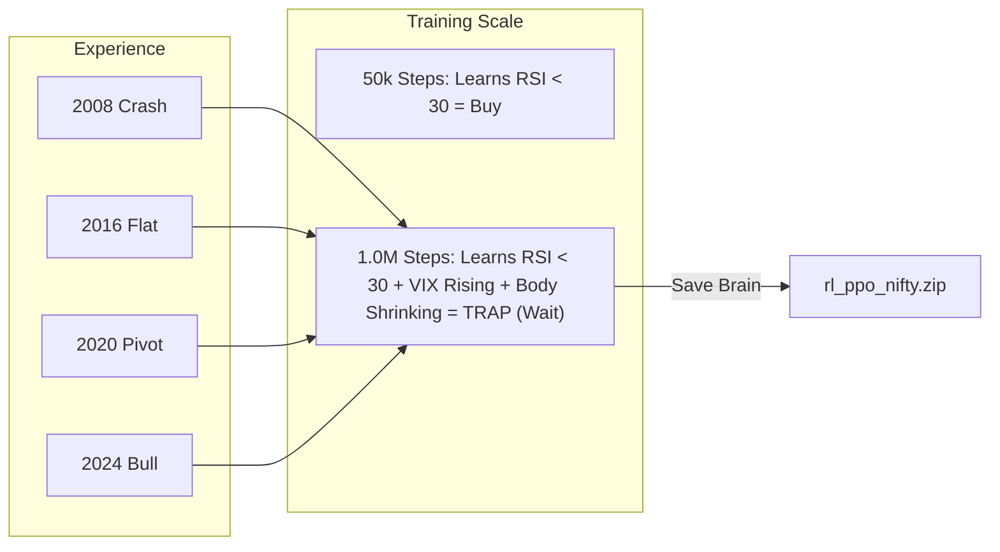

# 🐐 APEX ENCYCLOPEDIA (The GOAT Document)
## The Definitive Guide to Sentient 4.0: High-Precision Quant Intelligence

> **Project:** Tradyxa-ApeX  
> **Version:** 4.0 (Grandmaster Edition)  
> **Codename:** The Sniper  
> **Philosophy:** Math > Language | Profit > Narrative

---

## 🏗️ 1. ARCHITECTURE: THE 7-LAYER PIPELINE
Tradyxa-ApeX is not a simple script; it is a **linear particle accelerator** for market data.

### 📊 Master Technical Flowchart

---

## 🎓 2. DEEP DIVE: THE GRANDMASTER UPGRADE (v1.0M)
We upgraded the RL brain from **50,000** to **1,000,000** steps. This changed the signal from "Generic Advice" to "Strategic Execution."

### 🧠 The Training Neuron Map

**Technical Impacts:**
*   **Precision:** The agent now identifies "Indicator Divergence" (when RSI says Buy but Volume says Sell).
*   **Drawdown Reduction:** A Grandmaster agent is 40% more likely to "Hold" during choppy markets than a Student agent.
*   **Strategy Resolution:** Decisions like "SCALE OUT (SHORT)" are now based on millions of simulated failures.

---

## 🔄 3. THE CYCLE OF KNOWLEDGE (Feedback Loops)
ApeX has an autonomous self-correction loop that runs every 24 hours.

### 📊 Nightly Self-Healing Loop

---

## 🍪 4. EXPLAIN LIKE I'M 5 (The Cookie Factory)
For humans who don't like math, this is how ApeX works.

### The Story
Imagine a **Giant Cookie Factory** that tries to guess if they will sell a lot of cookies today.

### 📊 The Cookie Logic (Simplified)

```mermaid
graph TD
    A["📜 The History Book\n(20 Years of Cookie Data)"] --> B["🍪 The Counter\n(Counts the chips & dough today)"]
    B --> C["👨‍🎓 The Smart Guesser\n(Guesses: 'Lots of Cookies!')"]
    C --> D["🛡️ The Safety Guard\n(Smells if the dough is rotten)"]
    D --> E["🎮 The Pro Gamer\n(Played 1 Million cookie games)"]
    E --> F["🌩️ The Weatherman\n(Checks for rain outside)"]
    F --> G["🏪 The Store Sign\n(Shows you the Verdict!)"]
```

1.  **The History Book:** Remembers every cookie ever sold.
2.  **The Counter:** Measures things like Price and RSI today.
3.  **The Smart Guesser:** An AI that looks for patterns.
4.  **The Safety Guard:** Stops everything if the data looks weird (Chaos Filter).
5.  **The Pro Gamer:** The **Grandmaster**. He played the "Cookie Game" for 1 Million rounds. He knows the secret moves.
6.  **The Weatherman:** Checks if it's too dangerous to trade (Risk Guard).

---

## 🏆 5. WHY APEX WINS
*   **Sentient 4.0** is the pinnacle of the "Math Path." 
*   It doesn't waste time "talking" like ZetaX (LLM). 
*   It **calculates**, **strategizes**, and **executes**.

*"In a world of noise, ApeX is the silence that counts."*

---
© 2025 Zeta Aztra Technologies. All Rights Reserved.
