🎯 UNIVERSAL CORE LOGIC PIPELINE v1.0
## The Absolute Standard for Tradyxa Projects

> [!IMPORTANT]
> This is a **model-agnostic** pipeline. It works with ANY ML models (HMM, RF, XGB, LSTM, etc.). The pipeline is the **orchestration logic**, not the models themselves.

---

## 🏛️ THE PIPELINE ARCHITECTURE

```mermaid
flowchart TB
    subgraph LAYER0["⏰ REAL-TIME FEED (Every 30 Min)"]
        SPOT[("🔴 LIVE SPOT PRICE<br/>Polled Every 30 Min")]
        MACRO[("🌍 MACRO DATA<br/>DXY / VIX / Yields")]
    end

    subgraph LAYER1["LAYER 1: DATA INGESTION"]
        A1[Historical Archive<br/>20 Years .pkl Models]
        SPOT --> B1[Live Feature Builder]
        MACRO --> B1
        A1 --> B1
        B1 --> C1[Normalized Feature Vector<br/>with Live Context]
    end

    subgraph LAYER2["LAYER 2: HERITAGE VERDICT (V1)"]
        C1 --> E1[Heritage Models<br/>Trained on 20-Year Data]
        SPOT -.->|"Live Price Input"| E1
        E1 --> F1[Raw Probability]
        F1 --> G1["VERDICT 1<br/>(Heritage Signal)"]
    end

    subgraph LAYER3["LAYER 3: REFLEX AUDIT (V2)"]
        G1 --> H1[Error Log<br/>Last 30 Days]
        H1 --> I1[Reflex Model<br/>Bias Detection]
        MACRO -.->|"Macro Context"| I1
        I1 --> J1["VERDICT 2<br/>(Correction Factor)"]
    end

    subgraph LAYER4["LAYER 4: FUSION (V3)"]
        G1 --> K1[Fusion Engine]
        J1 --> K1
        SPOT -.->|"Live Recalibration"| K1
        K1 --> L1["VERDICT 3<br/>(Fused Signal)"]
    end

    subgraph LAYER5["LAYER 5: VETO GATE"]
        L1 --> M1{Chaos Filter}
        MACRO -.->|"VIX Check"| M1
        M1 -->|PASS| N1[FINAL VERDICT]
        M1 -->|FAIL| O1[HARD VETO]
    end

    subgraph LAYER6["LAYER 6: FEEDBACK LOOP"]
        N1 --> P1[Prediction Logger]
        P1 --> Q1[T+1 Outcome Fetch]
        Q1 --> R1[Accuracy Tracker]
        R1 --> H1
    end

    style SPOT fill:#ff6b6b,color:#fff
    style MACRO fill:#4ecdc4,color:#fff
```



---

## ⏰ THE 30-MINUTE MIXING LOGIC

The Live Spot Price feeds into **THREE places**:

```mermaid
flowchart LR
    SPOT[("🔴 SPOT PRICE<br/>Every 30 Min")] --> L2["LAYER 2<br/>Heritage Models"]
    SPOT --> L4["LAYER 4<br/>Fusion Engine"]
    SPOT --> FEATURES["Feature Builder<br/>(RSI, MACD, etc.)"]
    
    L2 --> |"V1 uses live indicators"| V1[Verdict 1]
    V1 --> L4
    L4 --> |"V3 recalibrates with live price"| V3[Verdict 3]
```



### Why This Matters:

| Without Live Mixing | With Live Mixing (Every 30 Min) |
|:--------------------|:-------------------------------|
| Heritage models use stale data | Heritage models use live indicators (RSI, MACD calculated on current price) |
| Verdict is fixed for the day | Verdict updates every 30 minutes during market hours |
| Missing intraday moves | Captures intraday regime shifts |
| Static prediction | Dynamic, adaptive prediction |

---

## � THE MARKET HOURS CYCLE

### Complete 24-Hour Institutional Loop:

```mermaid
graph TD
    subgraph MORNING["🌅 PHASE 1: ANTHOGENESIS (Pre-Market)"]
        A1[Load 20-Year .pkl Models] --> A2[Fetch Latest Historical Data]
        A2 --> A3["Generate Baseline V1<br/>(Before Market Opens)"]
    end

    subgraph MARKET["📊 PHASE 2: SYNAPSIS (Market Hours 9:15 AM - 3:30 PM)"]
        B1[("🔴 Fetch Spot Price<br/>Every 30 Min")] --> B2[Recalculate Features<br/>RSI, MACD, ATR with LIVE price]
        B2 --> B3[Run Heritage Models<br/>with Live Indicators]
        B3 --> B4["Update V1<br/>(Heritage + Live)"]
        B4 --> B5[Apply Reflex Correction V2]
        B5 --> B6["Generate V3<br/>(Fused with Live Context)"]
        B6 --> B1
    end

    subgraph CLOSE["🔒 PHASE 3: THE LOCK (3:30 PM)"]
        C1[Capture Final Spot Price] --> C2[Lock Final Verdict for the Day]
        C2 --> C3[Write to predictions.csv]
    end

    subgraph AUDIT["🧠 PHASE 4: THE AUDIT (Next Day 3:30 PM)"]
        D1[Read Yesterday's Prediction] --> D2[Fetch Actual Close from yfinance]
        D2 --> D3[Compare: Was V3 Correct?]
        D3 --> D4[Update Error Log]
        D4 --> D5[Feed into Layer 3 for Tomorrow]
    end

    MORNING --> MARKET
    MARKET --> CLOSE
    CLOSE --> AUDIT
    AUDIT -.->|"Error Log Updates"| MORNING
```



### The 30-Minute Polling Schedule (IST):

| Time | Action | Live Data Used |
|:-----|:-------|:---------------|
| 9:00 AM | Pre-market preparation | Historical only |
| **9:15 AM** | Market opens, first poll | ✅ Live spot price |
| 9:45 AM | Poll #2 | ✅ Live spot, 30-min OHLC |
| 10:15 AM | Poll #3 | ✅ Live spot, 1-hour OHLC |
| ... | Every 30 minutes | ✅ All live data |
| **3:00 PM** | Last regular poll | ✅ Full day's data |
| **3:30 PM** | Market close, FINAL LOCK | ✅ Closing price |

### What Happens Each 30-Minute Poll:

```python
def thirty_minute_poll():
    """
    This runs EVERY 30 MINUTES during market hours.
    It MIXES the live spot price with the heritage models.
    """
    
    # 1. Fetch LIVE spot price (not cached)
    live_spot = yfinance.download(symbol, period="1d")['Close'].iloc[-1]
    
    # 2. Fetch recent 1-year data (for indicators)
    historical = yfinance.download(symbol, period="1y")
    
    # 3. APPEND live spot to historical (THIS IS THE MIXING)
    historical.loc[datetime.now()] = {
        'Open': live_spot, 'High': live_spot, 
        'Low': live_spot, 'Close': live_spot
    }
    
    # 4. Recalculate ALL indicators with live price
    features = calculate_features(historical)
    # NOW RSI, MACD, etc. include the live price!
    
    # 5. Run heritage models on LIVE-MIXED features
    verdict_1 = heritage_models.predict(features)
    
    # 6. Apply reflex correction
    verdict_2 = reflex_audit(verdict_1, error_log)
    
    # 7. Fuse into V3
    verdict_3 = fuse(verdict_1, verdict_2)
    
    return verdict_3
```

### The Key Insight:

> [!IMPORTANT]
> **The Heritage .pkl models are FROZEN** - they were trained on 20 years of data and don't change during the day.
> 
> **BUT** - the FEATURES fed to them are LIVE. Every 30 minutes:
> 1. New spot price → recalculates RSI, MACD, Bollinger Bands
> 2. Heritage models see these live indicators
> 3. Output changes based on where spot price is NOW vs historical patterns

```
FROZEN: The .pkl model weights (trained weekly)
LIVE:   The feature vector (recalculated every 30 min)
RESULT: Same model, different inputs → different verdict
```

---

## �📋 THE 6 LAYERS (Mandatory for Both Projects)

### LAYER 1: DATA INGESTION
**Purpose**: Get clean, normalized data into the system.

```python
def layer_1_data_ingestion(symbol: str) -> dict:
    """
    INPUT:  Symbol (e.g., '^NSEI', '^NSEBANK')
    OUTPUT: Normalized feature vector
    
    RULES:
    1. Fetch live price (real-time)
    2. Fetch 1-year historical data (for indicators)
    3. Calculate all features (RSI, MACD, ATR, etc.)
    4. Normalize features to [0, 1] or Z-score
    5. Return as dictionary with timestamp
    """
    live_price = fetch_live_price(symbol)
    historical = fetch_historical(symbol, period="1y")
    features = calculate_all_features(historical, live_price)
    normalized = normalize_features(features)
    
    return {
        "timestamp": datetime.now().isoformat(),
        "symbol": symbol,
        "spot_price": live_price,
        "features": normalized
    }
```

---

### LAYER 2: HERITAGE VERDICT (V1)
**Purpose**: Generate the base prediction from long-term trained models.

```python
def layer_2_heritage_verdict(features: dict, models: dict) -> dict:
    """
    INPUT:  Normalized features, trained heritage models (20Y)
    OUTPUT: Verdict 1 (Heritage Signal)
    
    RULES:
    1. Load ALL heritage models (HMM, RF, XGB, etc.)
    2. Run inference on each model
    3. Collect raw probabilities
    4. Ensemble into single Heritage Verdict
    5. DO NOT apply any correction yet
    """
    predictions = {}
    
    for model_name, model in models.items():
        prob = model.predict_proba(features)[1]  # Bullish probability
        predictions[model_name] = prob
    
    # Simple weighted average (weights from training accuracy)
    heritage_prob = weighted_average(predictions, model_weights)
    
    # Convert to verdict
    if heritage_prob > 0.65:
        verdict_1 = "BULLISH"
    elif heritage_prob < 0.35:
        verdict_1 = "BEARISH"
    else:
        verdict_1 = "NEUTRAL"
    
    return {
        "verdict_1": verdict_1,
        "heritage_prob": heritage_prob,
        "model_breakdown": predictions
    }
```

---

### LAYER 3: REFLEX AUDIT (V2)
**Purpose**: Detect if the Heritage model is currently biased/drifting.

```python
def layer_3_reflex_audit(verdict_1: dict, error_log: list) -> dict:
    """
    INPUT:  Verdict 1, last 30 days of prediction errors
    OUTPUT: Verdict 2 (Correction Factor)
    
    RULES:
    1. Load last 30 predictions and their outcomes
    2. Calculate recent accuracy of Verdict 1
    3. Identify bias pattern (over-bullish? over-bearish?)
    4. Generate correction factor
    5. This layer ONLY looks at errors, not raw prices
    """
    recent_errors = error_log[-30:]  # Last 30 days
    
    # Count directional errors
    over_bullish = sum(1 for e in recent_errors 
                       if e['predicted'] == 'BULLISH' and e['actual'] == 'DOWN')
    over_bearish = sum(1 for e in recent_errors 
                       if e['predicted'] == 'BEARISH' and e['actual'] == 'UP')
    
    total_predictions = len(recent_errors)
    
    # Calculate correction factor
    if total_predictions > 5:
        bullish_error_rate = over_bullish / total_predictions
        bearish_error_rate = over_bearish / total_predictions
        
        # Bias detection
        if bullish_error_rate > 0.4:
            correction = -0.15  # System is over-bullish, dampen
        elif bearish_error_rate > 0.4:
            correction = +0.15  # System is over-bearish, boost
        else:
            correction = 0.0  # No bias detected
    else:
        correction = 0.0  # Not enough data
    
    return {
        "verdict_2": correction,
        "bias_detected": "OVER_BULLISH" if correction < 0 else "OVER_BEARISH" if correction > 0 else "NONE",
        "reflex_accuracy": (total_predictions - over_bullish - over_bearish) / max(total_predictions, 1)
    }
```

---

### LAYER 4: FUSION (V3)
**Purpose**: Combine Heritage + Reflex into final signal.

```python
def layer_4_fusion(verdict_1: dict, verdict_2: dict) -> dict:
    """
    INPUT:  Verdict 1 (Heritage), Verdict 2 (Correction)
    OUTPUT: Verdict 3 (Fused Signal)
    
    THE FUSION FORMULA:
    Fused_Probability = Heritage_Prob + Correction_Factor
    
    RULES:
    1. Apply correction to heritage probability
    2. Clamp result to [0, 1]
    3. Generate final stance
    4. Calculate confidence level
    """
    heritage_prob = verdict_1['heritage_prob']
    correction = verdict_2['verdict_2']
    
    # THE CORE FORMULA
    fused_prob = heritage_prob + correction
    fused_prob = max(0.0, min(1.0, fused_prob))  # Clamp to [0, 1]
    
    # Generate stance (5 levels)
    if fused_prob >= 0.70:
        stance = "BULLISH"
    elif fused_prob >= 0.55:
        stance = "LEAN BULLISH"
    elif fused_prob <= 0.30:
        stance = "BEARISH"
    elif fused_prob <= 0.45:
        stance = "LEAN BEARISH"
    else:
        stance = "NEUTRAL"
    
    # Confidence = distance from 0.5
    confidence = abs(fused_prob - 0.5) * 2  # 0 at 50%, 1 at 0% or 100%
    
    return {
        "verdict_3": stance,
        "fused_prob": fused_prob,
        "confidence": confidence,
        "heritage_contribution": heritage_prob,
        "reflex_contribution": correction
    }
```

---

### LAYER 5: VETO GATE
**Purpose**: Override all signals if market is too chaotic.

```python
def layer_5_veto_gate(verdict_3: dict, market_data: dict) -> dict:
    """
    INPUT:  Verdict 3, current market conditions
    OUTPUT: Final Verdict (or VETO)
    
    VETO CONDITIONS (ANY triggers veto):
    1. VIX > 25 (extreme fear)
    2. Intraday range > 2% (wild swings)
    3. Confidence < 0.3 (weak signal)
    4. Regime = CHAOTIC (from HMM)
    
    RULES:
    1. Check all veto conditions
    2. If ANY triggers, output HARD VETO
    3. If none trigger, pass Verdict 3 through
    """
    veto_triggered = False
    veto_reasons = []
    
    # Condition 1: VIX threshold
    if market_data.get('vix', 0) > 25:
        veto_triggered = True
        veto_reasons.append("VIX > 25")
    
    # Condition 2: Intraday range
    intraday_range = (market_data['high'] - market_data['low']) / market_data['close']
    if intraday_range > 0.02:
        veto_triggered = True
        veto_reasons.append("Range > 2%")
    
    # Condition 3: Low confidence
    if verdict_3['confidence'] < 0.3:
        veto_triggered = True
        veto_reasons.append("Confidence < 30%")
    
    # Condition 4: Chaotic regime
    if market_data.get('regime') == 'CHAOTIC':
        veto_triggered = True
        veto_reasons.append("Regime = CHAOTIC")
    
    if veto_triggered:
        return {
            "final_verdict": "HARD VETO",
            "veto_triggered": True,
            "veto_reasons": veto_reasons,
            "action": "NO TRADE - Wait for clarity"
        }
    else:
        return {
            "final_verdict": verdict_3['verdict_3'],
            "veto_triggered": False,
            "fused_prob": verdict_3['fused_prob'],
            "confidence": verdict_3['confidence'],
            "action": get_action_recommendation(verdict_3['verdict_3'])
        }
```

---

### LAYER 6: FEEDBACK LOOP
**Purpose**: Learn from outcomes to improve future predictions.

```python
def layer_6_feedback_loop(prediction: dict, actual_outcome: dict) -> dict:
    """
    INPUT:  Yesterday's prediction, today's actual outcome
    OUTPUT: Updated error log, accuracy metrics
    
    RULES:
    1. Compare prediction vs actual
    2. Log the error (if any)
    3. Update 30-day sliding window
    4. Calculate rolling accuracy
    5. This feeds back into LAYER 3
    """
    predicted_direction = prediction['final_verdict']
    actual_direction = "UP" if actual_outcome['change_pct'] > 0.1 else \
                       "DOWN" if actual_outcome['change_pct'] < -0.1 else "FLAT"
    
    # Determine correctness
    correct = (
        (predicted_direction in ['BULLISH', 'LEAN BULLISH'] and actual_direction == 'UP') or
        (predicted_direction in ['BEARISH', 'LEAN BEARISH'] and actual_direction == 'DOWN') or
        (predicted_direction == 'NEUTRAL' and actual_direction == 'FLAT')
    )
    
    # Create error log entry
    error_entry = {
        "date": prediction['date'],
        "predicted": predicted_direction,
        "actual": actual_direction,
        "correct": correct,
        "change_pct": actual_outcome['change_pct']
    }
    
    # Append to error log
    error_log.append(error_entry)
    
    # Maintain 30-day window
    if len(error_log) > 30:
        error_log.pop(0)
    
    # Calculate rolling accuracy
    rolling_accuracy = sum(1 for e in error_log if e['correct']) / len(error_log)
    
    return {
        "error_logged": True,
        "was_correct": correct,
        "rolling_accuracy": rolling_accuracy,
        "window_size": len(error_log)
    }
```

---

## 🔄 THE COMPLETE PIPELINE FLOW

```python
def run_universal_pipeline(symbol: str) -> dict:
    """
    THE COMPLETE UNIVERSAL CORE LOGIC PIPELINE
    
    This is the single entry point that orchestrates all 6 layers.
    Works with ANY ML models you plug in.
    """
    
    # LAYER 1: Get data
    data = layer_1_data_ingestion(symbol)
    
    # LAYER 2: Heritage verdict from your trained models
    verdict_1 = layer_2_heritage_verdict(data['features'], HERITAGE_MODELS)
    
    # LAYER 3: Reflex audit (error awareness)
    verdict_2 = layer_3_reflex_audit(verdict_1, ERROR_LOG)
    
    # LAYER 4: Fusion
    verdict_3 = layer_4_fusion(verdict_1, verdict_2)
    
    # LAYER 5: Veto gate
    final = layer_5_veto_gate(verdict_3, data)
    
    # Package result
    return {
        "timestamp": data['timestamp'],
        "symbol": symbol,
        "spot_price": data['spot_price'],
        "verdict_1": verdict_1,  # Heritage
        "verdict_2": verdict_2,  # Correction
        "verdict_3": verdict_3,  # Fused
        "final": final,          # After veto check
        "pipeline_version": "1.0"
    }
```

---

## 📊 REQUIRED CSV SCHEMA (Mandatory for Both Projects)

```csv
date,timestamp,symbol,spot_price,verdict_1,verdict_1_prob,verdict_2_correction,verdict_3,verdict_3_prob,confidence,veto_triggered,veto_reasons,final_verdict,outcome_direction,outcome_change_pct,was_correct
2025-12-23,10:00:00,^NSEI,26177,BULLISH,0.72,-0.05,LEAN BULLISH,0.67,0.34,False,,LEAN BULLISH,UP,0.58,True
```

| Column | Description |
|:-------|:------------|
| `verdict_1` | Heritage model output (before correction) |
| `verdict_1_prob` | Raw probability from heritage models |
| `verdict_2_correction` | Correction factor from reflex audit |
| `verdict_3` | Fused verdict (after correction) |
| `verdict_3_prob` | Fused probability |
| `confidence` | Signal strength (0-1) |
| `veto_triggered` | Was the veto gate triggered? |
| `final_verdict` | The actual output (may be HARD VETO) |
| `was_correct` | T+1 verification |

---

## 🎯 THE 5 VERDICT STANCES (Standard Output)

| Stance | Probability Range | Action |
|:-------|:------------------|:-------|
| **BULLISH** | ≥ 70% | Buy dips, sell puts |
| **LEAN BULLISH** | 55-70% | Small longs, tight stops |
| **NEUTRAL** | 45-55% | Range trade or wait |
| **LEAN BEARISH** | 30-45% | Stay light, hedge |
| **BEARISH** | ≤ 30% | Sell rallies, buy puts |
| **HARD VETO** | Any (chaos) | NO TRADE |

---

## ✅ IMPLEMENTATION CHECKLIST

### For DeltaX (AuztinX):
- [ ] Rename `ML1` → `Heritage Models` (Layer 2)
- [ ] Rename `ML2` → `Reflex Audit` (Layer 3)
- [ ] Standardize CSV to new schema
- [ ] Implement veto gate with 4 conditions
- [ ] Add `verdict_1_prob` and `verdict_2_correction` to logs

### For ZetaX:
- [ ] Add Layer 3 (Reflex Audit) - currently missing
- [ ] Separate logging for V1/V2/V3
- [ ] Replace decaying learning rate with 30-day window
- [ ] Add veto gate with 4 conditions
- [ ] Upgrade CSV schema

---

## 🔐 THE GOLDEN RULES

1. **Heritage models NEVER see error logs** - They only see historical prices
2. **Reflex layer ONLY sees errors** - It predicts correction, not direction
3. **Fusion is ARITHMETIC** - `V3 = V1 + V2`, not a model
4. **Veto is BINARY** - One trigger = full veto, no partial
5. **Feedback is DELAYED** - T+1 only, never same-day
6. **Window is FIXED** - Always 30 days, no decay

---

*Universal Core Logic Pipeline v1.0 - Designed for Tradyxa Projects*
