# 🔮 AuztinX: The Axiom Living Brain

<p align="center">
  <br/>
  <strong>NIFTY • BANKNIFTY • Institutional AI</strong><br/>
  <em>Stop guessing. Start trading with Sentient Intelligence.</em>
</p>

---

## 💬 From the Creator

> **"AuztinX isn't just a dashboard; it's a multi-generational leap in retail trading."**
>
> Legacy systems (DeltaX/RubiX) were reactive—they adjusted after the damage was done. **AuztinX 4.0** is sentient. It anticipates market shifts by fusing 20 years of "Ancestral Wisdom" with a 30-day "Tactical Reflex."
>
> **This is 100% free. No signup. No paywall. No BS.**

---

## 🎯 Architecture: The Living Brain 4.0

```mermaid
flowchart TB
    subgraph HERITAGE["🏛️ THE FLOODLIGHT: Ancestral DNA (20Y)"]
        direction TB
        DB[("Historical Archive<br/>20 Years OHLCV")] --> ML1["Master Brain (ML1)"]
    end

    subgraph REFLEX["⚡ THE SPOTLIGHT: Tactical Reflex (30D)"]
        direction TB
        CSV[("Recent Logs<br/>predictions.csv")] --> ML2["Apprentice Brain (ML2)"]
    end

    subgraph FUSION["🧠 AXIOM COMMAND"]
        ML1 & ML2 --> V3["Verdict 3: Fused Intelligence"]
        SPOT[("Live 30-min Spot<br/>DXY / VIX / Yields")] --> V3
    end

    subgraph GUARD["🛡️ RED TEAM: Institutional Veto"]
        V3 --> RT{Z-Score Filter}
        RT -->|PASS| EXEC["Executive Verdict"]
        RT -->|FAIL| VETO["HARD VETO"]
    end

    subgraph UI["🖥️ Cinematic Dashboard"]
        EXEC --> TILES["16 Sentient Tiles"]
    end

    EXEC -.->|"Marking Homework"| REFLEX
```



---

## 🔬 The 4 Pillars of Intelligence

### 1. The Master (ML1) - Ancestral Wisdom
Trained on **20 years of market behavior**. It knows the DNA of 2008, 2016, and 2020. This is the foundation of the market verdict.

### 2. The Apprentice (ML2) - Tactical Reflex
A secondary model trained on the **residual errors** of the Master. Using a **30-day sliding window**, it identifies if the Master is currently "drifting" off-course due to new market regimes.

### 3. The Red Team - Military-Grade Veto
An independent logic layer that performs a **Hard Veto** if the market environment becomes too chaotic (high kurtosis or regime shift).

### 4. The Executive Synthesis
An LLM-driven reasoning layer that translates complex math into plain English verdicts, resolving conflicts between different analytical modules.

---

## 📁 Project Structure

```
Tradyxa-AuztinX/
├── .github/workflows/
│   └── daily_inference.yml  # Inference -> Logging -> Self-Correction
├── engine/
│   ├── scripts/
│   │   ├── prediction_logger.py  # No-Loss persistent archiving
│   │   └── online_learner.py    # T+1 Reflexive learning (30D window)
│   └── logs/
│       ├── predictions.csv      # The Perpetual Audit Trail
│       └── brain_state.json     # The Brain Diary (Adaptive Weights)
├── scripts/
│   ├── predict.py           # Multi-brain Fusion (20Y Heritage)
│   └── jump_adaptive_kalman.py # Exotic Math Core
├── models/                  # ML1 Heritage Model Brains
├── public/data/
│   └── auztinx_data.json    # The 16-Tile Payload
└── App.tsx                  # Cinematic React Frontend
```

---

## ⏰ Workflow Schedules

| Workflow | Schedule | Purpose |
|----------|----------|---------|
| `daily_inference.yml`| Every 30 min (market hours)| Inference + No-Loss Logging + Reflex Learning |

---

## 📊 The 16 Sentient Tiles

AuztinX monitors the market across 4 disciplines:
1. **Senses**: Spot Price, India VIX.
2. **Exotic Math**: Jump-Adaptive Trend, SNR Fourier, GJR-GARCH.
3. **Institutional Logic**: Red Team Veto, Dealer Pos (GEX), Smart PCR.
4. **Sentient Reasoning**: AI Consensus, Executive Verdict.

---

## 🚀 Local Development

```bash
# Install frontend dependencies
npm install

# Run development server
npm run dev

# Run full Sentient Loop locally
python engine/scripts/online_learner.py
python scripts/predict.py
```

---

## 🔐 Disclaimer

> ⚠️ **Educational Use Only**  
> This dashboard is for informational purposes. Nothing here is financial advice.  
> Trading involves substantial risk. Always consult a licensed advisor.

---

<p align="center">
  <strong>AuztinX</strong> — Where Intelligence Becomes Sentient
</p>
