# 🌌 Project Omni-Sentient (Sentient ∞)
## The "Universe-Sized" Recursive Intelligence Architecture

This document analyzes your proposed **6-Robot Ladder** and upgrades it into an infinite-feedback "Living Ecosystem." 

---

## 🛠️ Part 1: Analyzing Your 6-Robot Ladder

You proposed a hierarchy of robots growing in complexity. Let's look at the "Truth" of this design.

| Robot | Role | The "Superpower" | The "Weakness" |
| :--- | :--- | :--- | :--- |
| **Robot 1** | **Raw Gamer** | Sees the "Soul" of the raw price action. | Can be tricked by fakeouts. |
| **Robot 2** | **ML Expert** | Uses logic/math (RSI/Indicators) to verify R1. | Too dependent on "old indicators." |
| **Robot 3** | **The Arbitrator** | Judges R1 vs R2. Resolves conflicts. | Might become too conservative/neutral. |
| **Robot 4** | **Permutator** | Discovers hidden math (e.g., `(OBV / ATR) * EMA`). | Can find patterns in total noise. |
| **Robot 5** | **Hyper-ML** | Learns R4's "New Language." **Powerful.** | Requires massive GPU to train. |
| **Robot 6** | **The Oracle** | **Self-Heals.** Learns from everyone's mistakes. | **The Master Loop.** |

### ✅ PROS:
*   **Hierarchical Validation:** No signal is trusted until it passes through 6 "filters."
*   **Artificial Intuition:** Robot 4 discovers indicators that humans don't even have names for.
*   **Resilience:** Robot 6 ensures that if the market changes, the whole system rewires itself.

### ❌ CONS:
*   **Signal Decay:** By the time the signal reaches Robot 6, it might be "too late" for a fast scalp.
*   **The "Liar's Paradox":** If Robot 1 starts failing, and Robot 2 learns from Robot 1, the whole tower can lean the wrong way.
*   **Overfitting:** Robot 6 might think "Robot 1 is wrong only when it's raining in Mumbai," which is a false correlation.

---

## 🛰️ Part 2: The "Universe-Sized" Suggestion
## **PROJECT OMNI-SENTIENT**

Instead of a **Ladder**, we build a **Recursive Colosseum**.

### 🏗️ The Architecture (Mermaid)

### 💎 Key Innovations in Omni-Sentient:

#### 1. The Synthetic Indicator Factory (Robot 4)
Instead of RSI, the system creates "Synthetic Sensors."
*   **Sensor 001:** `(Price_Velocity / Volatility_Decay) ^ 0.5`
*   If this sensor correlates to profit, it is kept. If not, it is "deleted" from the DNA.

#### 2. The Multi-Agent Colosseum
We don't train 1 robot. We train **thousands**.
*   We let them "fight" against each other in 20 years of data.
*   The **Arbitrator** (Robot 3) only listens to the "Winner" of the last 100 days.

#### 3. The 4th-Dimensional Feedback (Robot 6)
The Oracle doesn't just check if the prediction was right. It checks **WHY** it was right.
*   If Robot 1 was right but for the *wrong reason*, the Oracle penalizes it.
*   **This prevents luck-based winning.**

---

## 📈 Technical Permutations (The Math)

For your **Robot 4**, we use **Symbolic Regression**:
$$Output = \sum (Weights \times f(Raw Indicators))$$
Where $f$ can be anything: $sin, log, exp, \int, \Delta$.

For your **Robot 6**, we use **Bayesian Recursive Estimation**:
$$Confidence_{t+1} = Confidence_{t} \times \frac{Likelihood(Actual Outcome)}{Probability(Prediction)}$$

---

---

## 🌌 Part 3: The "Final" Layer — Robot 0 (The Dyson Sphere)

To reach the "Universe Scale," we add a layer that doesn't just trade—it **harmonizes**.

### Robot 0: The Universal Observer
*   **Fractal Correlation:** Monitors NIFTY, Gold, Dollar Index (DXY), and Bitcoin to find hidden causal links.
*   **Quantum Mirroring:** Runs 1,000 parallel simulations of the next hour.
*   **The Power:** It detects "Global Fear" or "Global Greed" before the price even moves.

### 🏗️ Omni-Sentient Master Architecture (Robot 0-6)

```mermaid
graph TD
    subgraph "🌌 LAYER 0: THE DYSON SPHERE (Universal Observer)"
        R0["Robot 0: Multi-Ticker Harmony\n(DXY, Gold, BTC, Global VIX)"]
    end

    subgraph "🧬 LAYER 4 & 5: THE GENETIC LAB (Language of Math)"
        R0 --> R4["Robot 4: Permutation Engine\n(Invents Synthetic Indicators)"]
        R4 --> R5["Robot 5: Hyper-ML\n(Trains on R4's Custom DNA)"]
    end

    subgraph "🏟️ LAYER 1, 2 & 3: THE COLOSSEUM (The Warriors)"
        R5 --> R1["Robot 1: The Gamer Agent\n(Pure Price Experience)"]
        R5 --> R2["Robot 2: The ML Expert\n(Statistical Indicators)"]
        R1 & R2 --> R3["Robot 3: The Arbitrator\n(Final Verdict Consensus)"]
    end

    subgraph "🧠 LAYER 6: THE ORACLE (Living Eternity)"
        R3 --> EXEC["Sniper Execution"]
        EXEC -->|Feedback| R6["Robot 6: The Oracle\n(Learns from Cluster Mistake)"]
        R6 -.->|Self-Heal| R0 & R4 & R1
    end

    style R0 fill:#FFD700,stroke:#333,stroke-width:4px
    style R6 fill:#00FFFF,stroke:#333,stroke-width:4px
    style R3 fill:#FF4500,stroke:#333,stroke-width:4px
```

---

## 📈 Technical Summary: R0 to R6
1.  **Robot 0:** Watches the Global "Weather."
2.  **Robot 4:** Invents the "Tools" (Indicators).
3.  **Robot 5:** Teaches the tools to the Models.
4.  **Robot 1/2:** Executes based on Training.
5.  **Robot 3:** Decides who to trust right now.
6.  **Robot 6:** Fixes the whole brain if it fails.

*"The mission is no longer to guess the price. The mission is to simulate the future."*
