# ApeX Living Brain 4.0: Architecture & Data Flow

## 🧠 Introduction: The "Double-Loop" Evolution

Your understanding is largely correct. ApeX has evolved from a simple linear predictor into a **Double-Loop Self-Learning System** (Living Brain 4.0).

Here is the breakdown of how the 30-minute fetch fits into the "Before" vs. "After" architecture.

---

### Phase 1: The Training Dojo (Nightly)
**Frequency:** Once per night (Post-market)
**Action:** 
1.  **Fetch:** 20 years of historical O-H-L-C data.
2.  **Feature Engineering:** Calculate RSI, MACD, GARCH Volatility, etc.
3.  **Training (Grandmaster):**
    *   **ML Model (XGBoost):** Learns patterns to predict *Direction* (Bullish/Bearish).
    *   **PPO Agent (Reinforcement Learning):** Learns *Strategy* (Long/Short/Hold) by playing millions of simulated trading games on this data.
4.  **Save:** Trained brains (`.json` and `.zip` files) are saved to the "Vault".

---

### Phase 3: The Live Arena (Market Hours)
**Frequency:** Every 30 Minutes (9:15 AM - 3:30 PM)

#### ❌ BEFORE (Old AuztinX/BetaX Era)
In the old system, the 30-minute run was just a "Refresh".
*   It fetched the data.
*   It ran the *same* daily prediction.
*   It just overwrote the display. 
*   **Problem:** It didn't distinguish between "What should I do for tomorrow?" (Positional) and "What is happening right now?" (Intraday).

#### ✅ AFTER (Living Brain 4.0)
Now, the 30-minute run serves a **Dual Purpose**.

1.  **Spot Price Fetch:** 
    *   The system fetches the **Live Spot Price** and constructs the "Developing Daily Candle".
    *   *Example:* At 11:30 AM, the "Daily Candle" includes data from 9:15 AM to 11:30 AM.

2.  **The Dual-Path Inference:**
    *   **Path A: Tomorrow's Direction (Daily Scope)**
        *   **Question:** "Based on the candle *so far*, where do we close tomorrow?"
        *   **Output:** The Main Verdict (e.g., BULLISH).
        *   **Role:** This is the *Strategic* view.
    *   **Path B: Live Momentum (Pulse)**
        *   **Question:** "What is the *immediate* pressure of this developing candle?"
        *   **Output:** The Momentum Verdict.
        *   **Role:** This is the *Tactical* view.
    *   *Note:* Currently, both use the **same core brain**, but because they run on *live, changing* data every 30 mins, the verdict evolves. If a sudden crash happens at 1:00 PM, the "Momentum" tile reacts instantly, updating your dashboard.

3.  **The Critical Difference: Memory**
    *   **Daily Loop:** The decision made at EOD (End of Day) is **Logged** into the `predictions.csv` file. This is "Long-Term Memory". The brain *learns* from this.
    *   **Intraday Loop:** The 30-min verdicts are **Ephemeral**. They guide you *now*, but they are NOT logged for training. We don't want the brain to obsess over 30-min noise. It only learns from the final outcome.

---

## 📊 Visualizing the Flow (Mermaid)

### 1. The "Before" Architecture (Linear)

### 2. The "After" Living Brain 4.0 (Dual-Track)

```mermaid
sequenceDiagram
    participant Market as 🌍 NSE Market
    participant Engine as ⚙️ ApeX Engine
    participant Brain as 🧠 Living Brain (Model)
    participant UI as 🖥️ Dashboard
    participant Log as 📜 Long-Term Memory

    loop Every 30 Mins
        Market->>Engine: Send Spot Price (Live Data)
        Engine->>Brain: "Analyze Developing Candle"
        
        par Dual Processing
            Brain->>Engine: Path A: Daily Forecast (Strategic)
            Brain->>Engine: Path B: Live Momentum (Tactical)
        end
        
        Engine->>UI: Update "Tomorrow's Direction" Tile
        Engine->>UI: Update "Live Momentum" & "PPO" Tiles
        
        Note right of Engine: verdicts are NOT saved to memory yet
    end

    Note over Engine, Log: 🌙 ORACLE CLOSING BELL (3:30 PM)
    
    Engine->>Log: Save FINAL Verdict to predictions.csv
    Log->>Brain: Nightly Re-Training (Learn from mistakes)
```

## 📝 Summary: Why this is better?
1.  **separation of Concerns:** You don't mix up a short-term scalp signal with a long-term trend signal.
2.  **Clean Memory:** The brain only learns from valid, completed daily candles, preventing "Overfitting" to intraday noise.
3.  **Live Adaptability:** The dashboard is no longer a static picture; it's a live pulse that updates with every tick of the 30-min clock.
