# Tradyxa Options Dashboard - Architecture & Reusability Guide

A comprehensive guide to the architecture, design patterns, and theme system of the Tradyxa Options Dashboard. This document enables you to recreate the entire website and reuse its code and theme for other projects.

---

## 📋 Table of Contents

1. [System Architecture](#system-architecture)
2. [Technology Stack](#technology-stack)
3. [Project Structure](#project-structure)
4. [Data Flow Architecture](#data-flow-architecture)
5. [Component Architecture](#component-architecture)
6. [Theme System](#theme-system)
7. [Ad Integration Architecture](#ad-integration-architecture)
8. [Deployment Architecture](#deployment-architecture)
9. [Reusability Guide](#reusability-guide)
10. [Quick Start for New Projects](#quick-start-for-new-projects)

---

## 🏗️ System Architecture

### High-Level Architecture

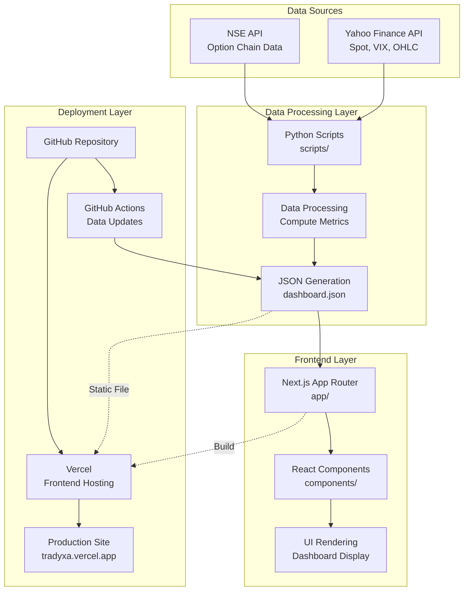

### Detailed Component Architecture

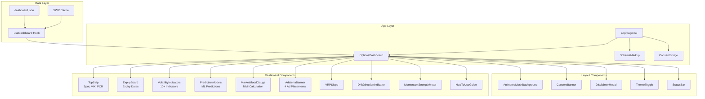

### Request/Response Flow

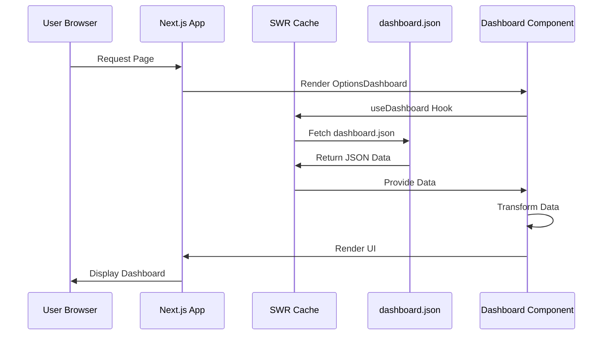

---

## 🛠️ Technology Stack

### Frontend

| Technology | Version | Purpose |
|------------|---------|---------|
| Next.js | 16.0.0 | React framework with App Router |
| React | 18.2.0 | UI library |
| TypeScript | 5.6.2 | Type safety |
| Tailwind CSS | 3.4.18 | Utility-first CSS |
| Framer Motion | 11.18.2 | Animations |
| Lucide React | 0.446.0 | Icons |
| SWR | 2.3.6 | Data fetching |

### Backend/Data Processing

| Technology | Version | Purpose |
|------------|---------|---------|
| Python | 3.12+ | Data processing |
| NumPy | >=1.24.0 | Numerical computations |
| Pandas | >=2.0.0 | Data manipulation |
| scikit-learn | >=1.3.0 | Machine learning |
| yfinance | >=0.2.0 | Market data |

### Deployment

| Service | Purpose |
|---------|---------|
| Vercel | Frontend hosting |
| GitHub Actions | CI/CD & data updates |
| GitHub | Version control |

---

## 📁 Project Structure

```
tradyx-options-dashboard/
├── app/                          # Next.js App Router
│   ├── about/                   # About page
│   ├── api/                     # API routes
│   │   └── ping/               # Health check endpoint
│   ├── components/              # App-specific components
│   │   ├── AnimatedMeshBackground.tsx
│   │   ├── SchemaMarkup.tsx
│   │   ├── SEOHead.tsx
│   │   └── visual/             # Visual components
│   ├── fonts/                   # Font directory (Google Fonts: Inter, JetBrains Mono, Manrope)
│   ├── legal/                   # Legal pages
│   │   ├── cookie-settings/
│   │   ├── cookies/
│   │   ├── disclaimer/
│   │   ├── privacy/
│   │   └── terms/
│   ├── globals.css              # Global styles & theme
│   ├── layout.tsx               # Root layout
│   ├── loading.tsx              # Loading page
│   ├── error.tsx                # Error page
│   ├── page.tsx                 # Main dashboard page
│   └── sitemap.ts               # Sitemap generator
│
├── components/                   # Shared React components
│   ├── ads/                     # Ad components
│   │   ├── AdConfig.ts         # Ad configuration
│   │   ├── AdsterraBanner.tsx  # Main ad component
│   │   ├── InfinityLoader.tsx  # Loading animation
│   │   └── SafeAdWrapper.tsx   # Error boundary
│   ├── dashboard/               # Dashboard components
│   │   ├── OptionsDashboard.tsx # Main dashboard
│   │   ├── TopStrip.tsx        # Top metrics bar
│   │   ├── ExpiryBoard.tsx     # Expiry dates
│   │   ├── VolatilityIndicators.tsx
│   │   ├── PredictionModels.tsx
│   │   ├── MarketMoodGauge.tsx
│   │   ├── VRPSlope.tsx
│   │   ├── DriftDirectionIndicator.tsx
│   │   ├── MomentumStrengthMeter.tsx
│   │   ├── GammaHeatmap.tsx
│   │   ├── IVSkewChart.tsx
│   │   ├── OITable.tsx
│   │   ├── WhaleAlerts.tsx
│   │   ├── QuickStats.tsx
│   │   ├── HowToUseGuide.tsx
│   │   ├── TileInfoModal.tsx
│   │   ├── DisclaimerModal.tsx
│   │   └── mmi.ts              # Market Mood Index calculation
│   ├── layout/                  # Layout components
│   │   ├── StatusBar.tsx
│   │   └── ThemeToggle.tsx
│   ├── ui/                      # UI components
│   │   └── LoadingSpinner.tsx  # Reusable spinner
│   ├── visual/                  # Visual components
│   │   └── Sparkline.tsx
│   ├── AdSlot.tsx
│   ├── ConsentBanner.tsx
│   ├── ConsentBridge.tsx
│   ├── EffectiveGateAd.tsx
│   ├── HighPerformanceAd.tsx
│   └── HighPerformanceAdSidebar.tsx
│
├── hooks/                        # React hooks
│   └── useDashboard.ts          # Dashboard data hook
│
├── lib/                          # Utility libraries
│   ├── fetcher.ts               # Data fetching utilities
│   ├── fmt.ts                   # Formatting utilities
│   ├── types.ts                 # TypeScript types
│   ├── schema.ts                # Zod schemas
│   ├── expiry.ts                # Expiry date calculations
│   └── logger.ts                # Logging utilities
│
├── scripts/                      # Python data generation
│   ├── data/                    # Generated JSON data
│   ├── fetch_nse_chain.py      # Fetch NSE option chain
│   ├── fetch_yf.py              # Fetch Yahoo Finance data
│   ├── fetch_predictions.py     # Fetch OHLC and sector data
│   ├── compute_metrics.py       # Compute option metrics
│   ├── compute_volatility_indicators.py
│   ├── compute_ml_predictions.py # ML predictions
│   ├── compute_breadth_momentum.py
│   ├── build_dashboard_json.py  # Build final JSON
│   ├── run_all.py               # Master script
│   ├── validate_production.py   # Data validation
│   ├── error_handler.py         # Error handling
│   ├── utils.py                 # Utility functions
│   ├── production_config.py     # Production config
│   ├── requirements.txt         # Python dependencies
│   └── README.md                # Scripts documentation
│
├── public/                       # Static assets
│   ├── data/                    # Dashboard JSON
│   │   └── dashboard.json       # Main data file
│   ├── ads/                     # Ad-related files
│   ├── ads.txt                  # Ad network declarations
│   └── robots.txt               # SEO robots file
│
├── .github/                      # GitHub Actions
│   └── workflows/
│       └── data-update.yml      # Automated data updates
│
├── next.config.js                # Next.js configuration
├── tailwind.config.js            # Tailwind CSS configuration
├── tsconfig.json                 # TypeScript configuration
├── package.json                  # Node.js dependencies
└── ARCHITECTURE.md               # This file
```

---

## 🔄 Data Flow Architecture

### Data Pipeline

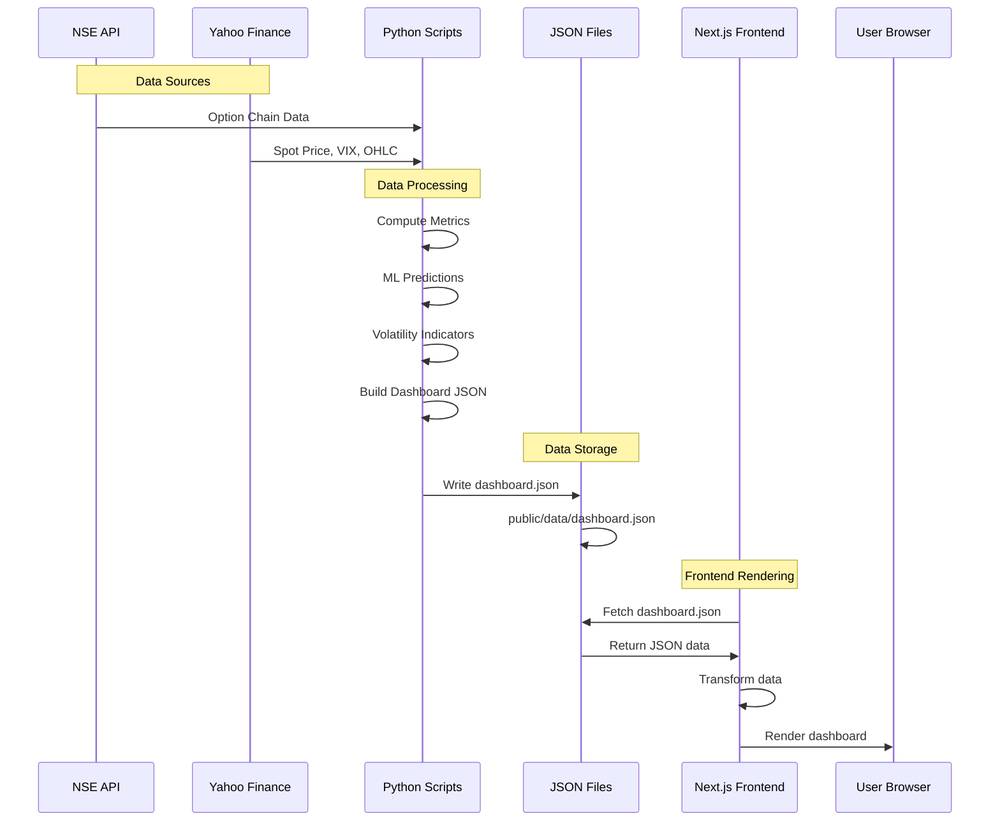

### Data Processing Flow

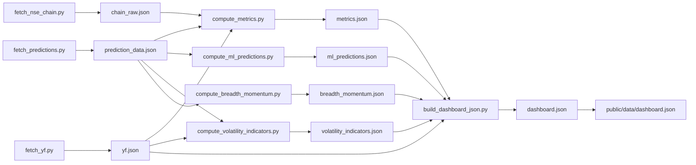

---

## 🧩 Component Architecture

### Component Structure

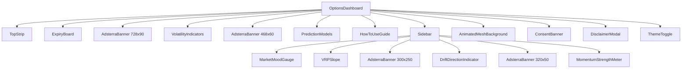

### Component Props Flow

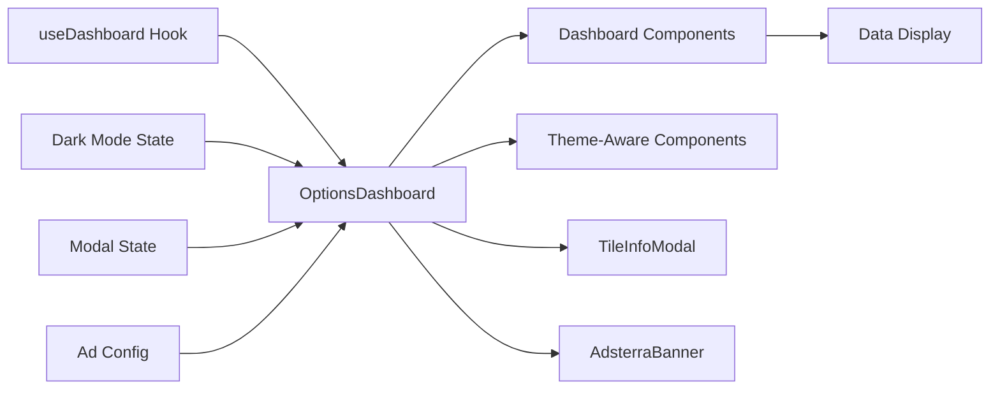

---

## 🎨 Theme System

### Theme Architecture

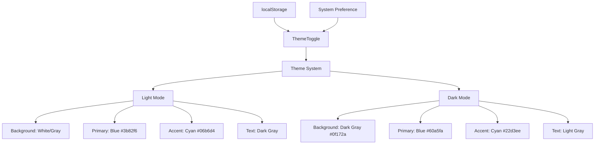

### Color Palette

The theme uses a sophisticated dark/light mode system with blue-cyan accents:

#### Light Mode
- **Background**: White/Gray gradients (`#ffffff`, `#f8fafc`)
- **Primary**: Blue (`#3b82f6`, `#60a5fa`, `#93c5fd`)
- **Accent**: Cyan (`#06b6d4`, `#22d3ee`)
- **Text**: Dark gray/Black (`#1e293b`, `#0f172a`)
- **Cards**: White with glass effect (`rgba(255, 255, 255, 0.6)`)

#### Dark Mode
- **Background**: Dark gray/Black (`#0f172a`, `#1e293b`, `#334155`)
- **Primary**: Blue (`#3b82f6`, `#60a5fa`, `#93c5fd`)
- **Accent**: Cyan (`#06b6d4`, `#22d3ee`)
- **Text**: Light gray/White (`#f1f5f9`, `#e2e8f0`)
- **Cards**: Dark with glass effect (`rgba(39, 39, 42, 0.5)`)

### Theme Configuration

**File**: `tailwind.config.js`

```javascript
module.exports = {
  darkMode: 'class',
  theme: {
    extend: {
      colors: {
        brand: {
          400: '#22d3ee',
          500: '#06b6d4'
        }
      }
    }
  }
}
```

### Theme Implementation

**File**: `app/globals.css`

Key theme classes:
- `.dark` - Dark mode styles
- `.card` - Glass morphism card
- `.tile-hover-gold` - Hover effects
- `.ad-container-transparent` - Transparent ad containers

### Theme Toggle

**Component**: `components/layout/ThemeToggle.tsx`

- Toggles between light/dark mode
- Persists preference in localStorage
- Updates `document.documentElement.classList`

---

## 📢 Ad Integration Architecture

### Ad System Architecture

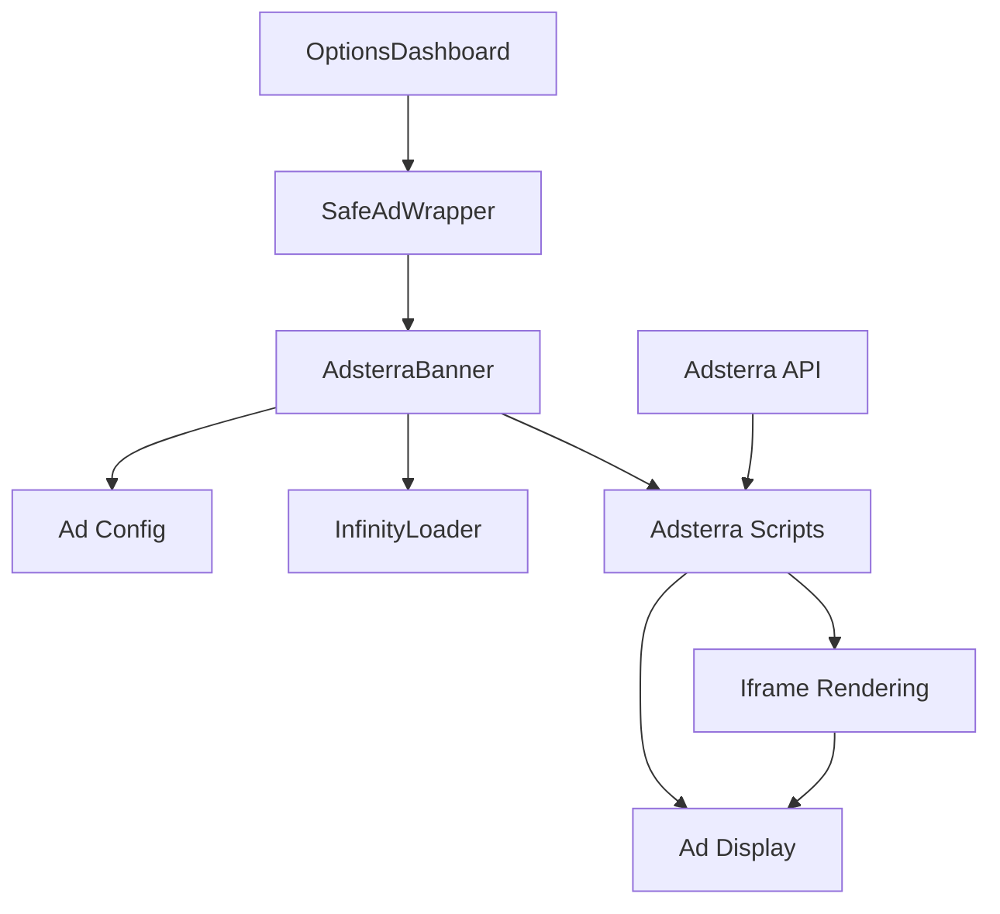

### Ad Loading Flow

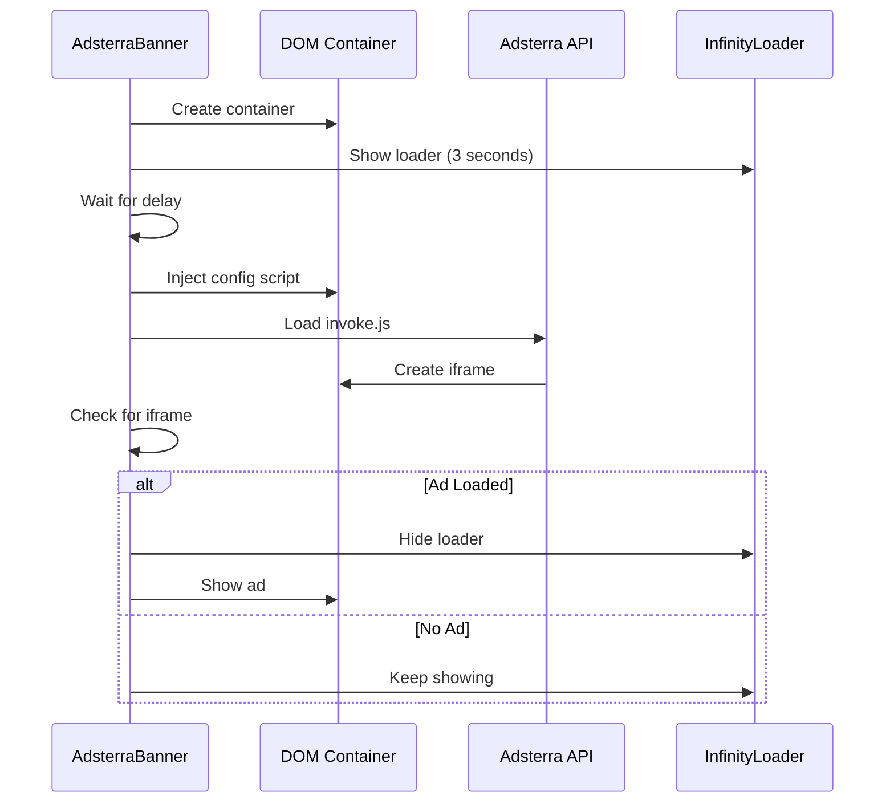

### Ad Components

1. **AdsterraBanner** - Main ad component
   - Handles script injection
   - Manages loading states
   - Shows InfinityLoader until ad loads

2. **SafeAdWrapper** - Error boundary
   - Catches ad errors
   - Prevents dashboard crashes
   - Shows placeholder on error

3. **InfinityLoader** - Loading animation
   - Animated infinity symbol
   - Electricity effect
   - Theme-matched colors

4. **AdConfig** - Centralized configuration
   - Ad keys
   - Ad sizes
   - Type-safe constants

---

## 🚀 Deployment Architecture

### Deployment Flow

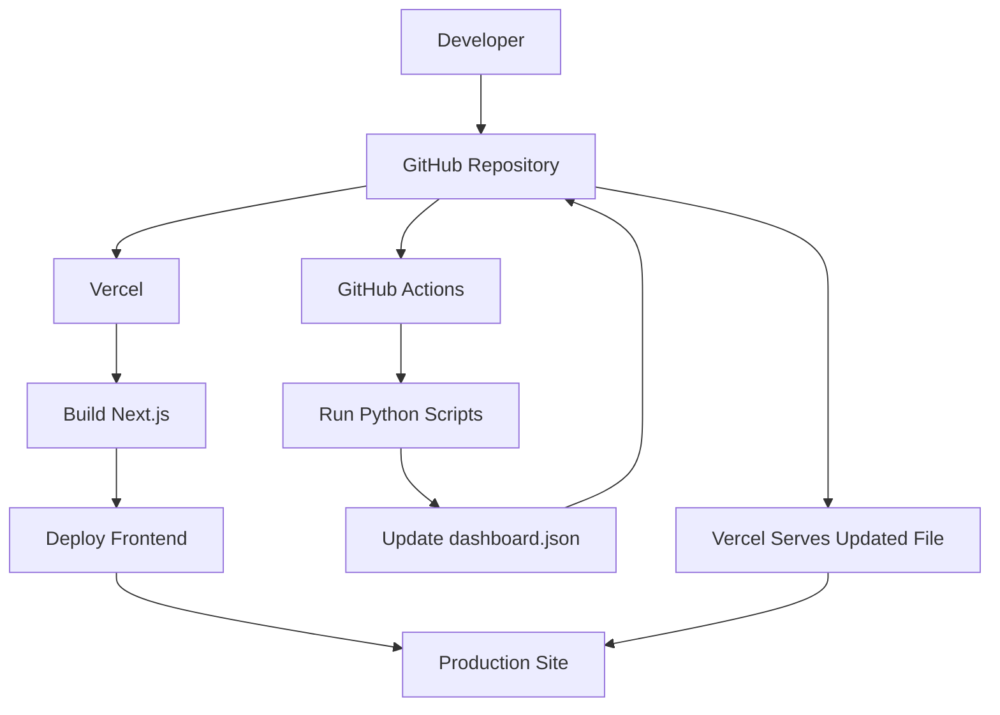

### CI/CD Pipeline

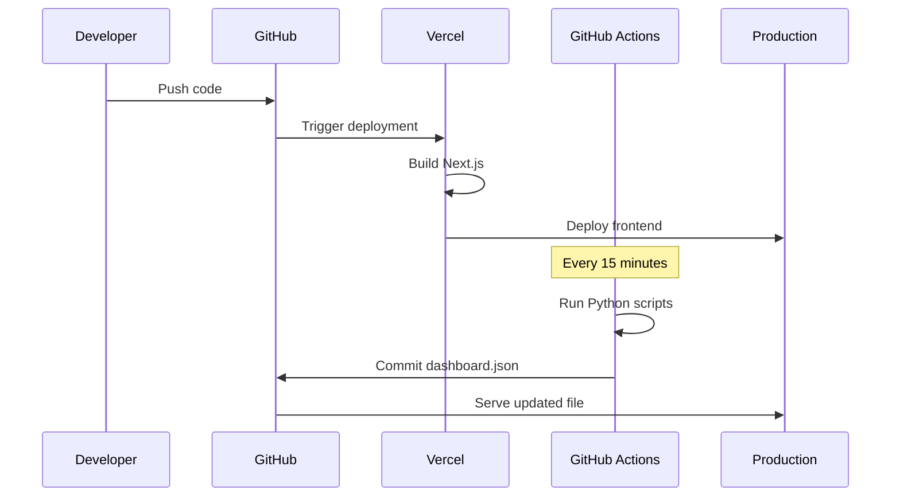

---

## 🔧 Reusability Guide

### 1. Theme Reusability

#### Extract Theme Colors

Create a theme configuration file:

**File**: `lib/theme.ts`

```typescript
export const theme = {
  colors: {
    primary: {
      light: '#3b82f6',
      dark: '#60a5fa',
    },
    accent: {
      light: '#06b6d4',
      dark: '#22d3ee',
    },
    background: {
      light: '#ffffff',
      dark: '#0f172a',
    },
    text: {
      light: '#1e293b',
      dark: '#f1f5f9',
    }
  },
  spacing: {
    card: 'p-4',
    tile: 'p-6',
  },
  effects: {
    glass: 'backdrop-blur-xl bg-white/60 dark:bg-zinc-900/50',
    glow: 'shadow-lg shadow-blue-500/20',
  }
}
```

#### Reuse Theme Classes

**File**: `app/globals.css`

```css
/* Reusable theme classes */
.theme-card {
  @apply rounded-2xl border border-white/10 bg-white/60 dark:bg-zinc-900/50 backdrop-blur dark:border-white/5;
  box-shadow: 0 1px 0 rgba(255,255,255,.08) inset, 0 10px 30px -12px rgba(2,6,23,.45);
}

.theme-hover {
  @apply transition-all duration-300 hover:transform hover:-translate-y-1;
  box-shadow: 0 0 0 2px rgba(59, 130, 246, 0.8);
}

.theme-gradient {
  background: linear-gradient(135deg, 
    rgba(59, 130, 246, 0.1) 0%, 
    rgba(6, 182, 212, 0.05) 50%, 
    rgba(59, 130, 246, 0.1) 100%
  );
}
```

### 2. Component Reusability

#### Reusable Dashboard Components

All dashboard components follow a consistent pattern:

```typescript
interface ComponentProps {
  data?: DataType;
  darkMode: boolean;
  onOpenModal?: (title: string, description: string, decision: string) => void;
}

export default function Component({ data, darkMode, onOpenModal }: ComponentProps) {
  // Component logic
  return (
    <div className="theme-card">
      {/* Component content */}
    </div>
  );
}
```

#### Reusable Ad System

**File**: `components/ads/AdConfig.ts`

```typescript
export const AD_KEYS = {
  BANNER_728x90: 'your-ad-key-1',
  BANNER_468x60: 'your-ad-key-2',
  RECTANGLE_300x250: 'your-ad-key-3',
  MOBILE_320x50: 'your-ad-key-4',
} as const;
```

### 3. Data Layer Reusability

#### Abstract Data Fetching

**File**: `lib/fetcher.ts`

```typescript
export async function fetchDashboard<T = any>(): Promise<FetchState<T>> {
  // Reusable data fetching logic
  // Can be adapted for any JSON data source
}
```

#### Reusable Data Hook

**File**: `hooks/useDashboard.ts`

```typescript
export function useDashboard() {
  // Reusable hook pattern
  // Can be adapted for any data source
}
```

### 4. Styling Reusability

#### Tailwind Configuration

**File**: `tailwind.config.js`

```javascript
module.exports = {
  theme: {
    extend: {
      colors: {
        // Your theme colors
      },
      boxShadow: {
        // Your custom shadows
      }
    }
  }
}
```

#### Global Styles

**File**: `app/globals.css`

```css
/* Reusable utility classes */
@layer utilities {
  .text-gradient {
    @apply bg-clip-text text-transparent bg-gradient-to-r from-blue-400 to-cyan-400;
  }
  
  .glass-effect {
    @apply backdrop-blur-xl bg-white/60 dark:bg-zinc-900/50;
  }
}
```

---

## 🚀 Quick Start for New Projects

### Migration Flow

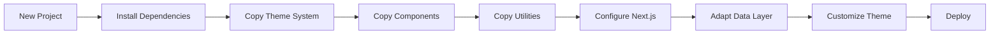

### Step 1: Initialize Next.js Project

```bash
# Create Next.js project with TypeScript and Tailwind
npx create-next-app@latest my-dashboard --typescript --tailwind --app
cd my-dashboard

# Install required dependencies
npm install framer-motion lucide-react next-themes swr axios zod class-variance-authority clsx tailwind-merge
npm install -D @types/node @types/react @types/react-dom autoprefixer postcss
```

### Step 2: Copy Theme System

**Essential Files to Copy:**

1. **`tailwind.config.js`**
   ```bash
   cp tradyx-options-dashboard/tailwind.config.js my-dashboard/
   ```

2. **`app/globals.css`**
   ```bash
   cp tradyx-options-dashboard/app/globals.css my-dashboard/app/
   ```

3. **`components/layout/ThemeToggle.tsx`**
   ```bash
   mkdir -p my-dashboard/components/layout
   cp tradyx-options-dashboard/components/layout/ThemeToggle.tsx my-dashboard/components/layout/
   ```

### Step 3: Copy Component Structure

**Reusable Components:**

1. **UI Components**
   ```bash
   mkdir -p my-dashboard/components/ui
   cp tradyx-options-dashboard/components/ui/LoadingSpinner.tsx my-dashboard/components/ui/
   ```

2. **Ad System (Optional)**
   ```bash
   mkdir -p my-dashboard/components/ads
   cp -r tradyx-options-dashboard/components/ads/* my-dashboard/components/ads/
   ```

3. **Background Animation (Optional)**
   ```bash
   mkdir -p my-dashboard/app/components
   cp tradyx-options-dashboard/app/components/AnimatedMeshBackground.tsx my-dashboard/app/components/
   cp tradyx-options-dashboard/app/components/mesh.css my-dashboard/app/components/
   ```

### Step 4: Copy Utilities

**Utility Libraries:**

```bash
mkdir -p my-dashboard/lib
cp tradyx-options-dashboard/lib/fetcher.ts my-dashboard/lib/
cp tradyx-options-dashboard/lib/fmt.ts my-dashboard/lib/
cp tradyx-options-dashboard/lib/types.ts my-dashboard/lib/  # Adapt as needed
cp tradyx-options-dashboard/lib/schema.ts my-dashboard/lib/  # Adapt as needed
```

### Step 5: Configure Next.js

**File**: `next.config.js`

```javascript
/** @type {import('next').NextConfig} */
const nextConfig = {
  reactStrictMode: true,
  compress: true,
  poweredByHeader: false,
  
  // Security headers
  async headers() {
    return [
      {
        source: "/(.*)",
        headers: [
          { key: "X-Content-Type-Options", value: "nosniff" },
          { key: "X-XSS-Protection", value: "1; mode=block" },
          { key: "Referrer-Policy", value: "strict-origin-when-cross-origin" },
          { 
            key: "Content-Security-Policy",
            value: [
              "default-src 'self' https: data: blob:;",
              "script-src 'self' 'unsafe-inline' 'unsafe-eval' https:;",
              "connect-src 'self' https:;",
              "img-src 'self' https: data: blob:;",
              "style-src 'self' 'unsafe-inline' https:;",
              "frame-src https: data: blob:;",
              "font-src 'self' data: https:"
            ].join(' ')
          },
        ]
      }
    ]
  },
  
  output: 'standalone',
  
  experimental: {
    optimizeCss: true,
  },
}

module.exports = nextConfig
```

### Step 6: Setup Layout

**File**: `app/layout.tsx`

```typescript
import './globals.css';
import { Inter } from 'next/font/google';

const inter = Inter({ subsets: ['latin'] });

export default function RootLayout({ children }: { children: React.ReactNode }) {
  return (
    <html lang="en" suppressHydrationWarning>
      <body className={`${inter.className} bg-zinc-50 dark:bg-zinc-950`}>
        {children}
      </body>
    </html>
  );
}
```

### Step 7: Create Your Dashboard

**File**: `app/page.tsx`

```typescript
'use client';

import { useState } from 'react';
import ThemeToggle from '@/components/layout/ThemeToggle';

export default function Page() {
  const [darkMode, setDarkMode] = useState(true);
  
  return (
    <div className="min-h-screen">
      <ThemeToggle darkMode={darkMode} setDarkMode={setDarkMode} />
      {/* Your dashboard content */}
    </div>
  );
}
```

### Step 8: Adapt Data Layer

1. **Create Data Hook**

   **File**: `hooks/useData.ts`

   ```typescript
   import useSWR from 'swr';
   import { fetcher } from '@/lib/fetcher';
   
   export function useData() {
     const { data, error, isLoading } = useSWR('/api/data', fetcher);
     
     return {
       data,
       loading: isLoading,
       error,
     };
   }
   ```

2. **Update Types**

   **File**: `lib/types.ts`

   ```typescript
   export interface YourData {
     // Your data structure
   }
   ```

3. **Adapt Schemas**

   **File**: `lib/schema.ts`

   ```typescript
   import { z } from 'zod';
   
   export const yourDataSchema = z.object({
     // Your schema
   });
   ```

---

## 🎨 Theme Customization

### Changing Color Scheme

**File**: `tailwind.config.js`

```javascript
module.exports = {
  theme: {
    extend: {
      colors: {
        // Change primary colors
        primary: {
          50: '#eff6ff',
          100: '#dbeafe',
          // ... your colors
        },
        // Change accent colors
        accent: {
          50: '#ecfeff',
          100: '#cffafe',
          // ... your colors
        }
      }
    }
  }
}
```

### Changing Fonts

**File**: `app/layout.tsx`

```typescript
import { Inter } from 'next/font/google';

const inter = Inter({ subsets: ['latin'] });

export default function RootLayout({ children }) {
  return (
    <html lang="en" className={inter.className}>
      {children}
    </html>
  );
}
```

### Customizing Animations

**File**: `app/globals.css`

```css
/* Custom animations */
@keyframes fadeIn {
  from { opacity: 0; transform: translateY(10px); }
  to { opacity: 1; transform: translateY(0); }
}

.fade-in {
  animation: fadeIn 0.5s ease-out;
}
```

---

## 📦 Key Files for Reusability

### Must-Copy Files

1. **`tailwind.config.js`** - Theme configuration
2. **`app/globals.css`** - Global styles and theme
3. **`components/layout/ThemeToggle.tsx`** - Theme toggle
4. **`components/ui/LoadingSpinner.tsx`** - Loading spinner
5. **`lib/fetcher.ts`** - Data fetching utilities
6. **`lib/fmt.ts`** - Formatting utilities
7. **`next.config.js`** - Next.js configuration (adapt headers)

### Optional Files

1. **`components/ads/`** - Ad system (if using ads)
2. **`app/components/AnimatedMeshBackground.tsx`** - Background animation
3. **`components/visual/Sparkline.tsx`** - Sparkline chart
4. **`hooks/useDashboard.ts`** - Data hook (adapt for your data)

---

## 🔄 Migration Checklist

### For New Projects

- [ ] Copy theme configuration (`tailwind.config.js`)
- [ ] Copy global styles (`app/globals.css`)
- [ ] Copy theme toggle component
- [ ] Copy utility functions (`lib/`)
- [ ] Copy UI components (`components/ui/`)
- [ ] Adapt data layer for your data source
- [ ] Update types and schemas
- [ ] Configure Next.js headers
- [ ] Test theme toggle (light/dark mode)
- [ ] Verify all components work
- [ ] Test responsive design
- [ ] Deploy to Vercel

### For Existing Projects

- [ ] Install required dependencies
- [ ] Merge theme configuration
- [ ] Merge global styles
- [ ] Add theme toggle component
- [ ] Update component styles to use theme classes
- [ ] Test theme compatibility
- [ ] Update color scheme if needed
- [ ] Test dark/light mode switching

---

## 🎯 Best Practices

### 1. Component Design

- ✅ Use TypeScript for type safety
- ✅ Follow consistent prop patterns
- ✅ Use theme classes instead of hardcoded colors
- ✅ Implement error boundaries
- ✅ Add loading states
- ✅ Use `'use client'` for client components
- ✅ Handle hydration mismatches with `suppressHydrationWarning`

### 2. Styling

- ✅ Use Tailwind utility classes
- ✅ Create reusable theme classes in `globals.css`
- ✅ Use CSS variables for dynamic values
- ✅ Implement responsive design (mobile-first)
- ✅ Test dark/light mode thoroughly
- ✅ Use glass morphism effects for modern UI
- ✅ Implement smooth transitions and animations

### 3. Data Fetching

- ✅ Use SWR for data fetching and caching
- ✅ Implement error handling and retry logic
- ✅ Add loading states with spinners
- ✅ Cache data appropriately
- ✅ Handle stale data with refresh mechanisms
- ✅ Use TypeScript types for data structures

### 4. Performance

- ✅ Use Next.js Image component for images
- ✅ Implement code splitting with dynamic imports
- ✅ Optimize bundle size
- ✅ Use React.memo for expensive components
- ✅ Implement lazy loading for heavy components
- ✅ Use `output: 'standalone'` for production

### 5. Theme System

- ✅ Centralize theme colors in `tailwind.config.js`
- ✅ Use CSS classes instead of inline styles
- ✅ Create reusable theme utility classes
- ✅ Support both light and dark modes
- ✅ Persist theme preference in localStorage
- ✅ Respect system preferences

### 6. Ad Integration

- ✅ Use error boundaries to prevent crashes
- ✅ Implement staggered loading for multiple ads
- ✅ Show loading animations until ads load
- ✅ Handle ad failures gracefully
- ✅ Use transparent containers for seamless integration
- ✅ Configure CSP headers correctly

---

## 📚 Additional Resources

### Documentation

- **Next.js**: https://nextjs.org/docs
- **Tailwind CSS**: https://tailwindcss.com/docs
- **Framer Motion**: https://www.framer.com/motion/
- **TypeScript**: https://www.typescriptlang.org/docs

### Theme Inspiration

- Glass morphism effects
- Blue-cyan color scheme
- Dark mode first approach
- Smooth animations
- Modern UI patterns

---

## 🎉 Summary

This architecture provides:

1. **Modular Component System** - Reusable, themed components
2. **Flexible Theme System** - Easy to customize and adapt
3. **Scalable Data Layer** - Adaptable to any data source
4. **Production-Ready Setup** - Optimized for deployment
5. **Type-Safe Development** - TypeScript throughout
6. **Modern UI/UX** - Glass morphism, animations, responsive

### Key Takeaways

- **Theme System**: Centralized, reusable, easy to customize
- **Component Architecture**: Modular, type-safe, consistent
- **Data Flow**: Clear separation of concerns
- **Deployment**: Automated, scalable, production-ready
- **Reusability**: Easy to adapt for new projects

---

**Last Updated**: December 2024

**Version**: 1.0.0

**License**: All Rights Reserved

